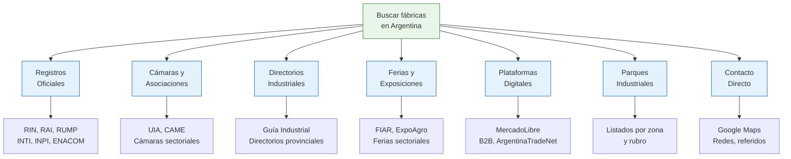

# Encontrar fábricas en Argentina

> A diferencia de China (donde tenés Alibaba con millones de proveedores en un solo lugar), en Argentina la información sobre fábricas está **dispersa en muchas fuentes diferentes**. Esta sección te muestra TODAS las fuentes disponibles y cómo usarlas.

## Por qué es diferente a buscar en China

En China, una sola plataforma como Alibaba te muestra miles de fábricas con fotos, precios y valoraciones. En Argentina no existe un equivalente único. La información está repartida entre:

- **Registros oficiales del Estado** (RIN, RAI, RUMP, INPI, etc.)
- **Cámaras empresariales y asociaciones** (UIA, CAME, cámaras sectoriales)
- **Directorios industriales** (Guía Industrial, directorios provinciales)
- **Ferias y exposiciones** (FIAR, ExpoAgro, ferias sectoriales)
- **Plataformas digitales** (MercadoLibre mayorista, plataformas B2B)
- **Parques industriales** (agrupaciones geográficas de fábricas)
- **Contacto directo** (Google Maps, redes sociales, referidos)

<Note>
Toda la información de esta sección fue recopilada y organizada a partir de un relevamiento exhaustivo de fuentes públicas argentinas vigentes a febrero de 2026. Las URLs y datos de contacto se verificaron al momento de escribir esta guía.
</Note>

## Mapa de fuentes disponibles

## Qué vas a encontrar en esta sección

<Steps>
  <Step title="Estrategia de búsqueda">
    Un método ordenado para decidir POR DÓNDE empezar según lo que estés buscando. No todas las fuentes sirven para todo.
  </Step>
  <Step title="Registros oficiales del Estado">
    RIN, RAI, RUMP, INTI, INPI y otros registros donde el Estado tiene información sobre empresas industriales.
  </Step>
  <Step title="Cámaras y asociaciones empresariales">
    Las organizaciones que agrupan fabricantes por rubro. Muchas tienen listados de socios públicos.
  </Step>
  <Step title="Directorios industriales">
    Publicaciones y sitios web que catalogan fábricas argentinas por rubro y ubicación.
  </Step>
  <Step title="Ferias y exposiciones">
    Eventos donde podés conocer fabricantes en persona, ver productos y negociar cara a cara.
  </Step>
  <Step title="Plataformas digitales y parques industriales">
    Herramientas online y agrupaciones físicas para localizar fabricantes.
  </Step>
</Steps>

## Explorá cada grupo de fuentes

<CardGroup cols={2}>
  <Card title="Estrategia de Búsqueda" icon="route" href="/app/paso1-argentina/encontrar-fabricas/estrategia-busqueda">
    Método paso a paso para decidir por dónde empezar según tu situación y lo que necesitás encontrar.
  </Card>
  <Card title="RIN — Registro Industrial" icon="landmark" href="/app/paso1-argentina/encontrar-fabricas/rin-registro-industrial">
    El registro nacional donde toda empresa industrial debe inscribirse. Cómo solicitar información.
  </Card>
  <Card title="RAI — CABA" icon="building-columns" href="/app/paso1-argentina/encontrar-fabricas/rai-caba">
    El registro de actividades industriales de la Ciudad de Buenos Aires y equivalentes provinciales.
  </Card>
  <Card title="RUMP y Cámaras" icon="chart-bar" href="/app/paso1-argentina/encontrar-fabricas/rump-matriz-productiva">
    Base de datos de la matriz productiva y el buscador de cámaras empresarias del Estado.
  </Card>
  <Card title="INTI — Certificaciones" icon="flask" href="/app/paso1-argentina/encontrar-fabricas/inti-certificaciones">
    Cómo el INTI te ayuda a encontrar fabricantes certificados y verificar calidad industrial.
  </Card>
  <Card title="INPI — Marcas y Patentes" icon="trademark" href="/app/paso1-argentina/encontrar-fabricas/inpi-marcas-patentes">
    Usá el registro de marcas y patentes para identificar quién fabrica qué producto.
  </Card>
  <Card title="Otros Registros Oficiales" icon="list-check" href="/app/paso1-argentina/encontrar-fabricas/otros-registros">
    ENACOM, ANMAC, Registro de Sociedades y otros registros especializados.
  </Card>
</CardGroup>

<Warning>
Ninguna fuente individual te va a dar TODA la información que necesitás. La clave es **combinar varias fuentes** y cruzar datos. Una fábrica que aparece en un registro oficial Y en una cámara sectorial es mucho más confiable que una que solo encontrás por Google.
</Warning>

<Tip>
Una vez que encuentres fábricas candidatas, el siguiente paso es [evaluarlas y negociar](/app/paso1-argentina/evaluar-negociar/introduccion). No compres sin antes verificar legitimidad y calidad.
</Tip>
