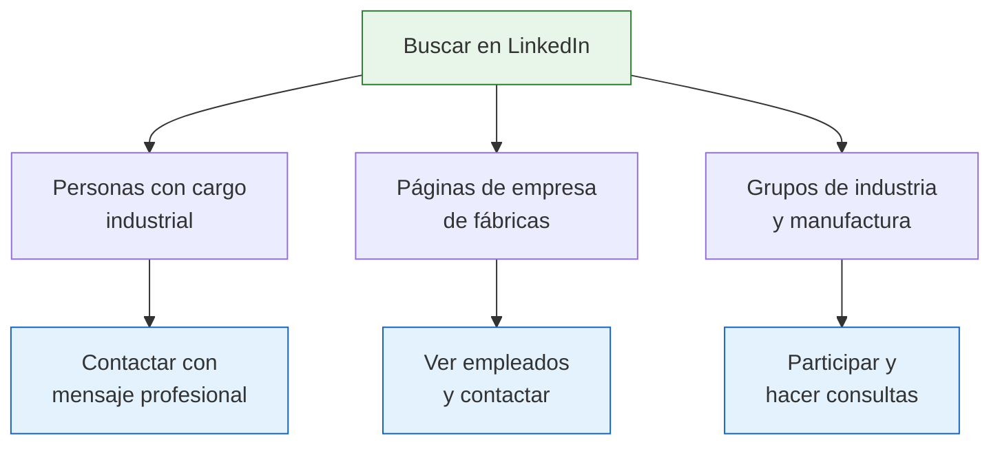

# LinkedIn y redes profesionales

> Cada vez más fábricas argentinas tienen presencia en redes profesionales y sociales. LinkedIn te permite encontrar a los dueños y gerentes directamente; Instagram muestra los productos y procesos de fabricación; y los grupos de Facebook concentran mayoristas y fabricantes por rubro.

## LinkedIn: contacto directo con decisores

LinkedIn es la red profesional por excelencia y una herramienta cada vez más usada en el mundo B2B industrial argentino. La ventaja principal es que podés llegar directamente a la persona que toma las decisiones, sin pasar por recepcionistas o formularios de contacto.

### Qué buscar en LinkedIn

### Búsquedas de personas por cargo

Buscá directamente a las personas que pueden venderte usando estos términos en el buscador de LinkedIn:

| Término de búsqueda | Qué encontrás |
|---------------------|---------------|
| `gerente de producción [rubro]` | Responsables de planta que conocen la capacidad productiva |
| `dueño fábrica [producto]` | Propietarios de fábricas (PyMEs) |
| `director comercial [industria]` | Responsables de ventas industriales |
| `gerente de ventas mayorista` | Personas a cargo del canal mayorista |
| `fundador [tipo de empresa industrial]` | Fundadores de empresas industriales |
| `jefe de planta [rubro]` | Responsables operativos de fábricas |

<Tip>
Filtrá los resultados por ubicación "Argentina" y por industria (manufacturing, textiles, food production, etc.). LinkedIn permite filtrar por estos campos, lo que reduce mucho los resultados irrelevantes.
</Tip>

### Búsquedas de empresas

También podés buscar directamente páginas de empresa:

- Buscá "[producto] Argentina" y filtrá por "Empresas"
- Buscá "fábrica" o "manufactura" + tu rubro
- Mirá la sección "Personas" de cada empresa para identificar a quién contactar

### Grupos para unirte

Buscá y unite a grupos relacionados con tu industria:

- Grupos de industria argentina (industria textil argentina, metalúrgica, etc.)
- Grupos de PyMEs industriales
- Grupos de cámaras empresariales (muchas tienen grupo en LinkedIn)
- Grupos de emprendedores y comerciantes mayoristas

<Note>
Los grupos de LinkedIn son útiles no solo para encontrar fabricantes, sino para entender el mercado: qué se discute, qué problemas hay, qué tendencias existen. Participar activamente te posiciona como un contacto serio y facilita que los fabricantes te respondan.
</Note>

## Cómo enviar un primer mensaje profesional

El mensaje inicial es clave. Si lo hacés bien, la tasa de respuesta es alta. Si lo hacés mal, te ignoran.

<Tabs>
  <Tab title="Mensaje que funciona">
    **Asunto**: Consulta comercial - [tu rubro]

    Hola [nombre], vi que trabajás en [empresa]. Me dedico a la comercialización de [tipo de producto] y estoy buscando proveedores directos de fábrica.

    Me interesaría conocer su catálogo y condiciones para compras mayoristas. Manejo un volumen aproximado de [cantidad] unidades mensuales.

    Quedo a disposición para coordinar una charla o visita.

    Saludos,
    [tu nombre]
    [tu teléfono]
  </Tab>
  <Tab title="Mensaje que NO funciona">
    "Hola, tienen precios?"

    "Buenas, venden por mayor?"

    "Me pasas catálogo?"

    Estos mensajes son demasiado vagos y poco profesionales. No muestran que sos un comprador serio y es muy probable que te ignoren o te respondan con un "mandá mail a ventas@...".
  </Tab>
</Tabs>

### Reglas para mensajes efectivos

| Regla | Por qué importa |
|-------|-----------------|
| **Presentate** | El fabricante necesita saber quién sos y qué hacés |
| **Sé específico** | Mencioná qué producto buscás y en qué cantidad |
| **Mostrá volumen** | Un comprador que mueve volumen genera más interés |
| **Ofrecé acción concreta** | Proponé una llamada, reunión o visita |
| **Dejá tus datos** | Teléfono y email para que te contacten por fuera |

<Warning>
No envíes el mismo mensaje copiado y pegado a 50 personas. LinkedIn penaliza el spam y te puede restringir la cuenta. Personalizá cada mensaje mencionando la empresa y el producto específico. Con 5-10 mensajes bien dirigidos por día es suficiente.
</Warning>

## Instagram: vidriera industrial

Muchas fábricas argentinas usan Instagram para mostrar sus productos, procesos de fabricación y novedades. Es especialmente común en rubros como:

- **Textil y moda**: fábricas de ropa, calzado, marroquinería
- **Alimentos**: fábricas de alimentos artesanales y de consumo masivo
- **Muebles y decoración**: fabricantes de muebles, objetos de diseño
- **Cosmética**: laboratorios y fábricas de productos de belleza

### Cómo buscar fábricas en Instagram

<Steps>
  <Step title="Buscá por hashtags industriales">
    Usá hashtags como: #fabricaargentina, #industria argentina, #hechoenfabrica, #fabricantede[producto], #mayorista[producto], #industrianacional.
  </Step>
  <Step title="Buscá por nombre de producto + fábrica">
    En el buscador de Instagram, escribí: "fábrica de [producto]" y filtrá por "Cuentas". Muchas fábricas incluyen "fábrica" en su nombre de usuario o biografía.
  </Step>
  <Step title="Mirá las publicaciones">
    Las fábricas reales suelen mostrar: procesos de producción, maquinaria, productos en diferentes etapas, packaging industrial. Si ves solo fotos de producto final sin contexto de fábrica, probablemente sea un revendedor.
  </Step>
  <Step title="Contactá por mensaje directo">
    Enviá un mensaje directo profesional similar al de LinkedIn. Mencioná que buscás comprar por mayor y pedí un contacto de WhatsApp o email para hablar más formalmente.
  </Step>
</Steps>

## Facebook: grupos mayoristas

Facebook sigue siendo relevante en Argentina para el comercio mayorista, especialmente a través de grupos:

| Tipo de grupo | Qué encontrás | Ejemplo de búsqueda |
|--------------|---------------|---------------------|
| Grupos de mayoristas | Fabricantes y mayoristas que publican productos | "mayoristas [rubro] Argentina" |
| Grupos por rubro | Fabricantes de un sector específico | "fabricantes textiles Argentina" |
| Grupos de emprendedores | Contactos y recomendaciones | "emprendedores mayoristas" |
| Grupos por zona | Comercio local mayorista | "mayoristas [ciudad]" |

<Tip>
En los grupos de Facebook, antes de publicar pidiendo proveedores, observá durante unos días qué tipo de publicaciones hay y quiénes publican. Muchos fabricantes publican sus productos directamente en estos grupos. Anotá los que te interesen y contactalos por privado.
</Tip>

## Construir tu red profesional a largo plazo

Encontrar fábricas no es una acción de una sola vez. Cuanto más grande sea tu red de contactos en el mundo industrial, más fácil será encontrar proveedores en el futuro.

| Acción | Frecuencia | Beneficio |
|--------|-----------|-----------|
| Publicar contenido en LinkedIn sobre tu actividad | Semanal | Te posiciona como comprador activo |
| Conectar con personas de tu industria | Diaria (5-10 conexiones) | Amplía tu red de contactos |
| Participar en grupos | Semanal | Te hace visible y genera confianza |
| Asistir a eventos (ferias, rondas) y publicarlo | Cuando surjan | Demuestra que estás activo en el mercado |
| Recomendar y pedir recomendaciones | Cuando corresponda | El boca a boca digital funciona |

<Note>
La mejor red se construye con el tiempo. No esperes resultados inmediatos de LinkedIn o Instagram. Pero después de 3-6 meses de actividad constante, vas a tener un flujo natural de contactos industriales que te llegan solos.
</Note>

## Siguiente paso

Para acceder a contactos industriales que no están en ninguna red social, usá la estrategia de [despachantes, contadores y contactos clave](/app/paso1-argentina/encontrar-fabricas/despachantes-contadores), que pueden referirte a fábricas de manera directa.
