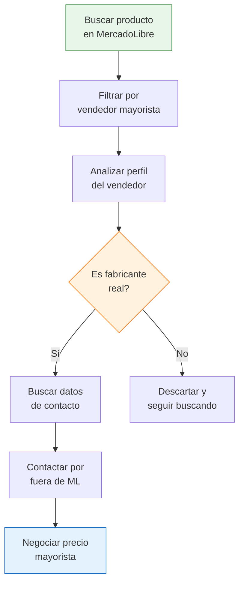

# MercadoLibre como fuente de fábricas

> MercadoLibre no es solo para comprar productos: es una de las mejores herramientas para **descubrir quién fabrica qué** en Argentina. Miles de fábricas venden ahí, y vos podés identificarlas para después negociar directo.

## La idea clave: no comprás, investigás

El objetivo NO es comprar por MercadoLibre al precio minorista. El objetivo es:

1. **Identificar** qué fábricas venden en la plataforma
2. **Verificar** que sean fabricantes reales (no revendedores)
3. **Contactarlos por fuera** de MercadoLibre para negociar precio mayorista

<Note>
Muchos fabricantes argentinos usan MercadoLibre como vidriera. Publican a precio minorista pero están dispuestos a vender por mayor si los contactás directamente. La diferencia de precio puede ser del **30% al 50%** menos que el precio publicado.
</Note>

## Cómo buscar fábricas en MercadoLibre

### Términos de búsqueda que funcionan

Usá estas combinaciones directamente en el buscador de MercadoLibre:

| Término de búsqueda | Qué encontrás |
|---------------------|---------------|
| `fábrica de [producto]` | Vendedores que se identifican como fábricas |
| `fabricante [producto]` | Similar, con otra terminología |
| `directo de fábrica [producto]` | Vendedores que resaltan el origen |
| `mayorista [producto]` | Vendedores con precios por cantidad |
| `[producto] por mayor` | Publicaciones con descuento por volumen |
| `[producto] x 100 unidades` | Publicaciones con cantidades grandes |

<Tip>
Probá buscar tu producto seguido de "x 50", "x 100" o "por mayor". Las publicaciones con cantidades grandes casi siempre son de fabricantes o distribuidores directos, no de revendedores pequeños.
</Tip>

## Cómo identificar un vendedor que es fábrica

No todos los que dicen "fábrica" lo son. Acá tenés las señales que distinguen a un fabricante real:

### Señales positivas (probablemente es fábrica)

- **Catálogo amplio de productos relacionados**: Vende muchas variantes del mismo tipo de producto (10, 20 o más publicaciones similares)
- **Stock alto declarado**: Publicaciones con "+500 disponibles" o cantidades muy altas
- **Fotos profesionales propias**: No son fotos genéricas de internet; se nota que las sacaron en una fábrica o showroom
- **Nombre comercial industrial**: El nombre del vendedor incluye "S.A.", "S.R.L.", "Industrias", "Fábrica", "Manufactura"
- **Ubicación en zona industrial**: La dirección corresponde a un parque industrial o zona fabril
- **Precios por escala**: Ofrecen descuento a partir de cierta cantidad
- **Antigüedad**: Llevan varios años vendiendo en la plataforma

### Señales negativas (probablemente NO es fábrica)

- Vende productos de rubros completamente diferentes (ropa + electrónica + juguetes)
- Pocas unidades disponibles
- Fotos copiadas de otros sitios o catálogos
- No tiene información clara de empresa
- Precios iguales o mayores al promedio del mercado

<Warning>
Muchos vendedores ponen "fábrica" o "directo de fábrica" en el título solo como estrategia de marketing. No lo tomes como prueba. Siempre verificá con las señales de arriba antes de contactar.
</Warning>

## Paso a paso: de MercadoLibre a tu proveedor mayorista

<Steps>
  <Step title="Buscá tu producto con términos mayoristas">
    Ingresá en mercadolibre.com.ar y buscá usando los términos de la tabla anterior. Probá varias combinaciones para ampliar los resultados.
  </Step>
  <Step title="Filtrá por tipo de vendedor">
    Usá los filtros de la izquierda. Buscá vendedores con reputación alta (verde) y con etiqueta de "MercadoLíder" o "MercadoLíder Platinum". Estos suelen ser vendedores profesionales.
  </Step>
  <Step title="Analizá el perfil de cada vendedor candidato">
    Entrá al perfil del vendedor. Revisá: cuántas publicaciones tiene, hace cuánto vende, dónde está ubicado, qué otros productos ofrece. Buscá las señales de fabricante que listamos arriba.
  </Step>
  <Step title="Buscá la razón social o CUIT">
    En la publicación, buscá la sección de "Información del vendedor" donde aparece la razón social. Con eso podés buscar en Google para encontrar su sitio web o datos de contacto directo.
  </Step>
  <Step title="Contactá por fuera de MercadoLibre">
    Una vez que tengas el nombre de la empresa, buscá en Google: "[nombre empresa] + contacto" o "[nombre empresa] + sitio web". Llamá por teléfono o escribí un email presentándote como comprador mayorista.
  </Step>
  <Step title="Negociá condiciones mayoristas">
    Al contactar, mencioná que los encontraste por MercadoLibre pero que querés comprar por mayor directo. Preguntá por: lista de precios mayorista, mínimo de compra, condiciones de pago y posibilidad de visitar la fábrica.
  </Step>
</Steps>

## Ejemplo práctico: encontrar una fábrica de medias

<Accordion title="Caso: buscar un fabricante de medias de algodón">
  **Búsqueda inicial**: "medias algodón fábrica" en MercadoLibre

  **Resultado**: Encontrás un vendedor llamado "Industrias Textiles XX S.R.L." que tiene:
  - 45 publicaciones de medias en diferentes modelos
  - Stock de "+999 disponibles" en cada publicación
  - Fotos propias tomadas en lo que parece ser un showroom industrial
  - Ubicación: Parque Industrial de Pilar, Buenos Aires
  - Precios con descuento a partir de 12 docenas

  **Verificación**: Buscás "Industrias Textiles XX S.R.L." en Google y encontrás:
  - Sitio web con catálogo completo
  - Teléfono de fábrica
  - Dirección que coincide con la de MercadoLibre

  **Contacto**: Llamás al teléfono de fábrica, te presentás como comerciante, y te envían la lista de precios mayorista. El precio por docena es un **40% menor** al precio unitario de MercadoLibre.
</Accordion>

## Ventajas y limitaciones de esta fuente

<Tabs>
  <Tab title="Ventajas">
    - **Acceso gratuito** y sin necesidad de registro especial
    - **Visual**: podés ver fotos reales de los productos
    - **Reputación visible**: las calificaciones dan una primera señal de confiabilidad
    - **Amplia cobertura**: la mayoría de las fábricas argentinas tienen presencia en ML
    - **Actualizado**: los vendedores activos mantienen sus publicaciones al día
  </Tab>
  <Tab title="Limitaciones">
    - **No todos los vendedores son fábricas**: hay muchos revendedores mezclados
    - **Precios inflados**: el precio publicado incluye comisión de ML (hasta un 30%)
    - **Información limitada**: no siempre aparece la razón social completa
    - **No es una plataforma B2B**: fue diseñada para venta minorista
    - **Prohibición de contacto externo**: ML prohíbe compartir datos de contacto en los mensajes internos
  </Tab>
</Tabs>

<Warning>
MercadoLibre prohíbe que vendedores y compradores intercambien datos de contacto dentro de la plataforma. Por eso la estrategia es buscar la razón social del vendedor y contactarlo por fuera usando Google. No intentes pedir teléfono o email por el chat de MercadoLibre porque te pueden suspender la cuenta.
</Warning>

## Siguiente paso

Una vez que identifiques fabricantes a través de MercadoLibre, complementá tu búsqueda con una [búsqueda estratégica en Google](/app/paso1-argentina/encontrar-fabricas/busqueda-google-estrategica) para encontrar más datos de contacto y verificar la información.

<Tip>
Para aprender a evaluar si la fábrica que encontraste es confiable, consultá la guía de [verificar legitimidad](/app/paso1-argentina/evaluar-negociar/verificar-legitimidad).
</Tip>
