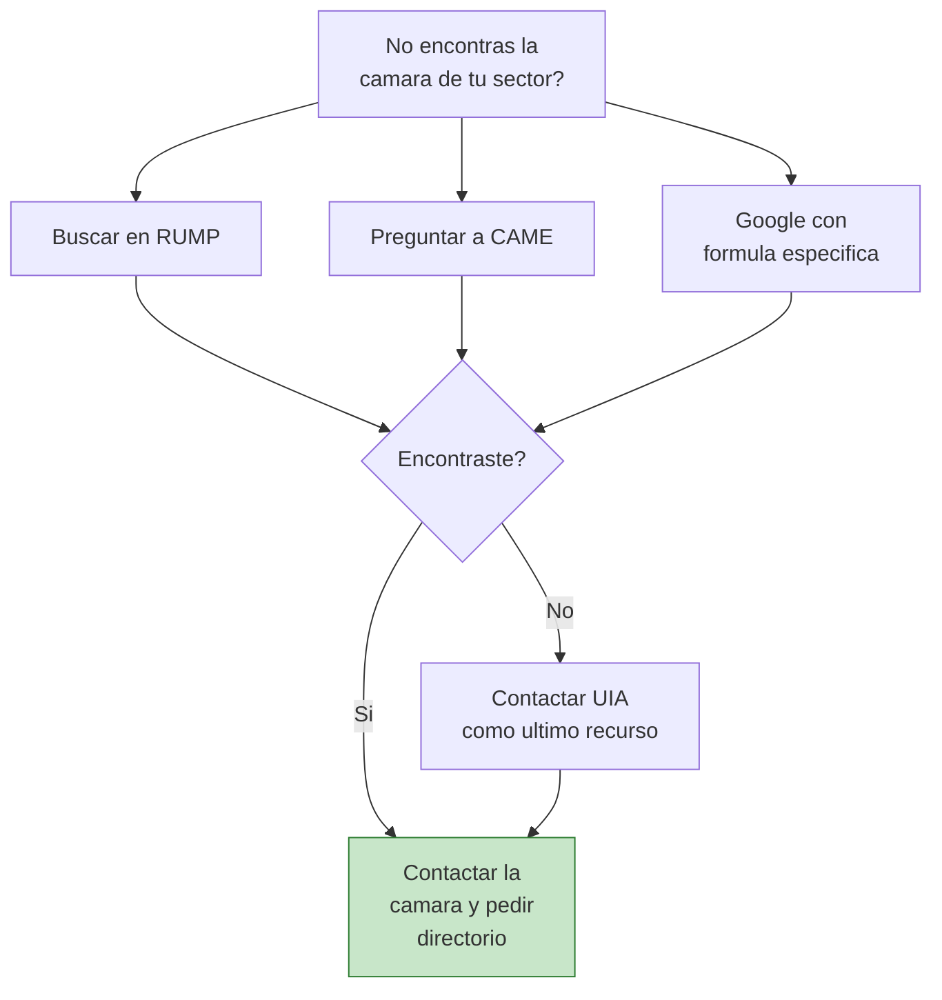

# Otras camaras sectoriales

> Ademas de los grandes sectores (textil, alimentos, metalurgia, plasticos), Argentina tiene **camaras para practicamente cada rubro imaginable**. Desde cosmetica hasta juguetes, desde papeleria hasta articulos deportivos. Aca encontras las que no cubrimos en las paginas anteriores.

## Camaras de sectores adicionales

### Cosmetica y cuidado personal

| Camara | Sector | Web / Referencia | Productos |
|--------|--------|-----------------|-----------|
| **CAPA (Camara Argentina de la Industria de Productos de Higiene y Tocador)** | Cosmetica e higiene | capa.org.ar | Cremas, shampoo, jabones, cosmeticos, perfumes |

La industria cosmetica argentina tiene fabricantes de alta calidad, muchos de los cuales producen marcas blancas (white label). Esto significa que podes vender productos con tu propia marca sin necesidad de formular nada.

<Tip>
Los productos de **cosmetica y cuidado personal** tienen margenes muy altos y demanda constante. A traves de CAPA podes encontrar fabricantes que hacen produccion tercerizada: ellos formulan, envasan y etiquetan con tu marca. Los pedidos minimos suelen arrancar desde 100-500 unidades.
</Tip>

### Juguetes

| Camara | Sector | Web / Referencia | Productos |
|--------|--------|-----------------|-----------|
| **CAIJ (Camara Argentina de la Industria del Juguete)** | Jugueteria | caij.org.ar | Juguetes didacticos, plasticos, de madera, juegos de mesa |

<Note>
Los juguetes tienen **regulaciones de seguridad estrictas** en Argentina. Todo juguete debe cumplir con normas IRAM de seguridad y tener la certificacion correspondiente. Cuando contactes fabricantes a traves de CAIJ, verificá que sus productos esten certificados.
</Note>

### Papeleria y libreria

| Camara | Sector | Productos |
|--------|--------|-----------|
| **Camaras de la industria grafica** | Impresion y papeleria | Cuadernos, agendas, blocks, papeleria corporativa |
| **Camaras de articulos de libreria** | Articulos escolares y de oficina | Lapiceras, carpetas, organizadores, pegamentos |

La papeleria y los utiles escolares tienen **picos estacionales fuertes** (febrero-marzo por la vuelta a clases). Los fabricantes argentinos de este rubro suelen tener buenos precios si compras en temporada baja (julio-noviembre).

### Deportes y fitness

| Camara | Sector | Productos |
|--------|--------|-----------|
| **Camaras de articulos deportivos** | Deporte y fitness | Indumentaria deportiva, accesorios, equipamiento |
| **CIRA** (parcialmente) | Calzado deportivo | Zapatillas, botines |

### Joyeria y bijouterie

| Camara | Sector | Productos |
|--------|--------|-----------|
| **Camaras de joyeria y relojeria** | Joyeria | Bijouterie, accesorios, relojes, joyeria de plata |

### Electrodomesticos

| Camara | Sector | Productos |
|--------|--------|-----------|
| **Camaras de fabricantes de electrodomesticos** | Linea blanca y pequeños electro | Cocinas, heladeras, ventiladores, planchas |

## Tabla completa de camaras adicionales

| Sector | Camara / Entidad | Tipo de productos |
|--------|-----------------|-------------------|
| **Cosmetica** | CAPA | Cremas, maquillaje, perfumes, higiene personal |
| **Juguetes** | CAIJ | Juguetes de todo tipo, didacticos, juegos |
| **Papeleria** | Camaras graficas | Cuadernos, agendas, articulos de escritorio |
| **Deportes** | Camaras deportivas | Indumentaria, equipamiento, accesorios |
| **Joyeria** | Camaras de joyeria | Bijouterie, plata, accesorios |
| **Electrodomesticos** | Camaras de fabricantes | Linea blanca, pequeños electrodomesticos |
| **Automotriz** | Camaras autopartistas | Repuestos, accesorios para vehiculos |
| **Farmaceutica** | CAEHFA / CILFA | Medicamentos, suplementos (sector regulado) |
| **Grafica e impresion** | Camaras graficas | Impresion comercial, editorial, packaging |
| **Cuero y calzado** | CIFRA / CIRA | Marroquineria, calzado (ver pagina textiles) |

## Como encontrar la camara de CUALQUIER sector

Si tu sector no aparece en ninguna de las paginas anteriores, hay tres metodos infalibles para encontrar la camara correcta:

<Steps>
  <Step title="Metodo 1: Buscar en RUMP">
    El **Registro Unico de la Matriz Productiva (RUMP)** del Ministerio de Produccion de la Nacion tiene un buscador que permite filtrar por sector productivo y ubicacion. Es la herramienta mas completa del gobierno para encontrar empresas manufactureras.

    Entrá a la pagina del Ministerio de Economia / Produccion y buscá la seccion de Registro de la Matriz Productiva.
  </Step>
  <Step title="Metodo 2: Preguntar a CAME">
    CAME tiene **1,491 federaciones y camaras** asociadas de todos los rubros. Si no encontras la camara de tu sector, contactá a CAME directamente y pedi que te deriven. Con 600,000+ PyMEs en su red, es practicamente imposible que no tengan un contacto para tu rubro.

    **Email de contacto:** Busca en [redcame.org.ar](https://www.redcame.org.ar) la seccion de contacto.
  </Step>
  <Step title="Metodo 3: Buscar en Google con formula especifica">
    Usa esta busqueda exacta en Google:

    `"camara" + "industria" + "[tu producto]" + "argentina"`

    Ejemplo: `"camara" "industria" "juguetes" "argentina"`

    Generalmente el primer resultado es la camara correcta.
  </Step>
  <Step title="Metodo 4: Consultar en UIA">
    La Union Industrial Argentina agrupa a las principales camaras del pais. Si ninguno de los metodos anteriores funciona, contactá a la UIA y pedi derivacion.
  </Step>
</Steps>

## Flujo para encontrar cualquier camara

<Tip>
**CAME es tu comodin.** Con 1,491 camaras y federaciones asociadas, si existe una camara para tu rubro en Argentina, CAME la conoce. No dudes en contactarlos aunque tu sector parezca muy especifico o de nicho.
</Tip>

## Preguntas frecuentes sobre camaras en general

<Accordion title="Que es exactamente una camara empresarial?">
Es una **asociacion civil sin fines de lucro** que reune a empresas de un mismo sector. Sus funciones principales son: representar al sector ante el gobierno, brindar servicios a sus socios (capacitacion, asesoramiento, networking), producir estadísticas del sector, y organizar eventos y ferias. Para vos como emprendedor, lo mas util es su funcion de **directorio y networking**: te conectan con fabricantes.
</Accordion>

<Accordion title="Cuanto cuesta asociarse a una camara?">
La asociacion tiene una cuota mensual que varia segun la camara y el tamaño de tu empresa. Generalmente va desde ARS 5,000 hasta ARS 50,000 por mes (febrero 2026). Pero **no necesitas ser socio** para pedir informacion o un directorio de fabricantes. La mayoria atiende consultas de no-socios sin costo.
</Accordion>

<Accordion title="Las camaras me garantizan que los fabricantes son confiables?">
No. Que una fabrica este asociada a una camara es una **señal positiva** (indica que opera formalmente y participa del sector), pero no es una garantía de calidad ni de confiabilidad. Siempre debes hacer tu propia [verificacion de legitimidad](/app/paso1-argentina/evaluar-negociar/verificar-legitimidad) antes de comprar.
</Accordion>

<Accordion title="Puedo contactar a una camara por WhatsApp?">
Algunas camaras tienen WhatsApp o contacto por redes sociales, pero la via mas profesional y efectiva es el **email** o el **telefono**. Si necesitas respuesta rapida, llamar por telefono suele ser mas efectivo que el email.
</Accordion>

<Accordion title="Las camaras me pueden ayudar con precios de referencia?">
Algunas camaras publican informes con precios de referencia del sector o indices de costos. No todas lo hacen, pero vale la pena preguntar. Esta informacion es muy valiosa para saber si un fabricante te esta cobrando un precio razonable.
</Accordion>

<Accordion title="Que pasa si mi producto es muy de nicho y no hay camara?">
Si tu producto es tan especifico que no existe una camara dedicada, usa estos caminos alternativos: (1) CAME, que cubre practicamente todo, (2) RUMP del Ministerio de Produccion, (3) camaras de la materia prima principal de tu producto (si es de plastico, CAIP; si es de metal, ADIMRA), (4) camaras regionales de la zona donde se concentra la produccion.
</Accordion>

## Resumen: que camara usar segun tu producto

<Tabs>
  <Tab title="Ropa y textiles">
    - **Ropa terminada:** CIAI
    - **Telas:** FITA
    - **Cuero:** CIFRA
    - **Calzado:** CIRA
    - Mas detalle en [camaras textiles](/app/paso1-argentina/encontrar-fabricas/camaras-textiles)
  </Tab>
  <Tab title="Alimentos">
    - **Punto de entrada:** COPAL (37+ sub-camaras)
    - Mas detalle en [camaras de alimentos](/app/paso1-argentina/encontrar-fabricas/camaras-alimentos)
  </Tab>
  <Tab title="Metal, plastico, electronica">
    - **Metal:** ADIMRA (30+ sub-camaras)
    - **Plastico:** CAIP
    - **Electrico:** CADIEEL
    - Mas detalle en [metalurgia y plasticos](/app/paso1-argentina/encontrar-fabricas/camaras-metalurgia-plasticos)
  </Tab>
  <Tab title="Otros sectores">
    - **Cosmetica:** CAPA
    - **Juguetes:** CAIJ
    - **Cualquier otro:** CAME o RUMP
    - Todo esta en esta pagina
  </Tab>
</Tabs>

<Warning>
No te quedes solo con una fuente. Las camaras son un metodo excelente, pero combinalas con los [registros oficiales](/app/paso1-argentina/encontrar-fabricas/rin-registro-industrial), los [directorios industriales](/app/paso1-argentina/encontrar-fabricas/introduccion) y la busqueda directa para tener la lista mas completa posible de fabricantes.
</Warning>

## Siguiente paso

<Tip>
Ya conoces todas las camaras y asociaciones para encontrar fabricas. El siguiente paso es [verificar la legitimidad](/app/paso1-argentina/evaluar-negociar/verificar-legitimidad) de las fabricas que encontraste antes de hacer tu primera compra.
</Tip>
