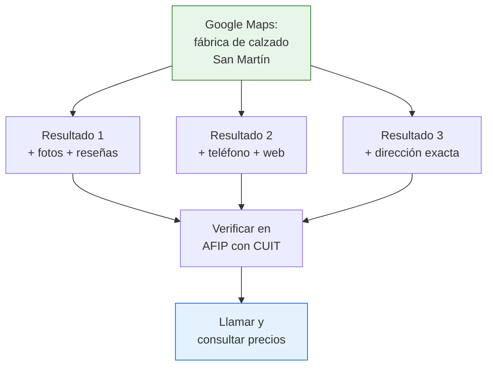

# Directorios B2B y especializados

Además de los directorios institucionales argentinos, existen plataformas comerciales B2B (business to business) internacionales y herramientas no convencionales que te ayudan a encontrar fabricantes. Muchas veces, las fábricas que no aparecen en los directorios oficiales sí están en estas plataformas.

## Plataformas B2B internacionales con presencia en Argentina

Estas plataformas funcionan como "marketplaces" para empresas. Conectan compradores con fabricantes y distribuidores:

### Kompass

| Dato | Detalle |
|------|---------|
| **Sitio** | kompass.com |
| **Qué es** | Directorio empresarial global con cobertura en Argentina |
| **Empresas argentinas** | Miles de empresas registradas |
| **Costo** | Búsqueda básica gratuita, funciones premium pagas |
| **Ventaja** | Clasificación industrial muy detallada |
| **Limitación** | Muchas fichas tienen información mínima |

<Steps>
  <Step title="Ingresá a Kompass">
    Entrá a kompass.com y seleccioná Argentina como país de búsqueda.
  </Step>
  <Step title="Buscá por producto o sector">
    Usá la clasificación por código de actividad o buscá directamente por producto. Kompass tiene una taxonomía industrial muy detallada con miles de categorías.
  </Step>
  <Step title="Filtrá los resultados">
    Acotá por provincia, tamaño de empresa o tipo de actividad (fabricante, distribuidor, importador).
  </Step>
  <Step title="Accedé a los perfiles">
    Revisá los perfiles de las empresas. Los perfiles premium tienen más información, pero los básicos ya incluyen datos de contacto útiles.
  </Step>
</Steps>

### Quiminet

| Dato | Detalle |
|------|---------|
| **Sitio** | quiminet.com |
| **Qué es** | Directorio B2B latinoamericano enfocado en industria |
| **Foco** | Productos químicos, pero también manufactura general |
| **Costo** | Gratuito con registro |
| **Ventaja** | Fuerte presencia de empresas latinoamericanas |
| **Limitación** | Más orientado a México, pero tiene empresas argentinas |

<Note>
Quiminet es especialmente útil si buscás proveedores de **insumos industriales, productos químicos, materias primas o embalajes**. Su nombre sugiere solo química, pero cubre muchos rubros industriales.
</Note>

## Páginas amarillas y directorios locales

Las "páginas amarillas" tradicionales migraron al formato digital y siguen siendo una fuente válida:

| Directorio | URL | Utilidad |
|-----------|-----|----------|
| **Páginas Amarillas Argentina** | paginasamarillas.com.ar | Directorio general, incluye industrias |
| **Guía Clarín** | guiaclarinrural.com.ar | Enfocada en sector rural y agroindustrial |
| **Cylex Argentina** | cylex.com.ar | Directorio empresarial con reseñas |
| **DonEmpresa** | donempresa.com | Directorio de empresas argentinas por rubro |

<Tip>
Las páginas amarillas digitales tienen una ventaja que los directorios industriales no tienen: **reseñas y comentarios** de otros usuarios. Si una fábrica tiene buenas reseñas como proveedor, es una señal positiva.
</Tip>

## Google Maps como directorio informal

Esta es una de las herramientas más subestimadas para encontrar fábricas. Google Maps puede funcionar como un directorio industrial improvisado:

### Cómo buscar fábricas en Google Maps

<Steps>
  <Step title="Abrí Google Maps">
    Entrá a maps.google.com o abrí la app en tu celular.
  </Step>
  <Step title="Escribí tu búsqueda">
    Usá fórmulas como:
    - "fábrica de [producto] [ciudad]"
    - "industria [rubro] [zona]"
    - "mayorista [producto] [provincia]"

    Ejemplo: "fábrica de calzado San Martín Buenos Aires"
  </Step>
  <Step title="Explorá los resultados en el mapa">
    Google Maps te muestra las empresas en su ubicación real. Podés ver:
    - Dirección exacta
    - Fotos del lugar (a veces de la fábrica por dentro)
    - Teléfono y horarios
    - Reseñas de otros compradores
    - Sitio web (si tiene)
  </Step>
  <Step title="Usá Street View">
    Con Street View podés "caminar" virtualmente por la calle y ver el frente de la fábrica. Esto te da una idea del tamaño del establecimiento antes de visitarlo.
  </Step>
  <Step title="Guardá tus hallazgos">
    Usá la función "Guardar" de Google Maps para marcar las fábricas que te interesan y planificar visitas.
  </Step>
</Steps>

<Warning>
Google Maps es una herramienta complementaria, no un directorio verificado. Algunas fichas de Google Maps pueden estar desactualizadas, con números de teléfono viejos o negocios que ya cerraron. Siempre llamá antes de ir en persona.
</Warning>

### Fórmulas de búsqueda efectivas en Google Maps

| Fórmula | Ejemplo | Qué encontrás |
|---------|---------|---------------|
| "fábrica de [producto] [ciudad]" | "fábrica de envases Lanús" | Fabricantes específicos en una zona |
| "industria [rubro] [zona industrial]" | "industria metalúrgica Pilar" | Empresas en zonas industriales conocidas |
| "mayorista [producto] [provincia]" | "mayorista textil Córdoba" | Mayoristas y distribuidores (que a veces son fábricas) |
| "planta industrial [zona]" | "planta industrial Campana" | Establecimientos industriales en general |

## Tabla comparativa general

| Plataforma | Tipo | Gratis | Verificación | Mejor uso |
|-----------|------|--------|-------------|-----------|
| **Kompass** | B2B internacional | Parcial | No | Búsqueda por clasificación industrial detallada |
| **Quiminet** | B2B latinoamericano | Si | No | Insumos industriales y químicos |
| **Páginas Amarillas** | Directorio general | Si | No | Búsqueda local con reseñas |
| **Google Maps** | Mapa + directorio | Si | No | Ubicación real, fotos, reseñas |
| **Cylex** | Directorio empresarial | Si | No | Reseñas de usuarios |

## Estrategia combinada

La clave no es usar un solo directorio sino combinar varios para maximizar resultados:

<Accordion title="Paso 1: Búsqueda amplia">
Empezá por la [Guía Industrial Argentina](/app/paso1-argentina/encontrar-fabricas/guia-industrial-argentina) y Kompass para tener una lista inicial de fábricas en tu rubro.
</Accordion>

<Accordion title="Paso 2: Verificación">
Cruzá esa lista con [ArgentinaTradeNet](/app/paso1-argentina/encontrar-fabricas/argentina-tradenet) para ver cuáles están verificadas por la Cancillería.
</Accordion>

<Accordion title="Paso 3: Ubicación y fotos">
Buscá cada empresa en Google Maps para ver fotos del lugar, verificar que la dirección sea real y leer reseñas de otros compradores.
</Accordion>

<Accordion title="Paso 4: Validación final">
Verificá el CUIT de cada empresa en AFIP para confirmar que está activa y registrada. Llamá por teléfono para confirmar que atienden.
</Accordion>

<Tip>
Si después de buscar en todos los directorios no encontrás fábricas de tu rubro, no te desanimes. Muchas fábricas argentinas no tienen presencia digital. Visitá las [ferias industriales](/app/paso1-argentina/encontrar-fabricas/ferias-principales) donde los fabricantes se presentan en persona.
</Tip>
