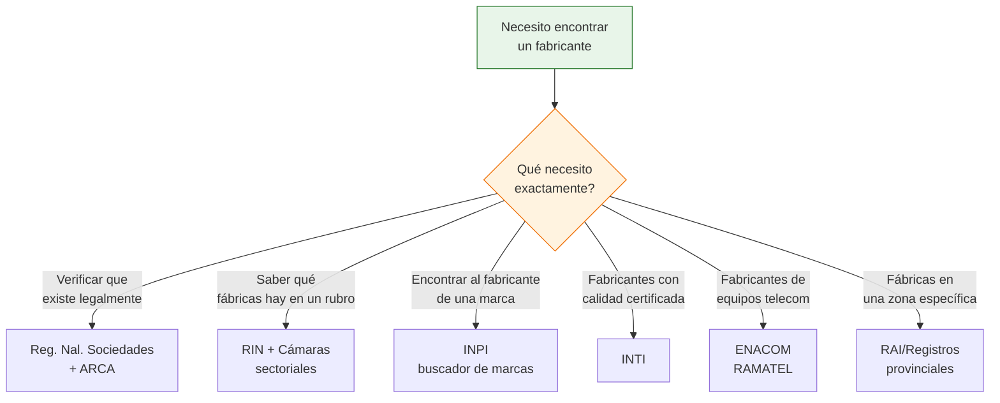

# Otros registros oficiales

> Además del RIN, RAI, RUMP, INTI e INPI, existen registros oficiales especializados que cubren sectores específicos. Esta página reúne los más relevantes para completar tu mapa de fuentes de búsqueda de fabricantes.

## Registro Nacional de Sociedades

### Qué es

Es el registro oficial del **Ministerio de Justicia** donde se inscriben todas las sociedades comerciales de Argentina (S.A., S.R.L., S.A.S., etc.). No es específico de industria, pero te permite **verificar que una empresa existe legalmente**.

| Dato | Detalle |
|------|---------|
| **Administrado por** | Ministerio de Justicia y Derechos Humanos |
| **Web** | argentina.gob.ar/justicia/registro-nacional-sociedades |
| **Búsqueda por** | CUIT o razón social |
| **Costo** | Gratuito (consulta básica) |

### Cómo usarlo

<Steps>
  <Step title="Accedé al buscador">
    Ingresá a **argentina.gob.ar/justicia/registro-nacional-sociedades** y buscá la opción de consulta.
  </Step>
  <Step title="Buscá por CUIT o razón social">
    Si ya tenés el CUIT de una fábrica (por ejemplo, lo sacaste del INPI), ingresalo para ver si la sociedad está registrada. También podés buscar por nombre de empresa.
  </Step>
  <Step title="Verificá los datos">
    El registro te muestra: razón social completa, tipo de sociedad, fecha de constitución y estado (activa, disuelta, etc.).
  </Step>
</Steps>

<Note>
Este registro es fundamental para **verificar** que una fábrica es una empresa legal. Si alguien te ofrece productos de una "fábrica" que no aparece como sociedad registrada ni tiene CUIT, es una señal de alerta importante.
</Note>

### Cuándo usarlo

- Antes de hacer tu primera compra a cualquier fábrica nueva
- Cuando encontraste una fábrica por Google o redes sociales y querés verificarla
- Para confirmar datos que te dieron por teléfono o email

## ENACOM-RAMATEL — Registro de Telecomunicaciones

### Qué es

ENACOM (Ente Nacional de Comunicaciones) administra el **RAMATEL** (Registro de Materiales de Telecomunicaciones). Todas las empresas que fabrican equipos de telecomunicaciones, electrónica de comunicaciones y productos relacionados deben inscribirse.

| Dato | Detalle |
|------|---------|
| **Administrado por** | ENACOM |
| **Web** | enacom.gob.ar/empresas-inscriptas_p351 |
| **Tipo de empresas** | Fabricantes de equipos de telecomunicaciones |
| **Acceso** | Público, listado en web |

### Para quién es útil

<Tabs>
  <Tab title="Te sirve si buscás">
    - Fabricantes de antenas, routers o equipos de red
    - Fabricantes de equipos de radiocomunicación
    - Productores de cables y conectores de telecomunicaciones
    - Fabricantes de centrales telefónicas o equipos VOIP
    - Cualquier producto electrónico que emita o reciba señales de radio
  </Tab>
  <Tab title="No te sirve si buscás">
    - Electrónica general (cargadores, accesorios de celular, auriculares)
    - Productos que no emiten ni reciben señales de telecomunicaciones
    - Software o aplicaciones
    - Electrodomésticos comunes
  </Tab>
</Tabs>

### Cómo consultar

<Steps>
  <Step title="Ingresá a la web de ENACOM">
    Visitá **enacom.gob.ar/empresas-inscriptas_p351** donde encontrás el listado de empresas inscriptas en el RAMATEL.
  </Step>
  <Step title="Revisá el listado">
    El sitio publica las empresas inscriptas con sus datos: razón social, productos registrados y datos de contacto.
  </Step>
  <Step title="Identificá fabricantes">
    Filtrá por el tipo de producto que te interesa. Las empresas que aparecen fabrican o importan legalmente equipos de telecomunicaciones en Argentina.
  </Step>
</Steps>

## ANMAC — Fabricantes de Explosivos y Pirotecnia

### Qué es

La ANMAC (Agencia Nacional de Materiales Controlados) registra a los **fabricantes de explosivos, pirotecnia y materiales controlados**. Es un registro altamente especializado.

| Dato | Detalle |
|------|---------|
| **Administrado por** | ANMAC (Ministerio de Seguridad) |
| **Web** | argentina.gob.ar/seguridad/anmac/tramites/fabricantes |
| **Tipo de empresas** | Fabricantes de pirotecnia, explosivos industriales |
| **Acceso** | Consulta a través de la web |

<Warning>
La fabricación y comercialización de pirotecnia y explosivos está **altamente regulada** en Argentina. Si estás considerando este rubro, necesitás habilitaciones especiales, permisos de almacenamiento y cumplir normativas de seguridad estrictas. No es un rubro para principiantes sin asesoramiento legal especializado.
</Warning>

### Cuándo es relevante

Este registro solo te interesa si buscás:
- Fabricantes de pirotecnia comercial (fuegos artificiales)
- Proveedores de explosivos para minería o construcción
- Fabricantes de señales luminosas o bengalas

## Tabla resumen de todos los registros oficiales

Esta tabla consolida **todos los registros oficiales** cubiertos en esta sección para que los tengas como referencia rápida:

| Registro | Qué contiene | Cuándo usarlo | Web/Contacto |
|----------|-------------|---------------|--------------|
| **RIN** | Todas las empresas industriales (Clase D CLANAE) | Buscar fabricantes por rubro industrial | consultarin@produccion.gob.ar |
| **RAI (CABA)** | Industrias registradas en CABA | Buscar fábricas en Capital Federal | buenosaires.gob.ar |
| **Registros provinciales** | Industrias por provincia | Buscar fábricas en una provincia específica | Web de cada provincia |
| **RUMP** | Empresas en programas productivos | Encontrar empresas formalizadas y activas | Ministerio de Economía |
| **Observatorio de Cámaras** | Cámaras empresariales por sector | Encontrar la cámara de tu rubro | argentina.gob.ar/produccion |
| **Reg. Bienes de Capital** | Fabricantes de maquinaria | Buscar fabricantes de equipos industriales | argentina.gob.ar (Excel) |
| **INTI** | Empresas con certificación técnica | Encontrar fabricantes certificados | inti.gob.ar |
| **INPI** | Marcas, patentes, diseños | Identificar quién fabrica qué producto | portaltramites.inpi.gob.ar |
| **Reg. Nal. Sociedades** | Todas las sociedades comerciales | Verificar existencia legal de una empresa | argentina.gob.ar/justicia |
| **ENACOM-RAMATEL** | Fabricantes de telecomunicaciones | Buscar fabricantes de equipos telecom | enacom.gob.ar |
| **ANMAC** | Fabricantes de explosivos/pirotecnia | Buscar fabricantes de pirotecnia | argentina.gob.ar/seguridad/anmac |

## Diagrama: cuándo usar cada registro

<Tip>
No necesitás usar TODOS estos registros. Para la mayoría de las búsquedas, la combinación de **INPI** (para identificar fabricantes) + **Registro Nacional de Sociedades** (para verificar) + **cámaras sectoriales** (para acceder a listados) cubre el 90% de las necesidades. Los demás registros son para situaciones específicas.
</Tip>

## Siguiente paso

Ya conocés todas las fuentes oficiales del Estado. Ahora avanzá hacia las fuentes no gubernamentales: [cámaras y asociaciones empresariales](/app/paso1-argentina/encontrar-fabricas/uia-came-grandes), [directorios industriales](/app/paso1-argentina/encontrar-fabricas/guia-industrial) y [ferias](/app/paso1-argentina/encontrar-fabricas/ferias-industriales) para completar tu búsqueda.
