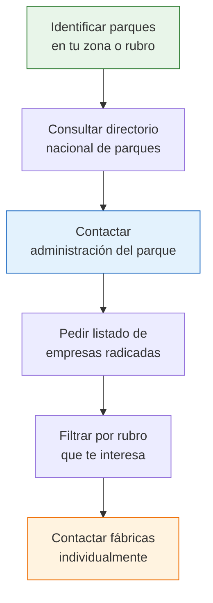

# Parques industriales

> Un parque industrial es una zona planificada donde se agrupan fábricas y talleres. Argentina tiene cientos de parques industriales distribuidos en todo el país. Contactar la administración de un parque te da acceso a un listado de todas las empresas radicadas, lo que equivale a un directorio de fábricas por zona geográfica.

## Qué es un parque industrial

Un parque industrial es un predio con infraestructura compartida (gas, electricidad, acceso vial, seguridad) donde se instalan empresas industriales. Existen parques públicos (creados por el Estado), privados (desarrollados por empresas) y mixtos.

**Lo que importa para tu búsqueda:** Cada parque tiene una administración que conoce a todas las empresas que operan dentro. Al contactar esa administración, podés acceder a un listado completo de fabricantes por rubro.

<Note>
Argentina cuenta con más de 400 parques industriales registrados a nivel nacional. No todos son grandes o conocidos, pero incluso los parques pequeños de ciudades del interior pueden tener fabricantes de nicho muy interesantes que no vas a encontrar en ninguna plataforma online.
</Note>

## Directorio nacional de parques industriales

El recurso principal para localizar parques es:

| Recurso | Detalle |
|---------|---------|
| **Sitio web** | parquesindustriales.com.ar |
| **Qué ofrece** | Directorio de parques industriales de Argentina |
| **Búsqueda** | Por provincia, localidad y tipo de parque |
| **Información** | Ubicación, contacto de administración, empresas radicadas |
| **Costo** | Gratuito |

<Tip>
El directorio de parquesindustriales.com.ar te permite buscar por provincia y localidad. Empezá buscando los parques de la provincia donde operás, ya que la cercanía geográfica facilita las visitas y reduce costos de flete.
</Tip>

## Principales concentraciones industriales

### Gran Buenos Aires (GBA)

| Zona | Partidos principales | Rubros predominantes |
|------|---------------------|---------------------|
| **Zona Norte** | Pilar, Escobar, Campana, Zárate | Automotriz, farmacéutica, alimentos, plásticos |
| **Zona Oeste** | Moreno, Merlo, La Matanza, Morón | Textil, metalúrgica, alimenticia, caucho |
| **Zona Sur** | Avellaneda, Quilmes, Berazategui, Florencio Varela | Textil, curtiembres, química, vidrio |

### Interior del país

| Provincia | Ciudades industriales clave | Rubros predominantes |
|-----------|---------------------------|---------------------|
| **Córdoba** | Córdoba capital, Río Cuarto, Villa María | Automotriz, alimentos, maquinaria agrícola |
| **Santa Fe** | Rosario, Rafaela, Reconquista | Maquinaria agrícola, alimentos, siderurgia |
| **Mendoza** | Mendoza capital, San Rafael, Luján de Cuyo | Vitivinícola, alimentos, metalmecánica |
| **San Luis** | San Luis capital, Villa Mercedes | Electrónica, plásticos, textil (régimen de promoción industrial) |
| **Tucumán** | San Miguel de Tucumán | Azúcar, citrícola, textil |
| **Entre Ríos** | Paraná, Concordia, Gualeguaychú | Avícola, citrícola, madera |

<Note>
San Luis tiene un régimen de promoción industrial que atrajo muchas fábricas a la provincia. Si buscás fabricantes de electrónica, plásticos o textil, los parques industriales de San Luis pueden tener opciones que no encontrás en Buenos Aires.
</Note>

## Cómo contactar la administración de un parque

<Steps>
  <Step title="Identificá los parques de tu interés">
    Usá parquesindustriales.com.ar o buscá en Google: "parque industrial [ciudad]" o "parque industrial [provincia]". Seleccioná 3-5 parques que estén en tu zona o en zonas conocidas por el rubro que buscás.
  </Step>
  <Step title="Buscá los datos de contacto de la administración">
    Cada parque tiene una administración con teléfono, email y a veces sitio web propio. Si no encontrás datos online, buscá en Google Maps el nombre del parque y llamá al número que aparece.
  </Step>
  <Step title="Llamá o escribí a la administración">
    Presentate como emprendedor o comerciante que busca contactar fabricantes de un rubro específico. Pedí: listado de empresas radicadas, datos de contacto de fábricas del rubro que te interesa, y si es posible una visita al parque.
  </Step>
  <Step title="Solicitá el listado de empresas">
    La mayoría de las administraciones tienen un listado o directorio de empresas radicadas que pueden compartir. Algunos parques lo publican en su sitio web; otros te lo envían por email si lo pedís.
  </Step>
  <Step title="Contactá a las fábricas individualmente">
    Con el listado en mano, contactá por teléfono o email a las fábricas del rubro que te interesa. Mencioná que conseguiste su contacto a través de la administración del parque; esto genera confianza.
  </Step>
</Steps>

<Tip>
Las administraciones de parques industriales suelen ser muy colaborativas. Parte de su trabajo es promover las empresas radicadas. No tengas vergüenza de pedir información: están acostumbrados a recibir consultas de compradores y emprendedores.
</Tip>

## Visitar un parque industrial

Visitar un parque industrial en persona es una de las mejores formas de conocer fabricantes. Esto es lo que necesitás saber:

<Tabs>
  <Tab title="Antes de ir">
    - Llamá a la administración para avisar que vas a visitar
    - Pedí que te indiquen qué fábricas de tu rubro están activas
    - Averiguá el horario de atención (muchas fábricas cierran a las 16:00-17:00)
    - Llevá tarjetas personales y una breve presentación de tu negocio
    - Vestite de forma profesional pero práctica (vas a caminar por zonas industriales)
  </Tab>
  <Tab title="Durante la visita">
    - Pasá primero por la administración para presentarte
    - Pedí que te orienten hacia las fábricas de tu rubro
    - Recorré el parque y fijate en los carteles de las empresas
    - En cada fábrica que te interese, preguntá por el área comercial o ventas
    - Si no hay nadie de ventas, dejá tus datos y pedí que te contacten
  </Tab>
  <Tab title="Después de la visita">
    - Anotá todas las fábricas que visitaste con datos de contacto
    - Enviá un email de seguimiento a cada una dentro de las 48 horas
    - Agregá los contactos a tu planilla de proveedores
    - Programá una segunda visita si hay fábricas que no pudiste ver
  </Tab>
</Tabs>

## Ventajas de buscar en parques industriales

| Ventaja | Detalle |
|---------|---------|
| **Concentración** | Muchas fábricas en un mismo lugar, ahorrás tiempo |
| **Verificación inmediata** | Ves la fábrica con tus propios ojos |
| **Confianza** | Las empresas en parques son formales (pagan alquiler, servicios) |
| **Contacto directo** | Hablás con la gente que fabrica, no con intermediarios |
| **Descubrimientos** | Podés encontrar fábricas que no tienen presencia online |

<Warning>
No todos los parques industriales son iguales. Algunos están en pleno funcionamiento con muchas empresas activas; otros tienen lotes vacíos o empresas que ya no operan. Consultá con la administración antes de visitarlos para asegurarte de que hay empresas activas del rubro que buscás.
</Warning>

## Parques industriales especializados

Algunos parques se especializan en determinados rubros. Estos son particularmente útiles porque concentran fabricantes del mismo sector:

<Accordion title="Ejemplos de especialización por zona">
  - **Avellaneda / Lanús (GBA Sur)**: histórica concentración de curtiembres y fabricantes de calzado de cuero
  - **Flores / Once (CABA)**: concentración de talleres y fábricas textiles
  - **Rafaela (Santa Fe)**: polo de maquinaria agrícola y autopartismo
  - **Mendoza**: polo vitivinícola y olivícola con fábricas de equipamiento asociado
  - **San Luis**: polo electrónico y plástico por régimen de promoción industrial
  - **Pilar (GBA Norte)**: concentración de empresas farmacéuticas y de consumo masivo
</Accordion>

## Siguiente paso

Complementá la búsqueda en parques industriales con una estrategia digital: usá [LinkedIn y redes profesionales](/app/paso1-argentina/encontrar-fabricas/linkedin-redes) para contactar directamente a gerentes y dueños de las fábricas que identificaste.
