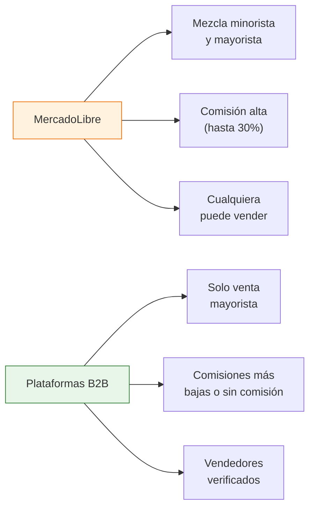

# Plataformas B2B mayoristas argentinas

> Mientras que MercadoLibre mezcla vendedores minoristas y mayoristas, existen plataformas argentinas diseñadas exclusivamente para la venta entre empresas (B2B). En estas plataformas, los vendedores son fabricantes y distribuidores verificados, y los precios ya son mayoristas.

## Qué son las plataformas B2B

Las plataformas B2B (Business to Business) son sitios web donde **solo venden empresas a empresas**. A diferencia de MercadoLibre o una tienda online común:

- Los precios son mayoristas (sin recargo minorista)
- Hay pedidos mínimos (no comprás una unidad)
- Los vendedores son fabricantes o distribuidores directos
- La facturación es formal (Factura A o B según tu condición fiscal)

<Note>
En Argentina, el ecosistema de plataformas B2B todavía está en desarrollo comparado con China (Alibaba) o Estados Unidos (Amazon Business). Las opciones son más limitadas pero están creciendo rápido, especialmente desde 2024. Los datos de esta guía son vigentes a febrero de 2026.
</Note>

## Plataformas principales

### VentasxMayor

| Dato | Detalle |
|------|---------|
| **URL** | ventasxmayor.com |
| **Qué es** | Marketplace mayorista argentino |
| **Tipo de vendedores** | Fabricantes, distribuidores y mayoristas |
| **Rubros principales** | Indumentaria, bazar, librería, juguetes, accesorios |
| **Registro** | Gratuito, necesitás CUIT |
| **Facturación** | Factura A y B |

**Cómo usarla:**
- Registrate con tu CUIT como comprador
- Navegá por categorías o buscá productos específicos
- Cada vendedor muestra su mínimo de compra y precios por escala
- Podés contactar al vendedor directamente dentro de la plataforma

<Tip>
En VentasxMayor, prestá atención a los vendedores que indican "fabricación propia". Estos son los que realmente fabrican el producto, no intermediarios que revenden de otra marca.
</Tip>

### Billowshop

| Dato | Detalle |
|------|---------|
| **URL** | billowshop.com |
| **Qué es** | Plataforma de venta mayorista con stock centralizado |
| **Modelo** | Precios diferenciados según tipo de cliente |
| **Rubros principales** | Moda, accesorios, bazar, decoración |
| **Registro** | Gratuito |
| **Diferencial** | Precios escalonados: revendedor, mayorista, supermayorista |

**Cómo funciona el sistema de precios:**
Billowshop maneja un sistema de escalas donde tu precio baja a medida que comprás más. Esto te permite empezar con compras pequeñas e ir escalando.

### Almacenes Mayoristas

| Dato | Detalle |
|------|---------|
| **URL** | almacenesmayoristas.com |
| **Qué es** | Portal mayorista con primeras marcas |
| **Tipo de vendedores** | Fabricantes directos y distribuidores oficiales |
| **Rubros principales** | Alimentos, bebidas, limpieza, perfumería |
| **Registro** | Gratuito con CUIT |
| **Diferencial** | Trabaja directo con fabricantes de primeras marcas |

**Ventaja principal:** Si buscás productos de marcas conocidas para revender, esta plataforma te conecta con los canales oficiales de distribución. Los precios son los de lista mayorista del fabricante.

### Multipoint B2B

| Dato | Detalle |
|------|---------|
| **URL** | b2b.multipoint.com.ar |
| **Qué es** | Plataforma B2B de distribución de tecnología |
| **Tipo de vendedores** | Distribuidor oficial Samsung y otras marcas tech |
| **Rubros principales** | Electrónica, telefonía, tecnología |
| **Registro** | Requiere habilitación comercial |
| **Diferencial** | Distribuidor oficial, garantía de fábrica |

<Warning>
Multipoint B2B es un distribuidor especializado en tecnología, no un marketplace abierto. Para acceder necesitás estar registrado como comercio del rubro. Es ideal si tu negocio se orienta a la venta de electrónica y tecnología.
</Warning>

## Comparación entre plataformas

| Característica | VentasxMayor | Billowshop | Almacenes Mayoristas | Multipoint B2B |
|---------------|-------------|------------|---------------------|---------------|
| **Facilidad de registro** | Alta | Alta | Media | Baja |
| **Variedad de rubros** | Amplia | Media | Media | Baja (solo tech) |
| **Fabricantes directos** | Algunos | Pocos | Sí | Sí (distribuidor) |
| **Mínimo de compra** | Variable | Variable | Variable | Alto |
| **Mejor para** | Explorar rubros variados | Empezar con poco volumen | Marcas conocidas | Tecnología |

## Diferencias con MercadoLibre

| Aspecto | MercadoLibre | Plataformas B2B |
|---------|-------------|-----------------|
| **Precio base** | Minorista (incluye comisión ML) | Mayorista |
| **Tipo de comprador** | Cualquier persona | Empresas con CUIT |
| **Pedido mínimo** | 1 unidad | Variable (desde 6 a 100+ unidades) |
| **Facturación** | Factura C (consumidor final) | Factura A o B |
| **Contacto con vendedor** | Limitado por políticas ML | Directo |
| **Verificación del vendedor** | Reputación por ventas | Datos fiscales verificados |

## Cómo empezar con plataformas B2B

<Steps>
  <Step title="Elegí la plataforma según tu rubro">
    Usá la tabla de comparación de arriba. Si vendés ropa, empezá por VentasxMayor. Si vendés alimentos, por Almacenes Mayoristas. Si es tecnología, por Multipoint.
  </Step>
  <Step title="Registrate con tu CUIT">
    Todas las plataformas B2B requieren CUIT para registrarte como comprador. Si todavía no tenés, revisá la guía de [inscripción fiscal](/app/paso1-argentina/empezar-de-cero/inscripcion-fiscal).
  </Step>
  <Step title="Explorá catálogos y precios">
    Antes de contactar vendedores, revisá los catálogos para entender los rangos de precios mayoristas de tu rubro. Esto te da un marco de referencia para negociar.
  </Step>
  <Step title="Contactá a los vendedores que te interesen">
    Escribí un mensaje profesional presentándote: qué tipo de negocio tenés, qué productos buscás, qué volumen estimás comprar. Pedí lista de precios y condiciones.
  </Step>
  <Step title="Compará con otras fuentes">
    No te quedes solo con lo que encontrás en plataformas B2B. Cruzá precios con lo que encontraste en [MercadoLibre](/app/paso1-argentina/encontrar-fabricas/mercadolibre-como-fuente) y con fabricantes que contactes directo.
  </Step>
</Steps>

## Cuándo usar cada plataforma

<Tabs>
  <Tab title="Para explorar">
    Si estás empezando y querés ver qué productos y precios hay en el mercado mayorista, **VentasxMayor** y **Billowshop** son las mejores opciones. Son abiertas, fáciles de navegar y no requieren compromiso de compra para ver precios.
  </Tab>
  <Tab title="Para comprar marcas">
    Si ya sabés qué marca querés revender y necesitás el canal oficial, **Almacenes Mayoristas** te conecta con distribuidores autorizados. Esto te asegura producto original con garantía.
  </Tab>
  <Tab title="Para tecnología">
    Si tu negocio es la venta de electrónica, **Multipoint B2B** te da acceso a precios de distribuidor oficial. El registro es más exigente pero los márgenes son mejores que comprando por canales minoristas.
  </Tab>
</Tabs>

<Warning>
Ninguna plataforma B2B argentina es tan completa como Alibaba para China. Vas a necesitar complementar con otras fuentes: búsqueda directa en Google, ferias industriales y contactos. Las plataformas B2B son UNA herramienta dentro de tu estrategia, no la única.
</Warning>

## Siguiente paso

Para complementar lo que encontrés en plataformas digitales, explorá las [rondas de negocios](/app/paso1-argentina/encontrar-fabricas/rondas-negocios), donde podés conocer fabricantes en persona en reuniones organizadas.
