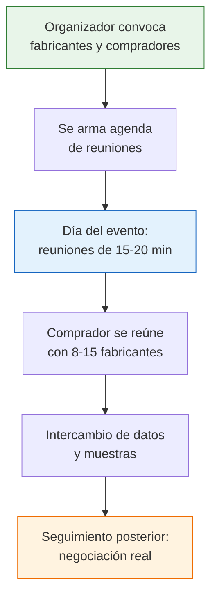

# Rondas de negocios

> Las rondas de negocios son reuniones organizadas donde te sientan cara a cara con fabricantes durante 15-20 minutos cada uno. Es como tener una agenda de reuniones con fábricas armada por alguien más, gratis o a bajo costo. Son una de las formas más efectivas de encontrar proveedores en Argentina.

## Qué es una ronda de negocios

Una ronda de negocios (también llamada "rueda de negocios") es un evento donde:

- Un **organizador** (cámara, gobierno, institución) convoca a fabricantes y compradores
- Se programan **reuniones cortas** (15 a 20 minutos) entre cada comprador y cada vendedor
- Vos te sentás frente a frente con el fabricante, le explicás qué necesitás, y él te muestra qué ofrece
- En un solo día podés tener **8 a 15 reuniones** con fabricantes diferentes

<Note>
La gran ventaja de las rondas es la **eficiencia**: en un solo día hacés lo que te llevaría semanas buscando por internet y agendando reuniones una por una. Además, los fabricantes que participan ya están en modo "quiero vender", lo que facilita la conversación.
</Note>

## Quién organiza rondas de negocios en Argentina

### Cámaras empresariales

| Organización | Tipo de rondas | Frecuencia aproximada |
|-------------|----------------|----------------------|
| **CAME** (Confederación Argentina de la Mediana Empresa) | Multisectoriales, por rubro | Varias al año |
| **UIA** (Unión Industrial Argentina) | Industriales, por sector | Periódicas |
| **Cámaras sectoriales** (textil, alimentos, metalúrgica, etc.) | Específicas del rubro | 1-2 al año |
| **Cámaras de comercio regionales** | Multisectoriales locales | Variable |

### Gobierno nacional y provincial

| Organismo | Tipo de rondas | Detalle |
|-----------|----------------|---------|
| **Cancillería** (a través de ArgentinaTradeNet) | Orientadas a exportación/importación | Conectan empresas argentinas con compradores internacionales, pero también sirven para el mercado interno |
| **Ministerios de Producción provinciales** | Por provincia y rubro | Cada provincia organiza las suyas según su perfil productivo |
| **Municipios y agencias de desarrollo** | Locales | Orientadas a PyMEs de la zona |

### Instituciones y organismos

- **Fundación ExportAr**: rondas con foco en comercio exterior
- **CFI** (Consejo Federal de Inversiones): rondas interprovinciales
- **Universidades y centros tecnológicos**: rondas de vinculación tecnológica

<Tip>
Las rondas organizadas por **gobiernos provinciales** suelen ser las más accesibles para quien está empezando. Son gratuitas, tienen un proceso de inscripción simple, y los organizadores te ayudan a prepararte si es tu primera vez.
</Tip>

## Cómo funcionan paso a paso

<Steps>
  <Step title="Enterarte de que hay una ronda">
    Las rondas se anuncian en las páginas web de las cámaras, ministerios de producción provinciales, y redes sociales de organismos de desarrollo. Suscribite a los newsletters de estas organizaciones para no perdértelas.
  </Step>
  <Step title="Inscribirte como comprador">
    La inscripción suele ser online. Te van a pedir: datos de tu empresa (o tu actividad si sos monotributista), qué productos buscás, qué volumen estimás comprar, y en qué rubros estás interesado.
  </Step>
  <Step title="Recibir la agenda de reuniones">
    Días antes del evento, el organizador te envía tu agenda personalizada: a qué hora te reunís con qué fabricante. Algunos eventos te permiten elegir con quién reunirte; otros lo asignan ellos.
  </Step>
  <Step title="Preparar tu presentación">
    Llevá una descripción clara de tu negocio, qué productos necesitás, qué volúmenes manejás, y tus datos de contacto impresos. Preparate para explicar todo en 2-3 minutos.
  </Step>
  <Step title="Asistir a la ronda">
    El día del evento, cumplí tu agenda de reuniones. Cada reunión dura entre 15 y 20 minutos. Tomá notas de cada fabricante, pedí catálogos y muestras, intercambiá datos de contacto.
  </Step>
  <Step title="Hacer seguimiento">
    La reunión en la ronda es solo el primer contacto. Después del evento, contactá a los fabricantes que te interesaron para profundizar: pedí cotizaciones formales, visitá la fábrica, negociá condiciones.
  </Step>
</Steps>

## Qué preparar para una ronda

<Tabs>
  <Tab title="Documentos">
    - Tarjetas personales o de tu empresa (mínimo 20)
    - Breve descripción de tu negocio (impresa, una carilla)
    - Lista de productos que buscás con especificaciones
    - Constancia de inscripción fiscal (si te la piden)
  </Tab>
  <Tab title="Información">
    - Volumen estimado de compra mensual o por pedido
    - Presupuesto aproximado disponible
    - Plazos de entrega que necesitás
    - Zona geográfica de tu operación
    - Requisitos especiales (packaging, certificaciones, etc.)
  </Tab>
  <Tab title="Actitud">
    - Sé directo y profesional: el tiempo es limitado
    - Escuchá más de lo que hablás
    - No te comprometas en el momento: decí que vas a evaluar
    - Tomá notas de cada reunión inmediatamente después
    - Pedí muestras cuando sea posible
  </Tab>
</Tabs>

## Por qué son tan efectivas

Las rondas de negocios tienen ventajas que ninguna búsqueda online puede igualar:

| Ventaja | Detalle |
|---------|---------|
| **Eficiencia** | 8-15 reuniones en un solo día |
| **Cara a cara** | Ves al fabricante, su catálogo, sus muestras |
| **Pre-filtrado** | El organizador ya seleccionó fabricantes activos |
| **Confianza** | El contexto formal genera más confianza mutua |
| **Gratuitas o de bajo costo** | La mayoría de las rondas gubernamentales son gratis |
| **Networking** | Conocés a otros compradores y podés intercambiar contactos |

<Warning>
No todas las rondas son iguales. Algunas son muy generales y terminás reunido con empresas que no tienen nada que ver con lo que buscás. Antes de inscribirte, pedí el listado de empresas participantes para asegurarte de que hay fabricantes de tu rubro.
</Warning>

## Dónde encontrar rondas próximas

<Accordion title="Fuentes para buscar rondas de negocios">
  - **CAME**: came.org.ar (sección eventos)
  - **UIA**: uia.org.ar (sección agenda)
  - **ArgentinaTradeNet**: argentiatradenet.gob.ar (rondas de Cancillería)
  - **Ministerios de Producción provinciales**: cada provincia tiene su página con calendario de eventos
  - **Argentina.gob.ar**: portal de trámites y servicios del gobierno nacional
  - **Redes sociales**: seguí en Instagram y LinkedIn a las cámaras de tu rubro; muchas anuncian rondas solo por redes
  - **Google Alerts**: creá una alerta para "ronda de negocios [tu rubro] Argentina" y te llegan las novedades automáticamente
</Accordion>

## Rondas de Cancillería (ArgentinaTradeNet)

<Note>
Las rondas organizadas por la Cancillería a través de ArgentinaTradeNet están principalmente orientadas al comercio exterior (conectar empresas argentinas con compradores del mundo). Sin embargo, participar en estas rondas te permite conocer fabricantes argentinos de alto nivel que exportan, lo que suele ser una señal de buena calidad y capacidad productiva. Aunque no busques exportar, estos fabricantes también venden en el mercado interno.
</Note>

## Errores comunes en tu primera ronda

<Accordion title="Errores que deberías evitar">
  - **Ir sin preparación**: si no sabés qué buscás ni qué volúmenes manejás, perdés tu tiempo y el del fabricante
  - **Comprometerse en el momento**: nunca digas "sí" a un precio o condición en la ronda. Siempre decí que vas a evaluar y confirmás después
  - **No hacer seguimiento**: el 80% del valor de la ronda está en lo que hacés DESPUÉS. Si no contactás a los fabricantes en la semana siguiente, se enfrían los contactos
  - **Llegar tarde**: las reuniones son puntuales. Si perdés una, no la recuperás
  - **No llevar tarjetas**: parece básico pero muchos van sin nada para entregar. El fabricante necesita poder contactarte después
</Accordion>

## Siguiente paso

Otra forma de encontrar fábricas en persona es visitando [parques industriales](/app/paso1-argentina/encontrar-fabricas/parques-industriales), donde hay concentraciones de fábricas agrupadas geográficamente que podés recorrer.
