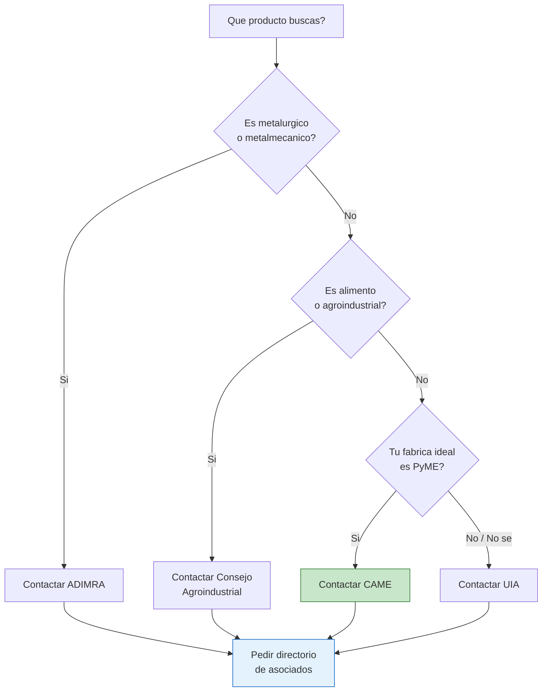

# UIA, CAME y grandes confederaciones

> Las **grandes confederaciones industriales** agrupan miles de fabricas en toda Argentina. Son el punto de partida mas potente para encontrar proveedores porque tienen directorios de socios, organizan eventos y pueden conectarte directamente con fabricantes de cualquier sector.

## Que son las confederaciones industriales

Una confederacion industrial es una **organizacion que agrupa camaras, federaciones y empresas** de un sector o region. Funcionan como un "paraguas" que representa a toda una industria frente al gobierno y al mercado.

Para vos como emprendedor, lo importante es que estas organizaciones:

- Tienen **listados de fabricas asociadas** (a veces publicos, a veces hay que pedirlos)
- Organizan **ferias, exposiciones y ruedas de negocios** donde podes conocer fabricantes
- Ofrecen **informacion sectorial** sobre tendencias, precios y produccion
- Pueden **derivarte directamente** a la camara o fabrica que necesitas

<Note>
No necesitas ser socio de ninguna confederacion para pedir informacion. La mayoria tiene areas de atencion al publico y responde consultas por email o telefono.
</Note>

## Las 5 grandes confederaciones argentinas

### 1. UIA — Union Industrial Argentina

La **principal entidad industrial del pais**. Agrupa a las camaras mas grandes de todos los sectores.

| Dato | Detalle |
|------|---------|
| **Sitio web** | [uia.org.ar](https://www.uia.org.ar) |
| **Que agrupa** | Camaras industriales de todos los sectores |
| **Alcance** | Nacional, con delegaciones regionales |
| **Utilidad para vos** | Directorio de camaras sectoriales, eventos industriales, contacto con fabricantes grandes y medianos |

**Como usarla:** Entra a su web, busca la seccion de camaras asociadas y encontra la que corresponda a tu sector. La UIA es ideal si buscas **fabricas medianas a grandes** con produccion consolidada.

### 2. CAME — Confederacion Argentina de la Mediana Empresa

La **mas util para emprendedores** porque se especializa en PyMEs. Tiene la red mas extensa del pais.

| Dato | Detalle |
|------|---------|
| **Sitio web** | [redcame.org.ar](https://www.redcame.org.ar) |
| **Miembros** | 1,491 federaciones y camaras, +600,000 PyMEs |
| **Alcance** | Nacional, con presencia en todas las provincias |
| **Utilidad para vos** | Red masiva de PyMEs, ferias regionales, contactos directos con fabricantes chicos y medianos |

<Tip>
**CAME es tu mejor aliado si recien empezas.** Sus 600,000+ PyMEs asociadas incluyen miles de fabricas chicas que venden por mayor con pedidos minimos accesibles. Ademas, organizan ferias regionales donde podes conocer fabricantes cara a cara.
</Tip>

### 3. ADIMRA — Asociacion de Industriales Metalurgicos

La organizacion que agrupa a **toda la industria metalurgica y metalmecanica** argentina.

| Dato | Detalle |
|------|---------|
| **Sitio web** | [adimra.org.ar](https://www.adimra.org.ar) |
| **Miembros** | 30+ camaras sectoriales especializadas |
| **Alcance** | Nacional |
| **Utilidad para vos** | Si buscas productos metalicos, herrajes, autopartes, herramientas, maquinaria o cualquier producto metalurgico |

**Como usarla:** ADIMRA tiene sub-camaras por especialidad (fundicion, estampado, torneria, etc.). Identificas la sub-camara que corresponde a tu producto y pedis el listado de asociados.

### 4. CAC — Camara Argentina de Comercio y Servicios

Representa al sector de **comercio y servicios**, no solo a fabricantes.

| Dato | Detalle |
|------|---------|
| **Sitio web** | [cac.com.ar](https://www.cac.com.ar) |
| **Alcance** | Nacional |
| **Utilidad para vos** | Util para encontrar distribuidores mayoristas y empresas de servicios complementarios (logistica, almacenamiento) |

### 5. Consejo Agroindustrial Argentino

Reune a las **cadenas agroindustriales** del pais.

| Dato | Detalle |
|------|---------|
| **Sitio web** | [consejoagroindustrialargentino.org.ar](https://www.consejoagroindustrialargentino.org.ar) |
| **Alcance** | Nacional |
| **Utilidad para vos** | Si buscas fabricantes de alimentos, bebidas, productos derivados del campo, aceites, harinas, etc. |

## Tabla comparativa rapida

| Confederacion | Mejor para | Tamanio de fabricas | Accesibilidad |
|---------------|-----------|---------------------|---------------|
| **UIA** | Todos los sectores industriales | Medianas y grandes | Media — mas institucional |
| **CAME** | Emprendedores y PyMEs | Chicas y medianas | Alta — orientada a PyMEs |
| **ADIMRA** | Metalurgia y metalmecanica | Todas | Media — por sub-camaras |
| **CAC** | Comercio y distribuidores | Todas | Alta |
| **Consejo Agroindustrial** | Alimentos y agro | Medianas y grandes | Media |

## Como contactar y pedir directorios

<Steps>
  <Step title="Elegir la confederacion correcta">
    Usa la tabla de arriba para identificar cual confederacion se acerca mas a tu sector. Si no estas seguro, **empeza por CAME** porque cubre practicamente todos los rubros.
  </Step>
  <Step title="Entrar al sitio web y buscar el directorio">
    La mayoria tiene una seccion de "Asociados", "Camaras miembro" o "Directorio". Navega esas secciones buscando tu sector o provincia.
  </Step>
  <Step title="Contactar por email o telefono">
    Si no encontras un directorio publico, escribi un email explicando que sos emprendedor y buscas fabricantes de [tu producto]. La mayoria responde en 2-5 dias habiles.

    **Modelo de mensaje:**

    *"Buenos dias, soy [tu nombre], emprendedor del rubro [X]. Estoy buscando fabricantes de [producto] que vendan por mayor. Podrian orientarme o derivarme a la camara sectorial correspondiente? Muchas gracias."*
  </Step>
  <Step title="Pedir derivacion a camara sectorial">
    Las confederaciones grandes como UIA y CAME no tienen el listado de fabricas directamente, pero te van a derivar a la **camara sectorial** especifica que si lo tiene.
  </Step>
  <Step title="Contactar la camara sectorial">
    Una vez que tenes el contacto de la camara de tu rubro, pedi el directorio de asociados o consultales directamente por fabricantes que vendan por mayor.
  </Step>
</Steps>

## Flujo de busqueda por confederacion

<Warning>
Las confederaciones son **organismos de representacion**, no plataformas de e-commerce. No esperes encontrar un catalogo con precios online. Su valor esta en conectarte con las **camaras sectoriales** que tienen los listados reales de fabricantes.
</Warning>

## Preguntas frecuentes

<Accordion title="Necesito ser socio para acceder a los directorios?">
No. Cualquier persona puede contactar a una confederacion o camara para pedir informacion. Algunas camaras tienen directorios publicos en su web; otras te los envian por email si lo pedis. Solo los beneficios exclusivos (descuentos, capacitaciones, representacion legal) requieren ser socio.
</Accordion>

<Accordion title="Cual es la diferencia entre UIA y CAME?">
La UIA representa principalmente a la **industria grande y mediana**, mientras que CAME se enfoca en **PyMEs de todos los sectores** (comercio, industria, servicios). Para un emprendedor que recien arranca, CAME suele ser mas accesible y tiene una red mas amplia de fabricas chicas.
</Accordion>

<Accordion title="Puedo ir personalmente a las oficinas?">
Si. Todas las confederaciones tienen sedes fisicas en Buenos Aires (la mayoria en microcentro) y atienden al publico. Ir en persona suele ser mas efectivo que el email porque te pueden derivar en el momento a la persona indicada.
</Accordion>

## Siguiente paso

Ahora que conoces las grandes confederaciones, explora las **camaras sectoriales especificas** de tu rubro. Empeza por la que aplique a tu producto:

<CardGroup cols={2}>
  <Card title="Camaras textiles e indumentaria" icon="shirt" href="/app/paso1-argentina/encontrar-fabricas/camaras-textiles">
    CIAI, FITA, ProTejer, cuero y calzado.
  </Card>
  <Card title="Camaras de alimentos" icon="utensils" href="/app/paso1-argentina/encontrar-fabricas/camaras-alimentos">
    COPAL, alimentacion y camaras regionales.
  </Card>
  <Card title="Metalurgia, plasticos y electronica" icon="gears" href="/app/paso1-argentina/encontrar-fabricas/camaras-metalurgia-plasticos">
    ADIMRA y sus 30+ sub-camaras, CAIP, CADIEEL.
  </Card>
  <Card title="Construccion, quimica y otros" icon="hammer" href="/app/paso1-argentina/encontrar-fabricas/camaras-construccion-quimica">
    Materiales, vidrio, madera, quimica.
  </Card>
</CardGroup>
