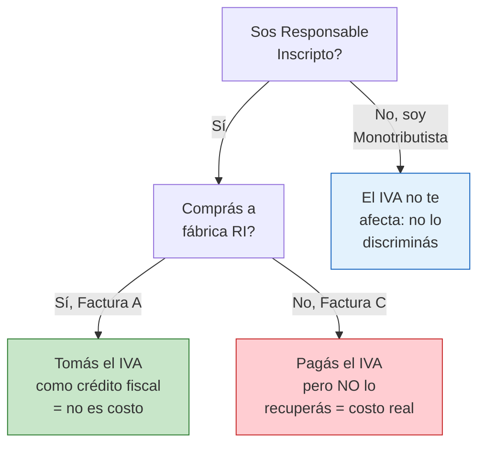

# Comparar precios entre fábricas

> El precio unitario es solo una parte de la ecuación. Para elegir la mejor fábrica necesitás comparar el **costo total real**, incluyendo fletes, condiciones de pago, defectuosos y todos los costos ocultos que los principiantes no ven.

## Por qué los precios varían entre fábricas

Dos fábricas pueden venderte el mismo tipo de producto a precios muy diferentes. Las razones principales:

| Factor | Cómo afecta el precio |
|--------|----------------------|
| **Calidad de materiales** | Materiales de mejor calidad cuestan más, pero generan menos devoluciones |
| **Escala de producción** | Fábricas más grandes suelen tener costos unitarios menores |
| **Ubicación geográfica** | Una fábrica en CABA tiene costos operativos mayores que una en el interior |
| **Formalidad fiscal** | Una fábrica que factura todo y paga impuestos tiene costos mayores que una informal |
| **Antigüedad y reputación** | Fábricas establecidas pueden cobrar más por su marca y confiabilidad |
| **Demanda actual** | Si la fábrica tiene mucho trabajo, los precios suben |

<Note>
Los precios de fábrica en Argentina pueden variar entre un 20% y 50% para productos similares. Por eso es fundamental cotizar con al menos 3 fábricas antes de decidir.
</Note>

## Qué comparar: más allá del precio unitario

Cuando recibís cotizaciones, no mires solo el precio por unidad. Compará estos elementos:

- **Precio unitario** -- el costo de cada unidad
- **Descuentos por cantidad** -- qué descuento dan si comprás más (ej: 10% a partir de 500 unidades)
- **Pedido mínimo** -- cuántas unidades mínimo tenés que comprar
- **Costo de flete/envío** -- si el precio incluye entrega o si el envío es aparte
- **Condiciones de pago** -- contado, seña + saldo, pago a 30 días
- **IVA** -- si sos Responsable Inscripto, el IVA de las compras es crédito fiscal (lo recuperás)
- **Plazo de entrega** -- a veces un plazo más largo viene con mejor precio
- **Packaging incluido** -- viene con packaging listo para venta o tenés que agregar vos?

## Cómo pedir una cotización

Al contactar una fábrica para pedir precio, dales toda la información necesaria para que te coticen bien:

<Steps>
  <Step title="Identificate como comprador mayorista">
    Decí claramente que comprás para revender y que buscás una relación comercial, no una compra puntual. Esto te posiciona mejor para negociar.
  </Step>
  <Step title="Especificá el producto exacto">
    Indicá modelo, color, talle/medida, variantes. Cuanto más específico seas, más precisa será la cotización.
  </Step>
  <Step title="Indicá la cantidad que necesitás">
    Mencioná cuántas unidades querés comprar ahora y cuántas estimás comprar por mes. Esto les da contexto de tu volumen.
  </Step>
  <Step title="Pedí que detallen condiciones">
    Solicitá que incluyan: precio unitario, pedido mínimo, descuentos por cantidad, costo de envío, forma de pago y plazo de entrega.
  </Step>
</Steps>

### Ejemplo de mensaje para pedir cotización

> *"Hola, soy [tu nombre] de [tu emprendimiento]. Compro para revender online. Me interesa cotizar el producto [nombre/modelo específico]. Necesitaría un primer pedido de [X] unidades y estimo comprar [Y] unidades por mes. Me podrían pasar precio unitario, pedido mínimo, descuentos por cantidad, costo de envío a [tu zona], formas de pago y plazo de entrega? Gracias."*

<Tip>
Pedí cotización a un mínimo de 3 fábricas antes de decidir. Esto te da un panorama real del mercado y te da poder de negociación ("otra fábrica me ofrece tal precio...").
</Tip>

## Tabla de comparación de cotizaciones

Armá una tabla como esta para comparar de forma objetiva. Podés hacerla en una hoja de cálculo o en papel:

| Aspecto | Fábrica A | Fábrica B | Fábrica C |
|---------|-----------|-----------|-----------|
| **Precio unitario** | ARS X | ARS Y | ARS Z |
| **Pedido mínimo** | 100 uds | 200 uds | 50 uds |
| **Descuento por cantidad** | 5% desde 500 | 10% desde 300 | Sin descuento |
| **Flete incluido** | No (ARS W aparte) | Sí, incluido | No (retiro en fábrica) |
| **Condiciones de pago** | 50% seña + 50% entrega | Contado contra entrega | 100% anticipado |
| **Plazo de entrega** | 10 días | 7 días | 15 días |
| **IVA** | Factura A (21% IVA discriminado) | Factura C (monotributo) | Factura A (21% IVA discriminado) |
| **Packaging** | Incluido | Básico, sin etiqueta | Incluido + etiqueta |
| **Total para 100 unidades** | ARS total A | ARS total B | ARS total C |

<Warning>
El precio más bajo NO siempre es el mejor. Una fábrica con precio 10% más alto pero que entrega en tiempo, mantiene la calidad y factura correctamente te sale más barata a largo plazo que una informal y poco confiable.
</Warning>

## Costos ocultos que muchos no ven

Estos costos extra pueden cambiar completamente la comparación:

| Costo oculto | Descripción | Impacto aproximado |
|-------------|-------------|-------------------|
| **Flete desde fábrica** | Si el precio no incluye envío, sumá el costo del flete o la combi | ARS 5.000 - 50.000 según distancia y volumen |
| **Packaging extra** | Si la fábrica no entrega con packaging de venta, vos tenés que comprar bolsas, etiquetas, cajas | ARS 50 - 500 por unidad |
| **IVA (si sos RI comprando a monotributista)** | Si comprás con Factura C, no tomás crédito fiscal del 21% de IVA | 21% del precio de compra que no recuperás |
| **Pérdida por defectuosos** | Siempre hay un porcentaje de unidades con defectos en cada lote | 2-5% del lote típicamente |
| **Costo del tiempo** | Si una fábrica tarda mucho en entregar, tenés dinero inmovilizado sin generar ventas | Variable pero real |
| **Costo de devoluciones** | Si la calidad falla, tenés devoluciones de tus clientes | 5-15% en productos de baja calidad |

### IVA: un costo oculto clave

<Note>
Si sos Responsable Inscripto, siempre conviene comprar a fábricas que también sean RI y te emitan Factura A. El IVA que pagás en la compra (21%) lo descontás del IVA que cobrás en tus ventas. Si comprás con Factura C (monotributista), ese 21% se convierte en un costo que no recuperás.
</Note>

## Cómo calcular el costo total real

Para cada fábrica, calculá el costo total así:

| Concepto | Cálculo |
|----------|---------|
| Precio unitario x cantidad | ARS base |
| + Flete/envío | ARS flete |
| + Packaging extra (si aplica) | ARS packaging |
| + IVA no recuperable (si aplica) | 21% del precio si comprás sin Factura A siendo RI |
| + Estimación defectuosos (3%) | 3% del total |
| = **Costo total real** | Suma de todo lo anterior |
| / Cantidad de unidades vendibles | (cantidad total - defectuosos) |
| = **Costo unitario real** | Este es el número que importa |

<Tip>
Los precios de fábrica pueden negociarse. La primera cotización que te dan **nunca es el precio final**. Siempre hay margen para mejorar condiciones, especialmente si mostrás que tenés otras opciones y que pensás comprar regularmente.
</Tip>

## Preguntas frecuentes

<Accordion title="Conviene siempre comprar al proveedor más barato?">
No. El proveedor más barato puede ser informal (no factura, te expone fiscalmente), tener calidad inconsistente (más devoluciones), o ser poco confiable en los tiempos (perdés ventas). El mejor proveedor es el que ofrece la mejor **relación calidad-precio-confiabilidad**, no necesariamente el más barato.
</Accordion>

<Accordion title="Puedo pedir que igualen el precio de otra fábrica?">
Sí, es una práctica habitual. Podés decir: "Otra fábrica me cotizó ARS X. Ustedes pueden igualar o mejorar ese precio?". La mayoría de las fábricas consideran esto como parte normal de la negociación, siempre y cuando lo hagas con respeto.
</Accordion>

<Accordion title="Los precios de fábrica incluyen IVA?">
Depende. Las fábricas RI te pasan precios **más IVA** (21% adicional). Los monotributistas te dan un precio final sin IVA discriminado. Siempre preguntá: "Ese precio es con IVA o sin IVA?" para no llevarte sorpresas.
</Accordion>

## Siguiente paso

<Tip>
Ya sabés cómo comparar precios. Si querés profundizar tu evaluación, aprendé cómo [visitar una fábrica en persona](/app/paso1-argentina/evaluar-negociar/visitar-fabrica) para ver la operación real antes de comprometerte.
</Tip>
