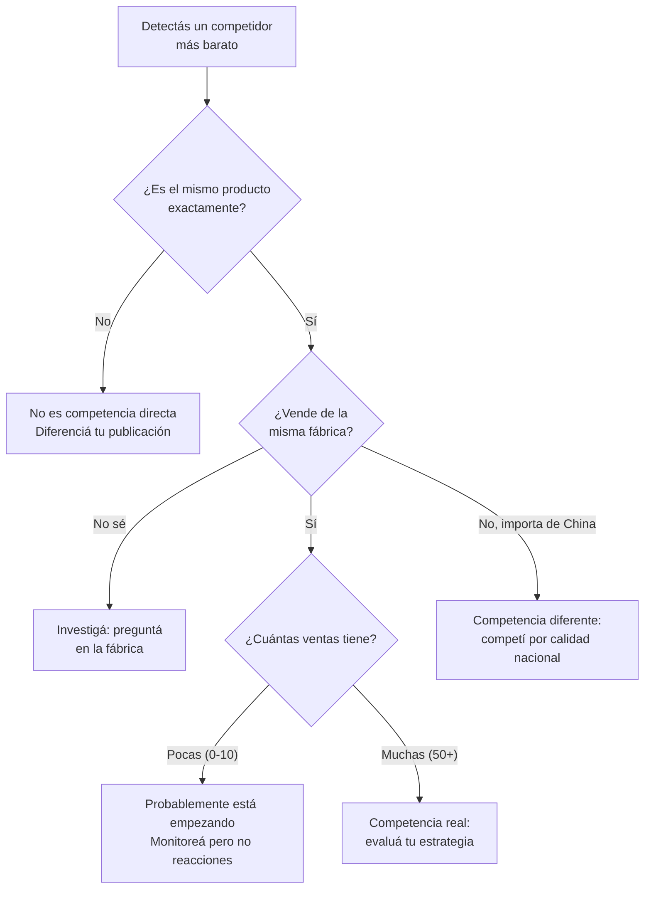

# Competencia y guerra de precios

> Publicaste un producto a $15.000 con buen margen. Al otro día aparece un competidor vendiéndolo a $11.000. Tu primera reacción es bajar el precio. **No lo hagas todavía.** Primero necesitás entender qué está pasando.

## Lo primero: no entres en pánico

Cuando ves un competidor vendiendo más barato, es tentador reaccionar de golpe. Pero antes de tocar tu precio, respondé estas preguntas:

| Pregunta | Por qué importa |
|----------|-----------------|
| ¿Vende exactamente el mismo producto? | Si es otro modelo o calidad, no son comparables |
| ¿De dónde saca el producto? | Si es la misma fábrica, compiten por margen. Si importa de China, es otro juego |
| ¿Cuántas unidades vendió? | Si tiene 0-5 ventas, capaz no es competencia real |
| ¿Puede mantener ese precio? | Si vende a pérdida para posicionarse, no es sostenible |
| ¿Tu margen permite competir? | Si bajás y quedás en rojo, no tiene sentido |

<Warning>
La "guerra de precios" es la trampa más destructiva del comercio. Cuando dos vendedores compiten bajando precios, **los dos pierden**. El único que gana es el comprador, y cuando los dos vendedores quiebren, el comprador tampoco va a tener opciones.
</Warning>

## Entendé a tu competencia

## Estrategias de respuesta por situación

<Tabs>
  <Tab title="Mismo producto, misma fábrica">
    ### Cuando compran al mismo proveedor que vos

    Esta es la situación más común. Dos (o más) revendedores comprando a la misma fábrica argentina y vendiendo en ML.

    **¿Por qué su precio es más bajo?**
    - Compran más volumen y tienen mejor precio de costo
    - Tienen menor estructura de costos (trabajan desde su casa, no pagan empleados)
    - Tienen menor margen objetivo (se conforman con ganar menos)
    - Están vendiendo a pérdida para ganar posicionamiento (insostenible)

    **Qué hacer:**
    1. **Negociá mejor precio con tu fábrica** — mostrá que hay competencia y pedí descuento por volumen
    2. **Diferenciá tu oferta** — packaging personalizado, envío más rápido, mejor atención
    3. **No bajes al mismo precio si eso te deja sin margen** — una venta con margen del 5% no es negocio
  </Tab>
  <Tab title="Producto importado de China">
    ### Cuando la competencia importa de China

    Si tu competidor importa de China, probablemente tiene un costo unitario menor pero tiempos de reposición de 30-60 días y riesgos de aduana.

    **Tus ventajas competitivas:**
    - Reposición rápida (1-2 semanas vs. 1-2 meses)
    - Producto hecho en Argentina (hay consumidores que lo valoran)
    - Sin riesgo de aduana ni tipo de cambio
    - Podés ver y controlar la calidad en persona

    **Cómo comunicar estas ventajas:**
    - En el título de ML: "Fabricación Nacional" o "Industria Argentina"
    - En la descripción: "Reposición inmediata, siempre en stock"
    - Ofrecé garantía directa (vos podés ir a la fábrica, el importador no)
  </Tab>
  <Tab title="Vendedor informal">
    ### Cuando la competencia no factura

    Si tu competidor vende sin factura, sin estar inscripto, esquivando impuestos, tiene una ventaja artificial de aproximadamente 20-35% (lo que se ahorra en IVA, IIBB, Monotributo/Ganancias).

    **Qué hacer:**
    - **No compitas bajando al mismo nivel**: vas a operar en rojo porque vos sí tenés costos fiscales
    - **Denuncia a ARCA (ex-AFIP)**: es legal y protege la competencia leal. MercadoLibre reporta todas las ventas a ARCA, así que es cuestión de tiempo hasta que lo detecten
    - **Enfocáte en tu profesionalismo**: factura, garantía, atención post-venta

    <Note>
    MercadoLibre informa todas las transacciones a ARCA desde 2019. Los vendedores informales eventualmente van a ser detectados. Competir formalmente es una inversión a largo plazo.
    </Note>
  </Tab>
</Tabs>

## Diferenciación: cómo competir sin bajar precios

El precio es solo una de las razones por las que alguien compra. Estas son las otras:

### Estrategias de diferenciación en MercadoLibre

| Estrategia | Costo | Impacto | Dificultad |
|-----------|-------|---------|------------|
| Fotos profesionales (fondo blanco, múltiples ángulos) | ARS 5.000-15.000 por sesión aprox. | Alto — la foto es lo primero que ve el comprador | Bajo |
| Envío Full (MercadoEnvíos Full) | Costo de almacenamiento en depósito ML | Alto — filtro de envío gratis en 24h | Medio |
| Respuesta rápida a preguntas (menos de 1 hora) | Gratis (tu tiempo) | Medio — ML premia la velocidad | Bajo |
| Packaging premium (bolsa personalizada, sticker, tarjeta) | ARS 50-200 por unidad aprox. | Medio — genera reviews positivas | Bajo |
| Video del producto en la publicación | ARS 3.000-10.000 por video aprox. | Medio — aumenta la conversión | Medio |
| Bundling (combos de productos relacionados) | Solo el costo del producto adicional | Alto — aumenta ticket promedio | Bajo |
| Garantía extendida | Reservar 2-3% de ventas para cubrir reclamos | Medio — genera confianza | Bajo |

<Tip>
La combinación de **fotos profesionales + envío Full + respuesta rápida** es la trifecta que más impacta en tus ventas en ML. Muchos competidores tienen buen precio pero fotos de celular borrosas, envío lento y tardan días en responder preguntas. Ahí está tu oportunidad.
</Tip>

### Estrategias de diferenciación fuera de ML

| Estrategia | Cómo funciona | Costo aproximado |
|-----------|---------------|-----------------|
| Marca propia (nombre, logo, packaging) | Registrá una marca en INPI y personalizá el packaging | USD 100-200 registro INPI (ARS 120.000-240.000 aprox.) + empaque personalizado |
| Tienda online propia | Tiendanube o similar, sin comisión de ML | USD 15-30/mes (ARS 18.000-36.000 aprox.) |
| Presencia en Instagram/TikTok | Contenido que muestre el producto en uso | Gratis (tu tiempo) |
| Atención personalizada por WhatsApp | Asesoramiento pre y post-venta | Gratis (tu tiempo) |

## Cuándo SÍ bajar precios

Hay situaciones donde bajar el precio es la decisión correcta:

- **Tu margen lo permite y seguís ganando razonablemente** (más del 20% después de todos los costos)
- **Necesitás volumen para mejorar tu posicionamiento** en ML (las publicaciones con más ventas suben en el ranking)
- **Es temporada alta** y querés capturar la mayor cantidad de ventas posible
- **Tu competidor no puede sostener su precio** y solo necesitás aguantar unas semanas

## Cuándo NO bajar precios

- **Si quedás con margen menor al 10-15%** después de costos, comisiones e impuestos
- **Si el competidor vende a pérdida** y vos no podés sostener eso
- **Si tu producto tiene diferenciación real** que justifica el precio mayor
- **Si bajando el precio no vas a vender significativamente más** (hay un piso de demanda)

<Warning>
Antes de bajar el precio, hacé la cuenta completa:

**Precio de venta - Costo del producto - Comisión ML (aproximadamente 13-17%) - Envío (si lo absorbés) - Empaque - Impuestos (IVA, IIBB, Monotributo/Ganancias) = Tu ganancia real**

Muchos revendedores se olvidan de algún costo y creen que ganan cuando en realidad están perdiendo plata.
</Warning>

## Recurso legal contra competencia desleal

En casos extremos, tenés herramientas legales:

| Situación | Recurso | Dónde |
|-----------|---------|-------|
| Vendedor usa tu marca registrada | Denuncia por uso indebido de marca | INPI (Instituto Nacional de la Propiedad Industrial) |
| Vendedor no está registrado fiscalmente | Denuncia anónima | ARCA (ex-AFIP) — línea telefónica o web |
| Vendedor hace dumping (vende por debajo del costo) | Denuncia comercial | Secretaría de Comercio Interior |
| Publicación con información falsa sobre tu producto | Reporte dentro de ML | Centro de atención al vendedor de ML |

<Note>
Los recursos legales son útiles pero lentos. Un trámite en INPI puede tomar 6-12 meses. Usálos como complemento de tu estrategia comercial, no como tu única defensa.
</Note>

## Crear valor percibido con marca propia

A largo plazo, la mejor protección contra la guerra de precios es tener una **marca**. No necesitás ser Nike. Solo necesitás que el comprador asocie tu nombre con calidad y confianza.

<Steps>
  <Step title="Elegí un nombre y registralo en INPI">
    Costo aproximado: USD 100-200 (ARS 120.000 - 240.000). Plazo: 6-12 meses para la resolución, pero podés usar el nombre desde que iniciás el trámite.
  </Step>
  <Step title="Diseñá un logo simple">
    Podés contratar un diseñador freelance en Fiverr o en grupos de Facebook por ARS 10.000-30.000 aproximado.
  </Step>
  <Step title="Pedí a tu fábrica que incluya tu marca en el producto o empaque">
    Muchas fábricas argentinas aceptan poner tu etiqueta o logo si comprás un mínimo (generalmente 50-100 unidades). Costo adicional: ARS 20-80 por unidad aproximado por etiqueta personalizada.
  </Step>
  <Step title="Comunicá tu marca en todas las publicaciones">
    Título, fotos, descripción, empaque. Que el comprador asocie el producto con tu marca, no con la fábrica.
  </Step>
</Steps>

<Tip>
Cuando tenés marca propia, dejás de competir por precio con otros revendedores del mismo producto. Tu competencia pasa a ser contra otras marcas, y ahí el que gana es el que mejor comunica su propuesta de valor.
</Tip>
