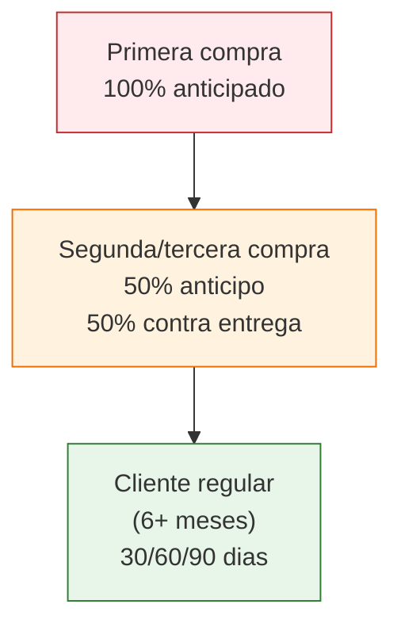

# Condiciones de pago con fabricas

> Como pagas a una fabrica es tan importante como cuanto pagas. El metodo de pago afecta tu seguridad, tu formalidad fiscal y la confianza que generas con el proveedor. En Argentina hay varias opciones, cada una con sus ventajas y riesgos.

## Metodos de pago en Argentina

### Comparacion rapida

| Metodo | Seguridad | Formalidad | Velocidad | Recomendacion |
|--------|-----------|------------|-----------|---------------|
| **Transferencia bancaria** | Alta | Alta | Inmediato | Recomendado |
| **MercadoPago** | Alta | Media-Alta | Inmediato | Buena alternativa |
| **Cheque propio** | Media | Alta | Diferido | Aceptable con cuidado |
| **Cheque de pago diferido** | Media-Baja | Alta | 30-90 dias | Solo con relacion establecida |
| **Efectivo** | Baja | Nula | Inmediato | EVITAR |

### Transferencia bancaria

Es el metodo **mas recomendado** para comprar a fabricas. Deja registro bancario, permite asociar la operacion a una factura y es aceptado por todas las fabricas formales.

**Como funciona:**
1. La fabrica te pasa sus datos bancarios (CBU/CVU, CUIT, razon social)
2. Vos transferis desde tu cuenta bancaria
3. La fabrica confirma recepcion y emite factura
4. Retiras o coordinan la entrega de la mercaderia

**Costo:** Generalmente gratis entre cuentas del mismo banco. Transferencia interbancaria: gratis si es por CBU, puede tener costo minimo si es inmediata.

<Tip>
Siempre verifica que el CBU y la razon social coincidan con la fabrica antes de transferir. Si los datos de la cuenta bancaria no coinciden con el nombre de la empresa, pedile explicacion antes de pagar.
</Tip>

### MercadoPago

Cada vez mas usado, especialmente en fabricas pequenias y medianas. Funciona bien para montos chicos y medianos.

**Ventajas:**
- Transferencia inmediata por CVU
- Queda registro digital completo
- Podes pagar con QR en la fabrica

**Desventajas:**
- Algunas fabricas grandes no lo aceptan
- Para montos muy altos (mas de ARS 1,000,000) puede haber limites
- La comision si pagas con tarjeta de credito via MercadoPago la absorbes vos (3-8%)

### Cheque propio

Es comun en la industria argentina, especialmente para compras grandes. Lo emitis vos a nombre de la fabrica.

**Importante saber:**
- Un cheque rebotado destruye tu credibilidad comercial (y puede tener consecuencias legales)
- La fabrica puede pedir referencias antes de aceptar cheques de un cliente nuevo
- El cheque comun se cobra en el momento; el diferido tiene fecha futura

<Warning>
Si la fabrica te pide que pagues con cheque de tercero (un cheque que no es tuyo ni de la fabrica, sino de otra persona), desconfia. Los cheques de tercero son mas riesgosos, mas dificiles de verificar y pueden ser robados o falsificados.
</Warning>

### Cheque de pago diferido

Funciona como un "pagare" con formato de cheque. Tiene una fecha de cobro futura (30, 60 o 90 dias). Es muy comun entre empresas establecidas en Argentina.

**Para un principiante:** Es improbable que una fabrica te acepte cheques diferidos en las primeras compras. Necesitas construir una relacion y un historial de pagos puntuales.

### Efectivo

<Warning>
EVITAR el pago en efectivo. No deja registro, no se puede asociar a una factura formal, y en caso de problemas no tenes como demostrar que pagaste. Ademas, manejar grandes cantidades de efectivo es inseguro. Si una fabrica solo acepta efectivo y no emite factura, es una senial de alerta sobre su formalidad.
</Warning>

## Estructuras de pago tipicas

Dependiendo de tu relacion con la fabrica, vas a encontrar estas modalidades:

### 100% anticipado

- **Cuando:** Primera compra, fabricas que no te conocen
- **Como funciona:** Pagas todo antes de que preparen tu pedido
- **Riesgo para vos:** Alto (si la fabrica no cumple, ya pagaste)
- **Mitigacion:** Compra montos que puedas permitirte perder, verifica la fabrica antes

<Warning>
NUNCA pagues 100% por adelantado a una fabrica que no conoces personalmente o que no pudiste verificar. Si no visitaste la fabrica, al menos pedile fotos de los productos, revisa sus redes sociales, busca opiniones de otros compradores y empeza con un pedido chico.
</Warning>

### 50% anticipo + 50% contra entrega

- **Cuando:** Despues de una o dos compras exitosas
- **Como funciona:** Transferis la mitad para que arranquen la produccion, y la otra mitad cuando retiras la mercaderia
- **Por que funciona:** La fabrica tiene capital para producir, y vos ves el producto antes de pagar el total
- **Es lo mas comun** en relaciones comerciales establecidas en Argentina

### Pago a 30/60/90 dias

- **Cuando:** Solo para clientes con historial, generalmente 6+ meses de relacion
- **Como funciona:** Retiras la mercaderia y pagas a 30, 60 o 90 dias con cheque diferido o transferencia
- **Ventaja:** Te permite vender el producto antes de pagar por el
- **Requisito:** Historial impecable de pagos puntuales

## Como construir credito comercial con una fabrica

Construir confianza financiera con un proveedor es un proceso gradual. Asi funciona:

<Steps>
  <Step title="Primera compra: paga 100% anticipado y puntual">
    Aunque duela, pagar todo por adelantado en la primera compra demuestra seriedad. Hace la transferencia rapido despues de confirmar el pedido. No demores.
  </Step>
  <Step title="Segunda compra: pedi 50/50">
    Si la primera compra salio bien, para la segunda pedile a la fabrica pagar 50% anticipo y 50% contra entrega. La mayoria acepta.
  </Step>
  <Step title="Tercera a quinta compra: consolida el 50/50">
    Segui pagando puntualmente, sin retrasos. Si prometiste pagar un martes, paga el martes o antes. Nunca despues.
  </Step>
  <Step title="Despues de 6 meses: pedi mejores condiciones">
    Si ya tenes 5+ compras puntuales, podes pedir pago a 30 dias o 70/30. La fabrica ya sabe que cumpliste y es mucho mas probable que te diga que si.
  </Step>
  <Step title="Mantene el historial impecable">
    Un solo pago atrasado puede retroceder meses de confianza construida. Prioriza siempre pagar a tus proveedores a tiempo, incluso si implica ajustar otros gastos.
  </Step>
</Steps>

<Note>
Pedi a la fabrica que emita factura A o B **ANTES de transferir**. Esto confirma que es una operacion formal, te sirve para tu contabilidad y ademas, si la fabrica emite la factura primero, tenes un comprobante de lo que te comprometiste a recibir.
</Note>

## Facturacion: tipos de factura

Cuando compras a una fabrica, te van a emitir uno de estos tipos de factura:

| Tipo | Quien la emite | Para quien | IVA |
|------|---------------|------------|-----|
| **Factura A** | Responsable Inscripto | Responsable Inscripto | Discrimina IVA (21%) |
| **Factura B** | Responsable Inscripto | Monotributista / Consumidor Final | IVA incluido en el total |
| **Factura C** | Monotributista | Cualquier receptor | Sin IVA discriminado |

<Tip>
Si sos Responsable Inscripto, pedile a la fabrica factura A. El IVA discriminado lo podes tomar como credito fiscal y descontarlo de lo que vos facturas. Esto puede representar un 21% de ahorro real en tu costo. Si sos monotributista, vas a recibir factura B y no podes descontar el IVA.
</Tip>

## Costos financieros a considerar

Cuando calcules tus costos, no olvides estos gastos asociados al pago:

| Concepto | Costo aproximado |
|----------|-----------------|
| Transferencia interbancaria | Gratis - ARS 500 |
| Cheque (talonario) | ARS 2,000-5,000 por talonario |
| Impuesto a los debitos y creditos | 0.6% de cada movimiento bancario |
| Percepcion de IIBB sobre compras | 1-3% adicional (depende de la provincia) |

<Warning>
El impuesto a los debitos y creditos bancarios (conocido como "impuesto al cheque") se cobra sobre cada movimiento. Cuando transferis a la fabrica, te cobran 0.6%, y cuando la fabrica deposita, le cobran 0.6% a ella. Este costo es invisible pero real: en una compra de ARS 500,000, pagas ARS 3,000 solo de impuesto al cheque.
</Warning>

## Que hacer si algo sale mal

| Problema | Que hacer |
|----------|-----------|
| Pagaste y no te entregan | Reclama por escrito (WhatsApp/email). Si no responden, consulta con un abogado con la factura como prueba |
| El producto no es lo acordado | Documenta con fotos, contacta a la fabrica y pedile cambio o devolucion. La factura y el acuerdo escrito son tu respaldo |
| La fabrica cierra o desaparece | Si pagaste con transferencia tenes registro. Consulta con un abogado. Por eso no invertir montos que no podes perder |
| Te cobran mas de lo acordado | Mostra el acuerdo escrito (WhatsApp/email) y pedile que respete el precio pactado |

## Preguntas frecuentes

<Accordion title="Puedo pagar con tarjeta de credito a una fabrica?">
Es poco comun. Algunas fabricas aceptan MercadoPago con tarjeta, pero te van a trasladar la comision (3-8% adicional). No es el metodo mas eficiente, pero puede servir si necesitas financiarte con la tarjeta.
</Accordion>

<Accordion title="Que pasa si no me dan factura?">
Si la fabrica no emite factura, estas comprando en negro. Esto significa que no tenes respaldo legal si algo sale mal, no podes deducir el IVA, y tu contador no puede registrar la compra. Siempre exigi factura; es tu derecho y tu proteccion.
</Accordion>

<Accordion title="Me conviene pagar todo junto o en cuotas?">
Si tenes el capital, pagar todo junto generalmente te da un descuento de 3-7%. Si no tenes el capital completo, el 50/50 es el mejor equilibrio entre riesgo y flujo de caja. Lo importante es no comprometer mas capital del que podes manejar.
</Accordion>

<Accordion title="Como se si una fabrica es formal?">
Pedile CUIT y busca la constancia de inscripcion en la web de AFIP. Si esta inscripta como Responsable Inscripto y emite facturas electronicas, es formal. Si solo acepta efectivo y no da factura, evitala.
</Accordion>
