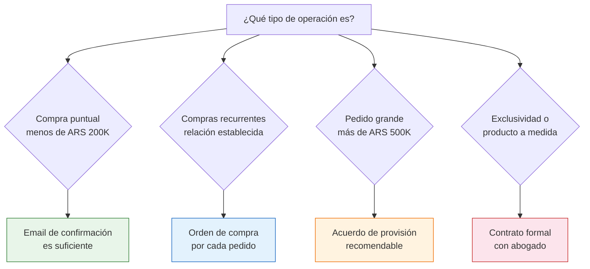

# Contrato con proveedores

> No todas las relaciones comerciales necesitan un contrato formal. Pero saber cuándo SÍ lo necesitás y qué incluir puede ahorrarte conflictos enormes y proteger tu negocio.

## Necesitás un contrato formal

La respuesta corta: **depende del tamaño de la operación.**

| Situación | Contrato formal | Qué usar en su lugar |
|-----------|----------------|---------------------|
| Compras chicas (menos de ARS 200,000) | No es necesario | Email de confirmación de pedido |
| Compras regulares moderadas | Recomendable | Orden de compra escrita |
| Pedidos grandes (más de ARS 500,000) | Muy recomendable | Acuerdo de provisión |
| Exclusividad de zona o producto | Sí, obligatorio | Contrato de exclusividad |
| Desarrollo de producto con tu marca | Sí, obligatorio | Contrato de desarrollo + confidencialidad |

<Note>
La mayoría de las fábricas pequeñas y medianas argentinas **no trabajan con contratos formales** para operaciones habituales. Esto es normal y no necesariamente es malo. La cultura comercial argentina se basa mucho en la confianza y la palabra. Pero eso no significa que no debas protegerte.
</Note>

## Tipos de acuerdos comerciales

### 1. Orden de compra (lo más simple y común)

Formaliza cada pedido individual. Es el documento más básico y el que vas a usar desde tu primera compra.

**Qué incluir:**

- Fecha
- Tus datos (nombre, CUIT)
- Datos de la fábrica (nombre, CUIT)
- Listado de productos con descripción, cantidad y precio unitario
- Precio total
- Forma de pago
- Fecha de entrega esperada
- Condiciones de entrega (retiro o envío)
- Política ante defectos acordada

<Tip>
Un email detallado confirmando el pedido funciona como acuerdo legal básico. Mientras contenga los datos clave y ambas partes confirmen por escrito (incluso un "OK, confirmado" por email), tiene validez como prueba de la operación comercial.
</Tip>

**Modelo de email de orden de compra:**

```
Asunto: Orden de compra #001 — [Tu nombre/empresa]

Hola [nombre del contacto],

Confirmo el siguiente pedido:

- Producto: [descripción completa]
- Cantidad: [número] unidades
- Precio unitario: ARS [monto]
- Total: ARS [monto] + IVA
- Forma de pago: Transferencia bancaria
- Fecha de entrega: [fecha]
- Retiro en fábrica / Envío por flete a [dirección]

Condiciones acordadas:
- Factura A/B a nombre de [tu razón social], CUIT [tu CUIT]
- Plazo de reclamo por defectos: 72 horas desde recepción
- [Otras condiciones pactadas]

Por favor confirmar recepción y aceptación de esta orden.

Saludos,
[Tu nombre]
```

### 2. Acuerdo de provisión (para compras recurrentes)

Establece condiciones generales para una relación comercial continua. No detalla cada pedido sino las reglas del juego.

**Qué incluir:**

| Cláusula | Detalle |
|----------|---------|
| **Productos** | Listado de productos que te provee |
| **Precios** | Tabla de precios vigente y mecanismo de actualización |
| **Cantidades mínimas** | Pedido mínimo por producto |
| **Plazos de entrega** | Tiempo desde que pedís hasta que recibís |
| **Forma de pago** | Transferencia, plazo, porcentaje anticipado |
| **Calidad** | Estándar de calidad acordado (referencia a muestras) |
| **Política de devolución** | Qué pasa con mercadería defectuosa |
| **Vigencia** | Duración del acuerdo (6 meses, 1 año) |
| **Actualización de precios** | Cada cuánto y cómo se ajustan los precios |

### 3. Contrato de exclusividad

Cuando querés ser el único vendedor de un producto o marca en una zona geográfica.

**Cuándo tiene sentido:**
- Vas a invertir en marketing y posicionamiento de ese producto
- Querés proteger tu mercado de otros revendedores
- La fábrica está dispuesta a limitar sus canales de venta

**Qué incluir además de lo anterior:**

- **Zona de exclusividad**: provincia, región o país
- **Compromiso de volumen mínimo**: cuánto te comprometés a comprar (la fábrica te da exclusividad a cambio de volumen garantizado)
- **Duración**: típicamente 6 meses a 2 años
- **Penalidades**: qué pasa si no cumplís el volumen mínimo o si la fábrica vende a otro en tu zona
- **Renovación**: condiciones para renovar el acuerdo

<Warning>
Un contrato de exclusividad te obliga a comprar un volumen mínimo. Si no llegás a ese volumen, la fábrica puede cancelar la exclusividad. Solo firmá exclusividad si tenés datos concretos de que podés cumplir con el compromiso.
</Warning>

## Cuándo SÍ necesitás un contrato formal



## Aspectos legales básicos

Aunque no firmes un contrato formal, hay aspectos legales que te protegen:

<Accordion title="El email tiene valor legal">
Un intercambio de emails donde ambas partes acuerdan condiciones constituye un principio de prueba en caso de conflicto. Guardá todos los emails de negociación y confirmación.
</Accordion>

<Accordion title="WhatsApp como prueba">
Los mensajes de WhatsApp también pueden ser presentados como prueba en una disputa comercial. Las capturas de pantalla con fecha y hora son válidas. No borres conversaciones con proveedores.
</Accordion>

<Accordion title="La factura como contrato implícito">
La factura emitida y aceptada implica un acuerdo sobre los productos, cantidades y precios detallados en ella. Es tu documento legal más fuerte.
</Accordion>

<Accordion title="Defensa del consumidor no aplica">
Cuando comprás como comerciante (no como consumidor final), la Ley de Defensa del Consumidor NO te protege. Las disputas se resuelven por el Código Civil y Comercial. Por eso es aún más importante tener todo documentado.
</Accordion>

## Errores comunes con acuerdos

- **No poner por escrito las condiciones verbales**: Lo que se habla por teléfono se olvida o se malinterpreta. Siempre confirmá por email después de una llamada
- **Asumir condiciones que no se pactaron**: Si no hablaste de devoluciones, no asumas que la fábrica va a aceptar devoluciones
- **Firmar exclusividad sin volumen real**: Si no podés garantizar el volumen mínimo, la exclusividad se cae y perdés credibilidad
- **No incluir mecanismo de actualización de precios**: En Argentina con inflación, si no pactás cómo se actualizan los precios, cada pedido es una negociación nueva

<Note>
Si la relación crece y los montos involucrados son significativos (más de ARS 1,000,000 mensuales), vale la pena consultar con un abogado comercialista para formalizar un acuerdo que proteja a ambas partes. El costo de la consulta es mínimo comparado con una disputa comercial sin documentación.
</Note>

<Tip>
Para empezar, con un email de orden de compra bien redactado por cada pedido estás cubierto. No te compliques con contratos formales hasta que el volumen lo justifique. Lo importante es que **todo quede por escrito**.
</Tip>
