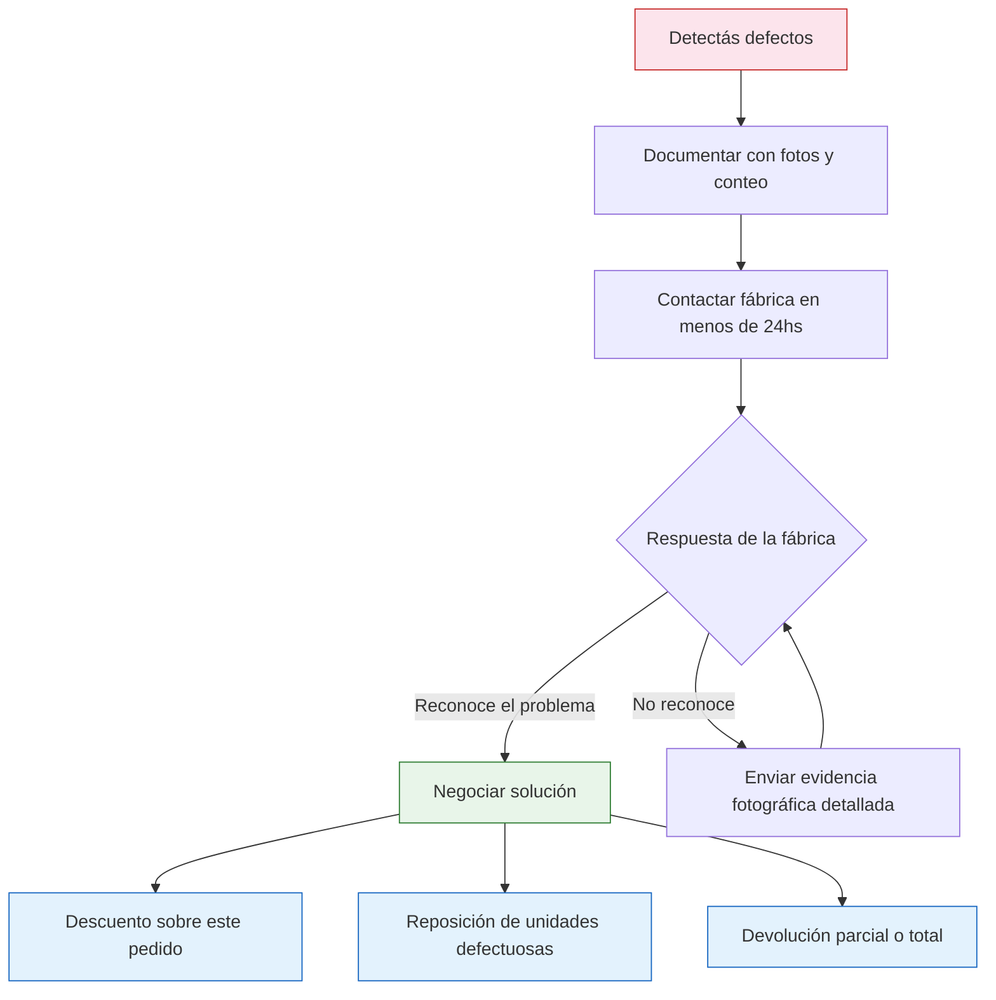

# Control de calidad al recibir mercadería

> Recibir mercadería sin revisarla es como firmar un cheque en blanco. El control de calidad al momento de la recepción es tu última línea de defensa antes de quedarte con productos defectuosos.

## Por qué el control de calidad es crítico

El momento de recibir la mercadería es tu **única ventana** para detectar problemas y reclamar. Después de 48-72 horas, la mayoría de las fábricas argentinas no aceptan reclamos. Cada minuto que invertís en revisar te puede ahorrar miles de pesos en mercadería inutilizable.

## Checklist de inspección al recibir

Revisá estos puntos **antes de firmar conformidad** en el remito:

| Punto de control | Qué verificar | Herramienta |
|-----------------|---------------|-------------|
| Cantidad | Número de bultos coincide con remito | Conteo manual |
| Embalaje | Sin golpes, humedad, roturas | Visual |
| Producto vs muestra | Color, textura, tamaño, terminación | Muestra de referencia |
| Etiquetas | Correctas, legibles, bien adheridas | Visual |
| Peso | Peso por unidad coherente con muestra | Balanza |
| Medidas | Dimensiones según especificación | Cinta métrica |
| Defectos visibles | Rayones, manchas, rebabas, costuras sueltas | Visual + lupa |
| Funcionamiento | Si aplica: que funcione, encienda, cierre bien | Prueba manual |

## Método de muestreo: cuánto revisar

No necesitás revisar el 100% del pedido (salvo que sea muy chico). Usá este esquema de muestreo:

| Tamaño del pedido | Muestra mínima | Porcentaje |
|-------------------|----------------|------------|
| Hasta 50 unidades | Revisar todas | 100% |
| 50 - 200 unidades | 25-30 unidades | ~15% |
| 200 - 500 unidades | 50-75 unidades | ~10-15% |
| 500 - 1,000 unidades | 75-100 unidades | ~10% |
| Más de 1,000 unidades | 100-150 unidades | ~8-10% |

<Note>
La muestra debe ser **al azar**, no solo las primeras unidades de arriba del paquete. Sacá productos de diferentes cajas y de diferentes partes de cada caja. Las fábricas a veces ponen los mejores productos arriba.
</Note>

## Proceso de inspección paso a paso

<Steps>
  <Step title="Recibir y contar bultos">
    Antes de abrir nada, contá los bultos y compará contra el remito. Fotografiá los bultos cerrados mostrando su estado general. Si faltan bultos o hay daños evidentes, anotalo en el remito antes de firmar.
  </Step>
  <Step title="Abrir y contar unidades">
    Abrí cada bulto y contá las unidades totales. Verificá que la cantidad coincida con la factura y el remito. Cualquier faltante, documentalo inmediatamente.
  </Step>
  <Step title="Seleccionar muestra al azar">
    Elegí unidades al azar de diferentes bultos para la inspección detallada. Usá el cuadro de muestreo de arriba como referencia.
  </Step>
  <Step title="Inspeccionar contra muestra de referencia">
    Compará cada unidad de la muestra contra la muestra aprobada que guardaste. Revisá: color, tamaño, peso, terminación, etiquetas, funcionamiento.
  </Step>
  <Step title="Documentar resultados">
    Anotá cuántas unidades revisaste, cuántas están OK y cuántas tienen defectos. Fotografiá cada defecto encontrado. Clasificá los defectos por gravedad.
  </Step>
  <Step title="Aceptar o disputar">
    Si la tasa de defectos es aceptable, firmá conformidad y almacená. Si es alta, contactá a la fábrica inmediatamente con fotos y tu registro de inspección.
  </Step>
  <Step title="Almacenar correctamente">
    Guardá la mercadería aprobada en un lugar seco y limpio. Separé las unidades defectuosas en un lugar aparte hasta resolver con la fábrica.
  </Step>
</Steps>

## Categorías de defectos

No todos los defectos son iguales. Clasificalos para saber cómo actuar:

<Tabs>
  <Tab title="Defectos Críticos">
    **Producto inutilizable o peligroso.** No se puede vender bajo ninguna circunstancia.

    Ejemplos:
    - Producto roto o no funciona
    - Falta una pieza esencial
    - Material dañado que puede lastimar al usuario
    - Producto completamente diferente al pedido

    **Acción:** Reclamo inmediato. Devolución o reposición total.
  </Tab>
  <Tab title="Defectos Mayores">
    **Afecta la funcionalidad o el uso.** El producto funciona pero con limitaciones.

    Ejemplos:
    - Cierre o mecanismo que traba
    - Color significativamente diferente a la muestra
    - Medidas fuera de rango aceptable
    - Etiquetas incorrectas o ausentes

    **Acción:** Reclamo. Negociar descuento, reposición parcial o corrección.
  </Tab>
  <Tab title="Defectos Menores">
    **Solo afectan la estética.** El producto funciona perfectamente pero tiene imperfecciones visuales.

    Ejemplos:
    - Pequeña mancha que se limpia
    - Costura ligeramente irregular
    - Leve diferencia de tono
    - Packaging con marcas menores

    **Acción:** Si son pocas unidades, aceptar. Si son muchas, negociar descuento.
  </Tab>
</Tabs>

## Tasas de defectos: qué es aceptable

| Tasa de defectos | Evaluación | Qué hacer |
|-----------------|------------|-----------|
| Menos del 2% | Normal y aceptable | Aceptar el lote, separar defectuosos |
| 2% - 5% | Preocupante | Reclamar, pedir descuento o reposición parcial |
| Más del 5% | Inaceptable | Reclamar formalmente, considerar devolución del lote |
| Más del 10% | Grave | Devolución total, replantear relación con la fábrica |

## Cómo documentar problemas

Cuando encontrés defectos, la documentación es tu herramienta de negociación:

1. **Fotografiá cada defecto** con buena luz y de cerca
2. **Filmá un video** mostrando el defecto en contexto
3. **Anotá**: número de unidades defectuosas, tipo de defecto, bulto de origen
4. **Enviá todo a la fábrica** por email (no solo WhatsApp) dentro de las primeras 24 horas
5. **Guardá las unidades defectuosas** separadas hasta que se resuelva el reclamo

<Tip>
Armá un **kit de control de calidad** básico para tener siempre a mano:
- Cinta métrica
- Balanza digital (ARS 5,000-15,000)
- Lupa
- Muestra de referencia del producto
- Celular con buena cámara
- Planilla impresa de control

Este kit te cuesta menos de ARS 20,000 y te puede ahorrar cientos de miles en mercadería defectuosa.
</Tip>

## Qué hacer si la calidad es mala

**Opciones de resolución (de mejor a peor):**
- **Reposición gratuita:** La fábrica envía unidades nuevas sin cargo
- **Descuento en este pedido:** Te devuelven plata proporcional a los defectuosos
- **Crédito para próximo pedido:** Descuento aplicado en la siguiente compra
- **Devolución parcial:** Devolvés los defectuosos y te reintegran ese monto
- **Devolución total:** Devolvés todo el lote (último recurso, daña la relación)

<Warning>
Pasadas las **72 horas** sin reclamo, muchas fábricas no aceptan devoluciones ni reclamos. Revisá lo antes posible y comunicá cualquier problema inmediatamente. El tiempo corre en tu contra.
</Warning>

<Note>
Un buen control de calidad no es ser desconfiado, es ser profesional. Las fábricas serias respetan a los compradores que controlan porque demuestra que tomás el negocio en serio.
</Note>
