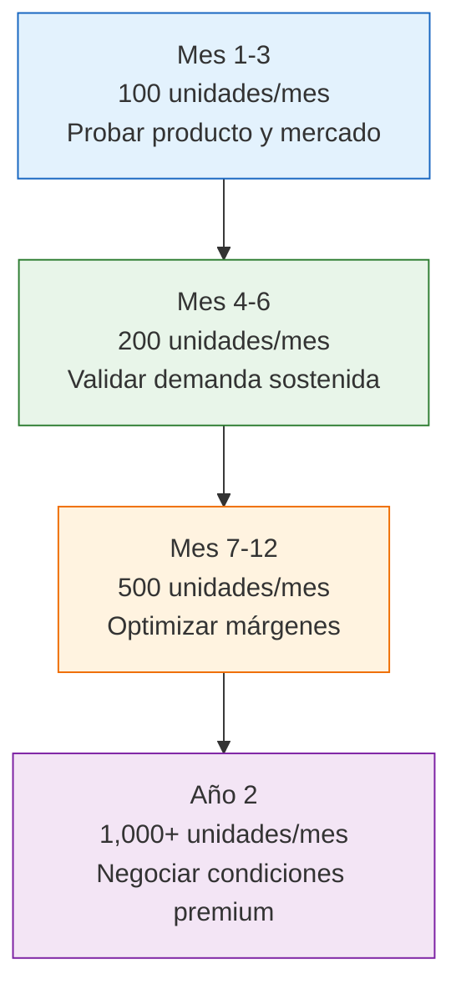

# Escalar volumen de compras

> Escalar no es simplemente comprar más. Es un proceso estratégico que requiere timing, datos y planificación. Escalar bien multiplica tus ganancias; escalar mal te deja con un depósito lleno de mercadería que no podés vender.

## Cuándo es momento de escalar

No escales por impulso. Escalá cuando los datos te lo confirmen:

| Señal | Qué significa | Listo para escalar |
|-------|---------------|-------------------|
| Vendés el stock en menos de 30 días | Hay demanda real y sostenida | Si |
| Tenés lista de espera o pedidos sin cumplir | La demanda supera tu oferta | Si |
| Tu margen neto es positivo después de todos los costos | El negocio es rentable | Si |
| Vendés el stock en 30-60 días | Demanda moderada, podés optimizar | Con cautela |
| Vendés el stock en más de 60 días | Demanda débil o precio alto | No, primero ajustá |
| Tenés stock sin vender de hace más de 90 días | Problema de producto o precio | No, resolvé primero |

<Warning>
Escalar rápido sin validar demanda real = capital inmovilizado. Si comprás 500 unidades y tardás 4 meses en venderlas, esa plata está trabada y no genera retorno. Mejor 3 pedidos de 200 que 1 de 600.
</Warning>

## Estrategia de crecimiento gradual

El crecimiento ideal es escalonado, no un salto al vacío:

**Regla general:** Aumentá entre 20% y 30% por pedido. Si vendés 100 unidades en un mes, el siguiente pedí 120-130. Nunca dupliques de golpe salvo que tengas datos muy sólidos.

## Reinversión estratégica

La clave del crecimiento sostenible es cuánto reinvertís y cuánto retirás:

| Etapa | Reinversión recomendada | Retiro personal | Lógica |
|-------|------------------------|-----------------|--------|
| Primeros 3 meses | 70-80% de ganancias | 20-30% | Priorizás crecimiento |
| Meses 4-6 | 60-70% de ganancias | 30-40% | Equilibrás crecimiento y retorno |
| Meses 7-12 | 50-60% de ganancias | 40-50% | El negocio se sostiene solo |
| Año 2+ | 40-50% de ganancias | 50-60% | Disfrutás los resultados |

<Note>
Estos porcentajes son orientativos. Lo importante es que **no retires toda la ganancia**. Si sacás todo para gastos personales, el negocio no crece y se estanca.
</Note>

## Cuándo agregar productos nuevos

No te apures a diversificar. Primero dominá un producto:

<Tabs>
  <Tab title="Profundizar en un producto">
    **Cuándo:** El producto vende bien y podés conseguir mejor precio por volumen.

    **Ventajas:**
    - Mejor poder de negociación con la fábrica
    - Conocés bien el producto y su mercado
    - Menos complejidad logística y de stock
    - Podés convertirte en referente del rubro

    **Ideal para:** Primeros 6 meses de operación.
  </Tab>
  <Tab title="Agregar productos">
    **Cuándo:** Tu producto principal vende consistentemente y tenés capital sobrante.

    **Ventajas:**
    - Diversificás riesgo
    - Aumentás ticket promedio por cliente
    - Aprovechás la relación con la fábrica para otros productos
    - Cubrís más segmentos del mercado

    **Ideal para:** Después de 6 meses exitosos con el primer producto.
  </Tab>
</Tabs>

## Negociar descuentos por volumen

Al aumentar tus pedidos, tenés argumentos para pedir mejores precios:

**Cómo negociar:**

1. **Mostrá tu historial**: "En los últimos 4 meses compré X unidades por un total de ARS X"
2. **Proyectá volumen futuro**: "Planeo duplicar mis pedidos en los próximos 3 meses"
3. **Pedí una escala de precios**: Precio para 100u, para 200u, para 500u
4. **Ofrecé compromiso**: "Si me das 10% de descuento, me comprometo a un mínimo de 300u/mes"

**Descuentos típicos en fábricas argentinas:**

| Volumen respecto al mínimo | Descuento esperable |
|---------------------------|---------------------|
| 2x el mínimo | 3-5% |
| 3-5x el mínimo | 5-10% |
| 10x+ el mínimo | 10-15% |
| Exclusividad de zona | 15-20% |

## Almacenamiento: cuándo escalar el espacio

| Volumen mensual | Solución de almacenamiento | Costo aproximado |
|----------------|---------------------------|-----------------|
| Hasta 200 unidades | Cuarto en casa/depto | ARS 0 (ya lo tenés) |
| 200-500 unidades | Habitación dedicada o garaje | ARS 0 - 50,000/mes |
| 500-1,000 unidades | Depósito compartido o guardamuebles | ARS 50,000 - 150,000/mes |
| 1,000+ unidades | Depósito propio o fulfillment tercerizado | ARS 150,000 - 500,000+/mes |

## MercadoLibre Full (fulfillment)

Si vendés por MercadoLibre, el servicio **Full** te permite enviar tu stock a los depósitos de ML y que ellos se encarguen del almacenamiento, empaque y envío:

**Ventajas:**
- Envíos más rápidos (24-48hs en muchas zonas)
- Tu publicación sube de ranking por tener envío Full
- No necesitás depósito propio
- Menos trabajo operativo

**Requisitos:**
- Tener reputación verde o superior en ML
- Volumen mínimo de ventas mensuales
- Productos que cumplan las normas de embalaje de ML

**Cuándo usarlo:**
- Cuando vendés consistentemente más de 50 unidades/mes por ML
- Cuando el costo de almacenamiento propio supera el costo de Full
- Cuando querés escalar sin sumar operación logística

<Tip>
Antes de escalar, asegurate de que el **margen neto sigue siendo positivo** después de TODOS los costos: producto, flete, packaging, comisiones de venta, impuestos, almacenamiento. Muchos negocios venden más pero ganan menos porque no recalculan al escalar.
</Tip>

## Errores comunes al escalar

<Accordion title="Comprar de más por un descuento tentador">
**El error:** La fábrica te ofrece 30% de descuento por un pedido de 2,000 unidades y comprás sin tener ventas que lo justifiquen.

**La solución:** Calculá cuántos meses te va a llevar vender ese stock. Si son más de 60 días, el descuento no compensa el capital inmovilizado.
</Accordion>

<Accordion title="Escalar sin sistema de gestión">
**El error:** Manejar 1,000 unidades mensuales con anotaciones en un cuaderno.

**La solución:** Antes de escalar, armá al menos una planilla de control de stock, ventas y costos. No necesitás un sistema caro, pero sí uno que funcione.
</Accordion>

<Accordion title="No recalcular costos al crecer">
**El error:** Asumir que los costos se mantienen proporcionales al escalar.

**La solución:** Al crecer, aparecen costos nuevos: depósito, empleados, más impuestos, packaging. Recalculá tu margen real con cada salto de volumen.
</Accordion>

<Warning>
El crecimiento sin planificación financiera es la causa número uno de fracaso en negocios de reventa. Crecé de a poco, medí resultados y ajustá antes de dar el siguiente paso.
</Warning>
