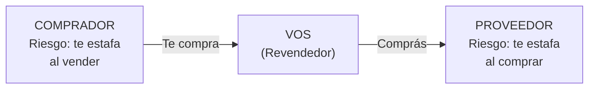

# Estafas y fraudes: cómo protegerte

> En el mundo de la compra-reventa hay dos tipos de fraude que te pueden afectar: el proveedor que te estafa a vos, y el comprador que te estafa en MercadoLibre. Ambos son prevenibles si sabés qué buscar.

## Los dos frentes de riesgo

Cuando comprás a fábricas argentinas para revender, estás expuesto a fraudes en **dos direcciones**:

<Warning>
Las estafas no solo le pasan a los descuidados. Proveedores con años de experiencia también caen. La diferencia entre perder plata y no perderla es tener un **proceso de verificación** y seguirlo siempre, sin excepciones.
</Warning>

---

## Parte A: Fraudes de proveedores

### Tipos de estafa más comunes

<Tabs>
  <Tab title="Fábrica fantasma">
    ### La fábrica que no existe

    **Cómo funciona:** Un "proveedor" te contacta (o lo encontrás online), te muestra fotos de productos geniales, te da precios muy buenos, cobrás y desaparece.

    **Señales de alerta:**
    - No tiene dirección física verificable
    - No aparece en Google Maps ni Street View
    - Solo acepta transferencia a alias o CBU personal (no empresarial)
    - No tiene redes sociales con historial real
    - Precios significativamente más bajos que la competencia (20-30% menos)

    **Pérdida típica:** USD 200 - 1.000 (ARS 240.000 - 1.200.000 aproximado)
  </Tab>
  <Tab title="Bait and switch">
    ### Te muestran una cosa y te entregan otra

    **Cómo funciona:** Te mandan muestras de excelente calidad. Cuando hacés el pedido grande, la mercadería que recibís es de calidad mucho inferior.

    **Señales de alerta:**
    - La fábrica no te deja visitar durante la producción
    - Te presionan para que pagues todo antes de recibir
    - Las muestras son "especiales" y el lote "es producción estándar"
    - No ofrecen garantía de calidad por escrito

    **Pérdida típica:** 30-60% del valor del pedido en mercadería no vendible
  </Tab>
  <Tab title="CUIT irregular">
    ### Proveedor con problemas fiscales

    **Cómo funciona:** El proveedor tiene CUIT pero está en situación irregular (baja, inscripción limitada, o directamente usa CUIT de otra persona).

    **Consecuencias para vos:**
    - La factura que te dan no es válida
    - Si ARCA (ex-AFIP) te audita, no podés justificar la compra
    - Podrías enfrentar ajustes impositivos

    **Pérdida potencial:** el monto total de la compra + multas de ARCA
  </Tab>
  <Tab title="Productos falsificados">
    ### Productos truchos vendidos como originales

    **Cómo funciona:** Te venden productos con marcas falsificadas haciéndote creer que son originales o con licencia.

    **Consecuencias:**
    - Si los vendés, vos sos responsable legalmente
    - INPI puede iniciar acciones por uso de marca registrada
    - MercadoLibre te baja las publicaciones y puede cerrar tu cuenta
    - Ley 22.362 de Marcas y Designaciones prevé penas de hasta 2 años de prisión

    **Pérdida potencial:** mercadería confiscada + multas + cierre de cuenta ML
  </Tab>
</Tabs>

### Proceso de verificación antes de pagar

<Steps>
  <Step title="Verificar CUIT en ARCA (ex-AFIP)">
    Ingresá a **arca.gob.ar** y buscá la constancia de inscripción del proveedor con su CUIT. Verificá que esté activo, que la actividad económica sea coherente con lo que fabrica, y que la dirección fiscal exista.

    **Tiempo:** 5 minutos. **Costo:** Gratis.
  </Step>
  <Step title="Buscar la dirección en Google Maps">
    Copiá la dirección fiscal y buscala en Google Maps. ¿Existe? ¿Se ve un local o fábrica en Street View? Si la dirección es un departamento en un edificio residencial, es una bandera roja (no necesariamente estafa, pero amerita preguntar).

    **Tiempo:** 5 minutos. **Costo:** Gratis.
  </Step>
  <Step title="Buscar reputación online">
    Googleá el nombre de la fábrica + "opiniones", "estafa", "reclamos". Revisá si tienen redes sociales activas con historial real (no creadas hace 2 semanas). Buscá en grupos de Facebook de revendedores si alguien los conoce.

    **Tiempo:** 15-20 minutos. **Costo:** Gratis.
  </Step>
  <Step title="Pedir muestra antes de comprar">
    Antes de hacer un pedido grande, comprá 2-5 unidades como prueba. Evaluá calidad, empaque, tiempos de entrega y comunicación. Si el proveedor no vende cantidades chicas, es una señal mixta (puede ser política legítima o puede ser que necesita montos grandes para desaparecer).

    **Costo:** USD 10-50 aproximado (ARS 12.000 - 60.000) dependiendo del producto.
  </Step>
  <Step title="Visitar la fábrica antes de pedidos grandes">
    Para pedidos superiores a USD 300 (ARS 360.000 aproximado), visitá la fábrica en persona. Verificá que existe, que producen lo que dicen, y que tienen capacidad real. Un viaje de ida y vuelta dentro de Buenos Aires cuesta ARS 5.000 - 15.000 aproximado en transporte.

    **Tiempo:** medio día. **Costo:** ARS 5.000 - 15.000 en transporte aproximado.
  </Step>
  <Step title="Pagar con trazabilidad">
    Pagá siempre por transferencia bancaria. Nunca pagues más del 50% por adelantado en la primera compra. El saldo se paga contra entrega o factura. Guardá todos los comprobantes.

    **Regla:** 50% al confirmar pedido, 50% al recibir mercadería.
  </Step>
</Steps>

### Tabla de banderas rojas

| Bandera roja | Nivel de riesgo | Qué hacer |
|-------------|----------------|-----------|
| No tiene CUIT o el CUIT está dado de baja | Alto | No comprés |
| No emite factura ("te hago un descuento sin factura") | Alto | No comprés |
| Solo acepta efectivo | Alto | Exigí transferencia o no comprés |
| No tiene dirección física verificable | Alto | No comprés |
| Precios 30%+ más bajos que cualquier competidor | Medio-Alto | Investigá por qué, probablemente sea estafa |
| No tiene otros clientes visibles (no lo conoce nadie) | Medio | Pedido chico de prueba primero |
| Te presiona para que compres rápido ("último lote") | Medio | Tomáte tu tiempo, si es legítimo va a esperar |
| No te deja visitar la fábrica | Medio | Preguntá por qué, insistí |

<Note>
La Ley de Defensa del Consumidor N.o 24.240 te protege como comprador, pero aplicar esa protección contra un proveedor que desapareció es prácticamente imposible. La prevención es tu única defensa real.
</Note>

---

## Parte B: Fraudes de compradores en MercadoLibre

### Estafas más comunes de compradores

| Tipo de fraude | Cómo funciona | Frecuencia aproximada |
|---------------|---------------|----------------------|
| "No recibí el producto" | El comprador recibe el producto y dice que no llegó | 1-3% de las ventas |
| Devolución de otro producto | Devuelve un producto diferente o dañado a propósito | Menos del 1% |
| Contracargo bancario | Paga con tarjeta, recibe el producto, y disputa el cargo con su banco | Menos del 0.5% |
| Extorsión por review negativa | Amenaza con review negativa para obtener descuento o producto gratis | Ocasional |

### Cómo protegerte como vendedor

<Steps>
  <Step title="Documentá todo el proceso de empaque">
    Filmá en video el producto antes de empaquetar. Mostrá que funciona, que está completo, y el proceso de empaque. Incluí el número de orden de ML visible en el video. Esto es tu evidencia principal en caso de reclamo.

    **Costo:** Gratis (tu celular). **Tiempo:** 2 minutos por envío.
  </Step>
  <Step title="Enviá siempre con seguimiento">
    Nunca, bajo ninguna circunstancia, envíes sin número de seguimiento. Usá MercadoEnvíos o, si usás correo propio, que tenga tracking verificable. Sin tracking, ML falla a favor del comprador automáticamente.
  </Step>
  <Step title="Mantené toda la comunicación dentro de ML">
    Si un comprador te pide pasar a WhatsApp para "resolver más rápido", no lo hagas. Las conversaciones dentro de ML son tu respaldo legal. Lo que se dice fuera de ML no existe para mediaciones.
  </Step>
  <Step title="Respondé reclamos dentro de 24 horas">
    ML penaliza vendedores que no responden rápido a los reclamos. Tenés 24-48 horas para responder. Si no respondés, ML resuelve automáticamente a favor del comprador.
  </Step>
  <Step title="Aprendé a escalar a soporte de ML">
    Si el comprador está cometiendo fraude y tenés evidencia (video de empaque, tracking entregado), escalá el caso a soporte de ML con toda la documentación. ML tiene un equipo que revisa fraudes de compradores.
  </Step>
</Steps>

<Warning>
**Sobre ofertas de "distribución exclusiva":** Si alguien te ofrece ser "distribuidor exclusivo" de su marca a cambio de un pago inicial grande (USD 500 - 5.000 aproximado), es casi seguro una estafa piramidal o un esquema fraudulento. Las fábricas legítimas no cobran por darte exclusividad; te la dan si comprás volumen suficiente.
</Warning>

## Qué hacer si ya fuiste estafado

Si a pesar de todas las precauciones caíste en una estafa:

1. **Juntá toda la evidencia:** transferencias, chats, fotos, facturas, comprobantes
2. **Hacé la denuncia en Defensa del Consumidor** de tu provincia (es gratis)
3. **Denuncia penal** en la comisaría o fiscalía más cercana (es gratis)
4. **Si fue por MercadoLibre**, abrí un reclamo formal en la plataforma
5. **Publicá tu experiencia** en grupos de revendedores para alertar a otros

<Tip>
Presupuestá las pérdidas por fraude como un costo del negocio. Un porcentaje de 1-2% de tus ventas totales perdidas por fraude es normal en la industria. Si estás por encima de eso, necesitás reforzar tus procesos de verificación.
</Tip>
