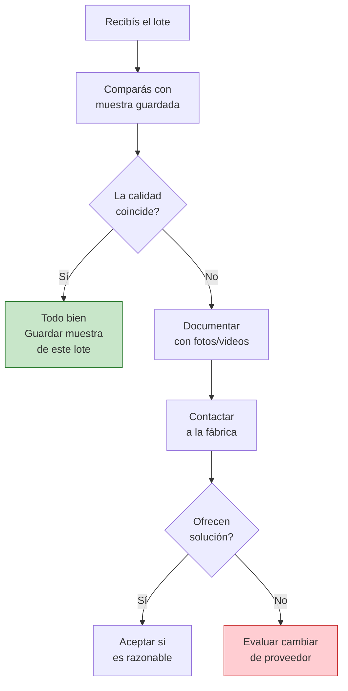

# Evaluar la calidad del producto

> La calidad del producto que revendés define tu reputación, tus devoluciones y tus ganancias. Evaluar la calidad **antes** de comprometer dinero en un pedido grande es uno de los pasos más importantes de todo el proceso.

## Por qué evaluar calidad antes de comprar

Un error común de principiantes es confiar en fotos, catálogos o la palabra del vendedor. En la realidad:

- Las fotos pueden estar editadas o ser de otro producto
- La muestra que te muestran puede ser de mejor calidad que la producción en serie
- Lo que "parece bueno" a simple vista puede tener defectos que tus clientes sí van a notar
- Un producto de mala calidad genera devoluciones, reclamos y daño a tu reputación online

<Warning>
**NUNCA** compres un pedido grande sin haber evaluado muestras primero. Si una fábrica no quiere darte muestras o te presiona para que compres sin ver el producto, es una señal de alerta grave.
</Warning>

## Proceso de evaluación de calidad

<Steps>
  <Step title="Pedir muestras SIEMPRE antes de un pedido grande">
    Contactá a la fábrica y pedí muestras del producto que te interesa. Algunas opciones:

    - **Muestra gratuita:** muchas fábricas dan 1-2 unidades sin cargo para clientes potenciales
    - **Muestra paga:** si no dan gratis, ofrecé comprar 5-10 unidades al precio unitario (aunque sea caro)
    - **Compra mínima de prueba:** comprá el pedido mínimo como "prueba" antes de hacer uno grande

    **Costo aproximado:** entre ARS 0 (gratuita) y ARS 5.000-50.000 dependiendo del producto. Es una inversión mínima comparada con el riesgo de un pedido grande fallido.
  </Step>

  <Step title="Comparar la muestra con productos similares del mercado">
    Comprá 1-2 unidades del mismo tipo de producto en MercadoLibre o en un local. Compará lado a lado:

    - Acabados y terminación
    - Peso y sensación al tacto
    - Materiales (se sienten igual de sólidos?)
    - Packaging y presentación
    - Funcionamiento (si aplica)
  </Step>

  <Step title="Testear el producto como lo usaría un cliente">
    Usá el producto durante varios días tal como lo haría un comprador. Esto te permite detectar:

    - Defectos que no se ven a primera vista
    - Durabilidad real (se rompe fácil? pierde color? se deforma?)
    - Si cumple la función que promete
    - Si la experiencia de uso justifica el precio al que lo vas a vender
  </Step>

  <Step title="Verificar acabados, costuras, materiales y empaque">
    Hacé una revisión detallada y técnica. Fijate en:

    - **Acabados:** bordes prolijos, sin rebaba, sin marcas de molde visibles
    - **Costuras** (si aplica): firmes, parejas, sin hilos sueltos
    - **Materiales:** consistentes, sin manchas, sin olores extraños
    - **Empaque:** protege el producto? tiene buena presentación? incluye instrucciones si las necesita?
  </Step>

  <Step title="Preguntar sobre materias primas">
    Consultá a la fábrica:

    - De dónde vienen los materiales (nacionales o importados?)
    - Qué calidad/grado de material usan
    - Si tienen certificaciones de calidad de sus materias primas
    - Si la materia prima puede variar entre lotes (esto es muy común en Argentina por problemas de importación de insumos)
  </Step>
</Steps>

## Checklist de calidad por tipo de producto

<Accordion title="Textiles (ropa, blanquería, accesorios)">
| Aspecto | Qué verificar | Cómo verificar |
|---------|---------------|----------------|
| **Costuras** | Firmes, parejas, sin hilos sueltos | Tirar suavemente de las costuras |
| **Tela** | Gramaje correcto, no se transparenta, no tiene fallas | Tocar, estirar, mirar a contraluz |
| **Tintado** | Color parejo, no destiñe | Frotar con un trapo blanco húmedo |
| **Etiqueta de composición** | Presente y legítima (obligatoria por ley) | Verificar que indique composición y CUIT |
| **Talles** | Consistentes con las medidas estándar | Medir con cinta métrica |
| **Lavado** | No se encoge ni deforma | Lavar una muestra y comparar |
</Accordion>

<Accordion title="Plásticos (envases, organizadores, accesorios)">
| Aspecto | Qué verificar | Cómo verificar |
|---------|---------------|----------------|
| **Espesor** | Suficiente para el uso previsto | Presionar y flexionar |
| **Flexibilidad** | No se quiebra ni raja | Doblar suavemente |
| **Olor** | Sin olor químico fuerte | Oler al abrir el packaging |
| **Acabado** | Sin rebabas, bordes lisos, color uniforme | Inspección visual y al tacto |
| **Encastre** | Tapas y piezas cierran bien | Probar abrir/cerrar varias veces |
| **Estabilidad** | No se deforma con calor moderado | Dejar al sol un rato si aplica |
</Accordion>

<Accordion title="Alimentos (galletitas, golosinas, conservas, condimentos)">
| Aspecto | Qué verificar | Cómo verificar |
|---------|---------------|----------------|
| **Registro RNPA/RPE** | Producto y establecimiento habilitados | Buscar los números en la etiqueta |
| **ANMAT/Bromatología** | Habilitación del organismo correspondiente | Verificar en la web de ANMAT |
| **Fecha de producción y vencimiento** | Presentes y legibles | Inspección visual |
| **Packaging hermético** | Sin roturas, bien sellado | Presionar el envase, verificar sellos |
| **Rotulado nutricional** | Completo según normativa vigente | Verificar que tenga tabla nutricional |
| **Lote** | Número de lote visible | Inspección visual |
</Accordion>

<Accordion title="Cosmética y cuidado personal">
| Aspecto | Qué verificar | Cómo verificar |
|---------|---------------|----------------|
| **Registro ANMAT** | Obligatorio para todo cosmético en Argentina | Verificar el número en anmat.gob.ar |
| **Ingredientes (INCI)** | Listado completo en la etiqueta | Inspección visual |
| **Fecha de producción/vencimiento** | Presente y con margen razonable | Inspección visual |
| **Consistencia** | Textura, color y olor consistentes | Comparar entre varias unidades |
| **Packaging** | No pierde, cierra bien, no se deteriora | Probar apertura/cierre, dejar cerrado varios días |
| **Testeo en piel** | No genera irritación (probalo vos) | Aplicar en antebrazo y esperar 24hs |
</Accordion>

<Accordion title="Metalurgia (herrajes, herramientas, estructuras)">
| Aspecto | Qué verificar | Cómo verificar |
|---------|---------------|----------------|
| **Soldaduras** | Parejas, sin poros, sin salpicaduras | Inspección visual y al tacto |
| **Acabado superficial** | Pintura pareja, galvanizado uniforme | Inspección visual |
| **Resistencia** | Soporta el uso previsto sin deformarse | Probar con carga o uso real |
| **Protección anticorrosión** | Pintura, galvanizado o tratamiento aplicado | Preguntar qué tratamiento tiene |
| **Dimensiones** | Medidas exactas según especificación | Medir con calibre o cinta métrica |
| **Peso** | Consistente entre unidades | Pesar varias unidades |
</Accordion>

## Qué hacer si la calidad del pedido no coincide con la muestra

Si recibís un lote y la calidad es inferior a la muestra que te dieron:

1. **Documentá todo con fotos y videos** antes de mover la mercadería
2. **Contactá a la fábrica inmediatamente** y mostrá la evidencia
3. **Compará con la muestra guardada** (por eso guardamos muestras de referencia)
4. **Negociá una solución:** reposición, descuento, o devolución
5. **Si no se resuelve:** evaluá si vale la pena seguir con ese proveedor

<Tip>
Guardá siempre una muestra de referencia de cada lote que recibís. Etiquetala con la fecha, el proveedor y el número de pedido. Esto te sirve como evidencia si hay problemas y para verificar que la calidad se mantiene en el tiempo.
</Tip>

## Cuánto invertir en muestras

| Tipo de producto | Costo aproximado de muestras (Feb 2026) | Cantidad sugerida |
|-----------------|----------------------------------------|-------------------|
| Textiles | ARS 5.000 - 30.000 | 3-5 prendas variadas |
| Plásticos/accesorios | ARS 2.000 - 15.000 | 5-10 unidades |
| Alimentos | ARS 3.000 - 20.000 | 5-10 unidades de cada variante |
| Cosmética | ARS 5.000 - 40.000 | 2-3 unidades de cada producto |
| Metalurgia | ARS 10.000 - 60.000 | 2-3 piezas |

<Note>
El costo de las muestras es una inversión mínima frente al riesgo de comprar un lote completo de mala calidad. Pensalo así: gastar ARS 20.000 en muestras te puede evitar perder ARS 500.000 en un lote defectuoso.
</Note>

## Siguiente paso

<Tip>
Con la calidad evaluada, ahora necesitás [comparar precios entre fábricas](/app/paso1-argentina/evaluar-negociar/comparar-precios) para asegurarte de que estás pagando un precio justo.
</Tip>
