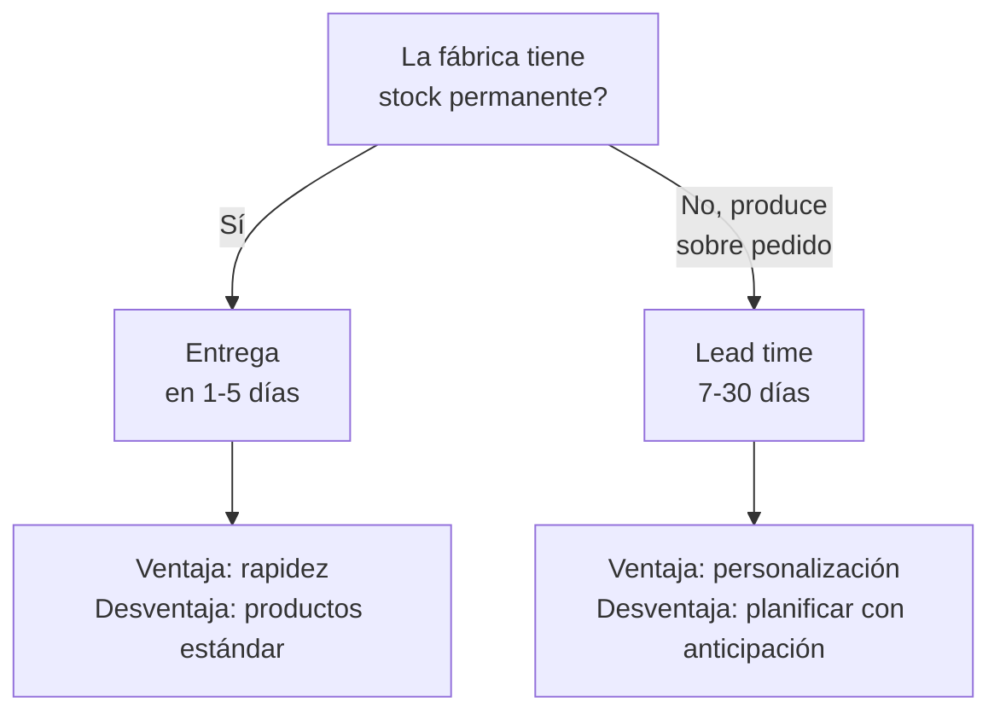

# Evaluar la capacidad productiva

> Una fábrica puede ser legítima y aún así no poder cumplir con tus pedidos. Evaluar la **capacidad productiva** te permite entender si tu proveedor puede entregar lo que promete, en tiempo y forma.

## Por qué importa la capacidad productiva

Que una fábrica exista y sea legal no garantiza que pueda:

- Producir las cantidades que necesitás
- Cumplir los plazos de entrega acordados
- Mantener la calidad constante entre lotes
- Escalar la producción cuando tu negocio crezca

<Note>
La capacidad productiva no se trata solo de cuánto produce, sino de cuánto puede producir **de forma consistente y confiable**. Una fábrica que hoy te entrega bien pero el mes que viene no puede, es un problema para tu negocio.
</Note>

## Preguntas clave para hacerle a la fábrica

Antes de visitar o comprometerte, hacé estas preguntas por teléfono, WhatsApp o email:

1. **Cuántas unidades producen por mes** del producto que te interesa?
2. **Cuál es el lead time** (tiempo desde que hacés el pedido hasta que está listo)?
3. **Tienen stock permanente** o producen sobre pedido?
4. **Cuál es el pedido mínimo?**
5. **Cuántos empleados tienen** en producción?
6. **Trabajan con otros clientes mayoristas** o solo venden al público?
7. **Pueden aumentar la producción** si necesitás más unidades en el futuro?
8. **Tienen materia prima asegurada** o dependen de proveedores que a veces fallan?

<Tip>
No tengas miedo de hacer estas preguntas. Una fábrica seria las responde sin problema. Si evaden o se molestan, es una señal de que algo no está bien.
</Tip>

## Categorías de fábricas por tamaño

Las fábricas argentinas varían enormemente en tamaño. Cada categoría tiene ventajas y desventajas para un comprador mayorista:

<Tabs>
  <Tab title="Micro (1-5 empleados)">
    **Qué es:** taller familiar o emprendimiento individual. El dueño suele ser también el operario principal.

    **Producción mensual típica:** 100-500 unidades (depende del producto)

    **Ventajas:**
    - Pedido mínimo bajo (a veces desde 10-20 unidades)
    - Flexibilidad para personalizar productos
    - Trato directo con el dueño
    - Precios negociables

    **Desventajas:**
    - Capacidad limitada para pedidos grandes
    - Si el dueño se enferma, la producción se frena
    - Menos probabilidad de tener certificaciones
    - Lead times más impredecibles

    **Ideal para:** primeras compras de prueba, productos personalizados, nichos muy específicos.
  </Tab>

  <Tab title="Pequeña (6-25 empleados)">
    **Qué es:** fábrica establecida con varios operarios, generalmente con un local o galpón dedicado.

    **Producción mensual típica:** 500-5.000 unidades

    **Ventajas:**
    - Buen equilibrio entre flexibilidad y capacidad
    - Pedidos mínimos razonables (50-200 unidades)
    - Proceso más profesionalizado
    - Suelen tener facturación formal completa

    **Desventajas:**
    - Menos flexible que un micro-taller para personalización
    - Puede tener varios clientes y priorizar a los más grandes
    - Lead times de 1-3 semanas típicamente

    **Ideal para:** la mayoría de los revendedores que están empezando y creciendo. Es el punto dulce.
  </Tab>

  <Tab title="Mediana (26-100 empleados)">
    **Qué es:** fábrica con estructura gerencial, producción en serie y clientes mayoristas establecidos.

    **Producción mensual típica:** 5.000-50.000 unidades

    **Ventajas:**
    - Alta capacidad y consistencia
    - Procesos estandarizados de control de calidad
    - Pueden acompañar tu crecimiento sin problemas
    - Suelen tener certificaciones y habilitaciones completas

    **Desventajas:**
    - Pedidos mínimos más altos (500-2.000+ unidades)
    - Menos flexibilidad para productos personalizados
    - Trato menos personal (hablás con un vendedor, no con el dueño)
    - Precios menos negociables en cantidades chicas

    **Ideal para:** cuando ya tenés un producto validado y necesitás volumen constante.
  </Tab>
</Tabs>

<Tip>
Empezar con fábricas pequeñas o medianas es lo más recomendable. Las micro-fábricas son buenas para probar, pero pueden no dar abasto si tu producto funciona bien. Las grandes suelen tener pedidos mínimos muy altos para alguien que recién arranca.
</Tip>

## Checklist de capacidad productiva

Usá esta lista para evaluar a cada fábrica que estés considerando:

| Aspecto | Qué verificar | Cómo verificar |
|---------|---------------|----------------|
| **Maquinaria** | Tiene equipos suficientes y en buen estado? | Preguntar o visitar |
| **Personal** | Cantidad de operarios vs producción declarada | Preguntar cuántos empleados tiene |
| **Materia prima** | Tiene proveedores estables de insumos? | Preguntar si alguna vez frenaron por falta de materiales |
| **Almacenamiento** | Tiene espacio para stock de producto terminado? | Preguntar o visitar |
| **Turno de trabajo** | Trabaja 1 o 2 turnos? Fines de semana? | Preguntar horarios de producción |
| **Otros clientes** | Cuántos clientes mayoristas atiende? | Preguntar (sin esperar nombres específicos) |
| **Historial de entregas** | Cumple con los plazos habitualmente? | Pedir referencias o preguntar a otros clientes |

## Stock permanente vs producción sobre pedido

Es clave entender cómo trabaja la fábrica:

| Modelo | Tiempo de entrega | Personalización | Ideal para |
|--------|-------------------|-----------------|------------|
| **Stock permanente** | 1-5 días hábiles | Baja (lo que hay, hay) | Reposición rápida, productos estándar |
| **Producción sobre pedido** | 7-30 días hábiles | Alta (colores, medidas, packaging) | Productos diferenciados, marca propia |

<Note>
Una fábrica que produce sobre pedido generalmente tiene mejor control de calidad porque fabrica específicamente para tu pedido. Pero necesitás planificar con más anticipación y tener stock de seguridad.
</Note>

## Señales de problemas de capacidad

Prestá atención a estas señales que indican que la fábrica podría no cumplir:

- **Lead times que se alargan sin explicación** -- te dijeron 10 días y después son 20
- **Calidad inconsistente entre lotes** -- un lote bien, el siguiente con defectos
- **Excusas frecuentes** -- "se rompió una máquina", "no conseguimos la tela", "el empleado se fue"
- **No responden mensajes en tiempo razonable** -- si tardan 3 días en contestar un WhatsApp, imaginá cómo manejan un pedido
- **Cambian los precios sin aviso** -- señal de inestabilidad o mala gestión

<Warning>
Si una fábrica te promete tiempos de entrega sospechosamente cortos para un volumen alto, desconfiá. Es mejor una fábrica que te diga "tardo 15 días" y cumpla, que una que prometa 5 días y no entregue.
</Warning>

## Cómo estimar si la fábrica alcanza para tu negocio

Hacé este cálculo simple:

1. **Estimá cuántas unidades vas a vender por mes** (sé conservador al principio)
2. **Sumá un 20% de stock de seguridad** (para cubrir picos de demanda)
3. **Preguntale a la fábrica cuánto puede entregarte por mes**
4. **Compará:** si la fábrica puede darte al menos 150% de lo que necesitás, tenés margen

**Ejemplo:** si estimás vender 200 unidades/mes, necesitás que la fábrica pueda darte al menos 300 unidades/mes para tener margen de crecimiento y reposición.

## Preguntas frecuentes

<Accordion title="Puedo comprar de más de una fábrica a la vez?">
Sí, y es recomendable una vez que crecés. Tener al menos 2 proveedores para tu producto principal te protege si uno falla. Pero al principio, empezá con una fábrica para simplificar la operación.
</Accordion>

<Accordion title="Qué pasa si la fábrica no puede seguir mi ritmo de crecimiento?">
Es un buen problema. Si tu negocio crece más rápido que la capacidad de tu proveedor, podés: (a) agregar una segunda fábrica como proveedor complementario, (b) negociar con la fábrica actual para que aumente su capacidad, o (c) migrar a una fábrica más grande que pueda acompañar tu volumen.
</Accordion>

<Accordion title="Cómo sé si la fábrica me está diciendo la verdad sobre su capacidad?">
La mejor forma es empezar con un pedido chico y medir: cumplieron el plazo? La calidad fue consistente? Si el primer pedido sale bien, hacé uno un poco más grande. Ir escalando de a poco es la forma más segura de verificar la capacidad real.
</Accordion>

## Siguiente paso

<Tip>
Ya sabés cómo evaluar si la fábrica puede producir lo que necesitás. Ahora aprendé a [evaluar la calidad del producto](/app/paso1-argentina/evaluar-negociar/evaluar-calidad-producto) antes de comprometerte con un pedido grande.
</Tip>
