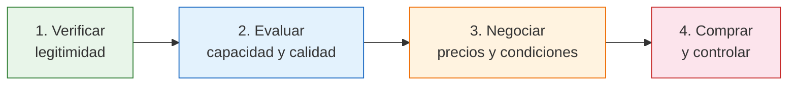

# Evaluar y negociar con fábricas

> Encontrar una fábrica es solo el primer paso. Antes de comprar, necesitás **verificar que sea confiable**, evaluar su capacidad, comparar precios y negociar condiciones. Este proceso te protege de perder plata y tiempo.

## Por qué la evaluación importa

No todas las fábricas argentinas son iguales. Algunas son excelentes proveedores con décadas de trayectoria, y otras son emprendimientos informales que pueden dejarte sin mercadería o con productos defectuosos.

**Problemas reales que ocurren por no evaluar:**

- Comprás un lote y la mitad viene con defectos
- La fábrica desaparece después de cobrar tu pedido
- Los tiempos de entrega se alargan semanas sin explicación
- El producto que recibís no se parece a la muestra
- Te dan una factura trucha y después tenés problemas con ARCA

<Warning>
Saltarse la evaluación para "ahorrar tiempo" es la forma más rápida de perder plata. Una mala compra mayorista puede significar pérdidas de cientos de miles de pesos que no vas a recuperar.
</Warning>

## El proceso en 4 etapas

Evaluar y negociar con una fábrica no es una sola acción sino un **proceso ordenado** de 4 etapas. Cada etapa filtra y reduce el riesgo antes de poner tu dinero:

| Etapa | Qué hacés | Por qué |
|-------|-----------|---------|
| **Verificar** | Confirmás que la fábrica existe legalmente, tiene CUIT, factura y no tiene reclamos | Eliminás fábricas fantasma e informales |
| **Evaluar** | Analizás su capacidad productiva, calidad de productos y comparás precios | Elegís la mejor opción entre varias |
| **Negociar** | Acordás precios, cantidades mínimas, condiciones de pago y plazos de entrega | Conseguís las mejores condiciones posibles |
| **Comprar** | Hacés tu primera compra, controlás la mercadería al recibirla y documentás todo | Arrancás la relación comercial con el pie derecho |

## Qué vas a aprender

<Steps>
  <Step title="Verificar legitimidad">
    Cómo confirmar que una fábrica es real y legal usando herramientas gratuitas de ARCA, registros públicos y búsquedas online. Vas a aprender a detectar señales de alerta antes de poner un peso.
  </Step>
  <Step title="Evaluar capacidad productiva">
    Cómo entender si la fábrica puede cumplir con tus pedidos: cuánto produce, con qué equipamiento trabaja, y si puede escalar cuando vos crezcas.
  </Step>
  <Step title="Evaluar calidad del producto">
    Cómo pedir y analizar muestras, qué verificar según el tipo de producto, y cómo asegurarte de que lo que comprás es lo que te prometieron.
  </Step>
  <Step title="Comparar precios entre fábricas">
    Cómo armar una comparación real de costos entre diferentes fábricas, incluyendo costos ocultos que muchos principiantes no ven.
  </Step>
  <Step title="Visitar una fábrica">
    Cómo prepararte para visitar una fábrica en persona, qué observar, qué preguntar y cómo comportarte profesionalmente.
  </Step>
</Steps>

## Explorá cada tema

<CardGroup cols={2}>
  <Card title="Verificar Legitimidad" icon="shield-check" href="/app/paso1-argentina/evaluar-negociar/verificar-legitimidad">
    Confirmá que la fábrica es legal y confiable antes de dar cualquier paso. CUIT, registros, señales de alerta.
  </Card>
  <Card title="Capacidad Productiva" icon="industry" href="/app/paso1-argentina/evaluar-negociar/evaluar-capacidad-productiva">
    Evaluá si la fábrica puede producir lo que necesitás, en los tiempos que necesitás y con consistencia.
  </Card>
  <Card title="Calidad del Producto" icon="magnifying-glass" href="/app/paso1-argentina/evaluar-negociar/evaluar-calidad-producto">
    Aprendé a pedir muestras, analizarlas y asegurarte de que la calidad sea la prometida antes de comprar.
  </Card>
  <Card title="Comparar Precios" icon="tags" href="/app/paso1-argentina/evaluar-negociar/comparar-precios">
    Compará cotizaciones de diferentes fábricas de forma objetiva, incluyendo costos ocultos y condiciones.
  </Card>
  <Card title="Visitar una Fábrica" icon="map-location-dot" href="/app/paso1-argentina/evaluar-negociar/visitar-fabrica">
    Guía completa para tu primera visita a una fábrica: qué observar, qué preguntar, cómo comportarte.
  </Card>
</CardGroup>

## Cuánto tiempo toma este proceso

No te apures. Evaluar bien a un proveedor toma entre **1 y 3 semanas**, dependiendo de cuántas fábricas estés comparando:

| Actividad | Tiempo estimado |
|-----------|----------------|
| Verificación de legitimidad (por fábrica) | 1-2 horas |
| Pedir y recibir muestras | 3-10 días |
| Evaluar muestras y calidad | 1-2 días |
| Comparar precios (3+ fábricas) | 2-3 días |
| Visita presencial (si aplica) | Medio día |
| Negociación y acuerdo | 1-5 días |

<Note>
Tomarse el tiempo para evaluar bien ahorra problemas y dinero a largo plazo. Un proveedor confiable es un activo invaluable para tu negocio. No lo elijas apurado.
</Note>

<Tip>
Para más detalle sobre cómo encontrar las fábricas que vas a evaluar, consultá [Encontrar fábricas argentinas](/app/paso1-argentina/encontrar-fabricas/introduccion).
</Tip>
