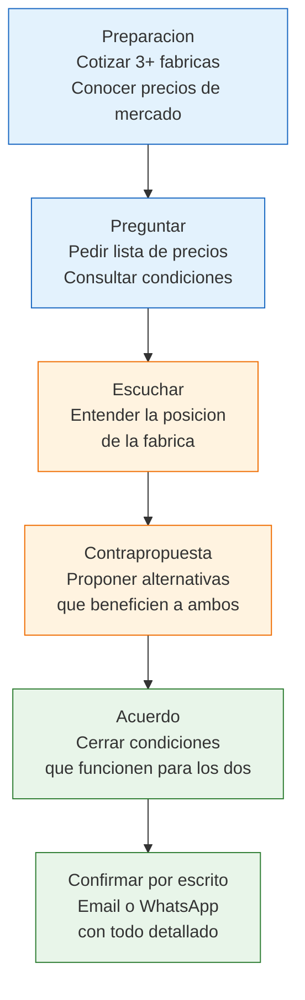

# Negociar precios y condiciones

> Negociar no es pelear ni regatear. Es una conversacion donde vos y la fabrica buscan un acuerdo que funcione para ambos. Si la fabrica pierde, eventualmente deja de atenderte o baja la calidad. Si vos perdes, tu negocio no es viable. El objetivo es encontrar el punto donde los dos ganan.

## Cambio de mentalidad: de "regatear" a "negociar"

Muchos principiantes llegan a una fabrica pensando que negociar es pedir un descuento y punto. La realidad es mas compleja y mas interesante:

| Regatear | Negociar |
|----------|----------|
| Enfoque solo en precio | Enfoque en el acuerdo completo |
| Uno gana, el otro pierde | Los dos ganan algo |
| Relacion de una vez | Relacion a largo plazo |
| "Bajame el precio o me voy" | "Como hacemos para que funcione para ambos?" |

<Note>
En Argentina, la relacion personal pesa mas que en muchos otros paises. Invertir tiempo en conocer al duenio o al vendedor, preguntar como le va, interesarte genuinamente en su fabrica, genera resultados que ningun descuento por volumen logra. Muchos fabricantes dan mejores condiciones a clientes que les caen bien y son confiables, aunque compren menos.
</Note>

## Que es negociable (y que no)

Antes de negociar, tene claro que cosas podes poner sobre la mesa:

| Elemento | Negociable? | Como negociarlo |
|----------|-------------|-----------------|
| **Precio unitario** | Si | Pedir descuento directo, especialmente por cantidad |
| **Descuento por cantidad** | Si | Escalas: +100 uds = 5%, +500 uds = 10%, etc. |
| **Plazo de pago** | Si | 50/50, pago a 30 dias, cheque diferido |
| **Flete incluido** | Si | Que la fabrica absorba el costo de envio |
| **Packaging personalizado** | A veces | Depende de la cantidad, generalmente desde +500 uds |
| **Exclusividad de zona** | A veces | Si compras volumen suficiente para esa zona |
| **Tiempos de entrega** | Parcialmente | Podes negociar prioridad, pero la produccion tiene sus tiempos |
| **Calidad del producto** | No | No pidas que bajen la calidad para bajar el precio. Es una trampa. |

## Tacticas basicas de negociacion

Estas tacticas son simples, eticas y funcionan especialmente bien con fabricas argentinas.

### 1. Tener alternativas reales

Antes de negociar con una fabrica, cotiza al menos en **3 fabricas diferentes** del mismo producto. Esto te da:
- Referencia de precios reales del mercado
- Poder de negociacion genuino (no inventado)
- La tranquilidad de que si no llegas a un acuerdo, tenes opciones

<Tip>
No hace falta decir "me cotizaron mas barato en otro lado". Simplemente tener alternativas te da confianza, y esa confianza se nota en como negocias.
</Tip>

### 2. Mostrar volumen futuro

Las fabricas piensan en el largo plazo. Si les mostras que tu negocio tiene potencial de crecimiento, estan dispuestas a darte mejores condiciones hoy.

Ejemplo: "Arranco con 100 unidades, pero mi objetivo es llegar a 500 mensuales en 6 meses. Si crezco como espero, me gustaria mantener este proveedor."

### 3. Ofrecer pago rapido por descuento

El efectivo inmediato tiene valor. Si podes pagar todo por adelantado o en el momento de retiro, pedile a la fabrica un descuento por pronto pago.

Rango tipico: **3-7% de descuento** por pago al contado vs pago a 30 dias.

### 4. Pedir descuento por lote mas grande

En lugar de negociar el precio unitario (que puede ser incomodo), pregunta: "Si en vez de 100 llevo 200 unidades, hay alguna mejora en el precio?"

Esto es mas facil de aceptar para la fabrica porque vos estas ofreciendo algo a cambio (mas volumen).

### 5. Negociar el flete incluido

El flete desde fabrica puede costar entre ARS 5,000 y ARS 50,000 dependiendo del volumen y la distancia. Pedile a la fabrica que lo incluya en el precio, especialmente si tu pedido es importante para ellos.

## Cuanto descuento se puede conseguir?

Sere directo: **5-15% sobre la primera cotizacion es lo normal** en Argentina.

| Situacion | Descuento esperable |
|-----------|-------------------|
| Primera compra, volumen chico | 0-5% |
| Primera compra, volumen mediano | 5-10% |
| Cliente recurrente, volumen medio | 10-15% |
| Cliente grande, volumen alto | 15-25% |
| Pago contado vs pago a 30 dias | 3-7% adicional |

<Warning>
NUNCA amenaces con "me voy a otra fabrica" como tactica de presion. En Argentina esto es contraproducente. El mundo industrial es chico, la gente se conoce, y te cerras puertas. Si realmente tenes una mejor oferta, mencionala con respeto: "Estoy evaluando opciones y me gustaria poder quedarme con ustedes, hay alguna posibilidad de mejorar el precio?"
</Warning>

## Proceso de negociacion paso a paso

## Ejemplo practico: negociacion de 200 unidades

Supongamos que queres comprar 200 organizadores de plastico para revender en MercadoLibre.

<Steps>
  <Step title="Cotizaste en 3 fabricas">
    - Fabrica A: ARS 2,800/unidad (minimo 100 uds)
    - Fabrica B: ARS 3,100/unidad (minimo 50 uds)
    - Fabrica C: ARS 2,600/unidad (minimo 200 uds)

    La Fabrica C tiene el mejor precio, pero la A te gusto mas por calidad y atencion.
  </Step>
  <Step title="Contactas a la Fabrica A para negociar">
    Le decis: "Me interesa mucho trabajar con ustedes. Estoy evaluando opciones y me gustaria comprar 200 unidades. Hay alguna posibilidad de mejorar el precio por esa cantidad?"
  </Step>
  <Step title="La fabrica responde">
    Te ofrecen ARS 2,650/unidad por 200 unidades (5.4% de descuento sobre los ARS 2,800 originales).
  </Step>
  <Step title="Vos haces una contrapropuesta">
    "Perfecto, me parece bien. Si ademas pago 100% por transferencia antes de retirar, pueden incluir el flete hasta mi deposito?" (El flete cuesta aprox. ARS 15,000.)
  </Step>
  <Step title="Llegan a un acuerdo">
    La fabrica acepta incluir el flete para pedidos de 200+ unidades con pago anticipado. Precio final: ARS 2,650/unidad con flete incluido y pago por transferencia.
  </Step>
  <Step title="Confirmas por escrito">
    Envias un WhatsApp: "Confirmo: 200 unidades de [producto], a ARS 2,650 c/u, flete incluido, pago por transferencia antes de retirar. Me pasan los datos para transferir y coordinar entrega?"
  </Step>
</Steps>

**Resultado:** Ahorraste ARS 30,000 en el producto (descuento de ARS 150/unidad x 200) + ARS 15,000 de flete = **ARS 45,000 de ahorro total** en una negociacion de 15 minutos.

## Errores fatales en la negociacion

Evita estos errores que arruinan relaciones comerciales:

| Error | Por que es malo | Que hacer en cambio |
|-------|-----------------|---------------------|
| Amenazar con irte a la competencia | Genera rechazo, el fabricante se cierra | Mencionar que "estas evaluando opciones" con respeto |
| Mentir sobre volumenes futuros | Se dan cuenta y perdes credibilidad | Ser honesto sobre tus proyecciones reales |
| Presionar demasiado por precio | La fabrica baja calidad o deja de atenderte | Negociar el paquete completo, no solo el precio |
| No cumplir lo acordado | Te cerras las puertas definitivamente | Cumplir al 100% lo que prometiste, siempre |
| Comparar despectivamente con otra fabrica | Es ofensivo y contraproducente | Si tenes mejor oferta, mencionarla con tacto |

<Tip>
La mejor negociacion es la que genera una relacion a largo plazo, no un ahorro de corto plazo. Una fabrica que confia en vos te va a dar mejores condiciones progresivamente, te va a avisar cuando saca productos nuevos, y te va a priorizar cuando haya escasez de stock.
</Tip>

## Confirmar todo por escrito

Despues de llegar a un acuerdo verbal, **siempre** confirma los puntos clave por WhatsApp o email:

- Producto exacto (nombre, codigo, variantes)
- Cantidad acordada
- Precio unitario final
- Condiciones de pago (forma, plazos)
- Flete (quien lo paga, hasta donde)
- Plazo de entrega estimado
- Tipo de factura (A o B)

<Warning>
Un acuerdo verbal sin confirmacion escrita no sirve. No porque el fabricante sea deshonesto, sino porque los malentendidos son comunes y la memoria falla. El WhatsApp con los puntos confirmados protege a ambas partes.
</Warning>

## Preguntas frecuentes

<Accordion title="Cuanto tiempo lleva una negociacion tipica?">
Desde el primer contacto hasta cerrar el acuerdo, puede tomar entre 3 dias y 2 semanas. No apures al fabricante; tomate el tiempo necesario para evaluar y decidir bien.
</Accordion>

<Accordion title="Puedo negociar si compro solo el minimo?">
Si, pero el margen de negociacion es menor. Podes negociar flete incluido, muestra gratis, o un compromiso de mejora de precio en el segundo pedido si el primero sale bien.
</Accordion>

<Accordion title="Que hago si la fabrica no quiere negociar nada?">
Algunas fabricas tienen precios fijos, especialmente las mas grandes o las que venden productos con mucha demanda. En ese caso, evalua si el precio te cierra con tu margen objetivo. Si cierra, compra sin negociar; si no cierra, busca otra fabrica.
</Accordion>
