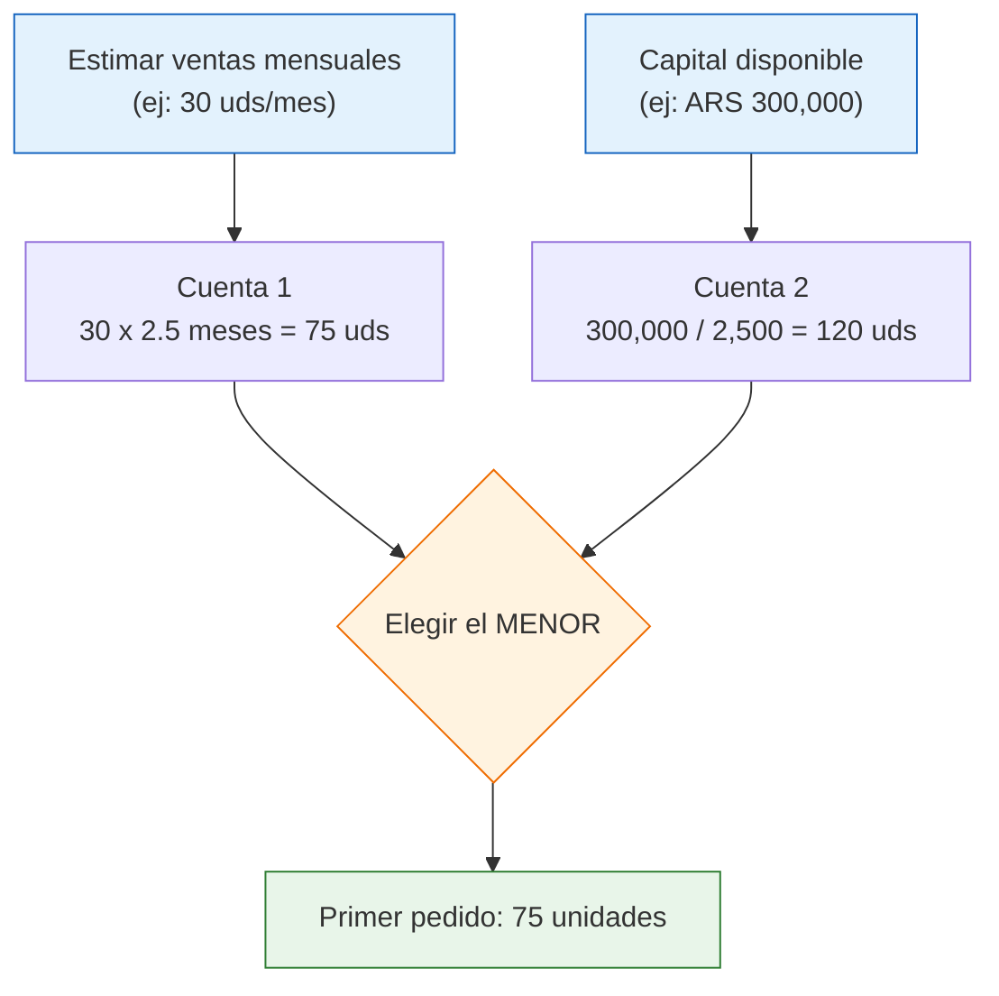
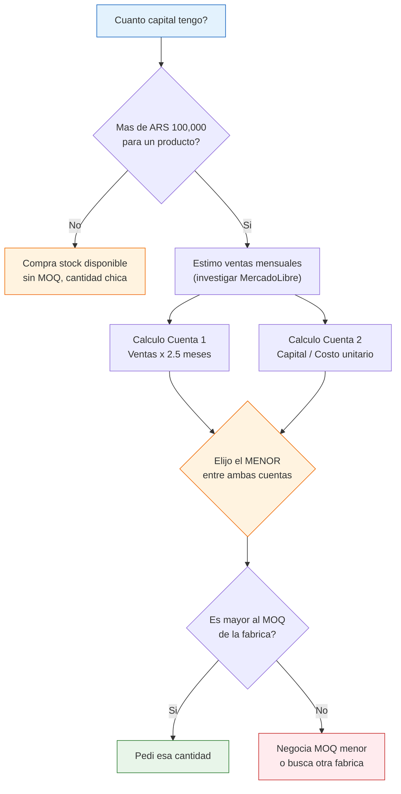

# Pedido minimo — Cuanto comprar

> Una de las decisiones mas dificiles para un principiante es definir cuantas unidades comprar en el primer pedido. Comprar demasiado inmoviliza tu capital; comprar muy poco aumenta el costo unitario y te deja sin stock rapidamente. La clave es encontrar el punto justo con numeros, no con intuicion.

## Que es el MOQ (Minimum Order Quantity)

El MOQ es la **cantidad minima de compra** que una fabrica exige para venderte. Existe porque a la fabrica le cuesta lo mismo preparar una orden de 10 unidades que una de 100 (mano de obra, logistica, facturacion), entonces debajo de cierta cantidad no le resulta rentable atenderte.

<Note>
El MOQ no es un numero fijo universal. Varia por fabrica, por producto, por temporada y hasta por la relacion que tengas con el proveedor. Siempre pregunta, y si el minimo te parece alto, negocia una excepcion para la primera compra.
</Note>

## MOQ tipicos en Argentina por industria

Estos son rangos habituales que vas a encontrar en fabricas argentinas. Son aproximados y pueden variar.

| Industria | MOQ tipico | Comentario |
|-----------|-----------|------------|
| **Textiles / Indumentaria** | 50-200 uds por modelo/color | Cada combinacion de talle y color cuenta como item separado |
| **Bazar / Hogar** | 100-500 uds | Productos estandar suelen tener MOQ mas bajo |
| **Cosmetica / Belleza** | 200-1,000 uds | El registro ANMAT exige volumenes minimos de produccion |
| **Ferreteria / Herramientas** | 100-300 uds | Productos metalicos suelen tener MOQ mas altos por el costo de setup |
| **Juguetes** | 100-500 uds | Alta variabilidad segun complejidad del producto |
| **Alimentos no perecederos** | Variable | Depende de la linea de produccion y el tipo de packaging |
| **Plasticos / Descartables** | 500-2,000 uds | Los moldes de inyeccion requieren corridas largas |
| **Marroquineria / Cuero** | 30-100 uds | MOQ mas bajo porque es produccion mas artesanal |

<Tip>
Si el MOQ de una fabrica es demasiado alto para vos, pregunta si tienen stock disponible que puedas comprar en menor cantidad. Muchas fabricas tienen un deposito con mercaderia lista que venden sin minimo, o con un minimo mucho menor que el de produccion a pedido.
</Tip>

## Como negociar un MOQ mas bajo

Estas estrategias funcionan especialmente bien para la primera compra:

| Estrategia | Como plantearla |
|------------|-----------------|
| **Pedido de prueba** | "Me gustaria hacer un pedido inicial mas chico para probar la respuesta del mercado, y si funciona bien, el segundo pedido va a ser mas grande." |
| **Compromiso futuro** | "Puedo arrancar con 50 unidades ahora y comprometerme a un pedido de 200 en 60 dias si el producto se vende bien." |
| **Pagar un precio mayor** | "Entiendo que el minimo es 200, pero puedo comprar 100 pagando un precio unitario un poco mayor?" Muchas fabricas aceptan. |
| **Comprar surtido** | "En vez de 200 de un solo modelo, puedo llevar 50 de 4 modelos diferentes para llegar al minimo?" |
| **Retirar de stock** | "Tienen stock disponible para venta inmediata sin necesidad de produccion?" |

## Calcular la cantidad ideal: formula simple

No necesitas una planilla compleja. Hacelo con estas dos cuentas simples:

### Cuenta 1: Basada en ventas estimadas

```
Cantidad ideal = Ventas estimadas mensuales x 2-3 meses de stock
```

Ejemplo: si estimas vender 30 unidades por mes, tu pedido ideal es entre **60 y 90 unidades**.

**Como estimar ventas mensuales si nunca vendiste:**
- Busca productos similares en MercadoLibre
- Mira las publicaciones con mas ventas y fijate cuantas unidades vendieron en los ultimos meses
- Dividi por la cantidad de meses para tener un promedio mensual
- Asumi que vos vas a vender **la mitad** de lo que vende el lider de la categoria (ser conservador te protege)

### Cuenta 2: Basada en tu capital disponible

```
Cantidad maxima = Capital disponible para este producto / Costo unitario
```

Ejemplo: si tenes ARS 300,000 para invertir y cada unidad cuesta ARS 2,500, tu maximo es **120 unidades**.

### La regla final

```
Tu primer pedido = El MENOR entre Cuenta 1 y Cuenta 2
```

Si la Cuenta 1 te da 90 unidades pero la Cuenta 2 te da 120, pedi **90**. Si la Cuenta 1 te da 90 pero la Cuenta 2 te da 60, pedi **60**. Siempre queda del lado conservador.



## Riesgos de comprar demasiado

| Riesgo | Consecuencia | Ejemplo |
|--------|-------------|---------|
| **Capital inmovilizado** | No podes invertir en otros productos o cubrir gastos | Invertis ARS 800,000 en stock y te quedas sin plata para publicidad |
| **Almacenamiento** | Necesitas espacio, que cuesta dinero o espacio en tu casa | 1,000 cajas de bazar ocupan un cuarto entero |
| **Productos que no se venden** | Quedas con mercaderia que nadie quiere | Compraste 500 unidades de un producto que solo vende 10/mes |
| **Obsolescencia / Vencimiento** | Los productos pierden valor o vencen | Cosmeticos con fecha de vencimiento, productos de moda que pasan de temporada |
| **Descuentos forzados** | Para liquidar, tenes que vender a perdida | Bajas el precio 40% para sacar la mercaderia |

### Costo oculto del sobre-stock

Tener mercaderia parada tiene un costo real, aunque no lo veas en una factura:

```
Costo mensual del sobre-stock = Valor del stock x 3-5%
```

Ese 3-5% incluye: costo de oportunidad (la plata podria estar generando ganancia en otra cosa), riesgo de daniarse, espacio de almacenamiento y depreciacion. Si tenes ARS 500,000 en stock parado, estas perdiendo entre **ARS 15,000 y ARS 25,000 por mes** sin darte cuenta.

## Riesgos de comprar muy poco

| Riesgo | Consecuencia | Ejemplo |
|--------|-------------|---------|
| **Costo unitario mas alto** | La fabrica cobra mas por unidad si compras poco | ARS 3,000/ud en vez de ARS 2,500/ud por comprar 50 en vez de 200 |
| **Stock-outs** | Te quedas sin producto cuando tenes demanda | Se te acaban las 30 unidades en 2 semanas y tardas 10 dias en reponer |
| **Perdida de ventas** | Cada dia sin stock es plata que no entra | Si vendes 2/dia y estas 10 dias sin stock, perdiste 20 ventas |
| **Posicionamiento en ML** | MercadoLibre penaliza publicaciones pausadas por falta de stock | Tu publicacion pierde posicion y cuesta recuperarla |

<Warning>
Nunca inviertas mas del 30-40% de tu capital total en un solo producto. Si tenes ARS 500,000 de capital, no pongas mas de ARS 150,000-200,000 en un unico producto. Diversificar te protege: si un producto no funciona, los otros cubren la perdida.
</Warning>

## Ejemplo practico: calculando tu primer pedido

Supongamos que queres vender organizadores de cocina de plastico.

<Steps>
  <Step title="Investigas el mercado">
    Buscas en MercadoLibre y encontras que los 3 principales vendedores venden entre 80 y 150 unidades por mes cada uno. Sos nuevo, asi que estimas vender **40 unidades por mes** (la mitad del vendedor mediano).
  </Step>
  <Step title="Calculas la Cuenta 1">
    Ventas estimadas x meses de stock: 40 uds x 2.5 meses = **100 unidades**.
  </Step>
  <Step title="Calculas la Cuenta 2">
    Capital disponible para este producto: ARS 250,000. Costo unitario: ARS 2,200. Cantidad maxima: 250,000 / 2,200 = **113 unidades**.
  </Step>
  <Step title="Aplicas la regla del menor">
    Cuenta 1 = 100, Cuenta 2 = 113. Tu primer pedido ideal es **100 unidades**.
  </Step>
  <Step title="Comparas con el MOQ de la fabrica">
    La fabrica tiene un minimo de 100 unidades. Perfecto, coincide con tu calculo. Si el minimo fuera 200, tendrias que negociar una excepcion o buscar otra fabrica.
  </Step>
  <Step title="Verificas tu inversion total">
    100 unidades x ARS 2,200 = ARS 220,000. Eso es el 44% de tu capital total de ARS 500,000. Esta un poco por encima del 40% ideal, pero es aceptable para un primer producto si no tenes otros compromisos fuertes.
  </Step>
</Steps>

**Resultado:** Primer pedido de 100 unidades. Si se venden a 40/mes como estimas, te dura 2.5 meses. Tenes tiempo de sobra para evaluar, ajustar precios y hacer el segundo pedido antes de quedarte sin stock.

## Cuadro resumen: guia rapida de cantidades

| Tu situacion | Cantidad sugerida |
|-------------|-------------------|
| Capital menor a ARS 100,000 | 30-50 unidades (comprar de stock disponible) |
| Capital ARS 100,000-300,000 | 50-150 unidades (un solo producto, bien elegido) |
| Capital ARS 300,000-600,000 | 100-200 unidades de 2 productos diferentes |
| Capital mayor a ARS 600,000 | 150-300 unidades de 2-3 productos, diversificando |

<Note>
Estos valores son orientativos para febrero 2026 y dependen del costo unitario del producto. Un producto de ARS 500 permite comprar mas unidades con el mismo capital que uno de ARS 5,000. Siempre haz las cuentas con tus numeros reales.
</Note>

## Flujo de decision para tu primer pedido



<Tip>
Para tu primer pedido, preferi siempre comprar MENOS cantidad y evaluar la respuesta del mercado. Es mejor quedarte corto y tener que reponer rapido (buena senial: el producto se vende!) que quedarte con 500 unidades de algo que nadie quiere. El primer pedido es una prueba, no una apuesta.
</Tip>

## Preguntas frecuentes

<Accordion title="Que hago si el MOQ es demasiado alto para mi capital?">
Tenes varias opciones: pedir una excepcion por ser primera compra, comprar de stock disponible (sin MOQ), buscar otra fabrica con minimo mas bajo, o asociarte temporalmente con otro revendedor para compartir un pedido grande. Otra opcion es comprar en mayoristas intermediarios que compran a la fabrica y revenden sin minimo (pagando un poco mas por unidad).
</Accordion>

<Accordion title="Como se si estoy calculando bien las ventas estimadas?">
Sere honesto: la primera estimacion siempre tiene margen de error. Por eso usamos el multiplicador conservador (mitad de lo que vende el lider). Lo importante es no apostar todo al primer numero. Despues de 30-60 dias de ventas reales, vas a tener datos concretos para ajustar tu proximo pedido.
</Accordion>

<Accordion title="Conviene comprar 2-3 productos distintos o concentrar en uno?">
Para un principiante, empezar con 1-2 productos bien elegidos es lo ideal. Diversificar demasiado con poco capital significa comprar cantidades minimas de cada uno, pagando mas por unidad y sin poder negociar. Mejor ser fuerte en 1-2 productos que debil en 5.
</Accordion>

<Accordion title="Cada cuanto deberia reponerme de stock?">
Idealmente, hace tu pedido de reposicion cuando te quedan entre 2-3 semanas de stock. Si vendes 40 unidades por mes y la fabrica tarda 10 dias en preparar tu pedido, pedile reposicion cuando te queden 25-30 unidades. Asi no te quedas sin mercaderia.
</Accordion>
