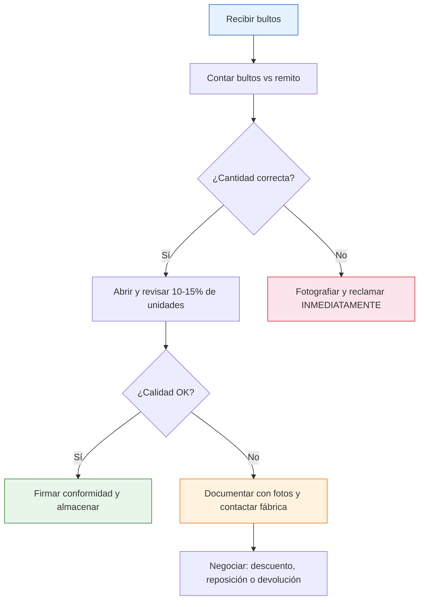

# Tu primera compra a una fábrica

> Llegó el momento de poner plata. Tu primera compra mayorista es emocionante pero también es donde más errores se cometen. Esta guía te lleva paso a paso para que todo salga bien desde el principio.

## Checklist previo: antes de comprar

Antes de transferir un solo peso, confirmá que tenés todo esto resuelto:

| Requisito | Estado | Por qué importa |
|-----------|--------|-----------------|
| Fábrica verificada (CUIT, registro) | Pendiente | Sin verificación, arriesgás tu plata |
| Muestras aprobadas | Pendiente | Sabés exactamente qué vas a recibir |
| Precios negociados y confirmados | Pendiente | Evitás sorpresas en el costo final |
| Condiciones de pago acordadas | Pendiente | Sabés cuánto, cuándo y cómo pagar |
| Fecha de entrega pactada | Pendiente | Podés planificar tu logística y ventas |
| Política de devolución consultada | Pendiente | Sabés qué hacer si algo sale mal |

<Warning>
Si alguno de estos puntos no está resuelto, **NO avances con la compra**. Volver atrás después de transferir plata es mucho más difícil que tomarte un par de días más para cerrar todo.
</Warning>

## Paso a paso: tu primera compra

<Steps>
  <Step title="Confirmar el pedido por escrito">
    Enviá un email o mensaje de WhatsApp detallando **exactamente** qué estás pidiendo. Esto funciona como respaldo legal básico. Incluí: productos, cantidades, precio unitario, precio total, fecha de entrega y condiciones de pago. Pedí que te confirmen por escrito.
  </Step>
  <Step title="Realizar el pago">
    Transferí el monto acordado por transferencia bancaria. Guardá el comprobante. Si la fábrica pide efectivo, intentá que al menos una parte sea por transferencia para tener trazabilidad. Nunca pagues el 100% por adelantado en la primera compra si podés evitarlo.
  </Step>
  <Step title="Recibir la factura">
    Pedí la factura **antes o junto con la entrega**. Verificá que tenga CAE válido, tus datos correctos y el detalle de productos. Sin factura no comprés.
  </Step>
  <Step title="Coordinar envío o retiro">
    Definí cómo llega la mercadería: retiro en fábrica con vehículo propio, envío por transporte de la fábrica, o flete contratado por vos. Asegurate de que te preparen el **remito** para el traslado.
  </Step>
  <Step title="Recibir la mercadería">
    Al recibir, no firmes el remito de conformidad hasta haber hecho al menos una revisión rápida: cantidad de bultos correcta, embalaje sin daños visibles, peso aproximado coherente.
  </Step>
  <Step title="Verificar calidad y cantidad">
    Revisá una muestra del lote (mínimo 10% de las unidades). Compará contra la muestra aprobada. Contá todas las unidades. Documentá todo con fotos.
  </Step>
  <Step title="Almacenar correctamente">
    Guardá la mercadería en un lugar seco, limpio y organizado. Etiquetá los lotes con fecha de recepción y proveedor. Esto te va a servir para controlar stock y rotación.
  </Step>
</Steps>

## Qué confirmar por escrito

Antes de pagar, tu mensaje de confirmación tiene que incluir estos puntos como mínimo:

- **Productos exactos**: nombre, código o referencia, color, talle, variante
- **Cantidades**: número exacto de unidades por producto
- **Precio unitario y total**: en pesos argentinos, con o sin IVA especificado
- **Fecha de entrega**: día o semana exacta
- **Forma de pago**: transferencia, efectivo, cheque, porcentaje anticipado
- **Política ante defectos**: qué pasa si llega mercadería en mal estado

<Tip>
Copiá y pegá este formato básico para tu primer pedido:

*"Hola [nombre], confirmo el pedido de [cantidad] unidades de [producto] a $[precio] c/u (total $[monto]). Pago por transferencia bancaria. Entrega estimada: [fecha]. Retiro en fábrica / envío por flete. Por favor confirmame por este medio."*
</Tip>

## Primer pedido: empezá chico

En tu primera compra, **pedí el mínimo posible** aunque el precio unitario sea más alto. El objetivo no es maximizar margen sino **probar la relación**:

| Aspecto | Primer pedido | Pedidos siguientes |
|---------|---------------|--------------------|
| Cantidad | Mínimo de fábrica (o cercano) | Aumentar 20-30% si todo salió bien |
| Inversión | ARS 50,000 - 200,000 aprox. | Según capacidad y ventas |
| Objetivo | Probar calidad y cumplimiento | Generar ganancia y escalar |
| Variedad | 1-2 productos máximo | Ampliar según demanda |

## Qué hacer cuando recibís la mercadería

**En las primeras 48 horas:**
- Contá **todas** las unidades (no solo una muestra)
- Verificá calidad contra la muestra aprobada
- Reportá cualquier problema a la fábrica inmediatamente
- Tomá fotos de todo: bultos cerrados, productos abiertos, defectos encontrados

<Warning>
Pasadas las 48-72 horas sin reclamo, muchas fábricas consideran que aceptaste la mercadería tal cual. **Revisá rápido y reclamá rápido.**
</Warning>

## Errores comunes en la primera compra

<Accordion title="Pagar todo por adelantado sin conocer al proveedor">
**El error:** Transferir el 100% antes de recibir nada.
**La solución:** Negociá un esquema 50% anticipado y 50% contra entrega, o al menos dejá un porcentaje pendiente hasta verificar la mercadería.
</Accordion>

<Accordion title="No pedir factura 'para que sea más barato'">
**El error:** Aceptar mercadería sin factura porque te hacen un descuento.
**La solución:** Siempre exigí factura. Sin factura no tenés respaldo legal, no podés reclamar defectos, y te exponés a problemas con ARCA.
</Accordion>

<Accordion title="Pedir demasiada variedad en el primer pedido">
**El error:** Comprar 10 productos diferentes en cantidades chicas.
**La solución:** Enfocate en 1-2 productos que ya validaste con las muestras. Agregá variedad después.
</Accordion>

<Accordion title="No documentar la recepción">
**El error:** Abrir todo, usar la mercadería y después descubrir problemas.
**La solución:** Fotografiá los bultos cerrados, el proceso de apertura y cada producto revisado. Esto es tu evidencia si necesitás reclamar.
</Accordion>

<Accordion title="No tener dónde guardar la mercadería">
**El error:** Pedir 500 unidades sin un lugar adecuado para almacenarlas.
**La solución:** Antes de comprar, asegurate de tener un espacio limpio, seco y seguro. Un cuarto de tu casa puede servir para empezar.
</Accordion>

<Tip>
Documentar TODO con fotos al recibir la mercadería es tu mejor seguro. Un video corto abriendo los bultos es aún mejor. Guardalo por al menos 30 días.
</Tip>

<Note>
La primera compra es también una **prueba de la relación comercial**. Prestá atención a cómo responde la fábrica ante preguntas, si cumple los plazos, y cómo reacciona si hay un problema. Un buen proveedor se nota desde el día uno.
</Note>
