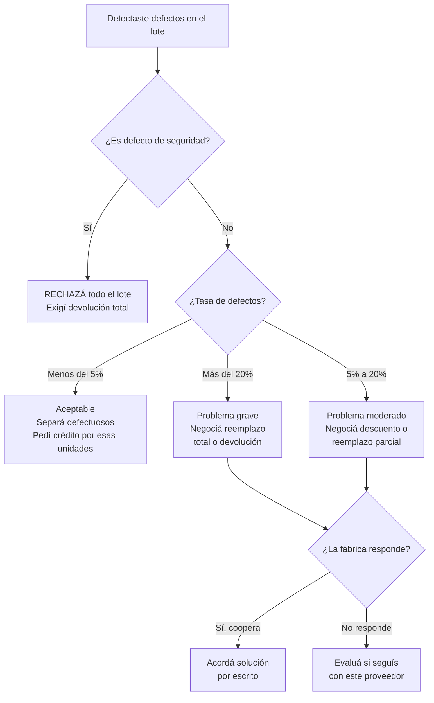

# Problemas de calidad en lote

> Abrís las cajas del pedido y algo no está bien: las costuras están torcidas, el color no coincide, hay piezas rotas. No entres en pánico. Hay un proceso claro para resolver esto y proteger tu inversión.

## Por qué pasan los problemas de calidad

Las fábricas argentinas, especialmente las pymes, pueden tener variaciones en la calidad por múltiples motivos:

- **Cambio de materia prima:** el insumo que usaban subió de precio y cambiaron a uno más barato
- **Personal nuevo:** un operario experimentado se fue y lo reemplazó alguien sin experiencia
- **Presión de producción:** tu pedido se hizo apurado para cumplir el plazo
- **Falta de control interno:** muchas fábricas chicas no tienen un proceso formal de control de calidad
- **Desgaste de maquinaria:** las máquinas se descalibran con el uso

<Note>
Los problemas de calidad no siempre son intencionales ni indican mala fe del proveedor. Muchas veces son errores operativos que se pueden resolver si los manejás profesionalmente.
</Note>

## Paso a paso: cómo manejar un lote con defectos

<Steps>
  <Step title="Documentá todo inmediatamente">
    Apenas detectés un defecto, **sacá fotos y videos** de cada producto con problemas. Incluí:
    - Tomas generales del producto mostrando el defecto
    - Primeros planos del defecto específico
    - Comparación lado a lado con la muestra aprobada o una unidad buena
    - Video mostrando defectos funcionales (si el producto no funciona)
    - Fotos del embalaje y etiquetas del lote

    **Regla:** si no lo documentaste, no pasó. Sin evidencia fotográfica, tu reclamo pierde fuerza.
  </Step>
  <Step title="Cuantificá la tasa de defectos">
    Revisá un mínimo del 20% del lote y contá los defectuosos. Calculá el porcentaje:

    **Tasa de defectos = (unidades defectuosas / unidades revisadas) x 100**

    Ejemplo: revisaste 50 de 200 unidades y encontraste 8 defectuosas = 16% de tasa de defectos.
  </Step>
  <Step title="Clasificá la severidad">
    No todos los defectos son iguales. Usá la tabla de severidad que aparece más abajo para determinar qué tipo de defecto tenés y qué acción corresponde.
  </Step>
  <Step title="Contactá a la fábrica con evidencia">
    Enviá un email o WhatsApp (con respaldo escrito) incluyendo:
    - Fotos y videos de los defectos
    - Cantidad de defectuosos encontrados sobre total revisado
    - Referencia a la muestra aprobada
    - Tu propuesta de resolución (qué esperás que hagan)

    **Tono:** profesional y orientado a soluciones. No acuses de estafa ni amenaces. La mayoría de las fábricas quieren resolver porque dependen de clientes recurrentes.
  </Step>
  <Step title="Negociá la resolución">
    Las opciones de resolución más comunes son: reemplazo de unidades defectuosas, nota de crédito para el próximo pedido, descuento parcial en este pedido o devolución completa del lote. Elegí la que más te convenga según la severidad y tu relación con el proveedor.
  </Step>
</Steps>

## Niveles de severidad de defectos

| Nivel | Tipo | Ejemplos | Tasa aceptable | Acción recomendada |
|-------|------|----------|---------------|-------------------|
| **Leve** | Cosmético menor | Pequeñas diferencias de tono, empaque levemente dañado | Hasta 5% | Aceptable, vendé con descuento mínimo |
| **Moderado** | Cosmético visible | Costuras torcidas, etiquetas mal puestas, rayones visibles | Hasta 3% | Pedí reemplazo o crédito por defectuosos |
| **Grave** | Funcional | No funciona, se rompe fácilmente, piezas faltantes | 0% aceptable | Reclamá reemplazo total o devolución |
| **Crítico** | Seguridad | Riesgo de lesión, materiales tóxicos, bordes cortantes | 0% aceptable | Rechazá todo el lote, no vendas |

<Warning>
**Nunca vendas productos con defectos de seguridad (nivel crítico).** Si un comprador se lastima con un producto que vendiste sabiendo que era defectuoso, sos legalmente responsable bajo la Ley de Defensa del Consumidor N.o 24.240. Las consecuencias incluyen demandas civiles, multas y responsabilidad penal.
</Warning>

## Árbol de decisión para defectos

## Acuerdo de calidad preventivo

Antes del primer pedido grande, acordá estos puntos con tu proveedor **por escrito** (email, WhatsApp o contrato):

| Punto | Qué definir | Ejemplo |
|-------|-------------|---------|
| Muestra de referencia | El estándar contra el que se mide el lote | "Muestra aprobada del 15/03/2026" |
| Tolerancia de defectos | Porcentaje máximo aceptable | "Máximo 3% de defectos cosméticos, 0% funcionales" |
| Método de inspección | Cómo se verificará | "Inspección al azar del 15% del lote al recibir" |
| Plazo de reclamo | Días para reclamar después de recibir | "Reclamos dentro de 7 días hábiles de recepción" |
| Resolución | Qué pasa si hay defectos | "Reemplazo de defectuosos en el siguiente pedido" |

<Tip>
No necesitás un contrato formal para esto. Un email donde vos proponés estas condiciones y el proveedor responde "de acuerdo" tiene validez como acuerdo entre partes. Guardá ese email.
</Tip>

## Checklist de inspección al recibir (10 puntos)

Usá esta lista cada vez que recibas mercadería:

| N.o | Punto de inspección | Herramienta | Tiempo |
|----|---------------------|-------------|--------|
| 1 | Cantidad de bultos coincide con remito | Conteo manual | 2 min |
| 2 | Estado del embalaje (sin humedad, golpes, roturas) | Visual | 2 min |
| 3 | Cantidad de unidades por bulto | Conteo manual | 5 min |
| 4 | Color y tono vs. muestra aprobada | Comparación visual | 3 min |
| 5 | Dimensiones y peso vs. especificación | Cinta métrica, balanza | 5 min |
| 6 | Terminación (costuras, rebabas, acabado) | Visual + tacto | 5 min |
| 7 | Etiquetas correctas y bien adheridas | Visual | 2 min |
| 8 | Funcionalidad (si aplica: que funcione, cierre, encienda) | Prueba manual | 5 min |
| 9 | Olor (no debe tener olor químico fuerte ni humedad) | Olfato | 1 min |
| 10 | Documentación completa (factura, remito, CAE válido) | Visual | 2 min |

**Tiempo total aproximado:** 30-40 minutos para un lote de 100-200 unidades (revisando muestra del 15%).

## Cuándo rechazar un lote completo

Rechazá todo el lote (no solo las unidades defectuosas) cuando:

- La tasa de defectos supera el 20% en la muestra
- Los defectos son funcionales o de seguridad
- El producto recibido no se parece a la muestra aprobada
- No tiene factura con CAE válido
- El embalaje sugiere mala manipulación generalizada (humedad, aplastamiento)

<Note>
Si rechazás un lote, hacelo **antes de firmar conformidad en el remito**. Anotá en el remito "Recibido con observaciones - lote rechazado por defectos" y sacá foto del remito anotado. Esto te protege legalmente.
</Note>

## Cálculo del impacto económico de los defectos

Para entender cuánto te cuestan los defectos y decidir si vale la pena reclamar:

**Costo del defecto = Tasa de defectos x Unidades totales x Costo unitario**

| Escenario | Unidades | Costo unitario | Tasa defectos | Pérdida |
|-----------|----------|---------------|---------------|---------|
| Lote chico | 100 | USD 3 (ARS 3.600) | 10% | USD 30 (ARS 36.000 aprox.) |
| Lote mediano | 300 | USD 5 (ARS 6.000) | 15% | USD 225 (ARS 270.000 aprox.) |
| Lote grande | 500 | USD 8 (ARS 9.600) | 20% | USD 800 (ARS 960.000 aprox.) |

<Warning>
Para lotes medianos y grandes, una tasa de defectos del 15-20% puede significar pérdidas de cientos de dólares. Siempre reclamá, no importa qué tan buena sea tu relación con el proveedor. Un proveedor serio va a entender y resolver.
</Warning>

## Prevenir problemas futuros

**Antes del pedido:**
- Pedí muestras de producción (no muestras "especiales")
- Visitá la fábrica durante un día de producción normal
- Preguntá qué control de calidad interno tienen

**Durante la producción:**
- Para pedidos grandes (más de USD 500), pedí fotos o video del lote terminado antes del envío
- Si podés, visitá la fábrica cuando tu pedido esté listo para despacho

**Al recibir:**
- Seguí el checklist de 10 puntos siempre, sin excepciones
- No firmes conformidad hasta haber revisado
- Documentá con fotos inclusive cuando todo está bien (te sirve como referencia)

<Tip>
Llevá un registro de la tasa de defectos de cada proveedor en una planilla simple. Si un proveedor empieza con 2% de defectos y en el tercer pedido tiene 10%, es una señal de alerta temprana que te permite actuar antes de que se convierta en un problema grave.
</Tip>
