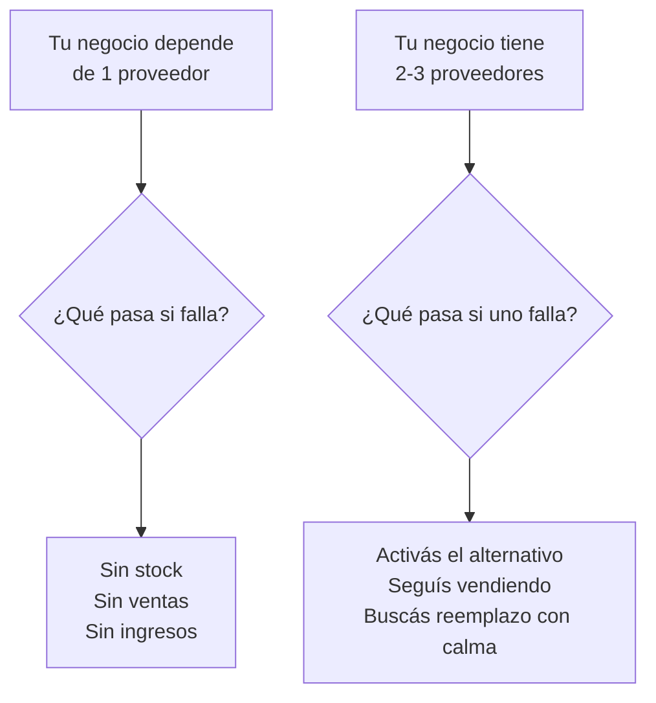
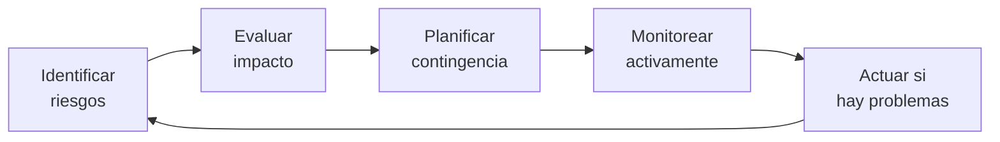

# Cuando el proveedor falla

> Tenés un proveedor que funciona perfecto. Un día te sube el precio 40% sin aviso, o te dice que ya no fabrica tu producto, o simplemente deja de responder. En Argentina esto pasa más seguido de lo que pensarías. La pregunta no es si va a pasar, sino cuándo.

## Fallas comunes de proveedores

Estos son los problemas más frecuentes que vas a enfrentar con fábricas argentinas:

| Problema | Frecuencia | Impacto en tu negocio |
|----------|------------|----------------------|
| Aumento de precios sin aviso | Muy frecuente (mensual en contexto inflacionario) | Reduce tu margen o te obliga a subir precios |
| Demoras en la entrega | Frecuente | Perdés ventas, caen tus métricas en ML |
| Dejan de fabricar tu producto | Ocasional | Te quedás sin stock de un producto clave |
| Aumentan el pedido mínimo | Ocasional | Necesitás más capital o perdés al proveedor |
| Baja gradual de calidad | Gradual, difícil de detectar | Más devoluciones, reviews negativas |
| Proveedor cierra o quiebra | Poco frecuente pero devastador | Perdés proveedor de golpe |

<Note>
En Argentina, la inflación hace que los aumentos de precio sean **normales y esperables**. El problema no es que suban los precios (eso pasa siempre), sino cuando lo hacen sin aviso, con porcentajes desproporcionados, o con condiciones que cambian unilateralmente.
</Note>

## Cómo manejar cada tipo de falla

<Tabs>
  <Tab title="Aumentos de precio">
    ### Cuando te suben los precios

    **Inmediatamente:**
    - Pedí la nueva lista de precios por escrito
    - Preguntá el motivo (materia prima, energía, salarios)
    - Compará el aumento con la inflación del período (si la inflación fue 5% y te suben 20%, hay un problema)

    **A mediano plazo:**
    - Renegociá: proponé un aumento gradual en lugar de un salto grande
    - Pedí mantener precio a cambio de mayor volumen o pago anticipado
    - Consultá con tus proveedores alternativos si tienen mejores precios

    **A largo plazo:**
    - Acordá un mecanismo de actualización de precios (por ejemplo, "ajuste mensual según índice de precios mayoristas")
    - Diversificá proveedores para no depender de los precios de uno solo

    **Margen de tolerancia:** Un aumento de hasta 5-10% mensual puede ser razonable en contexto inflacionario argentino. Más de eso amerita negociación.
  </Tab>
  <Tab title="Demoras en entrega">
    ### Cuando no entregan a tiempo

    **Inmediatamente:**
    - Contactá al proveedor y pedí nueva fecha firme
    - Documentá la demora por escrito (email o WhatsApp)
    - Evaluá si tenés stock suficiente para cubrir la demora

    **A mediano plazo:**
    - Si las demoras son recurrentes, empezá a pedir con más anticipación (sumá 1-2 semanas al plazo que te dan)
    - Tené stock de seguridad equivalente a 2 semanas de ventas

    **A largo plazo:**
    - Incluí penalidades por demora en tus acuerdos ("si demora más de X días, descuento de Y%")
    - Activá proveedor alternativo cuando la demora supere los 7 días

    **Impacto en ML:** Si vendés en MercadoLibre y no tenés stock, tus publicaciones bajan de posición. Una demora de 2 semanas puede costarte meses de posicionamiento.
  </Tab>
  <Tab title="Deja de fabricar">
    ### Cuando el proveedor deja de hacer tu producto

    **Inmediatamente:**
    - Preguntá si es temporal o definitivo
    - Pedí el último lote disponible si te conviene
    - Activá tu lista de proveedores alternativos

    **A mediano plazo:**
    - Buscá una fábrica que haga un producto equivalente
    - Considerá adaptar tu publicación a un producto similar
    - Liquidá gradualmente el stock restante si no vas a reponer

    **A largo plazo:**
    - Nunca tengas un solo producto que represente más del 30% de tus ingresos sin proveedor alternativo
  </Tab>
  <Tab title="Sube pedido mínimo">
    ### Cuando te exigen comprar más

    **Inmediatamente:**
    - Preguntá si hay flexibilidad o si es definitivo
    - Calculá si el nuevo mínimo encaja en tu presupuesto y rotación

    **A mediano plazo:**
    - Considerá asociarte con otro revendedor para compartir el pedido mínimo
    - Negociá: "puedo alcanzar ese mínimo si me das mejor precio"

    **A largo plazo:**
    - Si tu negocio crece, el mínimo va a dejar de ser problema
    - Si no podés alcanzar el mínimo, buscá un proveedor más chico que trabaje con volúmenes menores
  </Tab>
</Tabs>

## La regla de oro: nunca dependas de un solo proveedor

<Warning>
Si dependés de un solo proveedor para tu producto principal, tu negocio tiene un **punto único de falla**. No importa qué tan buena sea la relación: un incendio en la fábrica, una quiebra, un problema personal del dueño, pueden dejarte sin mercadería de un día para el otro.
</Warning>

### Cómo mantener un pipeline de proveedores

| Acción | Frecuencia | Costo | Beneficio |
|--------|-----------|-------|-----------|
| Visitar ferias industriales (FIAR, ferias sectoriales) | 2-3 veces al año | Entrada gratuita o ARS 2.000 - 10.000 aprox. | Conocés fábricas nuevas |
| Buscar en directorios industriales | Mensual | Gratis | Identificás alternativas |
| Mantener contacto con proveedores de respaldo | Trimestral | Gratis (un WhatsApp cada 3 meses) | Sabés que siguen activos |
| Hacer pedido de prueba a proveedor nuevo | Trimestral | USD 25-50 aprox. (ARS 30.000-60.000) | Validás calidad y tiempos |
| Pedir listas de precios actualizadas | Mensual | Gratis | Monitoreás competitividad |

## Plan de contingencia en 5 pasos

<Steps>
  <Step title="Identificá tus productos críticos">
    Hacé una lista de tus 3-5 productos que generan más ingresos (tus productos "A" de la clasificación ABC). Estos son los que necesitan respaldo urgente.
  </Step>
  <Step title="Buscá al menos 2 proveedores alternativos por producto crítico">
    No necesitás comprarles regularmente. Solo necesitás saber que existen, qué precios manejan, y que podés activarlos si tu proveedor principal falla. Guardá contactos, listas de precios y muestras.
  </Step>
  <Step title="Tené stock de seguridad">
    Para tus productos estrella, mantené stock para 2-3 semanas de ventas como mínimo. Sí, esto inmoviliza capital, pero es tu seguro contra quiebres de stock.

    **Costo aproximado del stock de seguridad:** si vendés 10 unidades/semana a USD 5 de costo, tu stock de seguridad de 3 semanas cuesta USD 150 (ARS 180.000 aproximado).
  </Step>
  <Step title="Diversificá tu catálogo">
    No pongas todos los huevos en una canasta. Si tenés 10 productos de 3 proveedores diferentes, la caída de un proveedor afecta solo una parte de tu negocio.
  </Step>
  <Step title="Revisá tu plan cada 3 meses">
    ¿Tus proveedores alternativos siguen activos? ¿Los precios siguen siendo competitivos? ¿Hay nuevas opciones que no conocías? Actualizá tu lista trimestralmente.
  </Step>
</Steps>

## Ciclo de gestión de riesgo de proveedores

## Protecciones contractuales

Si tu relación con un proveedor es estable y movés volumen, considerá formalizar algunos puntos:

| Protección | Qué cubre | Cómo implementar |
|-----------|-----------|-----------------|
| Lista de precios con vigencia | Evita aumentos sorpresivos | "Precios válidos por 30 días desde emisión" |
| Plazo de entrega con penalidad | Protege contra demoras | "Entrega en 15 días hábiles, 5% descuento por cada semana de demora" |
| Garantía de calidad | Establece estándar mínimo | "Máximo 3% defectos, reposición gratuita de defectuosos" |
| Aviso previo de discontinuación | Te da tiempo para buscar alternativa | "Aviso de 60 días antes de discontinuar un producto" |

<Note>
En Argentina, los contratos escritos entre empresas tienen fuerza legal, pero hacerlos cumplir puede ser lento y costoso (juicio comercial). La mejor protección sigue siendo tener alternativas y no depender de un solo proveedor.
</Note>

## La trampa emocional de la lealtad

<Accordion title="¿Por qué cuesta tanto cambiar de proveedor?">
Es normal desarrollar una relación personal con tu proveedor. Te conoce, te da facilidades, te guarda mercadería. Pero cuando la calidad baja, los precios suben injustificadamente o las demoras son constantes, la lealtad te juega en contra.

**Señales de que tu lealtad te está costando plata:**
- Seguís comprando a un proveedor que te da 10% más caro que la competencia "porque es buena gente"
- Aceptás demoras de 2-3 semanas como "normales" cuando otros entregan en 1 semana
- No reclamás defectos "para no molestar"
- No cotizás con otros porque "ya tengo mi proveedor de confianza"

Tener buena relación con un proveedor es valioso. Pero tu negocio depende de márgenes, tiempos y calidad, no de relaciones personales. Un proveedor profesional entiende que cotices con otros y te va a cuidar más si sabe que tenés alternativas.
</Accordion>

<Accordion title="¿Cómo comunicar que estás evaluando otros proveedores?">
No tenés que ocultarlo ni hacerlo conflictivo. Frases útiles:

- "Estoy ampliando mi cartera de proveedores para crecer, pero vos seguís siendo mi proveedor principal"
- "Necesito tener un respaldo para los momentos en que no podés cubrir mi demanda"
- "Quiero comparar opciones para asegurarme de que seguimos siendo competitivos los dos"

Un proveedor maduro lo va a entender. Si se ofende, es una señal de que depende demasiado de vos (lo cual es riesgoso para ambos).
</Accordion>

<Tip>
Llevá un registro simple de cada proveedor: fecha de último pedido, tasa de defectos, cumplimiento de plazos, historial de precios. No necesitás un software: una planilla de Google Sheets alcanza. Este registro te permite tomar decisiones basadas en datos, no en emociones.
</Tip>
