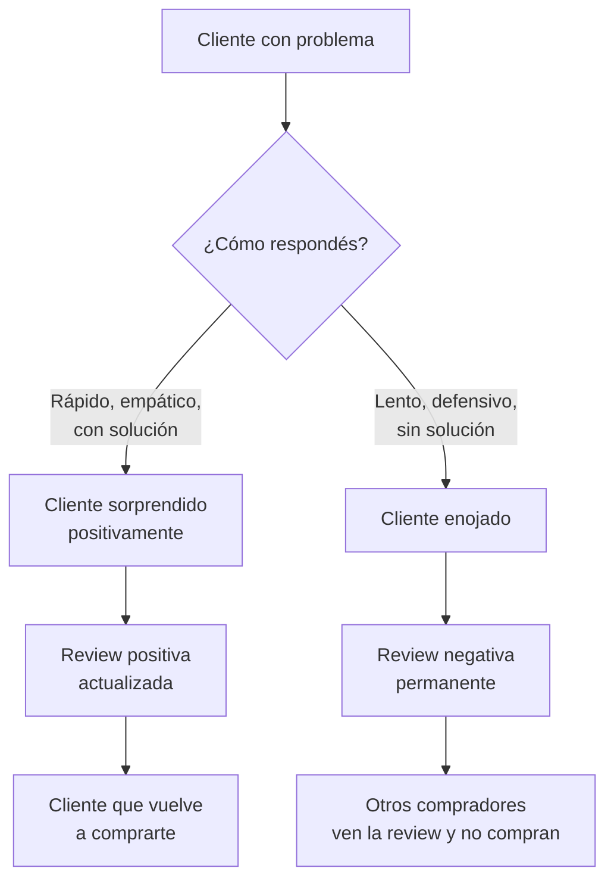

# Reclamos, devoluciones y reviews negativas

> Una review negativa no es el fin del mundo. Una devolución no es una tragedia. Lo que sí puede destruir tu negocio es **no saber manejarlos**. En esta guía aprendés el proceso completo para que cada problema se convierta en una oportunidad de fidelizar.

## La realidad de las devoluciones

Las devoluciones son parte normal de vender online. No las podés eliminar, pero sí reducirlas y manejarlas bien.

### Tasas de devolución por rubro (referencias aproximadas)

| Rubro | Tasa de devolución aproximada | Principal motivo |
|-------|------------------------------|-----------------|
| Bijouterie y accesorios | 3-5% | No era lo que esperaban del color/tamaño |
| Ropa para mascotas | 8-12% | Problemas de talle |
| Electrónica/gadgets | 5-8% | Defectos o no funciona como esperaban |
| Decoración/hogar | 3-6% | Diferencia entre foto y producto real |
| Herramientas | 2-4% | Defectos de funcionamiento |
| Cosmética/cuidado personal | 2-3% | Reacciones alérgicas, no les gustó |

<Note>
Si tu tasa de devolución está dentro de estos rangos, es normal. Si está muy por encima, tenés un problema de producto, de publicación o de empaque que necesitás resolver.
</Note>

## Proceso de reclamos en MercadoLibre

<Steps>
  <Step title="El comprador abre un reclamo">
    El comprador tiene hasta 30 días después de la entrega para abrir un reclamo en ML. Cuando lo hace, recibís una notificación por email y en tu panel de vendedor. Los motivos más comunes son: "El producto es diferente al publicado", "Tiene un defecto" o "No funciona".
  </Step>
  <Step title="Tenés 2-3 días hábiles para responder">
    ML te da un plazo para responder al reclamo. Este plazo es estricto. Si no respondés dentro del plazo, ML resuelve automáticamente a favor del comprador, te cobran el reembolso y te penalizan la reputación.

    **Regla de oro:** respondé siempre dentro de las primeras 24 horas, aunque sea para decir "estoy revisando tu caso".
  </Step>
  <Step title="Proponé una solución">
    Tenés tres opciones dentro de ML:
    - **Reembolso total:** devolvés el dinero, el comprador devuelve (o no) el producto
    - **Reembolso parcial:** acordás un descuento y el comprador se queda con el producto
    - **Envío de reemplazo:** mandás otra unidad (solo si tenés stock)

    ML te guía por estas opciones dentro de la plataforma.
  </Step>
  <Step title="Si no hay acuerdo, ML interviene como mediador">
    Si vos y el comprador no llegan a un acuerdo, ML evalúa la evidencia de ambas partes y toma una decisión. ML generalmente favorece al comprador si no tenés evidencia clara de que el producto estaba en condiciones.
  </Step>
  <Step title="Se cierra el reclamo y se califica">
    El resultado impacta en tu reputación como vendedor. Los reclamos cerrados sin acuerdo o a favor del comprador bajan tus métricas de vendedor.
  </Step>
</Steps>

## Cómo minimizar las devoluciones

La mejor estrategia contra las devoluciones es **prevenirlas**. La mayoría se deben a expectativas no cumplidas:

### Mejorá tus publicaciones

| Elemento | Qué mejorar | Impacto en devoluciones |
|----------|-------------|----------------------|
| Fotos | Mínimo 6 fotos: frente, dorso, detalle, escala (junto a objeto conocido), producto en uso, empaque | Reduce "no era lo que esperaba" |
| Descripción | Incluí medidas exactas, peso, material, instrucciones de uso | Reduce "no me sirve el tamaño" |
| Título | Especificá modelo, tamaño, color si hay variantes | Reduce compras equivocadas |
| Tabla de talles | Si vendés ropa o accesorios, incluí tabla con medidas en cm | Reduce devoluciones por talle (principal causa en ropa) |
| Preguntas frecuentes | Respondé las 5-10 preguntas más comunes en la descripción | Reduce consultas y compras erróneas |

### Mejorá tu empaque

| Problema | Solución | Costo aproximado |
|----------|----------|-----------------|
| Producto llega roto | Relleno con papel burbuja o kraft | ARS 50-150 por envío aprox. |
| Caja aplastada | Usá caja rígida, no sobre | ARS 100-300 por caja aprox. |
| Producto llega sucio | Bolsa individual dentro de la caja | ARS 20-50 por bolsa aprox. |
| Sin instrucciones | Incluí tarjeta con instrucciones de uso y cuidado | ARS 15-40 por tarjeta aprox. |

<Tip>
Incluir una tarjeta dentro del paquete que diga "Gracias por tu compra. Si tenés algún problema, contactanos antes de abrir un reclamo" con tu teléfono de ML reduce significativamente los reclamos formales. Muchos compradores prefieren resolver directo antes de hacer el trámite en ML.
</Tip>

## Ley de Defensa del Consumidor (Ley 24.240)

Lo que necesitás saber como vendedor online en Argentina:

| Derecho del consumidor | Qué significa para vos | Plazo |
|----------------------|----------------------|-------|
| **Derecho de arrepentimiento** | El comprador puede devolver el producto sin dar motivo | 10 días corridos desde la entrega |
| **Garantía legal** | Debés garantizar que el producto funciona correctamente | 6 meses para productos nuevos |
| **Botón de arrepentimiento** | Tu tienda online debe tener un botón visible para iniciar devoluciones | Permanente |
| **Información clara** | Debés informar precio, características y condiciones de forma clara | Al momento de la publicación |

<Warning>
El derecho de arrepentimiento en compras online es **irrenunciable**. No podés poner "no se aceptan devoluciones" en tu publicación. Si lo hacés, no tiene validez legal y además ML te puede penalizar.
</Warning>

## Cómo manejar reviews negativas

### Lo que NUNCA debés hacer

- Discutir públicamente con el comprador
- Insultar o ser sarcástico
- Negar el problema sin evidencia
- Ignorar la review (dejar sin responder)
- Amenazar con acciones legales

### Lo que SÍ debés hacer

Respondé siempre de forma empática, profesional y orientada a soluciones.

<Accordion title="Plantilla: Producto llegó dañado">
"Lamentamos mucho que el producto haya llegado en malas condiciones. Nos tomamos muy en serio la calidad del empaque y queremos resolver esto. Te pedimos que nos contactes por la mensajería de MercadoLibre para coordinar el reemplazo o reembolso. Queremos que quedes conforme."
</Accordion>

<Accordion title="Plantilla: No era lo que esperaba">
"Entendemos tu frustración. Nuestro objetivo es que cada compra sea satisfactoria. Si el producto no cumplió tus expectativas, contactanos por la mensajería de ML y buscamos la mejor solución para vos. Tenés derecho a devolución dentro de los 10 días."
</Accordion>

<Accordion title="Plantilla: Problema de talle/medida">
"Gracias por avisarnos. Sabemos que las medidas pueden variar y entendemos la molestia. Contactanos por la mensajería de ML para coordinar el cambio por el talle correcto sin costo adicional."
</Accordion>

<Accordion title="Plantilla: Demora en el envío">
"Lamentamos la demora en la entrega. Sabemos lo importante que es recibir tu compra a tiempo. El envío fue despachado el [fecha] con el código de seguimiento [código]. Si necesitás más información, contactanos por ML y te ayudamos a hacer el seguimiento."
</Accordion>

<Accordion title="Plantilla: Comprador insatisfecho sin motivo específico">
"Lamentamos que tu experiencia no haya sido la esperada. Nos importa tu satisfacción y queremos entender qué podemos mejorar. Te pedimos que nos escribas por la mensajería de ML para buscar una solución juntos."
</Accordion>

## Presupuestá las devoluciones

Las devoluciones son un costo del negocio. Si no las presupuestás, te van a sorprender y desestabilizar tu flujo de caja.

| Concepto | Porcentaje de ventas | Ejemplo mensual (ventas de USD 2.000 / ARS 2.400.000 aprox.) |
|----------|---------------------|-------------------------------------------------------------|
| Reembolsos por devoluciones | 2-5% | USD 40-100 (ARS 48.000-120.000 aprox.) |
| Costo de envío de devolución | 0.5-1% | USD 10-20 (ARS 12.000-24.000 aprox.) |
| Producto devuelto no revendible | 0.5-2% | USD 10-40 (ARS 12.000-48.000 aprox.) |
| **Total costo devoluciones** | **3-8%** | **USD 60-160 (ARS 72.000-192.000 aprox.)** |

<Note>
Incluí este costo en tu cálculo de margen desde el principio. Si tu margen bruto es 40% y las devoluciones te cuestan 5%, tu margen real es 35%. Si no lo contemplás, vas a pensar que ganás más de lo que realmente ganás.
</Note>

## Convertir un cliente insatisfecho en cliente fiel

<Tip>
Estudios de mercado muestran que un cliente cuyo problema fue resuelto satisfactoriamente tiene mayor probabilidad de volver a comprar que un cliente que nunca tuvo problemas. Cada reclamo es una oportunidad disfrazada de problema.
</Tip>

## Cuándo escalar a soporte de ML

Escalá a soporte de MercadoLibre cuando:

- El comprador cometió fraude (dice que no recibió pero el tracking muestra entrega)
- Te devolvieron un producto diferente al que vendiste
- El comprador te extorsiona ("si no me das descuento, te pongo review negativa")
- El reclamo es abusivo o de mala fe

**Cómo escalar:**
1. Ingresá al reclamo desde tu panel de vendedor
2. Seleccioná "No estoy de acuerdo con el reclamo"
3. Adjuntá toda la evidencia: video de empaque, tracking, capturas de conversación dentro de ML
4. Describí la situación de forma clara y factual (sin emociones)
5. Esperá la resolución de ML (puede tomar 5-15 días hábiles)

<Warning>
**Nunca** amenaces al comprador con acciones legales dentro de ML. Esto viola las políticas de la plataforma y te puede traer penalidades a vos. Si realmente necesitás recurrir a la vía legal, hacelo fuera de ML con un abogado.
</Warning>

## Métricas clave para monitorear

Revisá estas métricas mensualmente en tu panel de vendedor de ML:

| Métrica | Nivel saludable | Señal de alarma |
|---------|----------------|----------------|
| Tasa de reclamos | Menos del 3% de ventas | Más del 5% de ventas |
| Tiempo de respuesta a reclamos | Menos de 12 horas | Más de 24 horas |
| Reclamos resueltos a tu favor | Más del 60% | Menos del 40% |
| Calificaciones negativas | Menos del 2% | Más del 5% |
| Tasa de devolución | Dentro de los rangos por rubro (ver tabla arriba) | Significativamente por encima |
