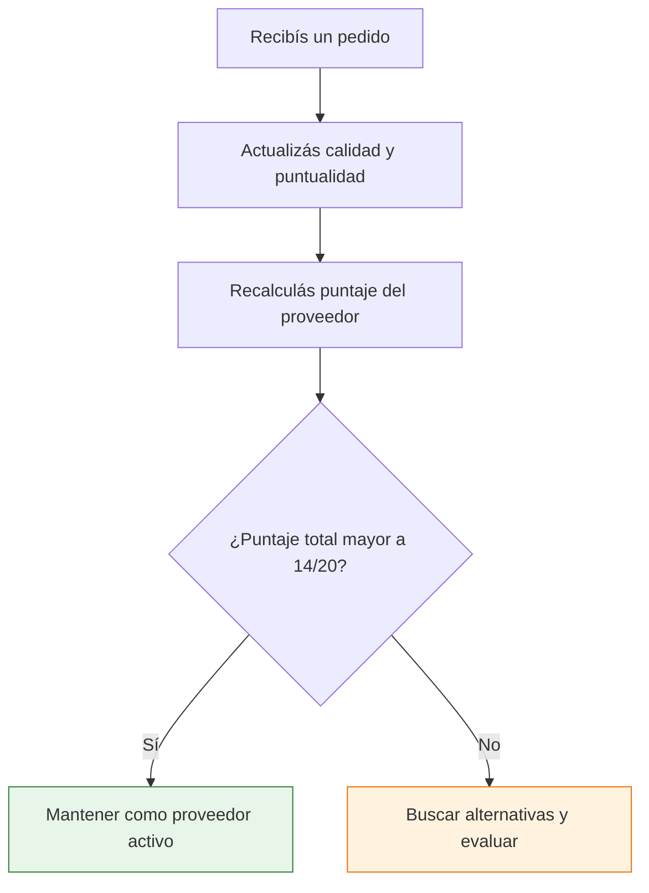

# Registro y gestión de proveedores

> Cuando tenés un solo proveedor, te lo acordás de memoria. Cuando tenés cinco, empezás a confundir precios. Cuando tenés diez, sin un registro organizado perdés tiempo, plata y oportunidades. Armá tu base de datos desde el día uno.

## Por qué mantener un registro de proveedores

Un registro organizado de proveedores es una de las herramientas más valiosas de tu negocio:

| Beneficio | Ejemplo concreto |
|-----------|-----------------|
| **Comparar proveedores** | ¿Quién tiene mejor precio para el mismo producto? |
| **Trackear compras** | ¿Cuánto compré este trimestre a cada fábrica? |
| **Identificar los mejores** | ¿Quién entrega siempre a tiempo y con buena calidad? |
| **No perder contactos** | El teléfono del vendedor que me atendió bien hace 6 meses |
| **Negociar con datos** | "En mis últimos 5 pedidos gastamos ARS X, necesito mejor precio" |
| **Detectar problemas** | La calidad de esta fábrica bajó en los últimos 3 pedidos |

## Qué datos registrar por proveedor

Cada proveedor en tu base de datos debería tener estos campos:

**Datos básicos:**
| Campo | Ejemplo |
|-------|---------|
| Nombre / Razón social | Textiles San Martín S.R.L. |
| CUIT | 30-12345678-9 |
| Rubro | Textil / Indumentaria |
| Dirección | Av. Rivadavia 1234, CABA |
| Contacto principal | María López |
| Teléfono | 11-2345-6789 |
| Email | ventas@textilessanmartin.com.ar |
| WhatsApp | 11-2345-6789 |

**Datos comerciales:**
| Campo | Ejemplo |
|-------|---------|
| Productos que ofrece | Remeras algodón, buzos, pantalones |
| Precio por unidad (referencia) | Remera: ARS 3,500 / Buzo: ARS 8,000 |
| Pedido mínimo (MOQ) | 50 unidades por modelo |
| Lead time (tiempo de entrega) | 10-15 días hábiles |
| Condición de pago | 50% anticipado, 50% contra entrega |
| Tipo de factura | A (Responsable Inscripto) |

**Datos de evaluación:**
| Campo | Ejemplo |
|-------|---------|
| Calidad del producto (1-5) | 4 |
| Puntualidad en entregas (1-5) | 3 |
| Comunicación (1-5) | 5 |
| Relación precio/calidad (1-5) | 4 |
| Puntaje total | 16/20 |
| Notas | Buena calidad pero se atrasa en entregas grandes |

## Sistema de calificación de proveedores

Usá un sistema simple de 1 a 5 en cuatro criterios:

| Puntaje | Significado |
|---------|-------------|
| **5** | Excelente, supera expectativas |
| **4** | Muy bueno, cumple siempre |
| **3** | Aceptable, cumple la mayoría de las veces |
| **2** | Regular, tiene problemas frecuentes |
| **1** | Malo, no cumple con lo acordado |

**Los 4 criterios de evaluación:**

<Tabs>
  <Tab title="Calidad">
    ¿El producto llega como fue acordado? ¿Coincide con la muestra? ¿Porcentaje de defectos bajo?

    - **5**: Cero defectos, calidad consistente
    - **4**: Menos del 2% defectos
    - **3**: Entre 2% y 5% defectos
    - **2**: Más del 5% defectos
    - **1**: Calidad inaceptable repetidamente
  </Tab>
  <Tab title="Puntualidad">
    ¿Entrega en la fecha acordada? ¿Avisa con anticipación si hay demoras?

    - **5**: Siempre a tiempo o antes
    - **4**: A tiempo el 90% de las veces
    - **3**: Atraso de 1-3 días frecuente
    - **2**: Atrasos de más de una semana
    - **1**: Incumple plazos constantemente
  </Tab>
  <Tab title="Precio">
    ¿El precio es competitivo comparado con alternativas? ¿Ofrece descuentos por volumen?

    - **5**: Mejor precio del mercado con buena calidad
    - **4**: Precio competitivo
    - **3**: Precio promedio del mercado
    - **2**: Precio por encima del promedio sin justificación
    - **1**: Muy caro para la calidad ofrecida
  </Tab>
  <Tab title="Comunicación">
    ¿Responde rápido? ¿Es claro en la información? ¿Resuelve problemas?

    - **5**: Responde el mismo día, proactivo con información
    - **4**: Responde en 24-48 horas, buena comunicación
    - **3**: A veces tarda, pero responde
    - **2**: Difícil de contactar, información confusa
    - **1**: No responde o es muy difícil comunicarse
  </Tab>
</Tabs>

## Herramientas: empezá con lo simple

No necesitás software caro ni sistemas complicados. Una planilla de cálculo es más que suficiente para empezar:

| Herramienta | Costo | Ideal para |
|-------------|-------|------------|
| **Google Sheets** | Gratis | Acceso desde cualquier dispositivo, compartir con socio |
| **Excel** | Incluido en Office | Si ya lo tenés, funciona perfecto |
| **Notion** | Gratis (plan personal) | Si te gusta organizar visualmente |
| **Airtable** | Gratis (plan básico) | Base de datos visual sin saber programar |

<Tip>
**Google Sheets es la mejor opción para empezar** porque es gratis, accedés desde el celular, podés compartirlo con tu socio o contador, y tiene filtros y ordenamiento que te permiten comparar proveedores fácilmente.
</Tip>

## Plantilla de registro

Armá tu planilla con estas columnas como mínimo:

| Nombre | CUIT | Rubro | Producto | Precio/u | MOQ | Lead time | Calidad (1-5) | Puntualidad (1-5) | Cond. pago | Contacto | Notas |
|--------|------|-------|----------|----------|-----|-----------|---------------|--------------------|------------|----------|-------|
| Textiles SM | 30-123-9 | Textil | Remeras | $3,500 | 50 | 15 días | 4 | 3 | 50/50 | María 11-2345 | Buena calidad |
| Plásticos JR | 20-456-1 | Plástico | Envases | $800 | 200 | 10 días | 5 | 5 | Contado | Juan 11-6789 | Excelente |

## Cuándo actualizar el registro

<Steps>
  <Step title="Después de cada pedido">
    Actualizá calidad, puntualidad y cualquier cambio de precio. Anotá si hubo problemas y cómo se resolvieron.
  </Step>
  <Step title="Cuando recibís cotizaciones nuevas">
    Actualizá los precios de referencia. En Argentina con inflación, los precios cambian frecuentemente. Anotá la fecha de la última cotización.
  </Step>
  <Step title="Cuando agregás un proveedor nuevo">
    Completá todos los datos básicos y comerciales. Ponele puntaje inicial basado en la primera impresión y ajustá después de la primera compra.
  </Step>
  <Step title="Revisión trimestral">
    Cada 3 meses revisá tu registro completo: ¿algún proveedor mejoró o empeoró? ¿Los precios siguen siendo competitivos? ¿Necesitás buscar alternativas?
  </Step>
</Steps>

## Cómo usar los datos para decidir mejor

Tu registro de proveedores no es solo un archivo para guardar: es una herramienta de decisión.

**Usos prácticos:**

- **Comparar antes de comprar**: Filtrá proveedores del mismo rubro y ordená por puntaje para elegir al mejor
- **Negociar con datos**: "En mis registros tengo otro proveedor del mismo producto a 10% menos" (sin mentir)
- **Detectar tendencias**: Si la calidad de un proveedor baja en 3 pedidos seguidos, es momento de hablar o buscar alternativa
- **Planificar compras**: Sabiendo el lead time de cada proveedor, podés planificar pedidos con anticipación
- **Escalar eficientemente**: Cuando crezcas, ya tenés toda la información para elegir a quién darle más volumen

## Evolución del registro

A medida que tu negocio crece, tu registro evoluciona:

| Etapa del negocio | Nivel del registro | Herramienta |
|-------------------|--------------------|-------------|
| Empezando (1-3 proveedores) | Planilla básica con datos de contacto y precios | Google Sheets |
| Creciendo (4-10 proveedores) | Planilla con scoring y historial de compras | Google Sheets / Airtable |
| Consolidado (10+ proveedores) | Base de datos con reportes y análisis | Airtable / CRM básico |
| Importando (Paso 2) | Sistema de gestión de proveedores internacionales | CRM / Software especializado |

<Note>
Este mismo registro de proveedores que armás hoy para fábricas argentinas evoluciona en tu base de datos de proveedores para cuando des el salto a la importación internacional. Las habilidades de organización y evaluación que desarrollás ahora son exactamente las que vas a necesitar cuando trabajes con fábricas en China, Brasil o cualquier otro país.
</Note>

<Warning>
Un registro desactualizado es peor que no tener registro, porque te da información falsa. Si no vas a mantenerlo al día, al menos actualizá los datos de contacto y precios después de cada compra. Eso solo te toma 5 minutos.
</Warning>

<Tip>
Mantener este registro actualizado es una de las herramientas más valiosas que vas a tener cuando tu negocio crezca. Dedicale 10 minutos después de cada pedido para actualizarlo. Tu yo del futuro te lo va a agradecer.
</Tip>
