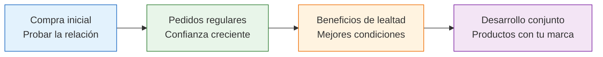

# Construir relaciones a largo plazo

> En Argentina, los negocios se construyen sobre relaciones personales. Un buen proveedor no es solo alguien que te vende productos: es un socio estratégico que puede hacer la diferencia entre un negocio mediocre y uno exitoso.

## Por qué las relaciones a largo plazo importan

Cambiar de proveedor constantemente es caro y riesgoso. Una relación sólida con una fábrica te da ventajas que no conseguís de otra forma:

| Beneficio | Qué significa en la práctica |
|-----------|------------------------------|
| **Mejores precios** | Descuentos progresivos por volumen y lealtad |
| **Prioridad en producción** | Cuando hay demanda alta, tu pedido se atiende primero |
| **Acceso a nuevos productos** | Te avisan antes que a otros cuando sacan algo nuevo |
| **Flexibilidad** | Plazos de entrega más ajustados, cambios de último momento |
| **Crédito** | Posibilidad de pagar a 30-60 días en lugar de por adelantado |
| **Personalización** | Packaging con tu marca, modificaciones de producto |

## Cómo construir confianza

La confianza se construye con acciones consistentes, no con promesas:

<Steps>
  <Step title="Pagá siempre en tiempo y forma">
    Nada destruye más rápido una relación comercial que pagar tarde. Si prometiste pagar un martes, pagá el martes. Si tenés un problema de cash flow, avisá con anticipación y proponé un plan.
  </Step>
  <Step title="Comunicá de forma clara y respetuosa">
    Sé específico en tus pedidos. No asumas que la fábrica sabe lo que querés. Confirmá todo por escrito y respondé mensajes en tiempo razonable.
  </Step>
  <Step title="Dá feedback constructivo">
    Si algo no estuvo bien, decilo de forma profesional: "Las últimas 30 unidades tenían una costura irregular en la manga izquierda" es mejor que "Mandaron cualquier cosa".
  </Step>
  <Step title="Reconocé el buen trabajo">
    Cuando un pedido sale perfecto, decilo. Un simple "Excelente calidad en este lote, gracias" genera buena voluntad.
  </Step>
  <Step title="Sé previsible">
    Intentá hacer pedidos regulares y de tamaño similar. La fábrica puede planificar mejor y vos recibís un servicio más consistente.
  </Step>
</Steps>

## Progresión natural de la relación

Una relación comercial con una fábrica evoluciona por etapas:

| Etapa | Tiempo típico | Qué esperás | Qué das |
|-------|--------------|-------------|---------|
| **Prueba** | 1-2 compras | Calidad y cumplimiento | Pago puntual, pedido mínimo |
| **Regularidad** | 3-6 meses | Consistencia, respuesta a problemas | Pedidos predecibles, lealtad |
| **Lealtad** | 6-12 meses | Descuentos, crédito, prioridad | Volumen creciente, referidos |
| **Sociedad** | 1+ año | Productos personalizados, exclusividad | Compromiso de volumen, colaboración |

## Beneficios concretos de la lealtad

Después de 6-12 meses de relación consistente, podés negociar:

- **Descuentos progresivos**: 5-15% de descuento sobre precio de lista según volumen y antigüedad
- **Crédito**: Pagar a 15, 30 o 60 días después de recibir la mercadería
- **Producción personalizada**: Productos con tus especificaciones, colores, medidas
- **Packaging con tu marca**: Etiquetas, cajas, bolsas con tu logo
- **Acceso prioritario**: Cuando hay escasez o alta demanda, tus pedidos se priorizan
- **Desarrollo de producto**: Crear un producto nuevo en conjunto para tu mercado

<Tip>
Un buen proveedor es como un socio. Invertir en la relación, conocer su negocio y sus desafíos, te posiciona como un cliente que vale la pena cuidar. Preguntá cómo les va, si tienen novedades, visitá la fábrica de vez en cuando.
</Tip>

## Cómo manejar conflictos

Los conflictos van a aparecer. Lo que importa es cómo los manejás:

**Reglas básicas:**

1. **Comunicá rápido**: No dejes que un problema se pudra. Cuanto antes lo hables, más fácil es resolverlo
2. **Sé específico**: "Recibí 12 unidades defectuosas de 200" es mejor que "Vino todo mal"
3. **Proponé soluciones**: No solo presentes el problema, ofrecé alternativas: "Podrían reponer las 12 unidades defectuosas, o darnos un crédito para el próximo pedido"
4. **No culpes**: Usá lenguaje neutro. "Encontramos un problema con el lote" en lugar de "Nos mandaron mercadería de mala calidad"
5. **Documentá todo**: Emails, fotos, números. La evidencia objetiva resuelve disputas más rápido que las opiniones

<Accordion title="Conflicto: mercadería llega tarde">
**Situación:** El pedido tenía que llegar hace 5 días y no hay novedades.

**Qué hacer:**
- Contactá a la fábrica y preguntá el estado (sin acusar)
- Pedí una nueva fecha de entrega firme
- Si el atraso te afecta las ventas, comunicalo para que entiendan la urgencia
- Para futuros pedidos, agregá un margen de 5-7 días a la fecha prometida
</Accordion>

<Accordion title="Conflicto: calidad inferior a lo habitual">
**Situación:** El último lote tiene más defectos de lo normal.

**Qué hacer:**
- Documentá los defectos con fotos y conteo
- Compará contra la muestra de referencia y lotes anteriores
- Preguntá si hubo cambios en materiales o proceso productivo
- Negociá descuento o reposición según la gravedad
</Accordion>

<Accordion title="Conflicto: aumento de precios sin aviso">
**Situación:** Te mandan la cotización del nuevo pedido con un aumento del 20%.

**Qué hacer:**
- Pedí explicación del aumento (costos de materia prima, inflación, etc.)
- Compará con otros proveedores para validar si el aumento es razonable
- Negociá: aumento parcial, gradual, o mantenimiento de precio por volumen
- Si es injustificado, es una señal de alerta para buscar alternativas
</Accordion>

## Cuándo cambiar de fábrica

No todas las relaciones funcionan. Estas son señales de que es momento de buscar alternativas:

- **Calidad consistentemente mala** a pesar de reclamos repetidos
- **Incumplimiento de plazos** como norma, no como excepción
- **Aumentos de precio injustificados** muy por encima de la inflación
- **Falta de respuesta** a mensajes y reclamos
- **No factura o factura irregular** (riesgo fiscal para vos)
- **Falta de voluntad** para adaptarse a tus necesidades

<Warning>
No dependas de una sola fábrica para todo tu negocio. Siempre tené un **Plan B**: al menos un proveedor alternativo evaluado y con muestras aprobadas. Si tu único proveedor falla, tu negocio no puede frenar.
</Warning>

<Note>
En Argentina, la relación personal es fundamental en los negocios. Conocer al dueño o responsable por nombre, visitar la fábrica, compartir un café, son cosas que construyen un vínculo que trasciende lo puramente comercial. No subestimes el poder de la relación humana.
</Note>
