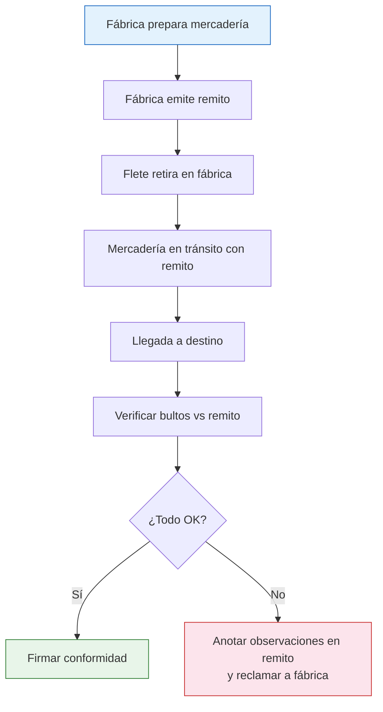

# Remito y transporte de mercadería

> Si la factura prueba la compra, el remito prueba que la mercadería está en tránsito legalmente. Circular con mercadería sin remito es como manejar sin registro: te pueden parar, retener la mercadería y multarte.

## Qué es un remito

Un remito es un **documento que acompaña la mercadería durante el transporte**. No es una factura, no implica cobro, pero es **obligatorio** cada vez que mercadería se mueve de un punto a otro.

| Aspecto | Factura | Remito |
|---------|---------|--------|
| **Función** | Comprobante de venta/compra | Comprobante de traslado |
| **Implica cobro** | Sí | No |
| **Obligatorio para transportar** | No (puede ir con o sin factura) | Sí, siempre |
| **Lo emite** | El vendedor | El emisor del envío (fábrica o vos) |
| **Se firma** | No necesariamente | Sí, al recibir la mercadería |

## Tipos de remito

<Tabs>
  <Tab title="Remito X">
    **Traslado sin operación de venta.**

    Se usa cuando movés mercadería que ya es tuya de un lugar a otro. Por ejemplo:
    - De tu depósito a un local
    - De tu casa a un punto de entrega
    - Envío de muestras

    **Lo emitís vos** como titular de la mercadería.
  </Tab>
  <Tab title="Remito R">
    **Acompaña una operación de venta.**

    Se usa cuando la mercadería viaja junto con (o como referencia a) una factura de venta. Por ejemplo:
    - La fábrica te envía la mercadería que compraste
    - Vos le enviás productos a un cliente mayorista

    **Lo emite el vendedor** (en tu caso, la fábrica cuando te envía el pedido).
  </Tab>
</Tabs>

## Qué información tiene un remito

Todo remito debe contener como mínimo:

| Dato | Detalle |
|------|---------|
| **Datos del emisor** | Nombre/razón social, CUIT, domicilio |
| **Datos del receptor** | Nombre/razón social, CUIT, domicilio de entrega |
| **Fecha de emisión** | Cuándo se despacha la mercadería |
| **Detalle de mercadería** | Descripción, cantidad, unidad de medida |
| **Número de remito** | Numeración correlativa |
| **Firma del receptor** | Se firma al momento de recibir (conformidad) |

<Warning>
Circular con mercadería sin remito puede resultar en **decomiso de la mercadería** y multas. Esto aplica tanto si la transportás vos en tu auto como si la envía un flete. **SIEMPRE** pedí el remito a la fábrica antes del retiro o envío.
</Warning>

## Opciones de transporte desde la fábrica

Dependiendo del volumen y la distancia, tenés varias opciones:

### Dentro de AMBA (Buenos Aires metropolitana)

| Opción | Volumen ideal | Costo aproximado | Tiempo |
|--------|--------------|-------------------|--------|
| Retiro con auto propio | Hasta 5-10 cajas | ARS 0 (solo combustible) | Inmediato |
| Retiro con utilitario/combi | 10-30 cajas | ARS 10,000 - 20,000 | Inmediato |
| Flete con camioneta | 30-50 cajas | ARS 15,000 - 30,000 | Mismo día o día siguiente |
| Transporte de la fábrica | Variable | ARS 0 - 20,000 (algunos incluyen envío) | 1-3 días |

### Interior del país (fábrica en otra provincia)

| Opción | Volumen ideal | Costo aproximado | Tiempo |
|--------|--------------|-------------------|--------|
| Encomienda (Andreani, OCA) | 1-5 paquetes chicos | ARS 5,000 - 20,000 | 3-7 días |
| Transporte de cargas (Via Cargo, Cruz del Sur) | 5-30 bultos | ARS 20,000 - 50,000 | 3-7 días |
| Flete dedicado | Grandes volúmenes | ARS 50,000 - 150,000+ | 2-5 días |
| Transporte de la fábrica | Variable | Consultar con la fábrica | Variable |

<Note>
Los costos de transporte son aproximados (febrero 2026) y varían según distancia, peso, volumen y operador. Siempre pedí cotización antes de contratar. Compará al menos 2-3 opciones.
</Note>

## Proceso de retiro en fábrica

Si vas a retirar la mercadería vos mismo:

<Steps>
  <Step title="Coordinar día y horario">
    Confirmá con la fábrica cuándo podés pasar. Muchas fábricas tienen horarios específicos de despacho (generalmente por la mañana). Preguntá si necesitás pedir turno.
  </Step>
  <Step title="Verificar que la documentación esté lista">
    Antes de ir, confirmá que la fábrica tenga preparados: la factura, el remito, y la mercadería embalada y lista para cargar.
  </Step>
  <Step title="Llevar vehículo adecuado">
    Calculá el volumen y peso de tu pedido. No vayas en un auto chico a buscar 50 cajas. Si necesitás, alquilá una camioneta o utilitario por el día (ARS 15,000 - 40,000 en AMBA).
  </Step>
  <Step title="Verificar la mercadería antes de cargar">
    Contá los bultos, verificá que coincidan con el remito y hacé una inspección visual rápida del estado del embalaje antes de cargar.
  </Step>
  <Step title="Firmar el remito y llevar la documentación">
    Firmá el remito de recepción (si estás conforme con lo que ves). Llevá una copia del remito en el vehículo durante todo el trayecto. Si te paran en un control, es lo que te piden.
  </Step>
</Steps>

## Proceso de envío por flete

Si la fábrica envía o vos contratás un flete:

**Puntos clave al recibir por flete:**
- **Contá los bultos** antes de firmar al fletero
- Si hay bultos dañados, **anotalo en el remito** antes de firmar
- Sacá fotos del estado de los bultos al recibirlos
- El fletero no es responsable del contenido, solo del transporte

## Operadores de transporte recomendados

| Operador | Cobertura | Ideal para | Seguimiento online |
|----------|-----------|------------|-------------------|
| **Andreani** | Nacional | Paquetes y cargas medianas | Sí |
| **OCA** | Nacional | Paquetes y encomiendas | Sí |
| **Via Cargo** | Nacional | Cargas grandes desde interior | Sí |
| **Cruz del Sur** | Nacional (sur y centro) | Cargas medianas y grandes | Consultar |
| **Fleteros independientes** | AMBA mayormente | Cargas chicas/medianas locales | No |

<Tip>
Coordiná con la fábrica para que el remito esté listo al momento del retiro o envío. Si vas a retirar personalmente, confirmá un día antes que todo está preparado. No hay nada peor que ir hasta la fábrica y que la mercadería no esté lista.
</Tip>

## Seguro de transporte

Para envíos de valor significativo (más de ARS 200,000), considerá contratar un seguro de transporte:

- **Quién lo contrata:** Generalmente el que paga el flete (puede ser la fábrica o vos)
- **Qué cubre:** Daño, robo, pérdida durante el tránsito
- **Costo:** Aproximadamente 0.5% - 1.5% del valor declarado de la mercadería
- **Cuándo es imprescindible:** Envíos de larga distancia, mercadería frágil o de alto valor

<Warning>
Sin seguro de transporte, si la mercadería se pierde o daña durante el envío, la recuperación del dinero depende de la buena voluntad del operador de transporte. Con volúmenes grandes, el seguro es una inversión mínima comparada con la pérdida potencial.
</Warning>
