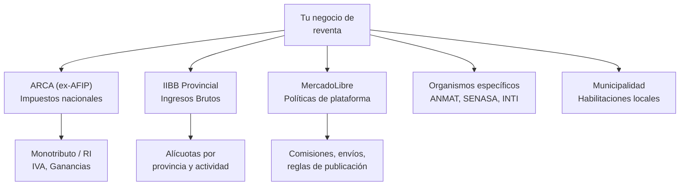

# Cambios regulatorios e impositivos

> En Argentina, las reglas del juego cambian constantemente. Un impuesto nuevo, una resolución de ARCA, un cambio de política en MercadoLibre, pueden alterar tus costos y márgenes de un mes al otro. No podés evitar los cambios, pero sí podés **estar preparado**.

## Por qué este riesgo es diferente

A diferencia de un proveedor que falla o un producto que no se vende (problemas que podés resolver vos), los cambios regulatorios son **externos y obligatorios**. No podés negociarlos, no podés ignorarlos, y las consecuencias de no adaptarte van desde multas hasta el cierre de tu actividad.

<Warning>
El mito más peligroso del revendedor novato es "vendo sin factura y nadie se entera". MercadoLibre reporta **todas** las transacciones a ARCA (ex-AFIP) desde 2019 mediante el Régimen de Información de Plataformas Digitales (RG 4415 y sus modificatorias). ARCA cruza esa información con tus declaraciones juradas. Si hay diferencia, llega la intimación.
</Warning>

## Áreas de riesgo regulatorio

## Riesgo 1: ARCA y el Monotributo

### Recategorización obligatoria

Si sos Monotributista, debés recategorizarte cada 6 meses (enero y julio) según tus ingresos acumulados de los últimos 12 meses. Si no lo hacés, ARCA puede hacerlo de oficio y cobrarte la diferencia con intereses.

| Situación | Qué pasa | Consecuencia |
|-----------|----------|-------------|
| Superaste los ingresos de tu categoría | Debés recategorizarte a una categoría superior | Pagás más de cuota mensual |
| Superaste el tope del Monotributo | Quedás excluido y pasás a Responsable Inscripto | Cambio total de régimen: IVA, Ganancias, más obligaciones |
| No te recategorizaste a tiempo | ARCA te recategoriza de oficio | Multa + intereses retroactivos |

<Note>
Los topes del Monotributo se actualizan periódicamente. Al momento de escribir este contenido, el tope más alto de facturación anual para venta de productos es de aproximadamente ARS 68.000.000 (este valor cambia con cada actualización, consultá siempre el valor vigente en arca.gob.ar).
</Note>

### Fechas clave de recategorización

| Período | Evaluación | Fecha límite |
|---------|-----------|-------------|
| Enero | Ingresos de enero a diciembre del año anterior | 20 de enero |
| Julio | Ingresos de julio a junio | 20 de julio |

### Exclusión del Monotributo

Si tus ventas crecen mucho (que es lo que querés), podés quedar excluido del Monotributo. Esto implica pasar a Responsable Inscripto, lo que cambia completamente tu estructura de costos:

| Concepto | Monotributo | Responsable Inscripto |
|----------|-------------|----------------------|
| IVA | Incluido en la cuota fija | 21% sobre cada venta (cobrás al cliente, ingresás a ARCA) |
| Ganancias | No corresponde | 25-35% sobre la ganancia neta anual |
| Autónomos | No corresponde | Cuota mensual obligatoria |
| Complejidad contable | Baja (facturar y pagar cuota) | Alta (necesitás contador sí o sí) |
| Costo mensual fiscal aproximado | ARS 30.000 - 180.000 según categoría | Variable, depende de la facturación |

<Tip>
Si estás cerca del tope del Monotributo, hablá con tu contador **antes** de llegar al límite. La transición a Responsable Inscripto necesita planificación: hay que darse de alta en IVA, cambiar el tipo de factura, ajustar precios y modificar la facturación en ML.
</Tip>

## Riesgo 2: Ingresos Brutos (IIBB)

Ingresos Brutos es un impuesto provincial que se paga sobre tu facturación (no sobre la ganancia). La alícuota y el régimen varían según la provincia donde operás.

### Diferencias por provincia (valores aproximados, sujetos a cambio)

| Provincia | Alícuota aproximada para comercio | Régimen |
|-----------|----------------------------------|---------|
| Buenos Aires (provincia) | 3.5 - 5% | ARBA |
| CABA | 3 - 4.5% | AGIP |
| Córdoba | 4 - 5% | DGR Córdoba |
| Santa Fe | 3.6 - 4.5% | API Santa Fe |
| Mendoza | 3 - 4% | ATM Mendoza |

<Warning>
Si vendés a todo el país por MercadoLibre (y es lo más probable), podés estar sujeto al **Convenio Multilateral**, que implica pagar IIBB en más de una jurisdicción. Esto es complejo y necesitás un contador que lo maneje. No intentes resolverlo solo.
</Warning>

### Retenciones y percepciones

ARBA, AGIP y otros organismos provinciales aplican retenciones y percepciones automáticas sobre tus ventas y compras. MercadoLibre actúa como agente de retención de IIBB, lo que significa que te retiene un porcentaje de cada venta antes de depositarte.

**Impacto real:** si tu alícuota de retención es 3% y vendés ARS 1.000.000 por mes, ML te retiene ARS 30.000 de tus ventas. Este monto se puede descontar de tu declaración de IIBB, pero mientras tanto es plata que no tenés disponible.

## Riesgo 3: Cambios en MercadoLibre

MercadoLibre modifica sus políticas, comisiones y reglas de forma frecuente. Estos cambios pueden afectar directamente tu rentabilidad.

### Cambios recientes significativos

| Área | Tipo de cambio | Impacto |
|------|---------------|---------|
| Comisiones de venta | Aumentos graduales (aproximadamente 13-17% dependiendo de categoría y tipo de envío) | Reduce tu margen directo |
| Envíos | Mayor énfasis en MercadoEnvíos Full, penalización de envío propio | Más costo logístico o pérdida de visibilidad |
| Publicaciones | Restricciones en categorías, requisitos de fotos, límites de publicaciones gratuitas | Necesitás adaptar tu catálogo |
| Reputación | Cambios en el algoritmo de reputación y visibilidad | Afecta cuánto se muestran tus publicaciones |

<Note>
MercadoLibre comunica los cambios importantes por email y en el panel del vendedor. Revisá las notificaciones de ML al menos una vez por semana. Un cambio de comisión del 1% puede significar miles de pesos de diferencia en tu rentabilidad mensual.
</Note>

## Riesgo 4: Organismos específicos

Dependiendo de qué productos vendés, puede haber organismos que regulen tu actividad:

| Organismo | Qué regula | Productos afectados | Riesgo |
|-----------|-----------|---------------------|--------|
| **ANMAT** | Salud y seguridad de productos | Cosméticos, productos de higiene, suplementos | Prohibición de venta, decomiso |
| **SENASA** | Alimentos y productos de origen animal | Alimentos, cuero, plumas | Decomiso, multas |
| **INTI** | Certificaciones técnicas | Electrónica, juguetes, materiales de construcción | No podés vender sin certificación |
| **INPI** | Marcas y patentes | Todos los productos con marca | Denuncia por uso indebido |

<Warning>
Las regulaciones de ANMAT y SENASA pueden cambiar sin mucho preaviso. Si vendés cosméticos, alimentos o productos que toquen la piel, mantené especial atención a las resoluciones de estos organismos. Un producto que hoy es legal puede requerir un registro nuevo mañana.
</Warning>

## Plan de gestión de riesgo regulatorio en 5 pasos

<Steps>
  <Step title="Tené un buen contador">
    Este es tu escudo principal. Un contador especializado en comercio electrónico te avisa de los cambios antes de que te afecten, te recategoriza a tiempo, te maneja IIBB y te prepara para auditorías.

    **Costo aproximado:** ARS 15.000 - 40.000/mes dependiendo de la complejidad de tu situación (Monotributo es más barato, Responsable Inscripto más caro).

    **Qué buscar en un contador:**
    - Que conozca MercadoLibre y e-commerce
    - Que responda en menos de 24 horas
    - Que te avise proactivamente de cambios (no que espere a que le preguntes)
    - Que maneje IIBB y Convenio Multilateral si vendés a todo el país
  </Step>
  <Step title="Suscribíte a fuentes de información">
    - Newsletter de ARCA (arca.gob.ar)
    - Grupos de Telegram/WhatsApp de vendedores de ML (hay varios activos con miles de miembros)
    - Seguí cuentas de contadores especializados en redes sociales
    - Blog oficial de MercadoLibre para vendedores
  </Step>
  <Step title="Revisá tus números mensuales">
    Cada mes controlá:
    - Facturación acumulada vs. tope de tu categoría de Monotributo
    - Retenciones de IIBB que te hizo ML
    - Comisiones reales de ML vs. las que tenías presupuestadas
    - Margen real después de todos los impuestos
  </Step>
  <Step title="Mantené un colchón financiero">
    Reservá entre un 5% y 10% de tus ingresos mensuales como fondo para imprevistos regulatorios: una multa, un impuesto nuevo, una recategorización retroactiva. Tener este colchón te permite absorber cambios sin que te desestabilicen.

    **Ejemplo:** si facturás ARS 1.000.000/mes, guardá ARS 50.000-100.000 como reserva regulatoria.
  </Step>
  <Step title="Planificá la transición fiscal">
    Si tu negocio crece (y ese es el objetivo), vas a pasar del Monotributo a Responsable Inscripto eventualmente. Planeá esto con anticipación:
    - Hablá con tu contador cuando estés al 70% del tope de facturación
    - Ajustá tus precios para absorber IVA y Ganancias
    - Cambiá tu tipo de factura (de C a A/B)
    - Avisá a ML del cambio de condición fiscal
  </Step>
</Steps>

## Calendario de fechas importantes

| Fecha | Obligación | Quién |
|-------|-----------|-------|
| 20 de cada mes | Pago cuota Monotributo | Monotributistas |
| 20 de enero / 20 de julio | Recategorización Monotributo | Monotributistas |
| Varía por jurisdicción (mensual) | Declaración y pago IIBB | Todos |
| Abril-junio | Declaración Jurada de Ganancias | Responsables Inscriptos |
| Mensual (según terminación de CUIT) | Declaración Jurada de IVA | Responsables Inscriptos |

<Tip>
Poné alarmas en tu calendario para cada una de estas fechas. Una multa por presentación tardía del Monotributo es de ARS 2.000-10.000 aproximado, pero los intereses por IIBB no presentado pueden ser mucho más significativos.
</Tip>

## Auditoría de ARCA para vendedores online

ARCA cruza la información que le reporta MercadoLibre con tus declaraciones juradas. Si hay inconsistencias, te llega una intimación.

### Qué dispara una auditoría

| Disparador | Ejemplo |
|-----------|---------|
| Facturación en ML mucho mayor que la declarada | ML reporta que vendiste ARS 5.000.000 y vos declaraste ARS 2.000.000 |
| Muchas ventas sin facturas emitidas | Vendés 200 productos por mes y emitiste 50 facturas |
| Categoría de Monotributo no coincide con ventas | Estás en categoría A pero ML reporta ventas de categoría H |
| Movimientos bancarios no justificados | Depósitos constantes sin origen declarado |

### Qué hacer si te llega una intimación

1. **No entrés en pánico** pero tampoco la ignores (tiene plazos legales)
2. **Contactá a tu contador inmediatamente** con la notificación
3. **Juntá toda la documentación** de tus compras y ventas
4. **Respondé dentro del plazo** indicado en la intimación (generalmente 15 días hábiles)
5. **Evaluá opciones** con tu contador: puede haber planes de pago, moratorias o formas de regularizar

<Warning>
Ignorar una intimación de ARCA no hace que desaparezca. Al contrario: los intereses y multas crecen, y puede derivar en una ejecución fiscal (te embargan la cuenta bancaria). Siempre respondé, aunque sea para pedir más plazo.
</Warning>

## La adaptabilidad como ventaja competitiva

<Note>
En Argentina, los cambios regulatorios son frecuentes, impredecibles y a veces retroactivos. Esto es frustrante, pero también es una ventaja competitiva si lo sabés manejar. Muchos de tus competidores van a cometer errores fiscales, van a ser intimados, van a cerrar. Vos, con un buen contador y una actitud proactiva, vas a seguir operando mientras ellos tienen problemas. La formalidad y la adaptabilidad son inversiones a largo plazo.
</Note>
