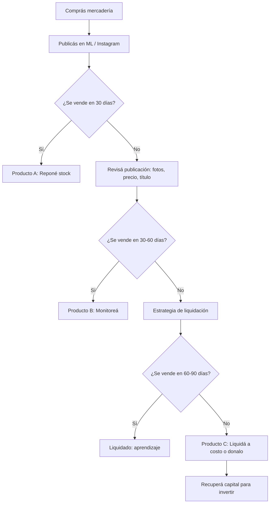

# Stock muerto: qué hacer cuando no se vende

> Compraste un lote de 200 unidades convencido de que se iban a vender rápido. Pasaron 60 días y tenés 180 unidades apiladas en tu depósito. Bienvenido al problema más común del revendedor: el **stock muerto**.

## Qué es stock muerto y por qué importa

Stock muerto es mercadería que compraste para revender y no se vende en un tiempo razonable. No es solo un estante ocupado: es **plata inmovilizada** que podrías estar usando para comprar productos que sí rotan.

<Warning>
El error más caro que comete un revendedor novato es "esperar a que se venda solo". Cada día que una unidad está parada en tu depósito, **perdés plata**. El costo real no es solo lo que pagaste por el producto, sino todo lo que dejás de ganar con esa plata invertida en otra cosa.
</Warning>

## Umbrales de alerta: cuándo preocuparte

No todo lo que no se vendió en una semana es stock muerto. Usá estos umbrales como referencia:

| Días sin venta | Estado | Acción recomendada |
|---------------|--------|-------------------|
| 0 - 30 días | Normal | Seguí con tu estrategia habitual |
| 30 - 60 días | Alerta amarilla | Revisá precio, publicación, fotos |
| 60 - 90 días | Alerta naranja | Aplicá estrategias de liquidación |
| Más de 90 días | Stock muerto | Liquidá a cualquier precio razonable |

<Note>
Estos umbrales son orientativos y dependen del rubro. Para ropa de temporada (verano/invierno), los tiempos se comprimen: si en 30 días no vendiste ropa de verano y ya es marzo, es alerta naranja.
</Note>

## Clasificación ABC: organizá tu inventario

El sistema ABC te ayuda a entender cuáles de tus productos merecen atención y cuáles son candidatos a liquidar.

| Categoría | Porcentaje de tus ventas | Porcentaje de tus productos | Acción |
|-----------|-------------------------|---------------------------|--------|
| **A** (estrellas) | Aproximadamente 80% de tus ingresos | 20% de tus productos | Priorizá reposición, nunca te quedes sin stock |
| **B** (regulares) | Aproximadamente 15% de tus ingresos | 30% de tus productos | Gestioná activamente, evaluá mensualmente |
| **C** (problemáticos) | Aproximadamente 5% de tus ingresos | 50% de tus productos | Candidatos a liquidar o eliminar |

<Tip>
Para hacer tu propia clasificación ABC: abrí tu historial de ventas en MercadoLibre, exportá a Excel, ordená de mayor a menor por ingresos totales, y separá en los tres grupos. Hacé este ejercicio cada 3 meses.
</Tip>

## Costo real de tener stock parado

Muchos revendedores piensan que el stock parado "no cuesta nada" porque ya lo pagaron. Es uno de los errores más graves. El costo real incluye tres componentes:

| Componente | Descripción | Ejemplo con un lote de USD 500 (ARS 600.000 aproximado) |
|-----------|-------------|--------------------------------------------------------|
| **Costo de almacenamiento** | Espacio en depósito, estantería, organización | ARS 5.000 - 15.000/mes aproximado |
| **Depreciación** | El producto pierde valor con el tiempo, moda, obsolescencia | 2-5% mensual del valor original |
| **Costo de oportunidad** | La plata que podrías ganar invirtiendo esos USD 500 en productos que sí rotan | Si tu margen es 40%, perdés USD 200 potenciales por mes |

<Warning>
En Argentina, con inflación alta, el costo de oportunidad se magnifica. Si tenés ARS 600.000 en stock parado durante 3 meses y la inflación es 5% mensual, tu mercadería perdió aproximadamente un 15% de valor real sin que le hayas cambiado el precio.
</Warning>

## Ciclo de vida del inventario

## Estrategias para mover stock parado

<Tabs>
  <Tab title="En MercadoLibre">
    ### Estrategias dentro de ML

    **1. Bajá el precio gradualmente**
    - Semana 1: reducí un 10-15%
    - Semana 2: reducí un 20-25%
    - Semana 3: reducí un 30-40%

    **2. Publicá como "Oferta del Día"**
    - Activá las promociones de ML desde la sección de Marketing en tu panel de vendedor
    - Los productos con descuento tienen más visibilidad en el algoritmo

    **3. Armá combos o kits**
    - Combiná un producto que no se vende con uno que sí se vende
    - Ejemplo: "Pack 3 x 2" o "Kit completo con regalo"
    - El producto estrella arrastra al producto muerto

    **4. Mejorá la publicación**
    - Sacá fotos nuevas, de mejor calidad, con fondo blanco
    - Reescribí el título con palabras clave que la gente busca
    - Agregá más detalle en la descripción
  </Tab>
  <Tab title="En Instagram / Redes">
    ### Estrategias en redes sociales

    **1. Venta flash (24-48 horas)**
    - Publicá una historia con cuenta regresiva
    - Ofrecé un descuento agresivo por tiempo limitado
    - Usá urgencia: "solo quedan X unidades"

    **2. Sorteo + venta**
    - Sorteá una unidad del producto entre quienes compartan tu publicación
    - Ofrece un descuento especial para los que participaron y no ganaron

    **3. Venta directa con beneficio extra**
    - "Comprá 2 y te regalo el 3ro"
    - Envío gratis por compra directa (ahorrás comisión de ML)
  </Tab>
  <Tab title="Otros canales">
    ### Canales alternativos de liquidación

    **1. Ferias y mercados**
    - Costo de puesto: ARS 5.000 - 30.000 por día aproximado (varía por ubicación)
    - Ideal para stock grande de un mismo producto

    **2. Venta mayorista a otros revendedores**
    - Ofrecé tu stock a precio de costo a otros vendedores de ML
    - Buscá en grupos de Facebook de revendedores

    **3. Plataformas de liquidación**
    - Grupos de WhatsApp de mayoristas
    - Marketplace de Facebook
    - Tiendas de saldos y outlets
  </Tab>
</Tabs>

## Cuándo liquidar vs. cuándo esperar

<Steps>
  <Step title="Calculá tu punto de equilibrio">
    Sumá lo que pagaste por el producto + comisiones de ML + envío + empaque. Ese es tu costo real por unidad. Si podés vender por encima de eso, vendé. Si no, fijate cuánto perdés por unidad y compará contra el costo de seguir guardando el stock.
  </Step>
  <Step title="Evaluá si hay motivo para esperar">
    ¿El producto es estacional y viene la temporada? Tiene sentido esperar. ¿Es un producto genérico sin estacionalidad? No hay motivo para esperar, liquidá.
  </Step>
  <Step title="Hacé la cuenta del costo de oportunidad">
    Si liquidás el stock a pérdida y con esa plata comprás un producto que rota en 15 días con 40% de margen, recuperás la pérdida en uno o dos ciclos.
  </Step>
  <Step title="Tomá la decisión y ejecutá">
    La peor decisión es no decidir. Elegí un camino (liquidar, donar, esperar con fecha límite) y ejecutalo.
  </Step>
</Steps>

## Cómo evitar stock muerto en el futuro

La mejor estrategia es prevenir. Estas prácticas reducen drásticamente el riesgo:

**1. Pedidos de prueba chicos**
- Antes de comprar 200 unidades, comprá 10-20 y probá la venta durante 2-3 semanas
- Costo del test: USD 25-50 aproximado (ARS 30.000 - 60.000)
- Lo que te ahorrás si el producto no funciona: USD 500+ (ARS 600.000+)

**2. Investigá antes de comprar**
- Buscá el producto en MercadoLibre y revisá las publicaciones de la competencia
- Mirá la cantidad de "vendidos" que muestran otros vendedores
- Usá la herramienta de MercadoLibre "Tendencias" para ver la demanda

**3. Diversificá tu catálogo**
- No pongas más del 30% de tu capital en un solo producto
- Tené al menos 5-10 productos diferentes
- Combiná productos de alta rotación (margen bajo) con productos de baja rotación (margen alto)

## Implicaciones impositivas del stock perdido

<Accordion title="¿Puedo descontar las pérdidas de mis impuestos?">
Si sos Responsable Inscripto, las pérdidas por mercadería dañada o destruida se pueden deducir de Ganancias, pero necesitás:
- Documentación que pruebe la existencia del stock (facturas de compra)
- Acta de destrucción o donación (si corresponde)
- Tu contador debe registrar la baja contable

Si sos Monotributista, no tenés este beneficio porque el Monotributo es un impuesto fijo que no contempla deducciones por pérdidas.

**Costo aproximado del trámite contable:** ARS 10.000 - 25.000 si tu contador lo hace como servicio adicional. Solo vale la pena si el stock tiene un valor significativo (más de USD 200 / ARS 240.000 aproximado).
</Accordion>

<Accordion title="¿Puedo donar stock y obtener beneficio fiscal?">
Sí, si sos Responsable Inscripto y donás a una entidad autorizada por ARCA (ex-AFIP), podés deducir el valor de la donación en el Impuesto a las Ganancias. Necesitás el recibo de la entidad receptora y que tu contador lo registre.
</Accordion>

<Tip>
Antes de tirar stock muerto, considerá usarlo como **regalos con compra** o **muestras gratis** para clientes que compran tus productos estrella. Convertís un costo hundido en una herramienta de fidelización que puede generar reviews positivas y clientes recurrentes.
</Tip>

<Warning>
La trampa psicológica más peligrosa es pensar "ya va a aparecer un comprador". Si un producto no se vendió en 90 días con buena publicación y precio competitivo, no se va a vender mágicamente. Cada día que esperás, el costo de oportunidad crece. Liquidar a pérdida duele, pero es la decisión financieramente correcta en la mayoría de los casos.
</Warning>
