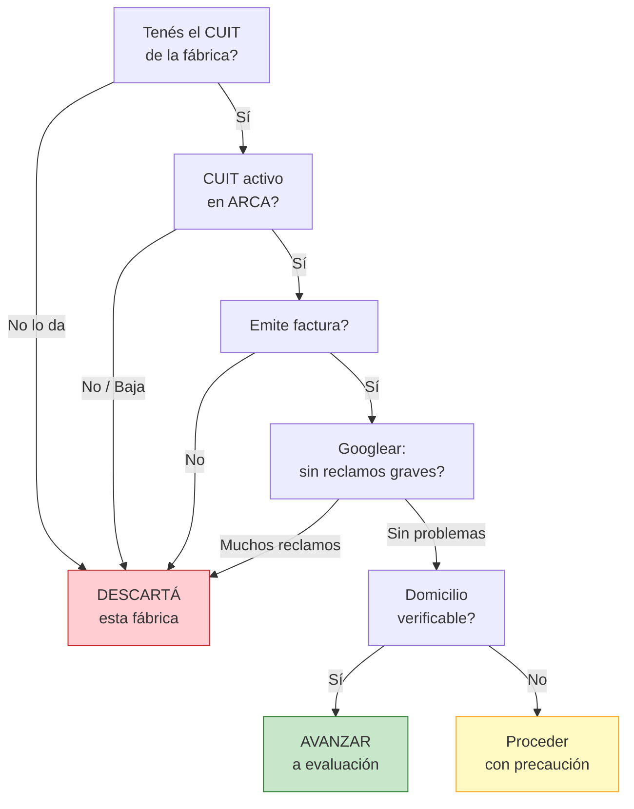

# Verificar la legitimidad de una fábrica

> Antes de enviar un solo peso a una fábrica, necesitás confirmar que **existe legalmente, opera en regla y no tiene antecedentes negativos**. Este proceso es gratuito, toma 1-2 horas, y te puede ahorrar una estafa.

## Por qué verificar

En Argentina hay miles de fábricas y talleres. Muchos son excelentes, pero también hay:

- **Fábricas fantasma** que cobran y no entregan
- **Talleres informales** que no facturan ni tienen habilitación
- **Empresas con problemas financieros** que pueden quebrar con tu pedido pendiente
- **Estafadores** que se hacen pasar por fabricantes

<Note>
La verificación no requiere ningún gasto ni conocimiento especial. Son consultas online que cualquier persona puede hacer en su casa, con una computadora o celular.
</Note>

## Pasos para verificar una fábrica

<Steps>
  <Step title="Verificar CUIT en ARCA (ex-AFIP)">
    Entrá a [www.arca.gob.ar](https://www.arca.gob.ar) y buscá la **constancia de inscripción** de la fábrica. Necesitás el CUIT o la razón social.

    **Qué verificar en la constancia:**
    - Que el CUIT esté **activo** (no dado de baja)
    - Que la actividad declarada tenga sentido (debe ser manufactura, fabricación o similar)
    - Que figure inscripto en IVA (Responsable Inscripto o Monotributista)
    - La fecha de inicio de actividades (más antiguo = más confiable)
    - Que el domicilio fiscal coincida con lo que te dijeron

    Si la fábrica no puede darte su CUIT o la constancia figura como "baja", es una señal de alerta grave.
  </Step>

  <Step title="Verificar en Registro de Sociedades (si es sociedad)">
    Si la fábrica opera como SRL, SA, o SAS, podés verificar su existencia en el **Registro Público de Comercio** o la **Inspección General de Justicia (IGJ)** si está en CABA: [www.argentina.gob.ar/justicia/igj](https://www.argentina.gob.ar/justicia/igj).

    En provincia de Buenos Aires, el registro es la **Dirección Provincial de Personas Jurídicas** (DPPJ).

    **Qué verificar:** que la sociedad esté vigente, quiénes son los socios y si tiene alguna irregularidad registrada.
  </Step>

  <Step title="Buscar en BCRA Central de Deudores">
    El Banco Central de la República Argentina tiene una base pública donde podés consultar si una persona o empresa tiene deudas impagas en el sistema financiero.

    Ingresá a [www.bcra.gob.ar/BCRAyVos/Situacion_Crediticia.asp](https://www.bcra.gob.ar/BCRAyVos/Situacion_Crediticia.asp) y buscá por CUIT.

    **Qué mirar:** situación 1 o 2 es normal. Situación 3, 4 o 5 indica problemas de pago significativos.
  </Step>

  <Step title="Googlear la fábrica + términos de alerta">
    Hacé estas búsquedas en Google:
    - `"nombre de la fábrica" estafa`
    - `"nombre de la fábrica" reclamo`
    - `"nombre de la fábrica" queja`
    - `"nombre de la fábrica" opiniones`
    - `"CUIT de la fábrica" problemas`

    Revisá los primeros 3-4 páginas de resultados. Buscá en foros, redes sociales y sitios de reclamos.
  </Step>

  <Step title="Buscar en Defensa del Consumidor">
    Revisá si la fábrica tiene reclamos registrados en el sistema COPREC (Conciliación Previa en las Relaciones de Consumo): [www.argentina.gob.ar/produccion/defensadelconsumidor](https://www.argentina.gob.ar/produccion/defensadelconsumidor).

    También podés buscar en la plataforma de reclamos de la provincia de Buenos Aires si la fábrica opera ahí.
  </Step>

  <Step title="Verificar domicilio fiscal vs domicilio real">
    Tomá la dirección que te dió la fábrica y la que figura en la constancia de ARCA. Verificá ambas en Google Maps.

    **Qué mirar:**
    - Que el domicilio fiscal no sea una casa particular en un barrio residencial (salvo que sea un taller pequeño)
    - Que haya una imagen de Street View que muestre una fábrica o taller real
    - Que ambas direcciones coincidan o al menos estén en la misma zona
    - Si hay reviews de Google en esa ubicación, leelas
  </Step>
</Steps>

## Señales de alerta (Red Flags)

Si detectás alguna de estas señales, procedé con **extrema precaución** o directamente descartá esa fábrica:

| Señal de alerta | Nivel de riesgo | Qué significa |
|----------------|-----------------|---------------|
| No puede darte su CUIT | Muy alto | Probablemente no existe formalmente |
| Solo acepta efectivo | Alto | Evita dejar rastro de la transacción |
| No emite factura de ningún tipo | Muy alto | Opera en la informalidad total |
| Presiona para que compres rápido | Alto | No quiere que investigues |
| Precios demasiado bajos vs competencia | Alto | Posible estafa o calidad muy baja |
| CUIT dado de baja o con actividad incorrecta | Muy alto | Empresa irregular |
| No tiene domicilio verificable | Alto | Puede ser una operación fantasma |
| Pide seña grande sin dar factura ni recibo | Muy alto | Riesgo de perder el dinero |
| Cambia las condiciones después de acordar | Medio-alto | Poco profesionalismo o mala fe |

## Señales positivas (Green Flags)

Estas señales indican que la fábrica tiene mayor probabilidad de ser confiable:

| Señal positiva | Por qué es buena señal |
|---------------|----------------------|
| Emite Factura A o B (es Responsable Inscripto) | Opera formalmente y a escala |
| Más de 5 años en el mercado | Estabilidad y trayectoria |
| Dirección real verificable con Google Maps | Existe físicamente |
| Tiene sitio web o redes sociales activas | Invierte en su imagen comercial |
| Acepta transferencia bancaria | Transparencia en las transacciones |
| Te da referencias de otros clientes | Confianza en su reputación |
| Figura en registros industriales oficiales | Cumple requisitos de habilitación |
| Te invita a visitar la fábrica | No tiene nada que esconder |

<Tip>
**SIEMPRE** pedí una factura de prueba antes de hacer un pedido grande. Comprá una cantidad mínima (aunque no te convenga el precio unitario) y verificá que la factura sea real validándola en la página de ARCA. Esto te confirma que la fábrica opera legalmente.
</Tip>

## Diagrama de decisión

Usá este flujo para decidir si avanzar con una fábrica:

<Warning>
Si una fábrica no puede emitir factura, **NO compres ahí**. Más allá del riesgo de estafa, comprarte mercadería sin factura te expone fiscalmente: no podés justificar el origen de tu stock frente a ARCA, y si te hacen una inspección podés tener problemas serios.
</Warning>

## Preguntas frecuentes

<Accordion title="Si la fábrica es Monotributista, es menos confiable?">
No necesariamente. Muchas fábricas pequeñas y talleres operan como Monotributistas y son perfectamente confiables. Lo importante es que estén inscriptos formalmente, emitan factura (C en este caso) y que puedas verificar su existencia. El tamaño no define la confiabilidad.
</Accordion>

<Accordion title="Cuánto cuesta verificar una fábrica?">
Nada. Todas las herramientas mencionadas (ARCA, BCRA, Google, Defensa del Consumidor) son gratuitas y de acceso público. Solo necesitás tiempo: entre 1 y 2 horas por fábrica.
</Accordion>

<Accordion title="Puedo pedirle al contador que haga la verificación?">
Sí, y es una muy buena idea. Tu contador puede verificar la constancia de ARCA con más profundidad y darte una opinión sobre la situación fiscal de la fábrica. Muchos contadores hacen este tipo de consultas como parte de su servicio mensual.
</Accordion>

## Siguiente paso

<Tip>
Una vez que verificaste que la fábrica es legítima, el siguiente paso es [evaluar su capacidad productiva](/app/paso1-argentina/evaluar-negociar/evaluar-capacidad-productiva) para confirmar que puede cumplir con tus pedidos.
</Tip>
