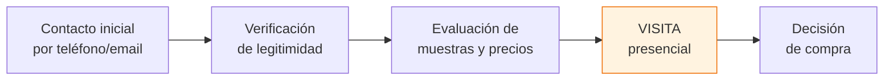

# Visitar una fábrica

> Visitar una fábrica en persona es el paso que más información te da sobre tu potencial proveedor. Ves la operación real, conocés a las personas detrás del negocio y generás una relación de confianza que no se logra solo por WhatsApp.

## Por qué visitar una fábrica

Una visita presencial te permite:

- **Ver la operación real** -- no la versión idealizada del catálogo
- **Conocer al dueño o responsable** -- la persona con la que vas a trabajar
- **Verificar la capacidad** -- si realmente tienen la maquinaria y el personal que dicen
- **Evaluar la organización** -- una fábrica limpia y ordenada produce mejor
- **Generar confianza mutua** -- el fabricante también te evalúa a vos como cliente

<Note>
Muchas fábricas argentinas están en el conurbano bonaerense, especialmente en zona norte (San Martín, Vicente López, San Isidro) y zona oeste (Morón, Ituzaingó, La Matanza). También hay importantes concentraciones en Córdoba, Santa Fe y Mendoza.
</Note>

## Cuándo visitar

No visites todas las fábricas que encontrés. La visita es para las que ya pasaron los filtros anteriores:

**Visitá una fábrica cuando:**
- Ya verificaste su legitimidad (CUIT, facturación, sin reclamos graves)
- Las muestras y precios te convencieron
- Estás por hacer un pedido significativo (más de ARS 200.000 aproximadamente)
- Querés establecer una relación comercial a largo plazo
- Algo no te termina de cerrar y necesitás verlo con tus propios ojos

<Tip>
Si la fábrica está lejos (otra provincia o más de 2 horas de viaje), una **videollamada** puede ser un excelente primer paso antes de viajar. Pedí que te muestren la fábrica por videollamada con el celular. No es igual que ir, pero te da una primera impresión muy valiosa.
</Tip>

## Qué observar durante la visita

Prestá atención a estos detalles desde que llegás:

### El espacio físico

| Aspecto | Buena señal | Mala señal |
|---------|-------------|------------|
| **Limpieza general** | Pisos limpios, áreas despejadas | Suciedad acumulada, basura visible |
| **Organización** | Materiales etiquetados, sectores definidos | Todo mezclado, desorden extremo |
| **Iluminación** | Buena luz natural o artificial | Oscuro, difícil ver lo que se produce |
| **Maquinaria** | Equipos funcionando, mantenidos | Máquinas paradas, oxidadas, en mal estado |
| **Materia prima** | Stock visible, bien almacenado | Poco material o mal conservado |
| **Producto terminado** | Área de almacén organizada | Productos apilados sin orden ni protección |
| **Seguridad** | Matafuegos, salidas señalizadas, EPP | Sin elementos de seguridad básicos |

### Las personas

- El dueño o encargado **te recibe y te atiende personalmente**?
- Los empleados trabajan de forma **organizada y concentrada**?
- Hay **suficiente personal** para la producción que dicen hacer?
- El ambiente se siente **profesional y serio**?

## 10 preguntas clave para hacer durante la visita

<Steps>
  <Step title="Cuánto tiempo llevan produciendo este producto?">
    Te da idea de su experiencia y si el producto está maduro o es nuevo.
  </Step>
  <Step title="Quiénes son sus principales clientes?">
    No necesitás nombres específicos, pero sí saber si venden a mayoristas, marcas conocidas o solo al público.
  </Step>
  <Step title="Qué pasa si un lote sale defectuoso?">
    La respuesta te dice mucho sobre su política de calidad y servicio posventa. Buscá que tengan un proceso claro de reposición o descuento.
  </Step>
  <Step title="Con qué frecuencia actualizan precios?">
    En Argentina los precios cambian seguido. Saber su política te permite planificar mejor.
  </Step>
  <Step title="Pueden personalizar el producto con mi marca?">
    Si pensás desarrollar marca propia, necesitás saber si hacen etiquetado privado (private label), packaging personalizado o modificaciones al producto.
  </Step>
  <Step title="Cuál es la mejor forma de hacer pedidos?">
    WhatsApp? Email? Tienen sistema propio? Esto te dice cuán profesionalizada está la operación.
  </Step>
  <Step title="Tienen temporadas de mayor o menor producción?">
    Muchas fábricas bajan producción en enero o tienen picos en fechas especiales. Saber esto te ayuda a planificar stock.
  </Step>
  <Step title="Qué problemas tuvieron con proveedores de materia prima?">
    En Argentina es común que falten insumos importados. Saber si les pasa y cómo lo manejan es clave.
  </Step>
  <Step title="Cómo manejan los envíos a otras provincias?">
    Si no estás en la misma zona, necesitás saber si tienen logística propia, usan transporte de terceros, o tenés que coordinar vos.
  </Step>
  <Step title="Están abiertos a que visite periódicamente?">
    Un proveedor que no tiene problema con visitas regulares es un proveedor que confía en su operación.
  </Step>
</Steps>

## Checklist de visita: qué llevar

Antes de salir, prepará:

- **Libreta o cuaderno** para anotar todo lo que observás y te dicen
- **Celular cargado** para fotos (pedí permiso antes de sacar fotos dentro de la fábrica)
- **Tarjetas personales** si tenés (da una imagen más profesional)
- **Muestras de referencia** del producto que evaluaste (para comparar in situ)
- **Lista de preguntas impresa** para no olvidarte de nada
- **La cotización que te mandaron** para poder consultar dudas específicas

## Red flags durante la visita

Si durante la visita detectás alguna de estas situaciones, reconsiderá la relación:

- **Desorden extremo** -- una fábrica desordenada produce con inconsistencia
- **Poca maquinaria para lo que dicen producir** -- si dicen hacer 5.000 unidades/mes pero tienen 2 máquinas viejas, algo no cierra
- **Evasivas a preguntas directas** -- si no te responden claro, probablemente estén ocultando algo
- **No te dejan ver ciertas áreas** -- puede haber razones válidas (seguridad, propiedad intelectual) pero también puede ser sospechoso
- **El dueño no aparece** -- si prometieron que iba a estar y no está, es una señal de poco compromiso
- **Presión para cerrar en el momento** -- "si comprás hoy te hago este precio" es una táctica de presión, no una práctica seria
- **Condiciones laborales preocupantes** -- empleados trabajando en condiciones inseguras o insalubres es una señal de problemas más profundos

<Warning>
**NUNCA lleves efectivo a una primera visita.** Si decidís comprar, siempre pagá por **transferencia bancaria**. El efectivo no deja comprobante, no se puede rastrear y te pone en una posición vulnerable. Además, pagando por transferencia tenés respaldo bancario de la operación.
</Warning>

## Etiqueta: cómo comportarte

Tu comportamiento durante la visita también impacta en la relación comercial:

| Aspecto | Qué hacer | Qué NO hacer |
|---------|-----------|--------------|
| **Puntualidad** | Llegá a la hora acordada o avisá si te retrasás | No llegues 30 min tarde sin avisar |
| **Vestimenta** | Ropa cómoda pero prolija. Zapatos cerrados si es fábrica | No vayas en ojotas o ropa de playa |
| **Respeto** | Escuchá, no interrumpas, agradecé el tiempo | No critiques la operación abiertamente |
| **Fotos** | Pedí permiso antes de fotografiar | No saques fotos sin autorización |
| **Procesos** | No toques maquinaria ni productos sin permiso | No te metas en áreas restringidas |
| **Tiempo** | Respetá la duración acordada (generalmente 1-2 horas) | No te quedes 4 horas sin que te lo ofrezcan |
| **Seguimiento** | Mandá un mensaje de agradecimiento después de la visita | No desaparezcas sin dar feedback |

## Después de la visita

Al volver, tomá 15 minutos para:

1. **Escribir tus impresiones** mientras están frescas
2. **Calificar la fábrica** del 1 al 10 en: limpieza, organización, capacidad, trato personal, confianza general
3. **Comparar con otras fábricas** que hayas visitado
4. **Decidir si avanzás** con un pedido o seguís buscando
5. **Mandar un mensaje de agradecimiento** al contacto que te atendió

## Preguntas frecuentes

<Accordion title="Es obligatorio visitar la fábrica antes de comprar?">
No es obligatorio, pero es muy recomendable para pedidos grandes (más de ARS 200.000). Para compras chicas de prueba podés saltarte la visita. Pero si vas a establecer una relación comercial a largo plazo, la visita presencial marca la diferencia.
</Accordion>

<Accordion title="Puedo llevar a alguien conmigo?">
Sí, y es buena idea. Llevá a tu socio, un amigo con experiencia en negocios, o incluso a tu contador. Dos pares de ojos ven más que uno, y te da más seguridad.
</Accordion>

<Accordion title="Qué pasa si la fábrica está en otra provincia?">
Si no podés viajar, hacé una videollamada primero. Si todo cierra bien, planificá una visita cuando puedas. Mientras tanto, empezá con un pedido chico para probar la relación. Muchos negocios exitosos trabajan con proveedores a distancia, pero la visita inicial siempre suma.
</Accordion>

## Siguiente paso

<Tip>
Ya tenés todas las herramientas para evaluar una fábrica. El próximo paso es aprender a [negociar tu primera reunión](/app/paso1-argentina/evaluar-negociar/primera-reunion) y conseguir las mejores condiciones para tu primera compra.
</Tip>
