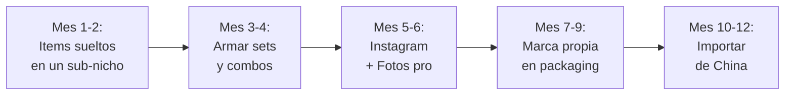

# Estrategia de venta — Bazar y hogar

La categoria de hogar y bazar es una de las de **mayor crecimiento** en MercadoLibre. La clave para competir no es tener el precio mas bajo, sino **elegir un sub-nicho, mostrar el producto en contexto de uso y armar sets que suban el ticket promedio**.

<Note>
Todos los precios y estimaciones son aproximados a inicios de 2026 (1 USD ≈ 1200 ARS aproximado).
</Note>

---

## Estrategia #1: Elegir un sub-nicho y dominarlo

El error mas comun en bazar es querer vender de todo. Hay demasiados productos y demasiada competencia como para ser "bazar general".

### Sub-nichos recomendados para empezar

| Sub-nicho | Por que funciona | Competencia |
|-----------|-----------------|-------------|
| **Organizadores de cocina** | Necesidad real, busqueda constante, facil de enviar | Media |
| **Accesorios materos** | Cultura argentina, diseño como diferenciador | Media-baja |
| **Productos de bambu** | Tendencia sustentable, percepcion premium | Baja |
| **Organizadores de baño** | Necesidad constante, sets tienen buen ticket | Media |
| **Cocina saludable** | Vaporeras, cortadores vegetales, contenedores | Baja-media |

<Tip>
Elegi **un solo sub-nicho** para empezar. Es mucho mejor tener 15 publicaciones de "organizadores de cocina" que 15 publicaciones de 15 categorias diferentes. El algoritmo de ML te posiciona mejor cuando sos especialista.
</Tip>

---

## MercadoLibre — Como publicar bazar

### Titulos efectivos

Los titulos en bazar deben incluir: **producto + material + tamaño/cantidad + uso**

**Ejemplos que funcionan:**
- "Set Organizador Cocina Plastico X4 Alacena Cajones"
- "Tabla De Cortar Bambu Grande 38x28 Cm Cocina"
- "Mate Acero Inoxidable Termico + Bombilla Set Completo"
- "Organizador Baño Acrilico Portacepillos + Dispenser X3"

### Fotos que venden — La regla del "en contexto"

En bazar, las fotos son **cruciales**. La diferencia entre vender y no vender es mostrar el producto **en uso real**.

| Foto | Que mostra | Por que importa |
|------|-----------|----------------|
| **Foto 1** | Producto solo, fondo blanco | Para que lo vea claramente |
| **Foto 2** | Producto en uso en cocina/baño real | Para que se imagine usandolo |
| **Foto 3** | Medidas con regla o mano de referencia | Para que sepa el tamaño real |
| **Foto 4** | Detalle del material (textura, color) | Para que confie en la calidad |
| **Foto 5** | Producto dentro de cajón/alacena | Para que vea como queda |
| **Foto 6** | Set completo o variantes de color | Para que vea las opciones |

<Warning>
**El reclamo #1 en bazar es "es mas chico de lo que esperaba".** Incluye medidas exactas en la descripcion, fotos con escala de referencia y una infografia con las dimensiones. Esto reduce devoluciones y reclamos significativamente.
</Warning>

---

## Pricing: ejemplo practico

### Set organizadores cocina x4

Armemos los numeros de un producto real:

**Costo del set (aproximado)**

| Item | Costo |
|------|-------|
| Organizador alacena | $1,200 ARS |
| Organizador cajones | $1,000 ARS |
| Portacubiertos | $800 ARS |
| Organizador bajo mesada | $1,500 ARS |
| Packaging (caja + sticker) | $300 ARS |
| **Total costo** | **$4,800 ARS (~USD 4.00)** |

**Precio de venta y margen**

| Concepto | Valor |
|----------|-------|
| Precio de venta en ML | $12,000 ARS (~USD 10.00) |
| Comision ML (~15%) | -$1,800 ARS |
| Costo de envio (paga comprador) | $0 |
| **Costo total** | **$4,800 ARS** |
| **Ganancia neta** | **$5,400 ARS (~USD 4.50)** |
| **Margen neto** | **~45%** |

<Note>
Vendiendo 40 sets por mes ya generas $216,000 ARS (~USD 180 aproximado) de ganancia neta. Un set se ve como un solo producto pero agrupa 4 items, lo que sube el ticket promedio y te diferencia de vendedores que venden items sueltos.
</Note>

---

## Visual selling: como vender con imagenes

En bazar, la venta es **visual**. Los compradores no leen descripciones largas; miran fotos y deciden.

### Tips para fotos de bazar

1. **Luz natural** — Fotografía cerca de una ventana, sin flash
2. **Contexto real** — Mostra el organizador dentro de una alacena real, la tabla de cortar con frutas
3. **Fondo limpio** — Encimera de cocina despejada, estante de baño ordenado
4. **Consistencia** — Todas tus fotos con el mismo estilo (misma luz, mismos angulos)
5. **Infografia** — Una imagen con las medidas superpuestas sobre el producto

<Tip>
No necesitas equipo profesional. Un celular con buena camara, una ventana con luz natural y una cocina limpia alcanzan. Lo que importa es **mostrar el producto en un contexto real** donde el comprador se imagine usandolo.
</Tip>

---

## Estacionalidad en bazar

| Temporada | Meses | Demanda | Que se vende |
|-----------|-------|---------|-------------|
| **Mudanzas** | Febrero-Marzo | Alta | Organizadores, cajas, todo para equipar casa nueva |
| **Invierno** | Mayo-Julio | Media-alta | Termos, mates, accesorios cocina (cocinar mas en casa) |
| **Dia de la Madre** | Septiembre-Octubre | Alta | Sets de cocina, organizadores como regalo |
| **Navidad** | Noviembre-Diciembre | Muy alta | Todo funciona como regalo, especialmente sets |
| **Mudanzas fin de año** | Diciembre | Alta | Mismo que febrero-marzo |

<Note>
Bazar no tiene una estacionalidad tan marcada como otros rubros. Los productos de hogar se venden **todo el año** porque son de necesidad. Los picos estacionales son bonus, no dependes de ellos.
</Note>

---

## Estrategia de sets y combos

Armar sets es la forma mas efectiva de **diferenciarte y subir el ticket promedio**:

### Como armar un buen set

<Steps>
<Step title="Identificar un tema">
Elige un tema especifico: "cocina minimalista", "baño organizado", "set matero completo", "cocina saludable".
</Step>

<Step title="Seleccionar 3-5 productos complementarios">
Los productos del set deben tener sentido juntos. Un "set cocina" con tabla de cortar + cuchillo + organizador de especias tiene logica. No mezcles cosas sin relacion.
</Step>

<Step title="Calcular el precio del set vs. items sueltos">
El set debe costar 10-15% menos que comprar los items por separado. El comprador siente que ahorra, y vos vendes mas unidades por transaccion.
</Step>

<Step title="Crear packaging atractivo">
Un set necesita verse como un set. Empaqueta todo junto en una caja o bolsa que se vea presentable. Esto es lo que justifica el precio premium.
</Step>

<Step title="Fotografiar como set completo">
La foto principal debe mostrar todos los items juntos, prolijos, en contexto de uso.
</Step>
</Steps>

### Ejemplos de sets que funcionan

| Set | Items incluidos | Costo aprox. | Precio venta aprox. |
|-----|----------------|-------------|-------------------|
| Set cocina minimalista negro | 5 utensilios + porta-utensilios | $5,000 ARS (~USD 4.15) | $14,000 ARS (~USD 11.65) |
| Set matero premium | Mate acero + bombilla + yerbero | $6,000 ARS (~USD 5.00) | $16,000 ARS (~USD 13.35) |
| Set baño organizado | 4 organizadores + dispenser | $4,000 ARS (~USD 3.35) | $11,000 ARS (~USD 9.15) |
| Set cocina saludable | Vaporera + cortador + bowl | $4,500 ARS (~USD 3.75) | $12,000 ARS (~USD 10.00) |

---

## Camino de crecimiento

### Estimacion de ganancias mensuales

| Etapa | Productos activos | Ventas/mes | Ganancia neta aprox. |
|-------|-------------------|-----------|---------------------|
| **Mes 1-2** | 8-12 publicaciones | 20-40 unidades | $80,000-180,000 ARS (~USD 65-150) |
| **Mes 3-4** | 15-25 publicaciones | 40-80 unidades | $180,000-380,000 ARS (~USD 150-315) |
| **Mes 5-6** | 20-35 publicaciones | 80-150 unidades | $350,000-600,000 ARS (~USD 290-500) |
| **Mes 7-12** | 30-50 publicaciones | 150-300 unidades | $500,000-900,000 ARS (~USD 415-750) |

<Warning>
Estas estimaciones asumen dedicacion de 3-5 horas diarias, reinversion de ganancias en stock y crecimiento progresivo. Son **aproximadas** y dependen de tu eleccion de sub-nicho, calidad de fotos y servicio al cliente.
</Warning>

---

## Instagram como canal complementario

Instagram funciona bien para bazar, especialmente para:

- **Productos de diseño** (bambu, accesorios materos premium)
- **Sets curados** (se ven lindo en fotos de estilo de vida)
- **Contenido "antes y despues"** (cajon desordenado → organizado)

### Contenido que funciona

| Tipo | Ejemplo |
|------|---------|
| **Reel de organizacion** | "Organice mi alacena con estos 4 productos" |
| **Antes y despues** | Cajon desordenado → ordenado con tus organizadores |
| **Uso real** | Preparando mate con tu set matero |
| **Unboxing** | Abriendo un set y mostrando cada pieza |

---

## Errores comunes a evitar

1. **Vender de todo** — Elegí un sub-nicho. Es imposible competir en toda la categoria de bazar.
2. **Fotos genericas** — No uses fotos del proveedor. Saca las tuyas en contexto real.
3. **No incluir medidas** — El reclamo mas comun es "es mas chico de lo que pensaba".
4. **Empezar con ceramica o vidrio** — La fragilidad genera roturas y reclamos. Empeza con plastico/silicona/bambu.
5. **No armar sets** — Vender items sueltos te pone a competir por precio. Los sets te diferencian.
6. **Ignorar el packaging** — Un producto de bazar bien empaquetado se percibe como 30-50% mas valioso.

---

## Siguiente paso

<CardGroup cols={2}>
<Card title="Proveedores de bazar" icon="store" href="/app/paso1-argentina/oportunidades/bazar/proveedores">
Donde encontrar fabricantes y mayoristas para tu stock de bazar.
</Card>
<Card title="Ranking general" icon="ranking-star" href="/app/paso1-argentina/oportunidades/ranking-general">
Compara bazar con los otros 7 rubros evaluados.
</Card>
</CardGroup>
