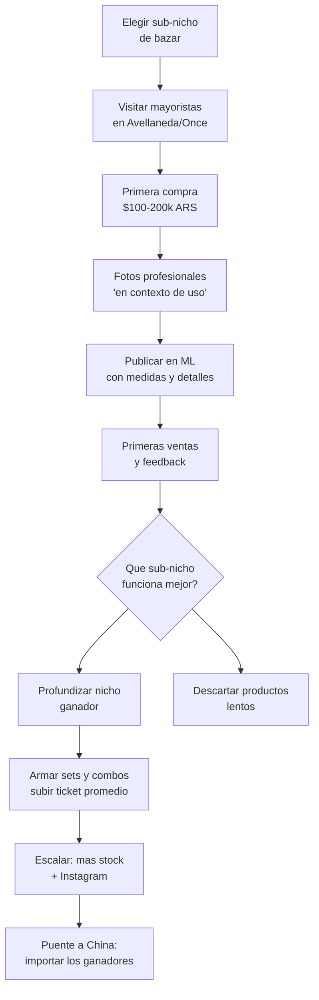

# Bazar y hogar — Score 7.17/10

Bazar y hogar es el **rubro #8** en nuestro ranking de oportunidades. Aunque no tiene el score mas alto, es uno de los rubros con **mayor potencial de volumen** gracias a su demanda enorme: la categoria de hogar crecio aproximadamente un +60% en MercadoLibre durante el primer semestre de 2025.

<Note>
Este analisis esta basado en los [9 criterios de evaluacion](/app/paso1-argentina/oportunidades/criterios-evaluacion) que usamos para todos los rubros. Todos los precios son aproximados a inicios de 2026.
</Note>

## Score detallado

| # | Criterio | Peso | Puntaje | Ponderado |
|---|----------|------|---------|-----------|
| 1 | Margen potencial | 20% | 7 | 1.40 |
| 2 | Demanda de mercado | 18% | 8 | 1.44 |
| 3 | Capital requerido | 15% | 7 | 1.05 |
| 4 | Simplicidad legal | 12% | 8 | 0.96 |
| 5 | Competencia | 10% | 6 | 0.60 |
| 6 | Facilidad logistica | 8% | 6 | 0.48 |
| 7 | Accesibilidad de fabricas | 7% | 7 | 0.49 |
| 8 | Escalabilidad | 5% | 7 | 0.35 |
| 9 | Puente a importacion | 5% | 8 | 0.40 |
| | **TOTAL** | **100%** | | **7.17** |

<Tip>
La fortaleza de bazar esta en la **demanda (8)** + **puente a China (8)** + **escalabilidad (7)**. Es un rubro con techo alto: podes crecer mucho si elegis bien tu sub-nicho.
</Tip>

---

## Por que bazar es una oportunidad

### Demanda enorme y en crecimiento

La categoria de hogar y bazar en MercadoLibre es una de las que mas crecio en 2025. Productos como organizadores, utensilios de cocina y accesorios para el hogar tienen **busquedas constantes** todo el año.

### Rango de productos amplisimo

A diferencia de otros rubros donde la variedad es limitada, bazar abarca cientos de productos diferentes. Esto significa que siempre podes encontrar un nicho con poca competencia dentro de la categoria.

### Puente fuerte a China

La mayoria de productos de bazar se fabrican masivamente en China. Aprender a vender bazar con fabricas argentinas te prepara para importar los mismos productos a un costo mucho menor.

---

## Tipos de productos

<CardGroup cols={3}>
<Card title="Utensilios de cocina" icon="utensils">
Tablas de cortar, sets de cubiertos, espatulas, cucharones, pinzas. Alta rotacion diaria.
</Card>
<Card title="Organizadores" icon="boxes-stacked">
Organizadores de cajones, alacena, bajo mesada, escritorio. Tendencia en crecimiento.
</Card>
<Card title="Recipientes y tappers" icon="jar">
Recipientes hermeticos, frascos, contenedores de alimentos. Compra recurrente.
</Card>
<Card title="Termos y mates" icon="mug-hot">
Termos, mates, bombillas, sets materos. Cultura argentina asegura demanda.
</Card>
<Card title="Accesorios de baño" icon="bath">
Organizadores de baño, portacepillos, dispensers, cestos. Necesidad constante.
</Card>
<Card title="Limpieza del hogar" icon="spray-can-sparkles">
Escobas, trapos, brochas, organizadores de limpieza. Recompra frecuente.
</Card>
<Card title="Decoracion funcional" icon="couch">
Portarretratos, relojes, cajas decorativas. Cruce con rubro decoracion.
</Card>
</CardGroup>

---

## Margenes reales — ejemplos practicos

| Producto | Costo fabrica (aprox.) | Precio venta ML (aprox.) | Margen bruto |
|----------|----------------------|------------------------|-------------|
| Set organizador cocina x4 | $3,000-5,000 ARS (~USD 2.50-4.15) | $8,000-14,000 ARS (~USD 6.65-11.65) | 80-165% |
| Tabla cortar bambu | $2,000-4,000 ARS (~USD 1.65-3.35) | $5,000-10,000 ARS (~USD 4.15-8.35) | 100-150% |
| Set cubiertos acero x24 | $4,000-8,000 ARS (~USD 3.35-6.65) | $10,000-18,000 ARS (~USD 8.35-15.00) | 100-150% |
| Organizador bajo mesada | $2,500-4,500 ARS (~USD 2.10-3.75) | $6,000-12,000 ARS (~USD 5.00-10.00) | 100-140% |
| Mate acero + bombilla | $3,000-6,000 ARS (~USD 2.50-5.00) | $8,000-15,000 ARS (~USD 6.65-12.50) | 100-165% |
| Set portacepillos baño | $2,000-3,500 ARS (~USD 1.65-2.90) | $5,000-9,000 ARS (~USD 4.15-7.50) | 100-150% |

<Warning>
Estos margenes son **brutos**. Resta la comision de MercadoLibre (~13-17%), costo de envio si lo bonificas, y tu carga impositiva. El margen neto queda aproximadamente en 50-100%, que es muy bueno. Pero cuidado con productos pesados: el costo de envio reduce el margen significativamente.
</Warning>

---

## Donde encontrar fabricas

| Zona | Ubicacion | Que encontras |
|------|-----------|---------------|
| **Avellaneda** | Zona comercial y alrededores | Gran concentracion de mayoristas de bazar y plasticos. Precios competitivos. |
| **Once** | Av. Pueyrredon y aledañas (CABA) | Mayoristas de bazar variado, cubiertos, organizadores. |
| **Parques industriales GBA** | Pilar, Pacheco, Garin | Fabricantes de plasticos, silicona y acero. Mejores precios por volumen. |
| **Flores** | Av. Avellaneda y alrededores | Algunos mayoristas de bazar con minimos bajos. |

<Tip>
Para proveedores detallados, zonas especificas y tips para negociar, consulta [Proveedores de bazar](/app/paso1-argentina/oportunidades/bazar/proveedores).
</Tip>

---

## Capital necesario para arrancar

| Nivel | Inversion (aprox.) | Que compras | Stock aproximado |
|-------|-------------------|-------------|------------------|
| **Minimo** | $100,000 ARS (~USD 85) | 30-50 unidades de 3-4 productos | Para testear el mercado |
| **Recomendado** | $150,000 ARS (~USD 125) | 50-100 unidades variadas | Stock para 10-15 publicaciones |
| **Comodo** | $200,000 ARS (~USD 170) | 100-200 unidades | Stock para vender 1-2 meses |

<Note>
El capital de bazar es mayor que rubros como bijouterie o packaging porque los productos tienen un ticket unitario mas alto. Pero el retorno por unidad vendida tambien es mayor.
</Note>

---

## Requisitos legales

La mayoria de productos de bazar son **simples desde el punto de vista regulatorio**:

- **Plasticos, bambu, silicona, madera:** Sin regulacion especial. Monotributo alcanza.
- **Acero inoxidable:** Sin regulacion especial para utensilios.
- **Mates y bombillas:** Sin regulacion especial.
- **Organizadores:** Sin regulacion especial.

<Warning>
**Atencion con electrodomesticos:** Si pensas vender productos electricos (licuadoras, sandwicheras, pavas electricas), estos requieren **certificaciones de seguridad electrica** y marcado CE/IRAM. No arranques por ahi. Empeza con productos que **no usen electricidad**.
</Warning>

---

## Logistica — Variable segun el producto

| Tipo de producto | Peso | Fragilidad | Dificultad envio |
|-----------------|------|-----------|-----------------|
| **Plasticos y silicona** | Liviano | Nula | Facil |
| **Bambu y madera** | Liviano | Baja | Facil |
| **Acero inoxidable** | Medio | Baja | Media |
| **Ceramica y vidrio** | Medio-pesado | **Alta** | **Dificil** |
| **Organizadores grandes** | Liviano pero voluminoso | Baja | Media |

<Warning>
**Empeza con plastico, silicona y bambu.** Evita ceramica y vidrio al principio. Los productos fragiles generan roturas en transporte, reclamos de clientes y devoluciones. Cuando tengas experiencia y sepas como embalar bien, podes ir incorporando productos mas fragiles.
</Warning>

---

## Puente a importacion desde China

Bazar tiene un **puente muy fuerte (score 8)** hacia la importacion:

| Paso | Que haces | Cuando |
|------|-----------|--------|
| **Paso 1** | Compras en fabricas argentinas, aprendes que se vende | Meses 1-6 |
| **Paso 2** | Contactas proveedores en China (Alibaba, Yiwu) | Meses 6-12 |
| **Paso 3** | Importas los mismos productos a 30-50% del costo local | Despues de mes 12 |

<Note>
La mayoria de productos de bazar que se fabrican en Argentina tienen equivalentes chinos a una fraccion del precio. Un organizador de cocina que cuesta $3,000 ARS en una fabrica local puede costar el equivalente a $500-800 ARS importado de China (sin contar flete e impuestos).
</Note>

---

## Competencia — Alta pero manejable

La competencia en bazar es **alta en general** pero la categoria es tan amplia que siempre hay nichos con espacio:

**Nichos con menos competencia:**
- Organizadores especificos (ej: solo organizadores de especias)
- Productos de bambu (tendencia sustentable)
- Accesorios materos premium
- Sets curados (ej: "set cocina minimalista negro")
- Organizadores de baño con diseño

**Nichos saturados (evitar al principio):**
- Tappers genericos
- Utensilios de cocina basicos (cucharas, espatulas genericas)
- Productos sin diferenciacion

<Tip>
La clave en bazar es **no vender de todo**. Elegí un sub-nicho especifico (ej: solo organizadores de cocina, solo accesorios materos, solo productos de bambu) y convertite en el especialista. Es mejor ser el #1 en un nicho chico que el #500 en la categoria general.
</Tip>

---

## Flujo del negocio

---

## Preguntas frecuentes

<Accordion title="Cuanto puedo ganar por mes vendiendo bazar?">
Depende del sub-nicho y tu dedicacion. Estimaciones aproximadas:

| Periodo | Ventas/mes | Ganancia neta aprox. |
|---------|-----------|---------------------|
| **Mes 1-3** | 20-50 unidades | $80,000-200,000 ARS (~USD 65-165) |
| **Mes 4-6** | 50-120 unidades | $200,000-450,000 ARS (~USD 165-375) |
| **Mes 6-12** | 120-300 unidades | $350,000-700,000 ARS (~USD 290-585) |

El ticket promedio de bazar es mas alto que bijouterie, asi que necesitas vender menos unidades para llegar al mismo ingreso. Estos numeros son aproximados.
</Accordion>

<Accordion title="Que sub-nicho de bazar recomiendan para empezar?">
Los mejores sub-nichos para principiantes son:

1. **Organizadores de cocina** — Demanda constante, facil de enviar, buen margen
2. **Accesorios materos** — Cultura argentina asegura demanda, diferenciacion por diseño
3. **Productos de bambu** — Tendencia sustentable, bajo peso, buena percepcion de calidad
4. **Sets curados** — "Set cocina negro x5 piezas" vende mejor que piezas sueltas

Evita empezar con ceramica, vidrio o electrodomesticos.
</Accordion>

<Accordion title="Es mejor vender productos sueltos o en sets?">
**Empeza con productos sueltos para testear, despues arma sets.**

Los sets tienen varias ventajas:
- Ticket promedio mas alto (vendes $15,000 ARS en vez de $5,000 ARS)
- Diferenciacion (tu combo es unico)
- Percepcion de valor ("5 productos por el precio de 3")
- Menos competencia directa (nadie tiene tu mismo combo)

Ejemplo: compra organizadores sueltos, testea cuales se venden, y despues arma un "Set organizacion cocina completo x5" con los ganadores.
</Accordion>

<Accordion title="Como manejo productos fragiles?">
Si decidis vender ceramica o vidrio, sigue estas reglas:

- **Doble capa de burbuja** alrededor de cada pieza
- **Carton corrugado** entre piezas si van juntas
- **Caja rigida** exterior con relleno
- **Etiqueta "FRAGIL"** visible en la caja
- **Fotos del embalaje** antes de cerrar (para reclamos)
- **Calcula el costo de embalaje** en tu precio (puede ser $500-1,500 ARS extra por envio)

Pero nuestra recomendacion es: empeza con plastico, silicona y bambu. No te compliques la vida al principio.
</Accordion>

<Accordion title="La competencia no es demasiada en bazar?">
Si, la categoria general de bazar tiene mucha competencia. Pero la categoria es **tan amplia** que siempre podes encontrar nichos con poco competidores. La clave es:

1. **No vendas "bazar general"** — Especializate
2. **Busca en ML que tiene pocas publicaciones** — Hay productos con alta demanda y poca oferta
3. **Diferencia por presentacion** — Fotos profesionales, descripciones detalladas, packaging lindo
4. **Arma combos unicos** — Tu set es diferente al de todos los demas
</Accordion>

---

## Siguiente paso

<CardGroup cols={2}>
<Card title="Proveedores de bazar" icon="store" href="/app/paso1-argentina/oportunidades/bazar/proveedores">
Donde encontrar fabricantes de plasticos, silicona, bambu y acero para bazar.
</Card>
<Card title="Estrategia de venta" icon="bullseye" href="/app/paso1-argentina/oportunidades/bazar/estrategia-venta">
Como vender productos de bazar online en la categoria de mayor crecimiento.
</Card>
</CardGroup>
