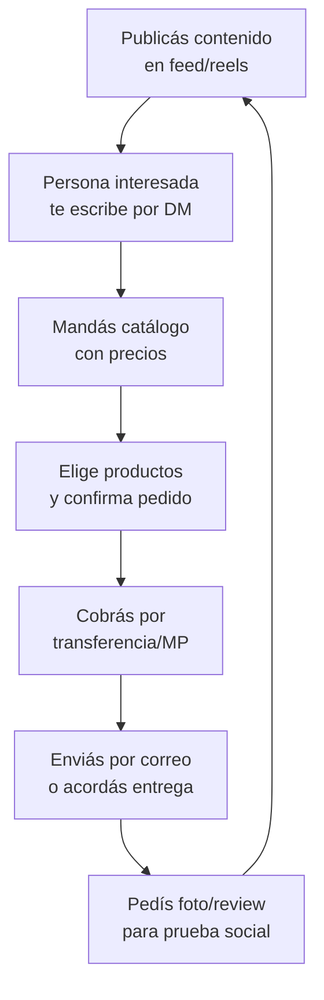

# Estrategia de venta — Bijouterie

Tener buen producto a buen precio es solo la mitad del negocio. La otra mitad es **cómo vendés**. Esta guía cubre la estrategia completa para vender bijouterie online, desde las fotos hasta la proyección de ganancias.

---

## Estrategia en MercadoLibre

MercadoLibre es el canal principal para empezar. Tiene la audiencia más grande y no necesitás seguidores para vender desde el día uno.

### Cómo armar una publicación que venda

| Elemento | Qué hacer | Ejemplo |
|----------|-----------|---------|
| **Título** | Incluir material + tipo + característica clave | "Aros Argolla Acero Quirúrgico — Set X3 — No Se Oxidan" |
| **Fotos** | Mínimo 6 fotos de alta calidad | Producto solo, puesto, detalle, packaging, medidas, lifestyle |
| **Descripción** | Detallar material, medidas, cuidados, envío | Ver formato sugerido abajo |
| **Precio** | Competitivo pero con margen, considerar comisiones | Costo x 2.5-3.5 |
| **Categoría** | Usar la categoría más específica posible | Bijouterie > Aros > Argollas |
| **Envío** | Envío gratis si el margen lo permite | MercadoEnvíos |

### Categorías recomendadas

- Bijouterie > Aros
- Bijouterie > Collares y Cadenas
- Bijouterie > Pulseras
- Bijouterie > Anillos
- Accesorios para el Cabello

<Tip>
Usá **variaciones** en una misma publicación para colores o modelos similares. MercadoLibre premia las publicaciones con más ventas, así que concentrar ventas en una publicación es mejor que tener muchas publicaciones separadas con pocas ventas cada una.
</Tip>

### Estructura de descripción sugerida

```
MATERIAL: Acero quirúrgico / Enchapado en oro / Fantasía premium
MEDIDAS: [largo x ancho en cm]
COLOR: [Dorado / Plateado / Rosé gold / etc.]
INCLUYE: [Detalle de lo que se entrega]

CARACTERÍSTICAS:
- No se oxida / Hipoalergénico / etc.
- Apto para uso diario
- [Otra característica relevante]

ENVÍO:
- MercadoEnvíos a todo el país
- Despacho en 24-48h

COMPRA COMBINADA:
- Llevá 3 pares con descuento [link]
```

---

## Fotografía de producto con celular

No necesitás una cámara profesional. Con un celular con buena cámara (cualquier gama media actual) y buena luz, podés sacar fotos que vendan.

<Steps>
<Step title="Prepará el setup de fotos">
Necesitás:
- **Luz natural**: poné una mesa cerca de una ventana grande. El mejor horario es entre las 10-14h en un día nublado (luz difusa, sin sombras duras).
- **Fondo blanco**: una cartulina blanca grande apoyada formando una curva suave. Costo: $200-500 ARS (~USD 0.15-0.40 aproximado).
- **Soporte para celular**: un trípode pequeño o simplemente apilá libros. Costo: $2,000-5,000 ARS (~USD 1.65-4.15 aproximado) el trípode.

Inversión total del mini-estudio: menos de $5,000 ARS (~USD 4 aproximado).
</Step>

<Step title="Sacá las fotos obligatorias">
Para cada producto, sacá al menos estas 6 fotos:

1. **Foto principal**: producto completo sobre fondo blanco, centrado
2. **Foto puesta**: el producto puesto (tu mano, oreja, cuello sirven como modelo)
3. **Foto de detalle**: acercamiento al cierre, piedra o detalle principal
4. **Foto de escala**: junto a una moneda o regla para mostrar tamaño real
5. **Foto de packaging**: cómo llega el producto al comprador
6. **Foto lifestyle**: el producto en un contexto (sobre una tela, junto a otros accesorios)
</Step>

<Step title="Editá las fotos">
Editá cada foto con estas correcciones básicas (podés usar Snapseed o Lightroom Mobile, ambos gratis):

- **Brillo**: subilo un poco para que el fondo quede bien blanco
- **Contraste**: subilo levemente para que el producto resalte
- **Saturación**: ajustá para que los colores sean fieles al producto real
- **Recorte**: cuadrado para MercadoLibre, dejá espacio alrededor del producto
- **Nitidez**: subila un poco para que el producto se vea definido
</Step>

<Step title="Optimizá para MercadoLibre">
Reglas de fotos en ML:
- Formato cuadrado (1200x1200 px mínimo)
- Fondo blanco puro en la foto principal (obligatorio para buena posición)
- Sin textos, logos ni marcas de agua en las fotos
- Mínimo 3 fotos, recomendado 6+
- La primera foto es la más importante: debe mostrar el producto completo y atractivo
</Step>
</Steps>

<Warning>
MercadoLibre penaliza las publicaciones con fotos de baja calidad o con texto superpuesto. Invertí tiempo en buenas fotos: es la diferencia entre vender 5 unidades por mes y vender 50.
</Warning>

---

## Fórmula de pricing

Para calcular el precio de venta en MercadoLibre, usá esta fórmula:

```
Precio de venta = Costo del producto / (1 - comisión ML - costo envío% - impuestos%)
```

### Ejemplo práctico

| Concepto | Valor |
|----------|-------|
| Costo del producto (aros) | $400 ARS (~USD 0.35) |
| Comisión MercadoLibre | ~16% del precio de venta |
| Costo de envío (si lo bonificás) | ~8% del precio de venta |
| Impuestos Monotributo (estimado) | ~5% del precio de venta |
| **Total de costos sobre venta** | **~29%** |

**Cálculo:** $400 / (1 - 0.29) = $400 / 0.71 = **$563 ARS** como precio mínimo para cubrir costos.

**Precio sugerido:** $400 x 3.0 = **$1,200 ARS** (~USD 1.00) para tener un margen neto saludable.

| Factor multiplicador | Margen neto aprox. | Cuándo usarlo |
|---------------------|-------------------|---------------|
| x 2.0 | ~25-30% | Precio agresivo para ganar mercado |
| x 2.5 | ~40-50% | Precio competitivo estándar |
| x 3.0 | ~55-65% | Precio con buen margen, buenas fotos |
| x 3.5 | ~65-75% | Producto premium, marca o exclusividad |

<Note>
Estos porcentajes son aproximados y varían según tu categoría de Monotributo, el tipo de envío y la comisión específica de tu categoría en MercadoLibre. Hacé siempre tus propios cálculos con los datos reales de tu situación.
</Note>

---

## Estrategia de packs y combos

Vender combos es una de las estrategias más efectivas en bijouterie. Aumenta el ticket promedio y el comprador siente que lleva más valor.

| Estrategia | Ejemplo | Efecto en ticket |
|-----------|---------|-----------------|
| **Pack por cantidad** | "3 pares de aros x $2,500" (vs. $1,200 individual) | +108% ticket |
| **Set combinado** | "Collar + aros haciendo juego" | +80-120% ticket |
| **Combo mix** | "5 hebillas surtidas" | +150% ticket |
| **Combo regalo** | "Kit regalo: collar + caja + bolsa" | +60% ticket + fecha especial |

<Tip>
Los packs también reducen tus costos de envío por unidad vendida. En vez de enviar 3 paquetes separados con sus 3 costos de envío, enviás 1 solo paquete con 3 productos.
</Tip>

---

## Venta en Instagram y redes sociales

Instagram es el segundo canal más importante para bijouterie y, a diferencia de MercadoLibre, no cobra comisión.

### Cómo armar tu perfil

- **Nombre**: algo corto, memorable, relacionado con accesorios
- **Bio**: qué vendés + zona de envío + forma de compra
- **Highlights**: "Catálogo", "Envíos", "Opiniones", "Proceso"
- **Link en bio**: link a WhatsApp Business o catálogo

### Contenido que funciona

| Tipo de contenido | Frecuencia sugerida | Objetivo |
|-------------------|-------------------|---------|
| **Fotos de producto** | 3-4 por semana | Mostrar el catálogo |
| **Reels de styling** | 2-3 por semana | Alcance orgánico |
| **Stories con encuestas** | Diario | Engagement |
| **Reels de packaging** | 1 por semana | Confianza + ASMR |
| **Fotos de clientas** | Cuando lleguen | Prueba social |

### Flujo de venta por Instagram



---

## Estacionalidad — Cuándo vender más

Bijouterie tiene picos claros de demanda que podés aprovechar:

| Fecha | Qué preparar | Cuándo stockear |
|-------|-------------|----------------|
| **San Valentín (14 feb)** | Sets románticos, combos regalo, packaging especial | Enero |
| **Día de la Madre (oct)** | Collares, aros premium, kits regalo | Septiembre |
| **Navidad/Año Nuevo (dic)** | Todo: máxima demanda del año | Noviembre |
| **Día del Amigo (jul)** | Pulseras, packs económicos para regalar | Junio |
| **Vuelta a clases (mar)** | Accesorios de pelo, bijouterie juvenil | Febrero |

<Warning>
Los picos de demanda estacionales pueden significar un aumento del 200-400% en ventas respecto a un mes normal. Si no tenés stock suficiente, perdés la oportunidad. Planificá con 4-6 semanas de anticipación.
</Warning>

---

## Camino de crecimiento

<Tabs>
<Tab title="Mes 1-3: Arranque">
**Objetivo:** Validar el negocio y aprender.

- Comprá tu primer lote pequeño ($30,000-50,000 ARS, ~USD 25-40 aproximado)
- Publicá 10-15 productos en MercadoLibre
- Aprendé a sacar fotos que vendan
- Conseguí tus primeras 10-20 ventas y reseñas positivas
- Identificá qué productos se venden y cuáles no

**Ganancia estimada:** $50,000-150,000 ARS/mes (~USD 40-125 aproximado)
</Tab>

<Tab title="Mes 4-6: Consolidación">
**Objetivo:** Escalar lo que funciona.

- Duplicá stock de los productos ganadores
- Eliminá los que no se vendieron
- Abrí cuenta de Instagram para venta directa
- Empezá a hacer packs y combos
- Mejorá packaging (bolsitas + tarjeta de marca)

**Ganancia estimada:** $150,000-350,000 ARS/mes (~USD 125-290 aproximado)
</Tab>

<Tab title="Mes 6-12: Escala">
**Objetivo:** Profesionalizar y diversificar.

- Registrá tu marca (INPI, ~$10,000-15,000 ARS, ~USD 8-12 aproximado)
- Negociá mejores precios con proveedores por volumen
- Sumá canales: Instagram Shops, tienda online propia
- Empezá a investigar importación directa desde China (Yiwu)
- Contratá ayuda si el volumen lo justifica

**Ganancia estimada:** $200,000-500,000 ARS/mes (~USD 165-415 aproximado)
</Tab>
</Tabs>

<Note>
Estas proyecciones son estimaciones conservadoras basadas en dedicación de 2-4 horas diarias y reinversión de ganancias. Los resultados reales pueden ser mayores o menores dependiendo de tu habilidad comercial, selección de productos y zona geográfica.
</Note>

---

## Errores comunes a evitar

<Accordion title="Comprar mucho stock de un solo modelo">
Es tentador comprar 100 unidades de un modelo que te gusta. Pero hasta que no lo probás en el mercado, no sabés si se va a vender. Empezá con 6-12 unidades de cada modelo. Solo reponé en cantidad los que se venden rápido.
</Accordion>

<Accordion title="Publicar con fotos del proveedor">
Las fotos del proveedor están pensadas para el mayorista, no para el comprador final. Suelen tener mala iluminación, fondos desprolijos o no muestran el producto puesto. Sacá tus propias fotos siempre.
</Accordion>

<Accordion title="Competir solo por precio">
Si tu estrategia es ser el más barato, siempre va a aparecer alguien más barato. Competí por fotos, presentación, atención y curación de diseño. El comprador de bijouterie busca algo lindo, no lo más barato.
</Accordion>

<Accordion title="Ignorar la atención post-venta">
Un comprador contento deja buena reseña y vuelve a comprar. Respondé mensajes rápido, resolvé problemas sin drama y mandá el producto con buena presentación. La reputación en MercadoLibre es tu activo más valioso.
</Accordion>

<Accordion title="No reinvertir las ganancias">
Los primeros meses, reinvertí la mayor parte de las ganancias en stock. El crecimiento del negocio depende de tener variedad y volumen para atender la demanda creciente.
</Accordion>

---

## Siguiente paso

<CardGroup cols={2}>
<Card title="Proveedores de bijouterie" icon="store" href="/app/paso1-argentina/oportunidades/bijouterie/proveedores">
Encontrá los mejores fabricantes y mayoristas para tu stock.
</Card>
<Card title="Overview bijouterie" icon="gem" href="/app/paso1-argentina/oportunidades/bijouterie/overview">
Volvé al análisis completo del rubro.
</Card>
</CardGroup>
