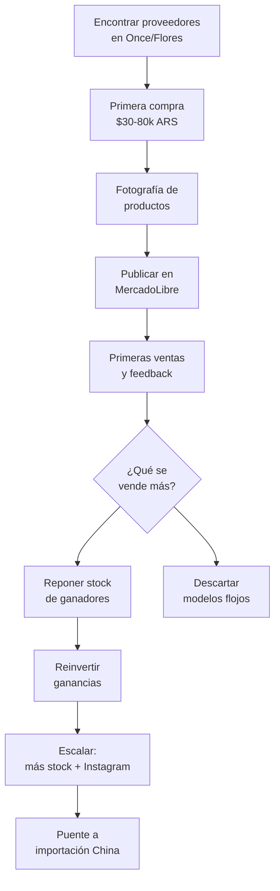

# Bijouterie y accesorios — Score 8.23/10

Bijouterie es el **rubro #1** en nuestro ranking de oportunidades para comprar en fábricas argentinas y revender. Combina los márgenes más altos del mercado con la inversión inicial más baja, lo que lo convierte en el punto de entrada ideal para emprendedores.

<Note>
Este análisis está basado en los [9 criterios de evaluación](/app/paso1-argentina/oportunidades/criterios-evaluacion) que usamos para todos los rubros. Todos los precios son aproximados a inicios de 2026.
</Note>

## Score detallado

| # | Criterio | Peso | Puntaje | Ponderado |
|---|----------|------|---------|-----------|
| 1 | Margen potencial | 20% | 9.5 | 1.90 |
| 2 | Demanda de mercado | 18% | 8.5 | 1.53 |
| 3 | Capital requerido | 15% | 9.0 | 1.35 |
| 4 | Simplicidad legal | 12% | 9.0 | 1.08 |
| 5 | Competencia | 10% | 5.5 | 0.55 |
| 6 | Facilidad logística | 8% | 9.5 | 0.76 |
| 7 | Accesibilidad de fábricas | 7% | 7.0 | 0.49 |
| 8 | Escalabilidad | 5% | 7.0 | 0.35 |
| 9 | Puente a importación | 5% | 9.0 | 0.45 |
| | **TOTAL** | **100%** | | **8.46** |

<Tip>
El score más alto viene de la combinación de **margen (9.5)** + **bajo capital (9.0)** + **logística excelente (9.5)**. Pocos rubros tienen esta triple ventaja.
</Tip>

---

## Por qué bijouterie es el rubro #1

### Márgenes de 100-300%

El costo por unidad en fábricas argentinas es muy bajo. Comprando al por mayor, un par de aros puede costar $200-800 ARS (aproximado, ~USD 0.15-0.65) y venderse en MercadoLibre o Instagram por $800-3000 ARS (~USD 0.65-2.50). En piezas más elaboradas como collares o sets, los márgenes son aún mayores.

### Capital inicial mínimo

Con $30,000-80,000 ARS (~USD 25-65 aproximado) podés arrancar con un stock variado. Es la barrera de entrada más baja de todos los rubros analizados.

### Logística perfecta

Los productos son pequeños, livianos y no son frágiles. Podés almacenar miles de unidades en una caja de zapatos. El envío por correo es económico y rara vez hay roturas.

### Conexión directa con importación de China

Bijouterie es uno de los productos estrella de **Yiwu**, la capital mundial de los pequeños artículos. Empezar con fábricas argentinas te enseña el negocio, y cuando estés listo, podés escalar importando desde China con márgenes aún mayores.

---

## Tipos de productos

<CardGroup cols={3}>
<Card title="Aros" icon="circle-dot">
Aros colgantes, argollas, perlas, abridores. El producto más vendido del rubro.
</Card>
<Card title="Collares" icon="link">
Cadenas, gargantillas, chokers, colgantes con dijes. Ticket medio-alto.
</Card>
<Card title="Pulseras" icon="ring">
Pulseras de acero, tejidas, con piedras, ajustables. Alta rotación.
</Card>
<Card title="Anillos" icon="ring">
Anillos de acero quirúrgico, enchapados, combinables. Fácil de enviar.
</Card>
<Card title="Accesorios de pelo" icon="wand-magic-sparkles">
Hebillas, pinzas, scrunchies, vinchas. Score 9.0 en análisis de productos.
</Card>
<Card title="Bijouterie masculina" icon="user">
Pulseras de cuero, cadenas gruesas, anillos. Nicho en crecimiento.
</Card>
<Card title="Pins y broches" icon="thumbtack">
Pins esmaltados, broches decorativos. Ideal para venta en packs.
</Card>
</CardGroup>

---

## Márgenes reales — ejemplos prácticos

| Producto | Costo fábrica (aprox.) | Precio venta ML (aprox.) | Margen bruto |
|----------|----------------------|------------------------|-------------|
| Par de aros básicos | $200-500 ARS (~USD 0.15-0.40) | $800-1,500 ARS (~USD 0.65-1.25) | 200-300% |
| Collar con dije | $400-1,200 ARS (~USD 0.35-1.00) | $1,500-4,000 ARS (~USD 1.25-3.35) | 200-275% |
| Set 3 pulseras | $500-1,000 ARS (~USD 0.40-0.85) | $1,800-4,500 ARS (~USD 1.50-3.75) | 260-350% |
| Anillo acero quirúrgico | $300-800 ARS (~USD 0.25-0.65) | $1,000-3,000 ARS (~USD 0.85-2.50) | 230-275% |
| Hebilla / pinza pelo | $150-400 ARS (~USD 0.12-0.35) | $600-1,500 ARS (~USD 0.50-1.25) | 275-300% |
| Pulsera cuero hombre | $600-1,500 ARS (~USD 0.50-1.25) | $2,000-5,000 ARS (~USD 1.65-4.15) | 230-270% |

<Warning>
Estos márgenes son **brutos**. Tenés que restarles la comisión de MercadoLibre (~13-17%), el costo de envío si lo bonificás, y el impuesto según tu categoría fiscal. El margen neto queda aproximadamente en 60-120%, que sigue siendo excelente.
</Warning>

---

## Dónde encontrar fábricas

| Zona | Ubicación | Qué encontrás |
|------|-----------|---------------|
| **Once** | Av. Pueyrredón, Paso, Larrea (CABA) | Mayor concentración de mayoristas y fabricantes. Variedad enorme. |
| **Flores** | Av. Avellaneda y alrededores (CABA) | Locales mayoristas con mínimos bajos, mucha bijouterie de moda. |
| **Talleres artesanales GBA** | Zona sur y oeste del Gran Buenos Aires | Fabricantes más pequeños, precios más bajos, posibilidad de diseños exclusivos. |
| **Villa Crespo** | Av. Corrientes y Scalabrini Ortiz | Algunos fabricantes especializados en acero quirúrgico y plata. |

<Tip>
Para información detallada de proveedores específicos, consultá [Proveedores de bijouterie](/app/paso1-argentina/oportunidades/bijouterie/proveedores).
</Tip>

---

## Capital necesario para arrancar

| Nivel | Inversión (aprox.) | Qué comprás | Stock aproximado |
|-------|-------------------|-------------|------------------|
| **Mínimo** | $30,000 ARS (~USD 25) | 80-120 piezas variadas | Para testear 3-4 modelos |
| **Recomendado** | $50,000 ARS (~USD 40) | 150-250 piezas | Stock para 15-20 publicaciones en ML |
| **Cómodo** | $80,000 ARS (~USD 65) | 300-500 piezas | Stock para vender 1-2 meses sin reponer |

<Note>
Estos valores son aproximados para inicios de 2026 (1 USD ≈ 1200 ARS aproximado). Incluyen solo el costo de mercadería, sin contar packaging ni herramientas de fotografía.
</Note>

---

## Requisitos legales

Bijouterie es uno de los rubros **más simples** desde el punto de vista regulatorio:

- **No requiere permisos especiales** ni habilitaciones
- **No necesita certificaciones** (a diferencia de alimentos, cosméticos o juguetes)
- Con **Monotributo categoría A o B** es suficiente para empezar
- No hay restricciones de importación ni aranceles especiales
- No necesitás local comercial, podés operar desde tu casa

<Tip>
Si todavía no tenés Monotributo, consultá nuestra guía [Monotributo vs. Responsable Inscripto](/app/paso1-argentina/empezar-de-cero/monotributo-vs-responsable-inscripto) para elegir la mejor opción.
</Tip>

---

## Logística — Por qué es ideal para empezar

| Aspecto | Evaluación | Detalle |
|---------|-----------|---------|
| **Tamaño** | Excelente | Caben cientos de unidades en una caja pequeña |
| **Peso** | Excelente | Un envío típico pesa menos de 200g |
| **Fragilidad** | Excelente | Metal, acero y plástico resisten el transporte |
| **Almacenamiento** | Excelente | Un cajón de escritorio puede ser tu depósito |
| **Costo de envío** | Excelente | Entra en la categoría más barata de correo |
| **Packaging** | Simple | Bolsita de organza o caja pequeña, costo $50-150 ARS (~USD 0.04-0.12) |

---

## Puente a importación desde China

Bijouterie es un **rubro perfecto** para la transición de fábricas argentinas a importación directa:

| Paso | Qué hacés | Cuándo |
|------|-----------|--------|
| **Paso 1** | Comprás en fábricas argentinas, aprendés el negocio | Meses 1-6 |
| **Paso 2** | Contactás proveedores en Yiwu (China), pedís muestras | Meses 6-12 |
| **Paso 3** | Hacés tu primer pedido de importación | Después de mes 12 |

<Note>
Yiwu es la capital mundial de bijouterie y accesorios. Los mismos productos que comprás en Once muchas veces vienen de ahí. Importar directo puede reducir tus costos un 50-70% adicional.
</Note>

---

## Análisis de competencia

La competencia en bijouterie es **alta**, pero eso no es necesariamente malo:

**Por qué la alta competencia no es un problema:**
- El ticket promedio es bajo, así que los compradores prueban vendedores nuevos con poco riesgo
- La moda cambia constantemente, siempre hay espacio para nuevos diseños
- La clave es **curación y fotografía**, no precio
- Podés diferenciarte por nicho (bijouterie masculina, acero quirúrgico, artesanal, etc.)

**Cómo diferenciarte:**
1. **Fotografía profesional** — La mayoría de los vendedores tienen fotos mediocres
2. **Curación de diseño** — Seleccioná piezas con estilo coherente, no todo mezclado
3. **Nicho específico** — Especializate en un tipo (acero, artesanal, masculino, minimalista)
4. **Packaging** — Una presentación linda genera recompra
5. **Combos y sets** — Vendé conjuntos para aumentar el ticket promedio

---

## Flujo del negocio

---

## Subcategoría estrella: accesorios de pelo

<Tip>
Accesorios de pelo obtuvo un **score de 9.0** en nuestro análisis de productos individuales. Es la subcategoría con mejor relación riesgo/beneficio dentro de bijouterie.
</Tip>

**Por qué empezar con accesorios de pelo:**
- Costo unitario aún más bajo ($150-500 ARS, ~USD 0.12-0.40 aproximado)
- Demanda constante todo el año
- Menos sensible a modas pasajeras que aros o collares
- Ideal para vender en packs (3 hebillas, set de scrunchies)
- Competencia menor que en aros o collares

---

## Preguntas frecuentes

<Accordion title="¿Necesito una marca propia para vender bijouterie?">
**No es obligatorio para empezar**, pero es muy recomendable a mediano plazo.

Al principio podés vender sin marca, simplemente como revendedor. Pero crear una marca simple te da ventajas:
- Podés registrarla en MercadoLibre como tienda oficial
- Genera confianza y recompra
- Te diferencia de otros revendedores
- Cuando importes de China, ya tenés marca establecida

Registrar una marca en INPI cuesta aproximadamente $10,000-15,000 ARS (~USD 8-12 aproximado) y tarda unos 12-18 meses. Podés empezar a usar el nombre antes de que salga el registro.
</Accordion>

<Accordion title="¿Cuánto puedo ganar por mes vendiendo bijouterie?">
Depende de tu dedicación y capital invertido. Estimaciones aproximadas:

| Período | Ventas/mes | Ganancia neta aprox. |
|---------|-----------|---------------------|
| **Mes 1-3** | 30-80 unidades | $50,000-150,000 ARS (~USD 40-125) |
| **Mes 4-6** | 80-200 unidades | $150,000-350,000 ARS (~USD 125-290) |
| **Mes 6-12** | 200-500 unidades | $200,000-500,000 ARS (~USD 165-415) |

Estos números asumen dedicación de 2-4 horas diarias y reinversión de ganancias en stock. Son aproximados y pueden variar según tu zona, tu habilidad con las fotos y la selección de productos.
</Accordion>

<Accordion title="¿Cómo me diferencio en un rubro con tanta competencia?">
Las 5 formas más efectivas de diferenciarte:

1. **Fotografía superior** — Invertí tiempo en fotos con buena luz natural, fondo limpio y modelos (puede ser tu propia mano/cuello). Esto solo ya te pone arriba del 80% de la competencia.

2. **Nicho claro** — En vez de vender "bijouterie", vendé "bijouterie minimalista en acero quirúrgico" o "accesorios boho artesanales". Un nicho claro atrae al comprador correcto.

3. **Combos y sets** — Ofrecé "set de 3 pares de aros" o "combo collar + aros". El ticket promedio sube y el comprador siente que lleva más.

4. **Packaging cuidado** — Una bolsita de organza con una tarjetita impresa cuesta $100-200 ARS (~USD 0.08-0.15) y genera una experiencia de marca.

5. **Contenido en redes** — Mostrá cómo combinar las piezas, hacé reels de styling. Instagram es un canal de venta directo para bijouterie.
</Accordion>

<Accordion title="¿Qué pasa si un producto no se vende?">
Es normal que algunos modelos no funcionen. Estrategias para manejar stock lento:

- **Bajar el precio** un 20-30% y ponerlo como "oferta"
- **Armar combos** juntando productos lentos con productos que sí se venden
- **Cambiar las fotos** — A veces el producto es bueno pero la foto no convence
- **Vender en ferias** o mercados los fines de semana como liquidación
- **Regalar como bonus** — "Comprá 2 pares de aros y te regalo esta pulsera"

La clave es no comprar grandes cantidades de un solo modelo hasta que sepas que se vende bien. Empezá con 6-12 unidades por modelo.
</Accordion>

---

## Siguiente paso

<CardGroup cols={2}>
<Card title="Proveedores de bijouterie" icon="store" href="/app/paso1-argentina/oportunidades/bijouterie/proveedores">
Dónde encontrar fabricantes reales, con direcciones y tips para la primera visita.
</Card>
<Card title="Estrategia de venta" icon="bullseye" href="/app/paso1-argentina/oportunidades/bijouterie/estrategia-venta">
Cómo armar tus publicaciones, sacar fotos y vender de forma rentable.
</Card>
</CardGroup>
