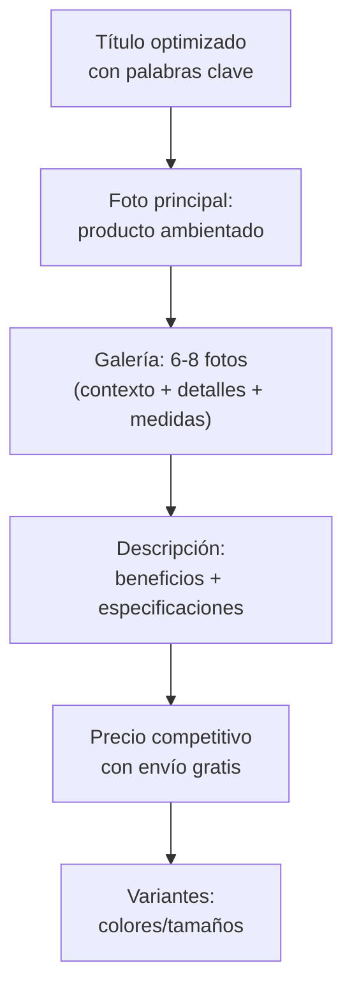
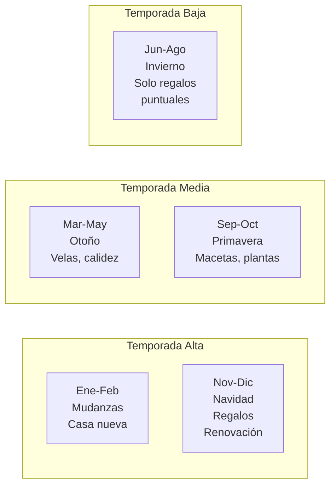

# Estrategia de venta — Decoración y organización

En decoración, **la venta es visual**. El mismo organizador de madera puede verse como un producto genérico de $3,000 ARS o como una pieza de diseño de $12,000 ARS. La diferencia está en la fotografía, la presentación y la narrativa visual que construís alrededor del producto.

<Note>
**Regla de oro de decoración:** El cliente no compra un objeto, compra cómo se va a ver su casa con ese objeto. Tu trabajo es **mostrarle esa visión**.
</Note>

---

## La fotografía lo es TODO

En decoración, la calidad de las fotos es más importante que el producto en sí. Una foto mal sacada con celular destruye la percepción de valor, mientras que una foto ambientada profesional la multiplica.

### Dos tipos de fotos que necesitás

| Tipo | Propósito | Ejemplo |
|------|-----------|---------|
| **Foto de producto** (fondo blanco) | MercadoLibre, catálogos | El organizador solo, bien iluminado, desde varios ángulos |
| **Foto ambientada** (en contexto) | Instagram, Pinterest, portada ML | El organizador sobre un escritorio con plantas, libros, café |

### Cómo lograr fotos ambientadas sin estudio

<Steps>
<Step title="Armá un rincón de tu casa como set">
Elegí un rincón con buena luz natural (cerca de una ventana). Usá una mesa o estante como base. Fondo simple: pared blanca, ladrillo, madera. No necesitás un estudio profesional.
</Step>

<Step title="Conseguí props (elementos decorativos auxiliares)">
Juntá objetos que complementen: plantas, libros, tazas, velas, telas. Estos elementos crean el "ambiente" que hace que el producto se vea en contexto. No necesitás comprar — usá lo que ya tenés en casa.
</Step>

<Step title="Usá luz natural — siempre">
La mejor iluminación para decoración es la luz natural indirecta. Sacá las fotos cerca de una ventana, entre las 10 y las 14 horas. Evitá la luz directa del sol que genera sombras duras. Si el día está nublado, mejor todavía — la luz es más suave y uniforme.
</Step>

<Step title="Editá con apps gratuitas">
Usá **Lightroom mobile** (gratis) o **Snapseed** (gratis) para ajustar brillo, contraste y calidez. Mantené un estilo de edición **consistente** en todas las fotos — esto crea una identidad visual de marca.
</Step>

<Step title="Hacé fotos en serie por colección">
Cuando fotografiés productos de la misma línea (ejemplo: "Línea Nórdica"), usá el mismo fondo, los mismos props y la misma edición. Esto crea cohesión visual que se nota en la tienda.
</Step>
</Steps>

<Tip>
**Inversión mínima para fotos decentes:** Un celular con buena cámara (que probablemente ya tenés), una ventana con luz natural y $5,000-$10,000 ARS en props básicos (plantas, tela de fondo, una tabla de madera). Con esto podés lograr fotos que compiten con marcas establecidas.
</Tip>

---

## Instagram como canal principal

Para decoración, Instagram no es un canal más — es **el canal principal** de construcción de marca y generación de ventas.

### Por qué Instagram funciona tan bien para decoración

1. **Es visual por naturaleza**: La plataforma está diseñada para mostrar productos bonitos
2. **Inspiración**: La gente busca ideas de decoración activamente en Instagram
3. **Confianza**: Un feed bien armado genera confianza inmediata en tu marca
4. **Tráfico**: Podés redirigir seguidores a tus publicaciones de MercadoLibre

### Estrategia de contenido para Instagram

| Tipo de post | Frecuencia | Ejemplo |
|-------------|-----------|---------|
| **Foto de producto ambientado** | 3-4/semana | Organizador en un escritorio estilizado |
| **Antes y después** | 1-2/semana | "Así se ve tu escritorio con/sin nuestro organizador" |
| **Reel de proceso** | 1-2/semana | Video del taller produciendo, empaquetando |
| **Tips de organización** | 1/semana | "3 formas de organizar tu cocina" con tus productos |
| **Stories con encuestas** | Diarias | "¿Qué color preferís para el nuevo organizador?" |
| **Testimonios de clientes** | 1-2/semana | Fotos de clientes usando el producto en su casa |

<Warning>
**Error frecuente:** Usar Instagram solo para publicar productos con precio, como si fuera una vidriera. Instagram funciona cuando das **valor** (inspiración, tips, ideas) y la venta viene como consecuencia. Si cada post es "COMPRÁ ESTO $X", la gente deja de seguirte.
</Warning>

---

## Estrategia en MercadoLibre

MercadoLibre es donde se cierra la mayoría de las ventas. La clave es optimizar las publicaciones para que se encuentren fácilmente y conviertan.

### Estructura de una publicación ganadora

### Tips para títulos en MercadoLibre

Los títulos deben incluir **palabras que la gente busca**:

| Mal título | Buen título |
|-----------|-------------|
| "Organizador lindo" | "Organizador De Escritorio Madera - Porta Lápices Decorativo" |
| "Vela" | "Vela Aromática De Soja - Frasco Vidrio 200g - Decoración Hogar" |
| "Repisa" | "Estantería Flotante Madera Pino 60cm - Repisa Nórdica Pared" |

<Tip>
**Truco para encontrar las mejores palabras clave:** Empezá a escribir en el buscador de MercadoLibre y mirá las **sugerencias automáticas**. Esas son las palabras que la gente realmente busca. Usalas en tu título.
</Tip>

---

## Pinterest como fuente de tráfico

Pinterest es una de las fuentes de tráfico más subestimadas para decoración. La gente usa Pinterest específicamente para **buscar ideas de decoración**, lo que significa tráfico de alta intención.

### Cómo usar Pinterest

1. **Creá un perfil de negocio** (gratis)
2. **Subí tus fotos ambientadas** como "Pins" con descripción y link a tu tienda
3. **Creá tableros temáticos**: "Decoración nórdica", "Ideas para escritorio", "Organización de cocina"
4. **Posteá regularmente** (5-10 pins por semana)
5. **Incluí link** a tu publicación de MercadoLibre o Instagram en cada pin

Pinterest genera tráfico de forma **orgánica y acumulativa** — un pin puede seguir trayendo visitas meses después de publicarlo.

---

## Colecciones por estilo — Tu diferenciación

En lugar de vender productos sueltos sin relación, armá **colecciones temáticas** por estilo decorativo. Esto te diferencia de los bazares genéricos y justifica precios más altos.

### Estilos que venden bien en Argentina

<Tabs>
<Tab title="Nórdico / Escandinavo">
**Características:** Madera clara (pino, paraíso), blanco, minimalismo, líneas simples.

**Productos típicos:**
- Organizadores de madera clara sin pintar
- Estanterías flotantes minimalistas
- Portarretratos de madera natural
- Letras decorativas en madera

**Público:** 25-45 años, nivel socioeconómico medio-alto, departamentos modernos.

**Precio premium:** Sí — el estilo nórdico justifica un +20-30% sobre el precio genérico.
</Tab>

<Tab title="Industrial">
**Características:** Metal negro, madera oscura, concreto, tubos de hierro.

**Productos típicos:**
- Estanterías con caño de hierro y madera
- Macetas de concreto
- Portavelas metálicos
- Organizadores metal + madera

**Público:** 25-40 años, lofts y departamentos modernos, hombres y mujeres.

**Precio premium:** Sí — los materiales (hierro + madera maciza) justifican precios más altos.
</Tab>

<Tab title="Boho / Natural">
**Características:** Macramé, mimbre, fibras naturales, colores tierra, plantas.

**Productos típicos:**
- Portamacetas colgantes de macramé
- Colgantes de pared tejidos
- Cestos de mimbre/yute
- Atrapasueños decorativos

**Público:** 20-35 años, amantes de las plantas, estética Instagram.

**Precio premium:** Moderado — el trabajo manual justifica el precio pero el público es sensible a costos.
</Tab>
</Tabs>

<Tip>
**Empezá con UN solo estilo** y dominá ese nicho antes de expandir. Es mejor ser conocido como "la tienda nórdica" que como "la tienda que vende un poco de todo". Cuando tengas tracción con un estilo, agregá un segundo.
</Tip>

---

## Pricing — Ejemplo real

Veamos un ejemplo concreto con un **organizador de escritorio de madera estilo nórdico**:

| Concepto | Monto (ARS) |
|----------|-------------|
| Costo del producto (carpintería) | $3,500 |
| Packaging y protección | $500 |
| **Subtotal costo** | **$4,000** |
| Precio de venta en ML | $10,500 |
| Comisión MercadoLibre (~13%) | -$1,365 |
| Costo de envío (si lo absorbés) | -$1,500 |
| Impuestos monotributo (~5%) | -$525 |
| **Ganancia neta por unidad** | **$3,110** |
| **Margen neto** | **~30%** |

<Note>
Este margen del 30% neto es sobre un producto **individual**. Si vendés el mismo organizador como parte de un **combo** ("Kit organización escritorio: organizador + portarretratos + portacelular" a $22,000 ARS), el margen total sube porque el costo de envío se reparte entre más productos.
</Note>

### Estrategia de combos

| Combo | Costo total | Precio venta | Margen neto aprox. |
|-------|-------------|--------------|-------------------|
| Organizador solo | $4,000 | $10,500 | ~30% |
| Organizador + portarretratos | $6,500 | $17,000 | ~35% |
| Kit escritorio completo (3 piezas) | $9,000 | $22,000 | ~38% |
| Colección deco mesa (4-5 piezas) | $14,000 | $35,000 | ~40% |

Los combos y colecciones **mejoran el margen** porque:
- El costo de envío se reparte
- La comisión de ML es un solo cobro
- El valor percibido del conjunto es mayor que la suma de las partes

---

## Estacionalidad y calendario de ventas

### Calendario de acciones

| Mes | Acción clave |
|-----|-------------|
| **Octubre** | Encargar stock de navidad a talleres (se saturan) |
| **Noviembre** | Lanzar colección navideña, publicar todo en ML |
| **Diciembre** | Venta fuerte, preparar packaging de regalo |
| **Enero** | Colección "casa nueva", organizadores, estanterías |
| **Febrero** | Mudanzas, combos de organización |
| **Marzo** | Transición a otoño, velas aromáticas, calidez |
| **Septiembre** | Colección primavera, macetas, plantas |

<Warning>
**No subestimes los tiempos de producción.** Si querés vender en diciembre, los pedidos a los talleres deben estar hechos en **octubre a más tardar**. Los talleres de carpintería y velas se saturan en noviembre y dejan de tomar pedidos nuevos.
</Warning>

---

## Camino de crecimiento

<Steps>
<Step title="Fase 1: Productos individuales (Mes 1-3)">
Empezá vendiendo **piezas sueltas** de un solo estilo. Organizadores, velas, portarretratos. Objetivo: validar qué productos y qué estilo tienen demanda real. Inversión: $100,000-$150,000 ARS (~USD 85-125).

**Meta:** 15-25 ventas/mes, entender qué funciona.
</Step>

<Step title="Fase 2: Colecciones y combos (Mes 3-6)">
Armá **combos temáticos** y empezá a crear una identidad de marca. Lanzá tu Instagram con fotos ambientadas. Sumá 1-2 proveedores nuevos.

**Meta:** 30-50 ventas/mes, cuenta de Instagram con 500+ seguidores activos.
</Step>

<Step title="Fase 3: Marca propia de decoración (Mes 6-12)">
Poné tu marca en los productos (etiquetas, grabado). Creá packaging propio. Empezá a vender colecciones completas. Explorá ventas corporativas (oficinas, consultorios).

**Meta:** 60-100 ventas/mes, marca reconocible, clientes recurrentes.
</Step>

<Step title="Fase 4: Escalar o importar (Mes 12+)">
Con experiencia validada, dos caminos: 1) **Escalar localmente** sumando más proveedores y categorías. 2) **Importar desde China** (Yiwu, Shenzhen) los productos que más vendés, multiplicando el margen.

**Meta:** Decidir si el siguiente paso es más proveedores locales o tu primera importación.
</Step>
</Steps>

---

## Estimación de ingresos mensuales

| Fase | Ventas/mes | Ticket promedio | Facturación | Ganancia neta aprox. |
|------|-----------|-----------------|-------------|---------------------|
| Inicio (mes 1-3) | 15-25 | $10,000 ARS | $150,000-$250,000 | $45,000-$75,000 ARS (~USD 38-63) |
| Crecimiento (mes 3-6) | 30-50 | $13,000 ARS | $390,000-$650,000 | $120,000-$200,000 ARS (~USD 100-170) |
| Consolidado (mes 6-12) | 60-100 | $15,000 ARS | $900,000-$1,500,000 | $270,000-$450,000 ARS (~USD 225-375) |

<Note>
Estas cifras son **estimaciones aproximadas** basadas en márgenes típicos del rubro. Los resultados reales dependen de la calidad de las publicaciones, la consistencia y el nicho elegido. La temporada de noviembre-diciembre puede duplicar estos números.
</Note>

---

## Preguntas frecuentes

<Accordion title="¿Necesito un estudio de fotografía?">
No. Con luz natural, un rincón de tu casa y un celular con buena cámara podés lograr fotos que venden muy bien. Si más adelante querés subir la calidad, un aro de luz ($15,000-$25,000 ARS) y un fondo de tela ($5,000-$10,000 ARS) son suficientes.
</Accordion>

<Accordion title="¿Cuánto tiempo dedico a fotografía?">
Aproximadamente **1 día cada 2 semanas** para fotografiar productos nuevos. Al principio va a ser más porque estás armando todo el catálogo. Con el tiempo se vuelve rutina y más rápido.
</Accordion>

<Accordion title="¿Conviene ofrecer envío gratis?">
En decoración, ofrecer **envío gratis** suele funcionar mejor porque el cliente de decoración compra por impulso visual y el costo de envío puede frenar la compra. Incluí el costo en el precio del producto.
</Accordion>

<Accordion title="¿Puedo vender en otras plataformas además de ML e Instagram?">
Sí. A medida que crezcas, sumá: **TiendaNube** (tu propia tienda online), **Facebook Marketplace**, y venta directa por **WhatsApp**. Pero al inicio, enfocate en ML + Instagram que es donde está el volumen.
</Accordion>

---

## Próximos pasos

<CardGroup cols={2}>
<Card title="Overview — Decoración" icon="couch" href="/app/paso1-argentina/oportunidades/decoracion/overview">
Volver al análisis completo del rubro
</Card>
<Card title="Proveedores de decoración" icon="store" href="/app/paso1-argentina/oportunidades/decoracion/proveedores">
Dónde encontrar talleres y artesanos
</Card>
</CardGroup>
