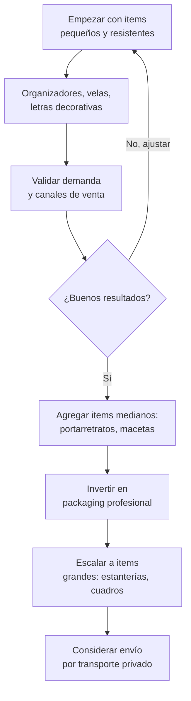
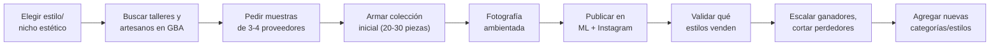

# Decoración y organización del hogar

> **Score: 7.30/10** — Puesto #5 en el ranking de oportunidades

La decoración del hogar es un rubro donde el **diseño agrega un valor enorme** al producto final. Un organizador de madera que cuesta $3,000 ARS en un taller se puede vender a $10,000 ARS si tiene un diseño atractivo y se presenta bien. La tendencia de organización del hogar (impulsada por redes sociales) mantiene la demanda alta y creciente.

<Note>
Este rubro es ideal para quienes tienen **buen ojo estético** o interés en diseño de interiores. La diferenciación no viene del producto en sí, sino de la **curaduría y presentación visual**.
</Note>

---

## Score detallado

| # | Criterio | Peso | Puntaje | Ponderado |
|---|----------|------|---------|-----------|
| 1 | **Margen potencial** | 20% | 8/10 | 1.60 |
| 2 | **Demanda de mercado** | 18% | 7/10 | 1.26 |
| 3 | **Capital requerido** | 15% | 7/10 | 1.05 |
| 4 | **Simplicidad legal** | 12% | 9/10 | 1.08 |
| 5 | **Competencia** | 10% | 6/10 | 0.60 |
| 6 | **Facilidad logística** | 8% | 6/10 | 0.48 |
| 7 | **Accesibilidad de fábricas** | 7% | 7/10 | 0.49 |
| 8 | **Escalabilidad** | 5% | 7/10 | 0.35 |
| 9 | **Puente a importación** | 5% | 8/10 | 0.40 |
| | **Total** | **100%** | | **7.31** |

> **Score 7.31/10 — Bueno** — El diseño como ventaja competitiva lo convierte en un rubro atractivo para emprendedores creativos.

---

## Por qué está en el puesto #5

El rubro decoración combina tres factores poderosos:

1. **El diseño multiplica el valor**: Un mismo producto básico (una caja, una repisa, una vela) puede valer 2x o 3x más con buen diseño y presentación
2. **Simplicidad legal**: No necesitás permisos especiales, certificaciones ni habilitaciones complejas. Con Monotributo alcanza
3. **Tendencia fuerte**: La organización del hogar es una de las tendencias más fuertes en redes sociales, impulsada por contenido de decoración en Instagram, Pinterest y TikTok

---

## Productos con mayor potencial

<CardGroup cols={3}>
<Card title="Organizadores" icon="grid-2">
De escritorio, closet, cocina, baño. Madera, plástico o tela.
</Card>
<Card title="Cajas decorativas" icon="box">
Para almacenamiento con diseño. Madera, cartón duro, mimbre.
</Card>
<Card title="Portarretratos" icon="image">
Individuales, collage, con frases. Madera, acrílico, metal.
</Card>
<Card title="Velas aromáticas" icon="fire">
De soja, cera vegetal. En frascos decorativos, latas, concreto.
</Card>
<Card title="Macetas decorativas" icon="seedling">
Cemento, cerámica, plástico pintado. Para suculentas y plantas.
</Card>
<Card title="Estanterías flotantes" icon="shelves">
Repisas de madera, metal, mixtas. Diferentes tamaños y estilos.
</Card>
<Card title="Lámparas" icon="lightbulb">
De mesa, veladores, guirnaldas LED. Diseños artesanales.
</Card>
<Card title="Cuadros y láminas" icon="frame">
Impresiones enmarcadas, lettering, ilustraciones.
</Card>
<Card title="Letras decorativas" icon="font">
De madera, acrílico, MDF. Nombres, palabras, iniciales.
</Card>
</CardGroup>

---

## Márgenes esperados

| Tipo de producto | Costo fábrica (ARS) | Precio venta (ARS) | Margen aproximado |
|-----------------|---------------------|--------------------|--------------------|
| Organizador de escritorio | $2,000 – $4,000 | $5,000 – $10,000 | 60% – 150% |
| Vela aromática artesanal | $2,500 – $4,000 | $6,000 – $12,000 | 80% – 140% |
| Portarretratos de madera | $2,000 – $3,500 | $5,000 – $9,000 | 60% – 140% |
| Maceta de cemento | $3,000 – $5,000 | $7,000 – $15,000 | 70% – 130% |
| Estantería flotante | $4,000 – $8,000 | $10,000 – $20,000 | 80% – 150% |
| Letras decorativas | $2,500 – $5,000 | $6,000 – $14,000 | 70% – 140% |

<Note>
Todos los precios son **aproximados** para principios de 2026 (1 USD ~ 1,200 ARS). Los márgenes varían significativamente según el diseño, la calidad del acabado y la presentación fotográfica.
</Note>

**Rango general**: Comprás entre **$2,000 – $8,000 ARS** por unidad y vendés entre **$5,000 – $20,000 ARS** con márgenes del **60% al 150%**.

---

## Capital inicial necesario

| Nivel | Inversión (ARS) | Inversión (USD aprox.) | Qué podés hacer |
|-------|-----------------|----------------------|-----------------|
| **Mínimo** | $100,000 | ~USD 85 | 20-30 piezas mixtas para probar demanda |
| **Recomendado** | $150,000 | ~USD 125 | 40-50 piezas, 3-4 categorías diferentes |
| **Cómodo** | $200,000 | ~USD 170 | Stock variado con profundidad, varias líneas |

<Tip>
Empezá con **piezas pequeñas y livianas** (organizadores de escritorio, velas, portarretratos). Son más fáciles de enviar, menos frágiles y requieren menos inversión por unidad. Una vez que valides qué estilo vende, escalá a piezas más grandes.
</Tip>

---

## Situación legal

| Aspecto | Requisito |
|---------|-----------|
| **Habilitación especial** | No necesitás |
| **Certificaciones** | No requeridas |
| **Registro de producto** | No aplica |
| **Lo que sí necesitás** | Monotributo, factura, cuenta bancaria |

La decoración es uno de los rubros con **menor complejidad legal**. No hay regulaciones especiales ni permisos adicionales. Podés empezar a vender apenas tengas tu Monotributo activo.

---

## Logística — El desafío de este rubro

La logística es el punto más débil de decoración. Algunos productos son **frágiles** y otros son **voluminosos**, lo cual complica el envío.

| Producto | Fragilidad | Volumen | Dificultad de envío |
|----------|-----------|---------|---------------------|
| Organizadores plástico | Baja | Medio | Fácil |
| Velas aromáticas | Baja | Bajo | Fácil |
| Portarretratos vidrio | **Alta** | Bajo | Medio |
| Macetas cemento | Media | Medio | **Pesado** |
| Estanterías | Baja | **Alto** | **Voluminoso** |
| Cuadros con vidrio | **Alta** | Medio | Difícil |
| Letras de madera/MDF | Baja | Bajo | Fácil |

<Warning>
**Los productos frágiles pueden destruir tu margen.** Un cuadro con vidrio roto significa perder la venta + el costo del envío de devolución + el reemplazo. Calculá un **5-10% extra** en tu costo por roturas y claims. Para vidrio y cerámica, invertí en **packaging profesional** (plástico burbuja, esquineros, cajas reforzadas) — esto puede costar $500-$1,500 ARS extra por pieza.
</Warning>

### Estrategia logística recomendada

---

## Dónde encontrar proveedores

| Tipo de proveedor | Productos | Zona típica |
|-------------------|-----------|-------------|
| **Carpinterías** | Organizadores, estanterías, portarretratos, letras | GBA Sur y Oeste, talleres en CABA |
| **Talleres de velas** | Velas de soja, aromáticas, decorativas | Toda la zona GBA, muchos artesanos |
| **Fábricas de plástico** | Organizadores, macetas, cajas | Parques industriales GBA |
| **Artesanos cerámica** | Macetas, portavelas, platos decorativos | Ferias de diseño, redes sociales |
| **Talleres de macramé** | Colgantes, atrapasueños, portamacetas | Artesanos independientes |

<Tip>
La mejor zona para empezar a buscar es el **corredor industrial de zona sur del GBA** (Burzaco, Longchamps, Glew). Hay concentración de carpinterías y talleres que trabajan con emprendedores. También revisá ferias de diseño en CABA como fuente de artesanos que producen en volumen.
</Tip>

Para la guía completa de proveedores, consultá [Proveedores de decoración](/app/paso1-argentina/oportunidades/decoracion/proveedores).

---

## Puente a importación desde China

**Score: 8/10 — Alto**

La decoración del hogar es uno de los rubros con **mayor conexión directa** con la importación desde China, especialmente desde **Yiwu** (la capital mundial de los productos pequeños y de bazar).

| Producto local | Equivalente importable | Ciudad de origen |
|----------------|----------------------|------------------|
| Organizadores plástico | Organizadores multifunción | Yiwu, Taizhou |
| Velas aromáticas | Velas + difusores a granel | Ningbo |
| Portarretratos | Marcos de fotos en volumen | Yiwu |
| Macetas | Macetas de cerámica/resina | Chaozhou, Dehua |
| Letras decorativas | Letras LED, neon, acrílico | Yiwu, Shenzhen |
| Lámparas | Lámparas LED decorativas | Zhongshan (capital de iluminación) |

Lo que aprendas vendiendo decoración local te prepara directamente para importar estos productos con márgenes todavía mayores.

---

## Competencia — Nivel medio

| Factor | Descripción |
|--------|-------------|
| **Vendedores en ML** | Muchos, pero mayoría sin curaduría ni estética |
| **Grandes jugadores** | Bazares grandes con precios bajos, poca diferenciación |
| **Tu ventaja** | Curaduría por estilo, fotos profesionales, colecciones temáticas |
| **Diferenciación clave** | Estética consistente > precio bajo |

<Tip>
**La clave para ganar en decoración es curar "colecciones" por estilo.** En lugar de vender productos sueltos sin relación, armá líneas temáticas: "Línea nórdica" (madera clara, blanco, minimalismo), "Línea industrial" (metal, negro, concreto), "Línea boho" (macramé, mimbre, naturales). Esto te diferencia de los bazares genéricos y justifica precios más altos.
</Tip>

---

## Flujo del negocio

---

## Estacionalidad

| Época | Nivel de demanda | Qué vender |
|-------|-----------------|------------|
| **Enero-Febrero** | Alta | Temporada de mudanzas, organización de casa nueva |
| **Marzo-Mayo** | Media | Decoración otoño, velas aromáticas |
| **Junio-Agosto** | Media-baja | Regalos (Día del padre, amigo, madre) |
| **Septiembre-Octubre** | Media | Renovación primaveral, macetas, plantas |
| **Noviembre-Diciembre** | **Muy alta** | Decoración navideña, regalos, renovación de fin de año |

<Warning>
**Noviembre-Diciembre** es la temporada más fuerte. Asegurate de tener stock listo desde **octubre** — los talleres se saturan de pedidos y los tiempos de producción se alargan.
</Warning>

---

## Preguntas frecuentes

<Accordion title="¿Necesito saber de diseño o decoración?">
No necesitás ser diseñador, pero sí necesitás **buen ojo estético**. Seguí cuentas de decoración en Instagram y Pinterest para entrenar tu criterio. Lo más importante es mantener una **línea visual coherente** en lo que vendés.
</Accordion>

<Accordion title="¿Cuánto puedo ganar por mes?">
Estimación aproximada para un emprendedor dedicando tiempo parcial:
- **Mes 1-2**: $50,000 – $100,000 ARS (~USD 40-85) mientras validás productos
- **Mes 3-6**: $150,000 – $300,000 ARS (~USD 125-250) con productos validados
- **Temporada alta** (noviembre-diciembre): Puede duplicarse o triplicarse

Estas cifras dependen de la inversión, dedicación y calidad de las publicaciones.
</Accordion>

<Accordion title="¿Cómo manejo la fragilidad en los envíos?">
Tres reglas: 1) **Empezá con productos no frágiles** (organizadores, velas, letras). 2) Cuando incluyas frágiles, invertí en **packaging profesional** ($500-$1,500 ARS por pieza). 3) Calculá un **porcentaje de pérdida** (5-10%) en tu estructura de costos. Si un producto se rompe mucho en envío, dejá de venderlo por correo y ofrecelo solo con **retiro en persona**.
</Accordion>

<Accordion title="¿Es mejor vender en MercadoLibre o Instagram?">
**Ambos, pero con estrategias diferentes.** MercadoLibre te da volumen y tráfico inmediato. Instagram te permite construir una marca, mostrar ambientes y cobrar precios premium. Lo ideal es usar Instagram para atraer y MercadoLibre para cerrar la venta con la seguridad que da la plataforma.
</Accordion>

<Accordion title="¿Los talleres aceptan pedidos pequeños?">
Muchos talleres y artesanos están acostumbrados a trabajar con emprendedores y aceptan pedidos desde **10-20 unidades**. Las carpinterías suelen tener mínimos un poco más altos (20-50 piezas). Siempre preguntá antes de comprometerte.
</Accordion>

---

## Próximos pasos

<CardGroup cols={2}>
<Card title="Proveedores de decoración" icon="store" href="/app/paso1-argentina/oportunidades/decoracion/proveedores">
Dónde encontrar talleres, carpinterías y artesanos en Argentina
</Card>
<Card title="Estrategia de venta" icon="bullseye" href="/app/paso1-argentina/oportunidades/decoracion/estrategia-venta">
Cómo vender decoración online con estrategia visual
</Card>
</CardGroup>
