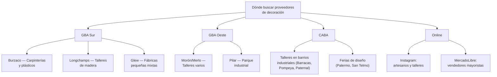

# Proveedores de decoración y organización

Encontrar proveedores de decoración es diferente a otros rubros: no hay grandes fábricas centralizadas, sino una red dispersa de **talleres, carpinterías, artesanos y pequeñas fábricas** que producen distintos tipos de productos. Esto es una ventaja porque te permite armar un catálogo **exclusivo y difícil de copiar**.

<Note>
La mayor ventaja competitiva en decoración es trabajar con **proveedores que no venden directamente al público**. Si conseguís un artesano que produce piezas únicas y solo vende a revendedores, tenés un producto que nadie más ofrece en MercadoLibre.
</Note>

---

## Tipos de proveedores

### 1. Carpinterías y talleres de madera

Producen la mayoría de los productos de decoración más vendidos: organizadores, estanterías flotantes, portarretratos, letras decorativas, bandejas.

| Aspecto | Detalle |
|---------|---------|
| **Productos** | Organizadores, repisas, portarretratos, letras, cajas, bandejas |
| **Material** | MDF, pino, paraíso, plywood, melamina |
| **Pedido mínimo** | 20-50 piezas (varía por taller) |
| **Tiempo de producción** | 7-15 días aproximados |
| **Zona principal** | GBA Sur (Burzaco, Longchamps), GBA Oeste, talleres en CABA |
| **Precio por pieza** | $2,000 – $8,000 ARS aproximado según tamaño y complejidad |

<Tip>
Las carpinterías suelen ofrecer **descuentos importantes por volumen** (10-20% a partir de 50 unidades). Además, muchas aceptan trabajar con **diseños personalizados** sin costo adicional si el volumen lo justifica — esto te permite crear productos exclusivos.
</Tip>

### 2. Talleres de velas aromáticas

La producción de velas artesanales creció mucho en Argentina. Hay talleres que producen en volumen con calidad consistente.

| Aspecto | Detalle |
|---------|---------|
| **Productos** | Velas de soja, cera vegetal, parafina premium, difusores |
| **Contenedores** | Frascos de vidrio, latas, recipientes de concreto, cerámica |
| **Pedido mínimo** | 20-30 unidades |
| **Tiempo de producción** | 5-10 días aproximados |
| **Zona** | Distribuidos en todo GBA y CABA |
| **Precio por pieza** | $2,500 – $5,000 ARS aproximado |

<Note>
Muchos talleres de velas ofrecen **white label** (etiqueta blanca): producen la vela y vos ponés tu marca. Esto es ideal para construir una marca propia de decoración desde el inicio.
</Note>

### 3. Fábricas de plástico e inyección

Producen organizadores, macetas, cajas y contenedores de plástico a gran escala.

| Aspecto | Detalle |
|---------|---------|
| **Productos** | Organizadores multiuso, macetas, cajas apilables, cestos |
| **Pedido mínimo** | 50-100 unidades (más alto que artesanos) |
| **Tiempo de producción** | 10-20 días aproximados |
| **Zona** | Parques industriales GBA (Burzaco, Pilar, Garín) |
| **Precio por pieza** | $1,500 – $4,000 ARS aproximado |
| **Ventaja** | Producción consistente, colores personalizables |

### 4. Artesanos de cerámica y concreto

Producen macetas, portavelas, bandejas y piezas decorativas con acabados únicos.

| Aspecto | Detalle |
|---------|---------|
| **Productos** | Macetas de cemento/cerámica, portavelas, platos decorativos |
| **Pedido mínimo** | 10-20 unidades (los más accesibles) |
| **Tiempo de producción** | 7-14 días aproximados |
| **Zona** | Distribuidos, muchos en ferias de diseño |
| **Precio por pieza** | $3,000 – $6,000 ARS aproximado |

### 5. Artesanos de macramé y textiles

Producen colgantes de pared, atrapasueños, portamacetas, caminos de mesa.

| Aspecto | Detalle |
|---------|---------|
| **Productos** | Colgantes macramé, portamacetas colgantes, atrapasueños, almohadones |
| **Pedido mínimo** | 10-15 unidades |
| **Tiempo de producción** | 10-20 días (trabajo manual intensivo) |
| **Zona** | Artesanos independientes en todo el país |
| **Precio por pieza** | $4,000 – $10,000 ARS aproximado |

---

## Zonas clave para buscar

### Parque industrial zona sur GBA

La zona de **Burzaco, Longchamps y Glew** tiene una alta concentración de talleres y pequeñas fábricas que trabajan madera, plástico y metal. Muchos ya están acostumbrados a vender a emprendedores y revendedores.

### Talleres en CABA

Barrios como **Barracas, Nueva Pompeya, Paternal y Villa Crespo** tienen talleres urbanos más pequeños pero con capacidad de producción. La ventaja es la cercanía para visitas y retiro de mercadería.

### Ferias de diseño y artesanos

Las ferias son la **mejor fuente para descubrir artesanos** que producen en volumen:

| Feria | Ubicación | Frecuencia | Qué encontrás |
|-------|-----------|------------|----------------|
| **Feria de Diseño** (varias) | Palermo, CABA | Semanal/mensual | Diseñadores con producción propia |
| **Mercado de Pulgas** | Dorrego, San Telmo | Fines de semana | Artesanos mixtos, vintage, reciclado |
| **Ferias de emprendedores** | Varios puntos GBA y CABA | Variable | Productores pequeños y medianos |
| **Feria de las colectividades** | Buenos Aires | Anual | Artesanías regionales |

<Tip>
Cuando vayas a una feria, no compres como consumidor. Presentate como **revendedor** y preguntá: "¿Vendés al por mayor?" o "¿Tenés precios para reventa?". Muchos artesanos esperan esta pregunta y tienen una lista de precios mayoristas separada.
</Tip>

---

## Búsqueda online de proveedores

### Instagram

Instagram es la **herramienta principal** para encontrar proveedores de decoración. La mayoría de talleres y artesanos tienen presencia activa.

**Términos de búsqueda sugeridos:**
- `#decoracionmayorista`
- `#velasaromaticasmayorista`
- `#organizadoresmayorista`
- `#carpinteriabuenosaires`
- `#decohogar fabricante`
- `#macrameargentina`
- `#ceramicaargentina`
- `#fabricadecohogar`

### MercadoLibre

Buscá vendedores que publican como "fábrica" o "taller" y contactalos por fuera para precios mayoristas.

### Google

Búsquedas estratégicas:
- `"fábrica de velas" buenos aires mayorista`
- `"carpintería" organizadores "por mayor" GBA`
- `"macetas de cemento" "por mayor" argentina`
- `taller decoración hogar proveedor`

---

## Cómo evaluar un proveedor de decoración

<Steps>
<Step title="Pedir muestras iniciales (3-5 piezas)">
Antes de hacer un pedido grande, comprá algunas unidades al precio minorista. Evaluá la calidad del acabado, los materiales, el peso y la resistencia. En decoración, los **detalles importan mucho**: un mal acabado en la pintura o un borde sin lijar se nota inmediatamente.
</Step>

<Step title="Evaluar consistencia de calidad">
El mayor riesgo con talleres pequeños es que la calidad varíe entre lotes. Pedí 2-3 muestras del **mismo producto** y compará. Si hay diferencias notables, ese proveedor puede ser problemático cuando escales.
</Step>

<Step title="Consultar capacidad de producción">
Preguntá: "¿Cuántas unidades podés producir por semana/mes?" Si la respuesta es muy baja (menos de 50 unidades por mes), ese proveedor sirve para arrancar pero vas a necesitar otro para escalar.
</Step>

<Step title="Negociar precios por volumen">
Siempre preguntá por **escalas de precio**: "¿Cuánto sale si compro 20? ¿Y si compro 50? ¿Y 100?" La mayoría de los talleres dan descuentos significativos a partir de 50 unidades.
</Step>

<Step title="Acordar packaging y protección">
Para productos frágiles, definí con el proveedor **cómo va a venir empaquetado**. Algunos talleres envuelven bien, otros te entregan todo suelto. Acordá de entrada quién pone el packaging de protección y cuánto cuesta.
</Step>

<Step title="Probar un pedido mediano">
Hacé una primera compra de **20-30 unidades**. Verificá que lleguen bien, que la calidad sea consistente y que el proveedor cumpla con los tiempos. Recién después escalá.
</Step>
</Steps>

---

## La ventaja de los diseños exclusivos

<Note>
La diferenciación más poderosa en decoración es tener **productos que nadie más vende**. Muchos talleres y carpinterías aceptan producir diseños personalizados si les presentás un boceto o una foto de referencia.
</Note>

### Cómo lograrlo

1. **Buscá inspiración** en Pinterest, Instagram y tiendas de decoración internacionales
2. **Adaptá el diseño** a lo que el taller puede producir con sus herramientas y materiales
3. **Pedí un prototipo** antes de encargar un lote (costo aproximado: $5,000-$15,000 ARS por el prototipo)
4. **Si funciona bien en ventas**, acordá exclusividad con el taller para ese diseño

Esto te da una ventaja que ningún competidor puede copiar fácilmente: productos únicos que solo se consiguen con vos.

---

## Errores comunes al elegir proveedores

<Warning>
**Cuidado con estos errores frecuentes:**

- **Comprar sin ver muestras**: En decoración la foto puede ser engañosa. Siempre pedí muestras físicas antes de un pedido grande
- **Ignorar la consistencia**: Un proveedor que hace piezas hermosas pero inconsistentes te va a generar problemas con las devoluciones
- **No definir el packaging**: Si el proveedor te entrega todo suelto y algo se rompe en el transporte, la pérdida es tuya
- **Depender de un solo proveedor**: Si tu único carpintero se enferma o cierra, te quedás sin stock. Tené siempre al menos **2 proveedores** por categoría
</Warning>

---

## Proveedores verificados

<Note>
Los siguientes proveedores fueron verificados en febrero 2026. Recomendamos contactar directamente para confirmar disponibilidad, precios y condiciones actuales.
</Note>

<Tabs>
  <Tab title="Iluminarte & Aromanza">
    | Dato | Detalle |
    |------|---------|
    | **Ubicación** | Argentina (consultar dirección) |
    | **Productos** | Velas, sahumerios, difusores y aromatizantes |
    | **Pedido mínimo** | Consultar directamente |
    | **Web** | [iluminarte.com.ar](https://iluminarte.com.ar) |
    | **Ventaja clave** | Mayor importador de Latinoamérica en decoración aromática, fábrica propia |
  </Tab>
  <Tab title="Distribuidora Fénix">
    | Dato | Detalle |
    |------|---------|
    | **Ubicación** | Argentina (consultar dirección) |
    | **Productos** | Velas aromáticas, velones, velas decorativas |
    | **Pedido mínimo** | Consultar directamente |
    | **Web** | [distribuidorafenix.com.ar](https://distribuidorafenix.com.ar) |
    | **Ventaja clave** | Mayorista ideal para bazares y regalerías, envíos nacionales |
  </Tab>
  <Tab title="Arte y Esencias">
    | Dato | Detalle |
    |------|---------|
    | **Ubicación** | Argentina (consultar dirección) |
    | **Productos** | Productos aromáticos y decorativos |
    | **Pedido mínimo** | Consultar directamente |
    | **Web** | [arteyesencias.com](https://arteyesencias.com) |
    | **Ventaja clave** | Mayorista especializado en línea aromática y decorativa |
  </Tab>
  <Tab title="DecoraGloba">
    | Dato | Detalle |
    |------|---------|
    | **Ubicación** | Argentina (consultar dirección) |
    | **Productos** | Velas, fragancias y artículos de decoración |
    | **Pedido mínimo** | Consultar directamente |
    | **Web** | [decoragloba.com](https://decoragloba.com) |
    | **Ventaja clave** | Variedad en velas y fragancias para decoración del hogar |
  </Tab>
</Tabs>

---

## Preguntas frecuentes

<Accordion title="¿Puedo pedir que el proveedor ponga mi marca?">
Sí. Muchos talleres ofrecen **grabado láser** en madera o **etiquetas personalizadas** en velas y productos textiles. El costo adicional es bajo ($200-$800 ARS por pieza aproximado). En plásticos, se necesita un molde nuevo, lo cual es más costoso y solo conviene con volúmenes altos (500+ unidades).
</Accordion>

<Accordion title="¿Cómo pago a los proveedores?">
Los métodos más comunes son: **transferencia bancaria** (el preferido), **efectivo al retirar** (común en talleres), y **MercadoPago** (algunos artesanos). Para primeros pedidos, la mayoría pide **pago al contado o 50% adelantado**. Con relación establecida, algunos dan plazo de 15-30 días.
</Accordion>

<Accordion title="¿Conviene comprar a un artesano individual o a una fábrica?">
Depende de tu estrategia. **Artesanos** te dan productos únicos y flexibilidad, pero con menor volumen y más riesgo de inconsistencia. **Fábricas pequeñas** te dan volumen y consistencia, pero con menos exclusividad. Lo ideal es tener **ambos**: artesanos para piezas premium y fábricas para básicos de volumen.
</Accordion>

<Accordion title="¿Cuántos proveedores necesito para empezar?">
Para empezar, con **2-3 proveedores** de categorías diferentes alcanza. Por ejemplo: una carpintería (organizadores y estantes), un taller de velas, y un artesano de cerámica (macetas). A medida que crezcas, sumá proveedores para ampliar el catálogo y reducir el riesgo de dependencia.
</Accordion>

---

## Próximos pasos

<CardGroup cols={2}>
<Card title="Overview — Decoración" icon="couch" href="/app/paso1-argentina/oportunidades/decoracion/overview">
Volver al análisis completo del rubro
</Card>
<Card title="Estrategia de venta" icon="bullseye" href="/app/paso1-argentina/oportunidades/decoracion/estrategia-venta">
Cómo vender decoración online con estrategia visual
</Card>
</CardGroup>
