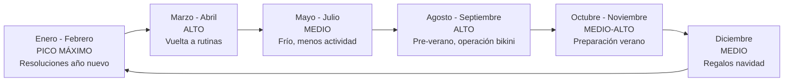
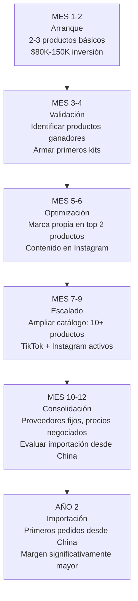

# Estrategia de venta — Fitness y deporte

> La clave para vender accesorios fitness no es solo publicar productos, sino construir una **marca que genere confianza** y ofrecer **kits de valor** que justifiquen un precio más alto que la competencia.

---

## Estrategia en MercadoLibre

MercadoLibre es el canal principal para empezar. Argentina tiene una de las penetraciones de e-commerce más altas de la región, y los accesorios fitness son una categoría con demanda sostenida.

### Tipos de publicaciones recomendadas

<Tabs>
<Tab title="Productos individuales">

Sirven para captar búsquedas específicas y ofrecer el precio más bajo de entrada.

**Mejores prácticas:**
- Título optimizado con palabras clave exactas: "Banda De Resistencia Fitness Ejercicio Gym - Nivel Medio"
- Precio competitivo (no necesariamente el más bajo, pero dentro del rango)
- Fotos claras sobre fondo blanco + foto de uso
- Descripción que incluya especificaciones técnicas: material, medidas, peso, nivel de resistencia

**Ejemplo de título para bandas:**
> `Set X5 Bandas De Resistencia Fitness Gym Ejercicio + Bolsa`

</Tab>
<Tab title="Kits y combos">

Los kits son donde está el **verdadero margen**. Vendés varios productos juntos a un precio que parece un descuento pero que en realidad tiene un markup mayor.

**Mejores prácticas:**
- Título descriptivo del kit: "Kit Yoga Completo Colchoneta + Banda + Bloque - Home Gym"
- Foto principal mostrando todos los elementos del kit juntos
- Descripción que detalle qué incluye y para qué sirve cada elemento
- Incluir regalo digital (guía de ejercicios en PDF)

**Ejemplo de kits con pricing:**

| Kit | Contenido | Costo fábrica (aprox.) | Precio ML (aprox.) | Margen bruto |
|-----|-----------|----------------------|-------------------|-------------|
| Kit Yoga Básico | Colchoneta + banda + guía PDF | $5,500 - $9,000 ARS | $15,000 - $25,000 ARS | 100-170% |
| Kit Home Gym | 5 bandas + soga + tobilleras + guía PDF | $8,500 - $14,000 ARS | $22,000 - $35,000 ARS | 100-160% |
| Kit Starter | 3 bandas + soga + guía PDF | $4,500 - $7,000 ARS | $12,000 - $18,000 ARS | 100-160% |

</Tab>
<Tab title="Publicaciones premium">

Para diferenciarte de la competencia masiva de productos genéricos:

- Usá la opción de **publicación premium** en MercadoLibre (mayor comisión, mayor visibilidad)
- Incluí **video** en la publicación mostrando el producto en uso
- Respondé todas las preguntas en menos de 2 horas
- Ofrecé **envío gratis** (incluido en el precio) para publicaciones de kits

La comisión de publicación premium en MercadoLibre es mayor (aproximadamente 16-19% + IVA según la categoría), pero la visibilidad y tasa de conversión lo compensan si tu margen lo permite.

</Tab>
</Tabs>

---

## Descripción que vende

Una buena descripción en MercadoLibre para accesorios fitness debe incluir:

<Steps>
<Step title="Qué incluye (ser exacto)">
Listar cada elemento del producto o kit, con medidas, colores y materiales. El comprador necesita saber exactamente qué va a recibir.

**Ejemplo:**
> Set de 5 bandas de resistencia de látex natural. Incluye: 1 banda amarilla (extra suave, 0.35mm), 1 banda roja (suave, 0.5mm), 1 banda verde (media, 0.7mm), 1 banda azul (fuerte, 0.9mm), 1 banda negra (extra fuerte, 1.1mm). Largo: 60cm cada una. Incluye bolsa de transporte.
</Step>

<Step title="Para qué sirve (beneficios)">
No todos los compradores saben de fitness. Explicá los beneficios en lenguaje simple.

**Ejemplo:**
> Ideales para tonificar, elongar, rehabilitación y entrenamiento funcional. Podés hacer más de 100 ejercicios diferentes en tu casa, sin necesidad de ir al gimnasio.
</Step>

<Step title="Guía de tallas/intensidades">
Incluí una tabla clara para que el comprador elija bien:

| Color | Intensidad | Ideal para |
|-------|-----------|------------|
| Amarilla | Extra suave | Rehabilitación, principiantes |
| Roja | Suave | Elongación, calentamiento |
| Verde | Media | Entrenamiento general |
| Azul | Fuerte | Tonificación avanzada |
| Negra | Extra fuerte | Fuerza, usuarios avanzados |

</Step>

<Step title="Diferenciador (por qué comprarte a vos)">
Mencioná qué te hace diferente: guía de ejercicios incluida, garantía, atención personalizada.
</Step>
</Steps>

---

## Marketing de contenido

### Instagram

Instagram es el canal ideal para construir marca en fitness. El contenido visual de ejercicios genera engagement naturalmente.

**Estrategia de contenido:**

| Tipo de contenido | Frecuencia sugerida | Objetivo |
|-------------------|-------------------|----------|
| Reels de ejercicios con tus productos | 3-4 por semana | Alcance y visibilidad |
| Fotos de productos (estilo lifestyle) | 2-3 por semana | Mostrar calidad |
| Stories de rutinas rápidas | Diario | Engagement y cercanía |
| Testimonios de clientes | 1-2 por semana | Prueba social |
| Carruseles educativos | 1-2 por semana | Valor y autoridad |

<Tip>
No necesitás ser influencer de fitness ni tener cuerpo de modelo. Podés contratar a un amigo/a que entrene, o simplemente filmar las manos haciendo los ejercicios. Lo importante es mostrar el producto **en acción**.
</Tip>

### TikTok

TikTok tiene un alcance orgánico mucho mayor que Instagram para cuentas nuevas:

- Videos cortos (15-30 segundos) de "ejercicio del día"
- Comparaciones antes/después de calidad de productos
- "Unboxing" de tus propios kits
- Tendencias fitness adaptadas a tus productos

### Guías de ejercicios en PDF

Crear una guía de ejercicios en PDF que incluyas con cada compra es una **inversión mínima con retorno enorme**:

- La creás una sola vez (costo: $0 si la hacés vos, o $5,000-15,000 ARS si contratás diseño)
- La incluís como regalo digital en cada venta
- Agrega valor percibido sin costo adicional por unidad
- Diferenciás tu producto de la competencia genérica
- El cliente siente que recibe más de lo que pagó

---

## Pricing: ejemplo real detallado

Veamos el cálculo completo para un **Kit Home Gym** (producto estrella):

### Estructura de costos

| Concepto | Monto aproximado |
|----------|-----------------|
| 5 bandas de resistencia (costo fábrica) | $4,000 ARS |
| Soga de saltar (costo fábrica) | $2,500 ARS |
| Tobilleras con peso par (costo fábrica) | $5,000 ARS |
| Bolsa de transporte | $800 ARS |
| Packaging y etiqueta | $500 ARS |
| **Costo total del kit** | **$12,800 ARS** |

### Precio y margen

| Concepto | Valor aproximado |
|----------|-----------------|
| Precio de venta en ML | $30,000 ARS |
| Comisión ML (aprox. 17% + IVA) | -$6,200 ARS |
| Costo de envío (si ofrecés gratis) | -$2,500 ARS |
| **Ingreso neto** | **$21,300 ARS** |
| Costo del kit | -$12,800 ARS |
| **Ganancia bruta por kit** | **$8,500 ARS** |
| **Margen bruto** | **~40% sobre venta / ~66% sobre costo** |

<Note>
Este cálculo es aproximado y no incluye impuestos sobre la ganancia (monotributo o ganancias según tu categoría). Los valores en ARS son aproximados para principios de 2026. Consultá con tu contador para un cálculo fiscal preciso.
</Note>

---

## Estacionalidad y calendario de ventas

**Cómo aprovechar la estacionalidad:**

| Mes | Acción recomendada |
|-----|-------------------|
| Noviembre-Diciembre | Stockearse para el pico de enero. Armar kits de regalo navideño. |
| Enero-Febrero | Máxima inversión en publicidad. Publicaciones nuevas. Aprovechar la demanda. |
| Marzo-Abril | Mantener stock. Kits para "vuelta al gym". |
| Mayo-Julio | Reducir stock, enfocarse en indoor (yoga, pilates, bandas). Planificar próximo pico. |
| Agosto-Septiembre | Segundo pico. Kits "operación verano", "pre-summer". |

---

## Cross-selling y upselling

<Tabs>
<Tab title="Cross-selling">
Ofrecer productos complementarios al que el cliente ya compró:

| Si compró... | Ofrecé... |
|-------------|-----------|
| Bandas de resistencia | Colchoneta yoga, guantes de gym |
| Colchoneta yoga | Bloques de yoga, banda de elongación |
| Soga de saltar | Tobilleras con peso, botella deportiva |
| Kit Home Gym | Mancuernas, rueda abdominal |

**Cómo hacerlo en ML:**
- Incluir productos relacionados en la descripción
- Usar la función de "productos relacionados" de MercadoLibre
- Después de cada venta, enviar un mensaje al comprador con un descuento para el segundo producto
</Tab>
<Tab title="Upselling">
Ofrecer una versión superior del producto que el cliente está viendo:

| Si mira... | Ofrecé como upgrade... |
|------------|----------------------|
| Set x3 bandas | Set x5 bandas + bolsa |
| Banda individual | Kit completo con guía |
| Colchoneta básica | Colchoneta premium + bolsa de transporte |

**Cómo hacerlo en ML:**
- En la descripción del producto individual, mencioná el kit completo con link
- Usá variaciones de publicación para mostrar las opciones de upgrade
</Tab>
</Tabs>

---

## Camino de crecimiento

### Detalle por etapa

<Accordion title="Mes 1-2: Arranque">
- **Inversión:** $80,000-150,000 ARS (USD 65-125 aprox.)
- **Productos:** 2-3 productos básicos (bandas, sogas, tobilleras)
- **Canal:** MercadoLibre únicamente
- **Objetivo:** Hacer las primeras 20-30 ventas, aprender el proceso
- **Ingreso estimado:** $30,000-80,000 ARS/mes bruto (muy variable al inicio)
</Accordion>

<Accordion title="Mes 3-4: Validación">
- **Inversión adicional:** Reinvertir ganancias ($50,000-100,000 ARS)
- **Productos:** Agregar 2-3 productos más, crear primeros kits
- **Canal:** MercadoLibre + Instagram (crear cuenta)
- **Objetivo:** Identificar qué productos y kits se venden mejor
- **Ingreso estimado:** $60,000-150,000 ARS/mes bruto (aproximado)
</Accordion>

<Accordion title="Mes 5-6: Optimización">
- **Inversión adicional:** $100,000-200,000 ARS para marca propia
- **Productos:** Marca propia en los 2 productos estrella
- **Canal:** MercadoLibre + Instagram activo (3-4 posts/semana)
- **Objetivo:** Diferenciarse de la competencia, construir marca
- **Ingreso estimado:** $100,000-250,000 ARS/mes bruto (aproximado)
</Accordion>

<Accordion title="Mes 7-12: Escalado y consolidación">
- **Catálogo:** 10+ productos, 5+ kits
- **Canales:** MercadoLibre + Instagram + TikTok + tienda propia opcional
- **Equipo:** Posiblemente necesités ayuda para embalaje y envíos
- **Objetivo:** Volumen sostenido, proveedores fijos, preparar importación
- **Ingreso estimado:** $150,000-400,000 ARS/mes bruto (aproximado)
</Accordion>

---

## Proyección de ganancias mensuales

<Warning>
Las siguientes proyecciones son **estimaciones aproximadas** basadas en escenarios promedio. Los resultados reales varían según la dedicación, calidad de las publicaciones, capital disponible y condiciones del mercado. No representan garantías de ingresos.
</Warning>

| Escenario | Ventas/mes | Ticket promedio (aprox.) | Ingreso bruto/mes (aprox.) | Ganancia neta estimada/mes (aprox.) |
|-----------|-----------|------------------------|--------------------------|-----------------------------------|
| Conservador (inicio) | 15-25 | $12,000 ARS | $180,000 - $300,000 ARS | $40,000 - $80,000 ARS |
| Moderado (3-6 meses) | 40-70 | $15,000 ARS | $600,000 - $1,050,000 ARS | $120,000 - $250,000 ARS |
| Optimista (6-12 meses) | 80-150 | $18,000 ARS | $1,440,000 - $2,700,000 ARS | $300,000 - $600,000 ARS |

<Note>
La ganancia neta estimada descuenta costo de producto, comisiones de MercadoLibre, envío y packaging. **No incluye** impuestos (monotributo o responsable inscripto). Consultá con tu contador para el cálculo fiscal.
</Note>

---

## Errores comunes a evitar

<Accordion title="Publicar sin fotos profesionales">
Una foto oscura o borrosa mata la venta. No necesitás un fotógrafo profesional, pero sí:
- Fondo blanco o neutro
- Buena iluminación natural
- Al menos 5 fotos: producto solo, en uso, detalle de material, kit completo, tamaño referencial
- Luz del día cerca de una ventana es suficiente
</Accordion>

<Accordion title="Competir solo por precio">
Si tu única estrategia es ser el más barato, siempre va a aparecer alguien que venda más barato. En cambio, competí por:
- Mejor presentación (fotos, descripción, packaging)
- Valor agregado (guía de ejercicios, atención personalizada)
- Kits que nadie más arma
- Velocidad de envío y respuesta
</Accordion>

<Accordion title="No responder preguntas rápido">
En MercadoLibre, la velocidad de respuesta a preguntas impacta directamente en el posicionamiento de tu publicación. Respondé en menos de 2 horas durante el horario comercial. Activá las notificaciones en el celular.
</Accordion>

<Accordion title="Stockearse de un solo producto">
No pongas todo el capital en un solo producto. Diversificá entre 2-3 productos para:
- Reducir el riesgo si uno no se vende
- Testear qué funciona mejor
- Ofrecer kits combinados
</Accordion>

---

## Siguiente paso

<CardGroup cols={2}>
<Card title="Encontrar proveedores" icon="store" href="/app/paso1-argentina/oportunidades/fitness/proveedores">
Dónde y cómo encontrar fábricas de accesorios fitness en Argentina
</Card>
<Card title="Volver al overview" icon="dumbbell" href="/app/paso1-argentina/oportunidades/fitness/overview">
Volver a la página principal del rubro fitness
</Card>
</CardGroup>
