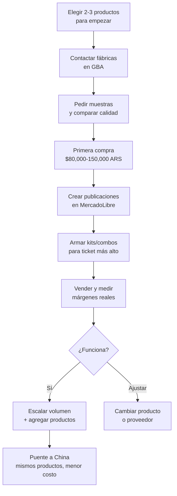

# Fitness y deporte — Rubro #3

> **Score: 7.77/10** — Tercer mejor rubro para compra-reventa con fábricas argentinas.

El rubro fitness combina tres ventajas que pocos rubros ofrecen: **logística perfecta** (productos livianos, compactos y no frágiles), **márgenes altos** (80-150%) y un **puente excelente hacia la importación desde China**, donde los mismos productos cuestan una fracción del precio.

---

## Score detallado

| # | Criterio | Peso | Puntaje | Ponderado |
|---|----------|------|---------|-----------|
| 1 | Margen potencial | 20% | 8 | 1.60 |
| 2 | Demanda de mercado | 18% | 7 | 1.26 |
| 3 | Capital requerido | 15% | 8 | 1.20 |
| 4 | Simplicidad legal | 12% | 9 | 1.08 |
| 5 | Competencia | 10% | 7 | 0.70 |
| 6 | Facilidad logística | 8% | 9 | 0.72 |
| 7 | Accesibilidad de fábricas | 7% | 6 | 0.42 |
| 8 | Escalabilidad | 5% | 7 | 0.35 |
| 9 | Puente a importación | 5% | 9 | 0.45 |
| | **TOTAL** | **100%** | | **7.78** |

<Note>
El score de 7.78 lo ubica como el **tercer mejor rubro** del ranking general, por detrás de accesorios de celular (#1) y bijouterie/accesorios (#2). Para entender cómo se calculan estos scores, consultá [Criterios de evaluación](/app/paso1-argentina/oportunidades/criterios-evaluacion).
</Note>

---

## Por qué fitness es el rubro #3

<CardGroup cols={3}>
<Card title="Logística perfecta" icon="truck">
Productos livianos, compactos y apilables. Una caja de bandas de resistencia pesa menos de 2 kg. Ideal para envíos por correo.
</Card>
<Card title="Márgenes altos" icon="money-bill">
El markup sobre accesorios deportivos va del 80% al 150%. Un set de bandas que comprás a $3,000 ARS lo vendés a $7,500 ARS o más.
</Card>
<Card title="Puente a China" icon="globe">
Bandas, colchonetas yoga y accesorios fitness son de los productos más baratos de importar desde China. Empezar local te prepara para dar el salto.
</Card>
</CardGroup>

---

## Productos principales

<Tabs>
<Tab title="Accesorios de ejercicio">

| Producto | Costo fábrica (aprox.) | Precio venta (aprox.) | Margen estimado |
|----------|----------------------|---------------------|-----------------|
| Bandas de resistencia (set x5) | $3,000 - $5,000 ARS | $7,500 - $12,000 ARS | 100-150% |
| Colchoneta yoga/pilates | $4,000 - $8,000 ARS | $10,000 - $20,000 ARS | 100-150% |
| Soga de saltar | $2,000 - $3,500 ARS | $5,000 - $8,000 ARS | 80-130% |
| Pelota pilates 65cm | $3,500 - $6,000 ARS | $8,000 - $15,000 ARS | 100-130% |
| Tobilleras con peso (par) | $4,000 - $7,000 ARS | $10,000 - $18,000 ARS | 100-150% |

<Tip>
Todos los costos en ARS son aproximados para principios de 2026 (1 USD ≈ 1,200 ARS aproximadamente). Los precios de fábrica pueden variar según volumen y proveedor.
</Tip>

</Tab>
<Tab title="Accesorios complementarios">

| Producto | Costo fábrica (aprox.) | Precio venta (aprox.) | Margen estimado |
|----------|----------------------|---------------------|-----------------|
| Guantes de gym | $2,500 - $4,500 ARS | $6,000 - $10,000 ARS | 80-140% |
| Botella deportiva 750ml | $2,000 - $3,500 ARS | $5,000 - $8,000 ARS | 80-130% |
| Mancuernas 2kg (par) | $5,000 - $8,000 ARS | $12,000 - $20,000 ARS | 100-140% |
| Banda de elongación | $1,500 - $2,500 ARS | $4,000 - $6,000 ARS | 100-140% |
| Rueda abdominal | $3,000 - $5,000 ARS | $7,000 - $12,000 ARS | 80-140% |

</Tab>
</Tabs>

---

## Flujo del negocio

---

## Análisis detallado por criterio

<Accordion title="Margen potencial — 8/10">
Los accesorios de fitness ofrecen márgenes del **80% al 150%** en la mayoría de los productos. Esto se debe a que:

- El costo de materiales (caucho, foam, plástico) es bajo
- El valor percibido por el consumidor es alto (salud/bienestar)
- Los kits y combos permiten aumentar el ticket promedio

**Ejemplo concreto:** Un set de 5 bandas de resistencia de distintas intensidades tiene un costo de fábrica aproximado de $3,000-5,000 ARS (USD 2.50-4.20 aprox.) y se vende en MercadoLibre entre $7,500-12,000 ARS (USD 6.25-10 aprox.), dejando un margen bruto del 100-150% antes de comisiones.
</Accordion>

<Accordion title="Demanda de mercado — 7/10">
El mercado fitness en Argentina está en crecimiento sostenido. Factores clave:

- Tendencia global hacia la salud y el ejercicio en casa
- Post-pandemia muchos adoptaron el entrenamiento en casa como hábito permanente
- Los accesorios son la puerta de entrada más accesible al fitness
- Estacionalidad marcada pero con demanda base todo el año

**Pico de demanda:** enero-marzo (resoluciones de año nuevo, vuelta al gym). Segundo pico menor en agosto-septiembre (pre-verano).
</Accordion>

<Accordion title="Capital requerido — 8/10">
Una de las grandes ventajas del rubro. Con una inversión inicial de **$80,000 a $150,000 ARS (aproximadamente USD 65-125)** podés armar un stock inicial variado.

**Ejemplo de primera compra:**

| Producto | Cantidad | Costo unitario (aprox.) | Subtotal (aprox.) |
|----------|----------|----------------------|-------------------|
| Sets bandas x5 | 15 unidades | $3,500 ARS | $52,500 ARS |
| Sogas de saltar | 10 unidades | $2,500 ARS | $25,000 ARS |
| Tobilleras con peso | 8 pares | $5,000 ARS | $40,000 ARS |
| **Total** | | | **$117,500 ARS** |

Eso equivale a aproximadamente **USD 98** de inversión inicial.
</Accordion>

<Accordion title="Simplicidad legal — 9/10">
Uno de los rubros más simples en materia regulatoria:

- **No requiere** habilitaciones especiales de ANMAT
- **No requiere** certificaciones de SENASA
- **No requiere** permisos de importación especiales (si luego importás)
- Solo necesitás la **inscripción fiscal básica** (monotributo o responsable inscripto)
- Facturación estándar

La única consideración es que si vendés productos como "terapéuticos" o "médicos", ahí sí entrarías en regulaciones de ANMAT. Evitalo: vendé como accesorios deportivos.
</Accordion>

<Accordion title="Competencia — 7/10">
Competencia media-alta pero con espacio para diferenciarse:

- Hay vendedores establecidos en MercadoLibre, pero muchos venden productos genéricos sin diferenciación
- La estrategia de **kits personalizados** y **contenido de valor** (guías de ejercicios) te da una ventaja competitiva
- El mercado sigue creciendo, por lo que hay espacio para nuevos jugadores

**Cómo diferenciarte:**
- Crear kits temáticos (kit yoga, kit home gym, kit rehabilitación)
- Incluir guías de ejercicios en PDF con cada compra
- Fotos profesionales y descripciones detalladas
</Accordion>

<Accordion title="Facilidad logística — 9/10">
Este es el punto fuerte del rubro. Los accesorios fitness son ideales para e-commerce:

- **Livianos:** La mayoría pesa menos de 2 kg
- **Compactos:** Se apilan fácilmente, ocupan poco espacio
- **No frágiles:** Caucho, tela y plástico resistente
- **Fácil de embalar:** No requiere packaging especial
- **Costo de envío bajo:** Por su peso y tamaño, el envío es económico

Un departamento de 2 ambientes puede funcionar como depósito para los primeros meses.
</Accordion>

<Accordion title="Accesibilidad de fábricas — 6/10">
Moderada. No hay tantas fábricas de accesorios deportivos como de indumentaria o alimentos, pero se pueden encontrar:

- Talleres de **caucho y silicona** en el GBA (fabrican bandas, pelotas)
- Fabricantes de **foam/EVA** (colchonetas, rollers)
- Talleres **textiles** que hacen guantes, tobilleras, fundas
- Fabricantes de **plástico** (botellas deportivas, ruedas abdominales)

Las zonas industriales de **Avellaneda, Lanús, Quilmes y Morón** son los mejores lugares para buscar.
</Accordion>

<Accordion title="Escalabilidad — 7/10">
Buena escalabilidad con camino claro de crecimiento:

1. **Etapa 1:** 2-3 productos básicos (bandas, sogas, tobilleras)
2. **Etapa 2:** Agregar kits temáticos y más variedad
3. **Etapa 3:** Marca propia (private label) en productos estrella
4. **Etapa 4:** Importar desde China los mismos productos a menor costo
5. **Etapa 5:** Expandir a equipamiento más grande (bancos, barras)

El crecimiento es orgánico y cada etapa financia la siguiente.
</Accordion>

<Accordion title="Puente a importación — 9/10">
Este es uno de los puntos más altos del rubro. Los accesorios fitness son de los productos **más fáciles y rentables** para importar desde China:

- Bandas de resistencia: costo China aproximado USD 0.30-0.80 por set
- Colchonetas yoga: costo China aproximado USD 2-5 por unidad
- Sogas de saltar: costo China aproximado USD 0.50-1.50 por unidad

Empezar comprando a fábricas argentinas te permite:
- Aprender el mercado y qué productos se venden mejor
- Construir una base de clientes
- Entender la logística de envíos
- Luego migrar a importación con márgenes aún mejores
</Accordion>

---

## Dónde encontrar proveedores

<CardGroup cols={2}>
<Card title="Talleres de caucho/textil en GBA" icon="industry">
Zonas industriales de Avellaneda, Lanús, Quilmes y Morón concentran fabricantes de artículos de caucho, foam y textiles que producen accesorios deportivos.
</Card>
<Card title="Fabricantes especializados" icon="dumbbell">
Empresas que se dedican específicamente a artículos deportivos. Son menos pero ofrecen mayor variedad y calidad consistente.
</Card>
</CardGroup>

<Tip>
Para la guía completa de cómo encontrar y evaluar proveedores de fitness, consultá [Proveedores de fitness](/app/paso1-argentina/oportunidades/fitness/proveedores).
</Tip>

---

## Inversión inicial y retorno esperado

| Concepto | Valor aproximado |
|----------|-----------------|
| Primera compra de stock | $80,000 - $150,000 ARS (USD 65-125 aprox.) |
| Packaging y etiquetas | $10,000 - $20,000 ARS (USD 8-17 aprox.) |
| Fotos y publicaciones | $0 (celular) - $15,000 ARS (fotógrafo) |
| **Inversión total inicial** | **$90,000 - $185,000 ARS (USD 75-155 aprox.)** |
| Tiempo hasta primera venta | 1-2 semanas |
| Punto de equilibrio estimado | 1-2 meses |

<Warning>
Las estimaciones de retorno son aproximadas y dependen de múltiples factores: calidad de las publicaciones, precios competitivos, velocidad de envío y atención al cliente. No hay garantías de resultados específicos.
</Warning>

---

## La estrategia ganadora: kits y combos

<Tip>
La clave para maximizar el ticket promedio es **vender kits temáticos** en lugar de productos sueltos. Un combo de banda + colchoneta + guía de ejercicios en PDF tiene un valor percibido mucho mayor que los productos individuales sumados.
</Tip>

**Ejemplos de kits que funcionan:**

| Kit | Productos incluidos | Costo total fábrica (aprox.) | Precio venta (aprox.) | Margen estimado |
|-----|-------------------|----------------------------|---------------------|-----------------|
| Kit Yoga Básico | Colchoneta + banda elongación + guía PDF | $5,500 - $9,000 ARS | $15,000 - $25,000 ARS | 100-170% |
| Kit Home Gym | 5 bandas + soga + tobilleras + guía PDF | $8,500 - $14,000 ARS | $22,000 - $35,000 ARS | 100-160% |
| Kit Rehabilitación | 3 bandas suaves + pelota pilates + guía PDF | $5,000 - $8,000 ARS | $13,000 - $20,000 ARS | 100-160% |

La guía de ejercicios en PDF no tiene costo adicional (la creás una vez) pero agrega valor percibido y diferenciación.

---

## Advertencias importantes

<Warning>
**Calidad de las bandas de resistencia:** Las bandas de caucho de baja calidad pueden **cortarse o romperse durante el uso**, lo que es peligroso para el usuario. Siempre pedí muestras antes de comprar por volumen y probá la elasticidad y resistencia. Un producto que se rompe genera reclamos, devoluciones y mala reputación.
</Warning>

<Warning>
**No vendas como "terapéutico" ni "médico":** Si describís tus productos como dispositivos médicos o terapéuticos, entrás en la órbita de ANMAT y necesitás habilitaciones especiales. Vendé siempre como "accesorios deportivos" o "accesorios para ejercicio".
</Warning>

---

## Preguntas frecuentes

<Accordion title="¿Qué producto elegir para empezar?">
Las **bandas de resistencia** son el producto ideal para empezar por varias razones:

- Bajo costo unitario (podés comprar más unidades con poco capital)
- Logística muy fácil (pesan muy poco, son compactas)
- Alta demanda en todas las épocas del año
- Margen alto (100-150%)
- Fácil de armar kits (set x3, set x5, con accesorios)

Si querés diversificar desde el inicio, la combinación de **bandas + sogas de saltar** cubre dos rangos de precio y dos públicos distintos.
</Accordion>

<Accordion title="¿Necesito saber de fitness para vender estos productos?">
**No es obligatorio**, pero ayuda mucho. No necesitás ser instructor de gym, pero sí conviene:

- Conocer los nombres correctos de los ejercicios
- Entender las diferencias entre intensidades de bandas
- Saber para qué sirve cada producto
- Poder responder preguntas básicas de los compradores

Una buena forma de aprender rápido es ver videos de YouTube sobre los productos que vendés. Eso te dará conocimiento suficiente para crear buenas descripciones y responder consultas.
</Accordion>

<Accordion title="¿Es mejor vender kits o productos individuales?">
**Ambos, pero priorizá los kits.** La estrategia recomendada es:

- Publicá **productos individuales** para captar búsquedas específicas y ofrecer el precio más bajo
- Publicá **kits/combos** para aumentar el ticket promedio y diferenciarte de la competencia
- Usá las publicaciones individuales como "puerta de entrada" y ofrecé el kit como upgrade en la descripción

En la práctica, los kits suelen generar **mayor margen porcentual** porque el valor percibido del combo es mayor que la suma de las partes.
</Accordion>

<Accordion title="¿Cuánto tiempo lleva armar el negocio?">
Con dedicación parcial (algunas horas por día), estimá:

| Etapa | Tiempo aproximado |
|-------|-------------------|
| Buscar y contactar proveedores | 1-2 semanas |
| Pedir muestras y evaluar | 1 semana |
| Hacer primera compra | 1-3 días |
| Crear publicaciones en ML | 2-3 días |
| Primera venta | 1-2 semanas después de publicar |
| **Total hasta primera venta** | **3-5 semanas** |
</Accordion>

---

## Siguiente paso

<CardGroup cols={2}>
<Card title="Encontrar proveedores" icon="store" href="/app/paso1-argentina/oportunidades/fitness/proveedores">
Dónde y cómo encontrar fábricas de accesorios fitness en Argentina
</Card>
<Card title="Estrategia de venta" icon="bullseye" href="/app/paso1-argentina/oportunidades/fitness/estrategia-venta">
Cómo vender fitness online: kits, precios, contenido y crecimiento
</Card>
</CardGroup>
