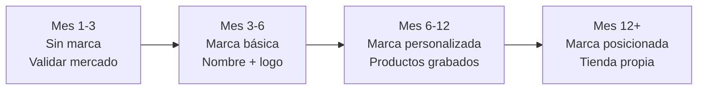

# Estrategia de venta — Marroquinería

Marroquinería tiene una ventaja sobre bijouterie en ventas: el **ticket promedio es más alto**. Eso significa que necesitás menos ventas para alcanzar buenos ingresos. Pero también requiere mejor presentación, porque el comprador evalúa más antes de gastar $10,000-25,000 ARS (~USD 8-21 aproximado) en un producto.

---

## Estrategia en MercadoLibre

### Optimización de publicaciones

| Elemento | Qué hacer | Ejemplo para marroquinería |
|----------|-----------|---------------------------|
| **Título** | Material + producto + característica clave + beneficio | "Mochila Urbana Eco Cuero — Porta Notebook 15 — Impermeable" |
| **Fotos** | Mínimo 8 fotos profesionales | Producto, detalles, interior, puesta, medidas, lifestyle |
| **Descripción** | Material, medidas exactas, capacidad, bolsillos, cuidados | Ver formato abajo |
| **Ficha técnica** | Completar TODOS los atributos que ML pide | Material, color, tipo, marca |
| **Precio** | Investigar competencia, posicionarse en el rango medio-alto | Costo x 2.5-3.0 |

### Estructura de descripción optimizada

```
MATERIAL: Eco cuero premium / Cuero genuino / PU texturizado
MEDIDAS: Alto x Ancho x Profundidad en cm
CAPACIDAD: Porta notebook hasta [X]" / Capacidad [X] litros
BOLSILLOS: [Cantidad] externos + [Cantidad] internos
CIERRE: Principal + bolsillos con cierre YKK / metálico
COLOR: [Color] — Las fotos son reales, tomadas con luz natural

CARACTERÍSTICAS:
- [Material específico] resistente al uso diario
- Interior forrado con tela de calidad
- Tiras ajustables / Correa regulable
- [Otra característica relevante]

CUIDADOS:
- Limpiar con paño húmedo
- No exponer al sol directo por tiempo prolongado
- [Otros cuidados según material]

ENVÍO:
- MercadoEnvíos a todo el país — Gratis
- Despacho en 24-48h hábiles
```

<Tip>
En marroquinería, los atributos de la ficha técnica son muy importantes. MercadoLibre los usa para filtros. Si no completás "tipo de producto", "material" y "color", tu publicación no aparece cuando el comprador filtra por esas opciones.
</Tip>

### Categorías recomendadas en ML

- Carteras y Bolsos > Carteras de Mano
- Carteras y Bolsos > Mochilas
- Carteras y Bolsos > Riñoneras
- Carteras y Bolsos > Bandoleras
- Carteras y Bolsos > Billeteras y Monederos
- Equipaje > Porta Notebooks

---

## Fotografía de marroquinería

Fotografiar carteras y bolsos requiere más cuidado que bijouterie. El comprador quiere ver detalles, interior, capacidad y cómo luce puesto.

<Steps>
<Step title="Preparación del producto">
Antes de fotografiar:
- **Rellenalo** con papel de seda o tela para que mantenga la forma
- **Limpialo** con un paño suave para quitar polvo o marcas
- **Planificá los accesorios**: monedero dentro, notebook asomando, cartera con objetos de referencia

La presentación del producto en las fotos determina en gran medida si el comprador hace clic o no.
</Step>

<Step title="Fotos obligatorias (8 mínimo)">
1. **Frente completo**: producto de frente, relleno, fondo blanco
2. **Perfil/lateral**: para mostrar profundidad y volumen
3. **Atrás**: bolsillos traseros, diseño posterior
4. **Interior abierto**: mostrá todos los bolsillos y compartimentos
5. **Detalle de cierre**: cierre principal y cierres de bolsillos
6. **Detalle de costura**: para demostrar calidad de fabricación
7. **Con objetos de referencia**: notebook dentro, celular en bolsillo, etc.
8. **Foto lifestyle**: producto puesto o en contexto de uso

Opcional pero recomendado:
- Foto de medidas con centímetro visible
- Foto del producto doblado o guardado (si aplica)
- Foto de la etiqueta con material y marca
</Step>

<Step title="Tips de iluminación para cuero y eco cuero">
El cuero y eco cuero tienen superficies que reflejan la luz. Para evitar brillos excesivos:

- Usá **luz natural difusa** (día nublado o ventana con cortina blanca)
- Evitá el flash del celular (genera brillos antiestéticos)
- Si hay brillos, mové el producto ligeramente hasta que desaparezcan
- Fotografiá en ángulo levemente desde arriba (30-45 grados) para minimizar reflejos
</Step>

<Step title="Ángulos que venden">
El ángulo de la foto cambia la percepción del producto:

| Ángulo | Uso | Efecto |
|--------|-----|--------|
| **Frontal recto** | Foto principal | Muestra el diseño completo |
| **45 grados arriba** | Foto de contexto | Muestra volumen y forma real |
| **Cenital (arriba)** | Interior abierto | Muestra organización y bolsillos |
| **Lateral puro** | Perfil | Muestra profundidad |
| **Detalle macro** | Cierres, costuras | Transmite calidad |
</Step>
</Steps>

<Warning>
En marroquinería, las fotos con el producto arrugado, desinflado o con mala luz son un error grave. El comprador asocia eso con baja calidad. Siempre rellenalo con papel para que mantenga su forma en las fotos.
</Warning>

---

## Estrategia de pricing

### Fórmula base

```
Precio de venta ML = Costo producto / (1 - 0.16 comisión - 0.08 envío - 0.05 impuestos)
```

### Ejemplo práctico completo

| Concepto | Mochila eco cuero | Cartera cuero genuino |
|----------|-------------------|----------------------|
| **Costo fábrica** | $5,500 ARS (~USD 4.60) | $12,000 ARS (~USD 10.00) |
| **Factor multiplicador** | x 2.8 | x 2.5 |
| **Precio de venta ML** | $15,400 ARS (~USD 12.85) | $30,000 ARS (~USD 25.00) |
| Comisión ML (~16%) | -$2,464 ARS | -$4,800 ARS |
| Costo envío (~8%) | -$1,232 ARS | -$2,400 ARS |
| Impuestos (~5%) | -$770 ARS | -$1,500 ARS |
| **Ganancia neta** | **$5,434 ARS (~USD 4.53)** | **$9,300 ARS (~USD 7.75)** |
| **Margen neto** | **~35%** | **~31%** |

<Note>
Los porcentajes de comisión, envío e impuestos son aproximados y varían según la categoría específica de MercadoLibre y tu situación fiscal. Siempre calculá con tus datos reales.
</Note>

---

## El camino de la marca propia

Una de las mayores ventajas de marroquinería es la posibilidad de crear tu marca desde el primer día. Esto te diferencia de la competencia y construye un activo a largo plazo.

<Tabs>
<Tab title="Fase 1: Sin marca">
**Meses 1-3**

- Vendés productos genéricos de fábrica
- Aprendés qué se vende y qué no
- Probás distintos proveedores
- Inversión en marca: $0

**Objetivo:** Validar el mercado y aprender el negocio.
</Tab>

<Tab title="Fase 2: Marca básica">
**Meses 3-6**

- Elegís un nombre para tu marca
- Diseñás un logo simple (podés usar Canva, costo: $0)
- Pedís tarjetas de marca impresas (~$3,000-5,000 ARS, ~USD 2.50-4.15 aproximado por 500 tarjetas)
- Empezás a incluir packaging con tu identidad (bolsa kraft + sticker)

**Inversión en marca:** $5,000-10,000 ARS (~USD 4-8 aproximado)
</Tab>

<Tab title="Fase 3: Marca personalizada">
**Meses 6-12**

- Contactás a Madu u otro proveedor que personalice
- Pedís grabado de logo o etiqueta interior con tu marca
- Elegís colores y modelos exclusivos si el volumen lo justifica
- Registrás la marca en INPI (~$10,000-15,000 ARS, ~USD 8-12 aproximado)

**Inversión en marca:** $15,000-30,000 ARS (~USD 12-25 aproximado)
</Tab>

<Tab title="Fase 4: Marca posicionada">
**Después de mes 12**

- Tienda online propia (Tiendanube: $0-15,000 ARS/mes, ~USD 0-12 aproximado)
- Presencia en Instagram con identidad visual definida
- Productos exclusivos con tu marca grabada
- Posibilidad de vender a otros revendedores como mayorista

**Inversión en marca:** Variable según ambición de crecimiento
</Tab>
</Tabs>



---

## Estrategia estacional

| Fecha/Temporada | Qué preparar | Productos estrella | Cuándo stockear |
|-----------------|-------------|-------------------|----------------|
| **Vuelta a clases (mar)** | Mochilas, porta notebooks | Mochilas urbanas, fundas notebook | Febrero |
| **Día de la Madre (oct)** | Carteras regalo, combos | Carteras + billetera, kits con packaging | Septiembre |
| **Navidad (dic)** | Todo el catálogo, packaging regalo | Sets, billeteras, riñoneras (regalo fácil) | Noviembre |
| **Black Friday (nov)** | Ofertas y combos | Liquidación de modelos menos vendidos + ofertas en top sellers | Octubre |
| **Invierno (jun-ago)** | Mochilas, materas, porta termos | Materas, mochilas de cuero | Mayo |
| **Verano (dic-feb)** | Riñoneras, bolsos playeros, bandoleras | Riñoneras, mini mochilas | Noviembre |

<Tip>
Marroquinería tiene demanda constante todo el año, pero los picos estacionales pueden representar un aumento del 150-300% en ventas. La clave es tener stock listo 4-6 semanas antes de cada fecha clave.
</Tip>

---

## Proyección de ganancias

<Warning>
Estas proyecciones son **estimaciones aproximadas** basadas en dedicación de 3-5 horas diarias, reinversión de ganancias, y condiciones de mercado de inicios de 2026. Los resultados reales pueden variar significativamente.
</Warning>

| Período | Productos en venta | Ventas/mes | Facturación aprox. | Ganancia neta aprox. |
|---------|-------------------|-----------|--------------------|--------------------|
| **Mes 1-3** | 8-15 publicaciones | 10-25 unidades | $100,000-350,000 ARS (~USD 85-290) | $30,000-120,000 ARS (~USD 25-100) |
| **Mes 4-6** | 15-30 publicaciones | 25-50 unidades | $350,000-750,000 ARS (~USD 290-625) | $120,000-260,000 ARS (~USD 100-215) |
| **Mes 6-12** | 30-50 publicaciones | 50-100 unidades | $750,000-1,500,000 ARS (~USD 625-1,250) | $260,000-520,000 ARS (~USD 215-435) |

**Variables que afectan estas proyecciones:**
- Calidad de las fotos y descripciones
- Velocidad de respuesta a consultas
- Selección de productos (modelos ganadores vs. flojos)
- Reputación acumulada en MercadoLibre
- Capital disponible para reinvertir

---

## Errores comunes en venta de marroquinería

<Accordion title="No describir el material correctamente">
Decir "cuero" cuando es eco cuero genera devoluciones y malas reseñas. Siempre especificá el material exacto: eco cuero, cuero sintético, PU, cuero vacuno genuino, etc. La honradez construye reputación.
</Accordion>

<Accordion title="Fotos con el producto desinflado">
Una mochila o cartera vacía y arrugada en la foto transmite baja calidad. Siempre rellenalo con papel de seda o tela. Es la diferencia entre una foto que vende y una que ahuyenta.
</Accordion>

<Accordion title="No incluir medidas exactas">
El comprador no puede tocar el producto. Si no ponés medidas exactas (alto x ancho x profundidad), recibís consultas que retrasan la venta o, peor, devoluciones porque "era más chica de lo que pensé". Incluí siempre una foto con centímetro o regla visible.
</Accordion>

<Accordion title="Ignorar la competencia en la misma categoría">
Antes de publicar, buscá productos similares en ML. Mirá sus precios, fotos y reseñas. Si tu precio es 30% más alto que la competencia con fotos similares, necesitás justificar ese precio con mejor presentación, marca o diferenciación clara.
</Accordion>

<Accordion title="No tener stock de reposición">
Si un producto se vende bien y se te acaba el stock, perdés el impulso de la publicación. ML premia las publicaciones con ventas continuas. Mantené siempre stock de reposición de tus top 5 productos más vendidos.
</Accordion>

---

## Venta en Instagram

### Contenido específico para marroquinería

| Tipo de contenido | Frecuencia | Qué mostrás |
|-------------------|-----------|-------------|
| **Fotos de producto** | 3-4/semana | Producto solo y en contexto |
| **Reels "qué cabe adentro"** | 1-2/semana | Mostrá todo lo que entra en la mochila/cartera |
| **Reels de detalle** | 1/semana | Cierres, costuras, interior, calidad |
| **Stories de empaque** | 2-3/semana | Proceso de packaging y envío |
| **Fotos de clientas** | Cuando lleguen | Repost de fotos de clientes |
| **Reels estilo outfit** | 1/semana | El producto combinado con ropa |

<Tip>
Los reels de "qué cabe adentro" son un formato que funciona muy bien para marroquinería. Mostrá en cámara rápida cómo caben el notebook, la billetera, los auriculares, el cargador, etc. Es informativo y atractivo a la vez.
</Tip>

---

## Siguiente paso

<CardGroup cols={2}>
<Card title="Proveedores de marroquinería" icon="store" href="/app/paso1-argentina/oportunidades/marroquineria/proveedores">
Fichas detalladas de cada fábrica verificada.
</Card>
<Card title="Overview marroquinería" icon="bag-shopping" href="/app/paso1-argentina/oportunidades/marroquineria/overview">
Volvé al análisis completo del rubro.
</Card>
</CardGroup>
