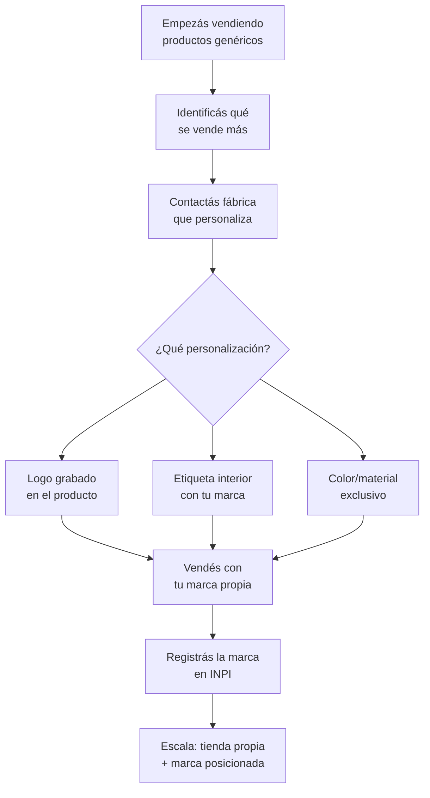

# Marroquinería — Score 7.89/10

Marroquinería ocupa el **puesto #2** en nuestro ranking de oportunidades. Se destaca por tener fábricas extremadamente accesibles (muchas sin mínimo de compra), márgenes sólidos de 60-120%, y una oportunidad clara de construir marca propia desde el primer día.

<Note>
Este análisis usa los [9 criterios de evaluación](/app/paso1-argentina/oportunidades/criterios-evaluacion) del ranking. Todos los precios son aproximados a inicios de 2026 (1 USD ≈ 1200 ARS aproximado).
</Note>

## Score detallado

| # | Criterio | Peso | Puntaje | Ponderado |
|---|----------|------|---------|-----------|
| 1 | Margen potencial | 20% | 7.5 | 1.50 |
| 2 | Demanda de mercado | 18% | 8.0 | 1.44 |
| 3 | Capital requerido | 15% | 7.5 | 1.13 |
| 4 | Simplicidad legal | 12% | 9.0 | 1.08 |
| 5 | Competencia | 10% | 6.5 | 0.65 |
| 6 | Facilidad logística | 8% | 8.5 | 0.68 |
| 7 | Accesibilidad de fábricas | 7% | 9.0 | 0.63 |
| 8 | Escalabilidad | 5% | 7.5 | 0.38 |
| 9 | Puente a importación | 5% | 8.0 | 0.40 |
| | **TOTAL** | **100%** | | **7.89** |

<Tip>
El punto fuerte de marroquinería es la **accesibilidad de fábricas (9.0)**. Hay proveedores reales, verificables, con showroom y que venden desde 1 unidad al por mayor. Pocos rubros ofrecen esto.
</Tip>

---

## Por qué marroquinería es el rubro #2

### Fábricas accesibles con mínimos muy bajos

A diferencia de otros rubros donde necesitás comprar cientos de unidades, en marroquinería hay fábricas como **Madu** que no exigen pedido mínimo en su línea mayorista. Esto reduce drásticamente el riesgo.

### Oportunidad de marca propia

Varias fábricas ofrecen servicios de personalización y branding. Podés empezar vendiendo productos genéricos y evolucionar hacia tu propia marca sin cambiar de proveedor.

### Producto con valor percibido alto

Una cartera o mochila tiene un valor percibido más alto que bijouterie. Eso te permite cobrar tickets de $8,000-25,000 ARS (~USD 6.50-21 aproximado) por unidad, lo que significa menos transacciones para alcanzar buenos ingresos.

### Demanda constante

Todo el mundo necesita carteras, mochilas y billeteras. No es un producto estacional (aunque tiene picos) y la recompra es alta.

---

## Tipos de productos

<CardGroup cols={3}>
<Card title="Carteras" icon="bag-shopping">
Carteras de mano, de hombro, totes. El producto estrella del rubro. Ticket alto.
</Card>
<Card title="Mochilas" icon="suitcase">
Mochilas urbanas, mini-mochilas, mochilas de cuero. Demanda universal.
</Card>
<Card title="Riñoneras / Bananos" icon="fanny-pack">
Tendencia sostenida. Unisex, prácticas. Excelente para empezar.
</Card>
<Card title="Materas" icon="mug-hot">
Porta termos y porta mates. Producto muy argentino, demanda constante.
</Card>
<Card title="Billeteras" icon="wallet">
Billeteras, tarjeteros, porta documentos. Ticket bajo pero alta rotación.
</Card>
<Card title="Porta notebooks" icon="laptop">
Fundas y maletines para notebooks y tablets. Nicho profesional.
</Card>
<Card title="Bandoleras" icon="briefcase">
Bolsos cruzados y bandoleras. Muy populares en hombres y mujeres.
</Card>
</CardGroup>

---

## Proveedores reales encontrados

Una de las mayores ventajas de marroquinería es que encontramos fábricas **reales y verificables** con presencia online y showroom:

| Fábrica | Ubicación | Ventaja principal |
|---------|-----------|-------------------|
| **Madu** | CABA | 25+ años, sin pedido mínimo en mayorista, ofrece personalización |
| **Enchúlate** | Zona Once, CABA | Variedad de estilos, precios competitivos |
| **Lenid** | Villa Crespo (Av. Corrientes 5476) | Showroom propio, fabricación local |
| **Necy** | Envíos a todo el país | Logística nacional, sin necesidad de ir a CABA |
| **Bag Center** | CABA | Amplia línea de productos |
| **Stockin** | CABA | Precios mayoristas competitivos |

<Tip>
Para información detallada de cada proveedor (precios, contacto, cómo comprar), consultá [Proveedores de marroquinería](/app/paso1-argentina/oportunidades/marroquineria/proveedores).
</Tip>

---

## Márgenes reales — ejemplos prácticos

| Producto | Costo fábrica (aprox.) | Precio venta ML (aprox.) | Margen bruto |
|----------|----------------------|------------------------|-------------|
| Riñonera básica | $3,000-5,000 ARS (~USD 2.50-4.15) | $8,000-13,000 ARS (~USD 6.65-10.85) | 100-165% |
| Mochila urbana | $5,000-8,000 ARS (~USD 4.15-6.65) | $12,000-22,000 ARS (~USD 10.00-18.35) | 120-175% |
| Cartera de mano | $4,000-7,000 ARS (~USD 3.35-5.85) | $10,000-20,000 ARS (~USD 8.35-16.65) | 100-185% |
| Billetera | $2,000-4,000 ARS (~USD 1.65-3.35) | $5,000-10,000 ARS (~USD 4.15-8.35) | 100-150% |
| Matera | $3,000-6,000 ARS (~USD 2.50-5.00) | $8,000-15,000 ARS (~USD 6.65-12.50) | 100-165% |
| Porta notebook | $4,000-7,000 ARS (~USD 3.35-5.85) | $10,000-18,000 ARS (~USD 8.35-15.00) | 100-155% |

<Warning>
Los márgenes brutos de 60-120% indicados en el score son **netos** después de comisiones de MercadoLibre (~16%), envío (~8%) e impuestos (~5%). Los márgenes de la tabla son brutos (antes de descontar estos costos).
</Warning>

---

## Capital necesario para arrancar

| Nivel | Inversión (aprox.) | Qué comprás | Stock aproximado |
|-------|-------------------|-------------|------------------|
| **Mínimo** | $50,000 ARS (~USD 40) | 8-12 productos variados | Para testear 3-4 categorías |
| **Recomendado** | $75,000 ARS (~USD 62) | 15-25 productos | Stock para 10-15 publicaciones en ML |
| **Cómodo** | $100,000 ARS (~USD 85) | 25-40 productos | Stock para vender 1-2 meses |

<Note>
Gracias a que fábricas como Madu no exigen pedido mínimo, podés empezar comprando incluso 1 unidad de cada modelo para probar. Esto no es posible en la mayoría de los rubros.
</Note>

---

## Requisitos legales

Marroquinería es un rubro **simple** desde lo legal:

- **No requiere permisos especiales** ni certificaciones
- **Monotributo categoría A o B** es suficiente para empezar
- No hay regulaciones sanitarias ni de seguridad específicas
- Podés operar desde tu casa sin habilitación comercial
- No necesitás inscripciones especiales para vender en MercadoLibre

---

## Logística

| Aspecto | Evaluación | Detalle |
|---------|-----------|---------|
| **Tamaño** | Bueno | Más grande que bijouterie, pero manejable |
| **Peso** | Bueno | Mayoría entre 200g-800g por producto |
| **Fragilidad** | Excelente | Cuero y sintético resisten el transporte |
| **Almacenamiento** | Bueno | Un placard o estantería pequeña alcanza |
| **Costo de envío** | Aceptable | Categoría media en MercadoEnvíos |
| **Packaging** | Simple | Bolsa de papel kraft o caja simple |

---

## Oportunidad de marca propia

Una de las ventajas más atractivas de marroquinería es la posibilidad de crear tu marca sin invertir en producción propia:

<Tip>
**Madu** ofrece explícitamente servicio de personalización y branding para sus productos mayoristas. Es una de las pocas fábricas que facilitan esto para clientes pequeños. Consultá su catálogo mayorista para opciones.
</Tip>

---

## Cuero genuino vs. cuero sintético

<Warning>
Es fundamental que sepas **exactamente** qué material vendés y lo comuniques con honradez a tus clientes. Vender cuero sintético como "cuero genuino" genera devoluciones, mala reputación y potencialmente problemas legales.
</Warning>

<Tabs>
<Tab title="Cuero genuino">
**Qué es:** Piel animal curtida (vaca, cerdo, cabra).

**Ventajas:**
- Mayor valor percibido y precio de venta
- Durabilidad superior (años de uso)
- Envejece bien ("pátina")
- Mercado premium dispuesto a pagar más

**Desventajas:**
- Costo significativamente mayor
- Mayor inversión en stock
- Cuidados específicos (puede mancharse con agua)

**Precio fábrica:** $8,000-20,000 ARS (~USD 6.65-16.65 aproximado) por cartera
</Tab>

<Tab title="Cuero sintético / Eco cuero">
**Qué es:** Material plástico que imita la apariencia del cuero (PU, PVC).

**Ventajas:**
- Costo mucho más bajo
- Mayor variedad de colores y texturas
- Resistente al agua
- Público joven/vegano lo prefiere

**Desventajas:**
- Menor durabilidad (puede descascararse)
- Valor percibido menor
- Más difícil de reparar

**Precio fábrica:** $3,000-8,000 ARS (~USD 2.50-6.65 aproximado) por cartera
</Tab>
</Tabs>

---

## Producto recomendado para empezar: mochilas y riñoneras

<Tip>
Recomendamos empezar con **mochilas urbanas** y **riñoneras** por estas razones:
- Demanda universal (todos los géneros y edades)
- Menos sensibles a la moda que las carteras
- Margen sólido con ticket medio accesible
- Fáciles de fotografiar y publicar
- Alta rotación todo el año
</Tip>

---

## Análisis de competencia

| Factor | Situación | Impacto |
|--------|-----------|---------|
| **Cantidad de vendedores** | Alta | Mucha competencia en ML, pero mercado grande |
| **Marcas establecidas** | Media | Hay marcas fuertes, pero mucho espacio para nuevos |
| **Sensibilidad al precio** | Media-Alta | El comprador compara, pero paga más por mejor presentación |
| **Diferenciación posible** | Alta | Diseño, marca propia, nicho específico |
| **Barrera de entrada** | Baja | Fábricas accesibles con mínimos bajos |

**Estrategias de diferenciación:**
1. **Marca propia** desde el inicio (aunque sea nombre + logo simple)
2. **Nicho específico**: solo materas, solo porta notebooks, solo mochilas minimalistas
3. **Fotografía superior**: la mayoría de los vendedores tienen fotos pobres
4. **Packaging memorable**: bolsa de papel kraft con sticker de tu marca
5. **Atención excepcional**: respuesta rápida, envío rápido, seguimiento post-venta

---

## Preguntas frecuentes

<Accordion title="¿Cuánto capital necesito realmente para empezar?">
Gracias a que hay fábricas sin mínimo de compra, podés empezar con tan solo $50,000 ARS (~USD 40 aproximado). Con eso comprás 8-12 productos variados para testear en MercadoLibre. No es necesario invertir más hasta que sepas qué se vende bien.
</Accordion>

<Accordion title="¿Puedo vender marroquinería sin local comercial?">
Absolutamente. La mayoría de los revendedores exitosos operan desde su casa. Almacenás el stock en un placard, enviás por MercadoEnvíos y gestionás todo desde tu celular. No necesitás habilitación comercial para vender online con Monotributo.
</Accordion>

<Accordion title="¿Conviene empezar con cuero genuino o sintético?">
Recomendamos empezar con **cuero sintético / eco cuero** por varias razones:
- Menor inversión inicial
- Más variedad de modelos accesibles
- Si un modelo no se vende, perdés menos
- Podés testear diseños y categorías con menor riesgo

Una vez que tengas experiencia y capital, podés sumar una línea de cuero genuino como categoría premium.
</Accordion>

<Accordion title="¿Puedo competir con marcas grandes como Prune, Lázaro, etc.?">
No competís directamente con ellos. Tus clientes son personas que buscan **buena calidad a precio accesible**, no marcas de lujo. El segmento de $8,000-25,000 ARS (~USD 6.65-21 aproximado) por producto es enorme y está lleno de compradores que quieren algo lindo sin pagar precio de marca premium.
</Accordion>

---

## Siguiente paso

<CardGroup cols={2}>
<Card title="Proveedores de marroquinería" icon="store" href="/app/paso1-argentina/oportunidades/marroquineria/proveedores">
Fichas detalladas de cada fábrica con precios, contacto y cómo comprar.
</Card>
<Card title="Estrategia de venta" icon="bullseye" href="/app/paso1-argentina/oportunidades/marroquineria/estrategia-venta">
Cómo publicar, fotografiar y vender marroquinería de forma rentable.
</Card>
</CardGroup>
