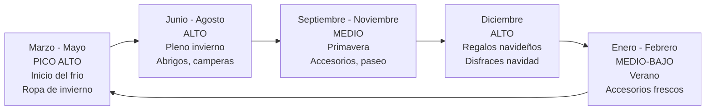
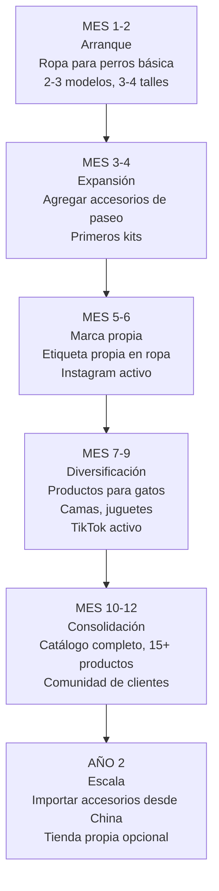

# Estrategia de venta — Artículos para mascotas

> Vender artículos para mascotas es diferente a otros rubros porque la **decisión de compra es emocional**, no racional. Los dueños de mascotas compran pensando en su "hijo peludo", no en optimizar el presupuesto. Tu estrategia debe aprovechar esa conexión emocional.

---

## La regla de oro: las mascotas son familia

Antes de cualquier táctica de venta, entendé el principio fundamental de este mercado:

> Los dueños de mascotas **no compran productos**, compran **bienestar para un miembro de su familia**.

Esto significa que:
- Las fotos deben mostrar mascotas **felices** usando el producto
- Las descripciones deben hablar de **beneficios para la mascota**, no de características técnicas
- El precio es secundario si el producto "hace feliz a mi perro"
- Los testimonios con fotos de mascotas son más poderosos que cualquier descuento

---

## Estrategia en MercadoLibre

### Optimización de publicaciones pet

<Tabs>
<Tab title="Ropa para mascotas">

**Título optimizado:**
> `Buzo Hoodie Para Perro Ropa Mascota Abrigo Invierno - Talle M`

**Elementos clave de la publicación:**

| Elemento | Qué incluir |
|----------|-------------|
| Foto 1 | Perro real vistiendo la prenda (foto principal) |
| Foto 2 | Prenda sola sobre fondo blanco |
| Foto 3 | Tabla de talles visual con medidas |
| Foto 4 | Detalle de la tela y costuras |
| Foto 5 | Cómo medir al perro (instrucciones visuales) |
| Foto 6 | Prenda en otro color/estilo (variaciones) |

**Descripción que vende:**
1. Beneficio emocional: "Mantenelo abrigado y con estilo este invierno"
2. Materiales y calidad: "Confeccionado con tela polar premium, costuras reforzadas"
3. Tabla de talles detallada con medidas en cm
4. Instrucciones de cómo medir al perro
5. Cuidado y lavado
6. Garantía de cambio de talle

<Tip>
Incluí **siempre** una tabla de talles clara con instrucciones de cómo medir. El talle incorrecto es la causa número uno de devoluciones en ropa pet. Una buena tabla reduce las devoluciones significativamente.
</Tip>

</Tab>
<Tab title="Accesorios">

**Título optimizado (ejemplo collar):**
> `Collar Para Perro Ajustable Resistente Paseo - Todos Los Talles`

**Elementos clave:**

| Elemento | Qué incluir |
|----------|-------------|
| Foto 1 | Perro real con el collar puesto |
| Foto 2 | Collar solo, mostrando cierre y ajuste |
| Foto 3 | Detalle del material y hebilla |
| Foto 4 | Referencia de tamaño (con regla o mano) |
| Foto 5 | Opciones de colores disponibles |
| Foto 6 | Perro paseando (lifestyle) |

**Descripción clave:**
1. Seguridad: "Hebilla de acero que no se abre sola"
2. Comodidad: "Interior acolchado para no lastimar el cuello"
3. Tabla de talles según circunferencia de cuello
4. Material y durabilidad
5. Opciones de personalización (si aplica)

</Tab>
<Tab title="Kits pet">

Los kits son la estrategia de mayor margen, igual que en fitness:

**Ejemplos de kits:**

| Kit | Contenido | Costo total (aprox.) | Precio ML (aprox.) | Margen bruto |
|-----|-----------|---------------------|-------------------|-------------|
| Kit Paseo Completo | Collar + correa + bolsita para bolsas | $5,000 - $8,000 ARS | $14,000 - $22,000 ARS | 100-175% |
| Kit Invierno | Buzo + campera impermeable | $5,000 - $10,000 ARS | $13,000 - $24,000 ARS | 100-160% |
| Kit Bienvenida Cachorro | Collar + comedero + juguete + manta | $6,000 - $11,000 ARS | $16,000 - $28,000 ARS | 100-167% |
| Kit Gato Feliz | Rascador + juguete plumas + cama | $7,000 - $13,000 ARS | $18,000 - $30,000 ARS | 80-157% |

<Note>
El "Kit Bienvenida Cachorro" es especialmente poderoso porque apunta a un momento emocional alto (llegada de una nueva mascota). Los dueños primerizos compran todo junto y no escatiman.
</Note>

</Tab>
</Tabs>

---

## Marketing en redes sociales

### Instagram: el canal perfecto para mascotas

El contenido de mascotas es **el tipo de contenido con mayor engagement natural** en redes sociales. La gente ama ver fotos y videos de animales. Esto juega a tu favor.

**Estrategia de contenido:**

| Tipo de contenido | Frecuencia sugerida | Objetivo |
|-------------------|-------------------|----------|
| Fotos de mascotas con tus productos | 3-4 por semana | Mostrar productos en uso real |
| Reels de mascotas divertidas | 3-4 por semana | Alcance orgánico masivo |
| Stories de "día a día" con mascotas | Diario | Cercanía con la audiencia |
| Antes/después (mascota con y sin ropa) | 1-2 por semana | Demostrar el producto |
| Testimonios de clientes (fotos de sus mascotas) | 2-3 por semana | Prueba social |
| Carruseles educativos (cuidado animal) | 1-2 por semana | Valor y autoridad |

<Tip>
Pedí a cada cliente que te mande una foto de su mascota con el producto. Ofrecé un **descuento del 10% en la próxima compra** a cambio de la foto y permiso para publicarla. Vas a construir un banco de fotos de mascotas reales que vale oro para tu marketing.
</Tip>

### TikTok: alcance orgánico explosivo

TikTok es incluso mejor que Instagram para contenido pet porque el algoritmo favorece contenido de mascotas:

**Ideas de contenido:**
- "Probando ropa nueva en mi perro" (reacción del animal)
- "POV: tu perro cuando le ponés la campera nueva"
- Transformaciones: de perro sin ropa a perro con outfit completo
- Videos con audio trending + mascota con tus productos
- "Cuánto gasto en mi perro por mes" (educar + mostrar productos)

**Ventaja clave:** En TikTok, una cuenta nueva puede tener un video viral con miles de vistas en la primera semana. El contenido pet tiene un factor viral natural.

### Estrategia de comunidad

<Steps>
<Step title="Crear comunidad de dueños de mascotas">
No solo vendés productos: construís una **comunidad de amantes de las mascotas**:
- Grupo de WhatsApp/Telegram para clientes VIP (novedades exclusivas, descuentos anticipados)
- Compartir tips de cuidado animal (no solo vender)
- Celebrar cumpleaños de las mascotas de tus clientes
- Repostear fotos de clientes (con permiso)
</Step>

<Step title="Programa de fidelización">
Las mascotas necesitan productos constantemente. Aprovechá la recurrencia:
- Descuento en la segunda compra (ej: 10%)
- "Compra 3 prendas, la 4ta con 20% off"
- Acceso anticipado a colecciones nuevas para clientes frecuentes
- Regalo pequeño en compras grandes (ej: juguete gratis con compra de $15,000+ ARS)
</Step>

<Step title="Contenido educativo">
Posicionarte como referente en el nicho:
- Tips de cuidado animal (no comerciales)
- Cómo elegir el talle correcto de ropa
- Qué hacer cuando hace frío / calor
- Cómo acostumbrar al perro a usar ropa
</Step>
</Steps>

---

## Pricing: ejemplo real detallado

Veamos el cálculo completo para un **Buzo Hoodie para perro talle M** (producto estrella del rubro):

### Estructura de costos

| Concepto | Monto aproximado |
|----------|-----------------|
| Buzo hoodie (costo costurera) | $3,000 ARS |
| Etiqueta de marca personalizada | $300 ARS |
| Bolsita de packaging con logo | $400 ARS |
| Tarjeta de agradecimiento | $100 ARS |
| **Costo total por unidad** | **$3,800 ARS** |

### Precio y margen

| Concepto | Valor aproximado |
|----------|-----------------|
| Precio de venta en ML | $9,000 ARS |
| Comisión ML (aprox. 17% + IVA) | -$1,850 ARS |
| Costo de envío (si ofrecés gratis) | -$1,500 ARS |
| **Ingreso neto** | **$5,650 ARS** |
| Costo del producto | -$3,800 ARS |
| **Ganancia bruta por unidad** | **$1,850 ARS** |
| **Margen bruto** | **~21% sobre venta / ~49% sobre costo** |

<Note>
El margen por unidad parece moderado, pero el volumen y la recurrencia de compra lo compensan. Un cliente que compra ropa para su mascota suele volver en cada cambio de temporada. Además, los kits tienen márgenes mucho más altos.
</Note>

### Comparación: producto solo vs. kit

| Modelo | Precio (aprox.) | Costo (aprox.) | Ganancia bruta (aprox.) | Margen s/venta |
|--------|----------------|----------------|------------------------|----------------|
| Buzo solo | $9,000 ARS | $3,800 ARS | $1,850 ARS (después de comisiones) | ~21% |
| Kit Invierno (buzo + campera) | $18,000 ARS | $8,500 ARS | $4,800 ARS (después de comisiones) | ~27% |
| Kit Paseo (collar + correa + bolsita) | $16,000 ARS | $5,500 ARS | $5,200 ARS (después de comisiones) | ~33% |

<Tip>
Los kits de accesorios (collar + correa) tienen **mejor margen** que los kits de ropa porque los accesorios tienen menor costo unitario. Una buena estrategia es combinar ambos: ropa como producto de entrada y kits de accesorios como upsell.
</Tip>

---

## Estacionalidad y picos de venta

### Fechas clave del calendario pet

| Fecha | Evento | Oportunidad |
|-------|--------|-------------|
| 29 de abril | Dia del Animal (Argentina) | Promociones especiales, kits de regalo, descuentos |
| Marzo-mayo | Inicio del frío | Lanzar colección invierno, camperas, buzos |
| Junio-agosto | Pleno invierno | Máxima venta de ropa abrigada |
| Octubre 31 | Halloween | Disfraces para mascotas (nicho muy rentable) |
| Diciembre | Navidad/Fiestas | Kits de regalo, disfraces navideños, packaging especial |

<Tip>
El **Dia del Animal (29 de abril)** es la fecha más importante del rubro. Prepará stock y publicaciones especiales con al menos 2-3 semanas de anticipación. Muchos dueños compran regalos para sus mascotas en esta fecha.
</Tip>

---

## Cross-selling y upselling

<Tabs>
<Tab title="Cross-selling">

| Si compró... | Ofrecé... |
|-------------|-----------|
| Buzo para perro | Campera impermeable para días de lluvia |
| Collar | Correa a juego, chapita con nombre |
| Cama para perro | Manta, almohadón extra |
| Juguete | Pack de 3 juguetes con descuento |
| Kit Paseo | Botella de agua portátil, bolsitas |

**Automatización en ML:**
- Después de cada venta confirmada, enviá un mensaje amigable al comprador:
> "Gracias por tu compra. Si te interesa, tenemos [producto complementario] con un 10% de descuento para clientes. Te dejo el link: [...]"
</Tab>

<Tab title="Upselling">

| Si mira... | Ofrecé como upgrade... |
|------------|----------------------|
| Buzo básico | Buzo premium con capucha + forro polar |
| Collar simple | Collar personalizado con nombre bordado |
| Cama mediana | Cama grande premium con funda lavable |
| Un producto | Kit completo con descuento |

**En la descripción de ML:**
> "Si querés el kit completo con collar + correa + bolsita a un precio especial, visitá nuestra publicación: [link]"
</Tab>
</Tabs>

---

## Camino de crecimiento

### Detalle por etapa

<Accordion title="Mes 1-2: Arranque con ropa para perros">
- **Inversión:** $80,000-150,000 ARS (USD 65-125 aprox.)
- **Productos:** 2-3 modelos de ropa en 3-4 talles cada uno
- **Canal:** MercadoLibre + Instagram (crear cuenta)
- **Objetivo:** Hacer las primeras 15-25 ventas, aprender sobre talles y preferencias
- **Ingreso estimado:** $25,000-70,000 ARS/mes bruto (muy variable al inicio)
- **Desafío principal:** Acertar los talles y manejar cambios/devoluciones
</Accordion>

<Accordion title="Mes 3-4: Agregar accesorios">
- **Inversión adicional:** Reinvertir ganancias ($50,000-100,000 ARS)
- **Productos:** Agregar collares, correas, primeros kits
- **Canal:** MercadoLibre + Instagram activo (contenido 3-4 veces/semana)
- **Objetivo:** Identificar productos estrella, crear primeros kits
- **Ingreso estimado:** $50,000-130,000 ARS/mes bruto (aproximado)
</Accordion>

<Accordion title="Mes 5-6: Marca propia">
- **Inversión adicional:** $50,000-100,000 ARS para etiquetas, packaging, diseño
- **Productos:** Marca propia en ropa y collares, packaging personalizado
- **Canal:** MercadoLibre + Instagram activo + empezar TikTok
- **Objetivo:** Diferenciarse de la competencia, fidelizar clientes
- **Ingreso estimado:** $80,000-200,000 ARS/mes bruto (aproximado)
</Accordion>

<Accordion title="Mes 7-12: Diversificación y consolidación">
- **Catálogo:** 15+ productos, incluyendo productos para gatos
- **Canales:** MercadoLibre + Instagram + TikTok + comunidad WhatsApp
- **Equipo:** Posiblemente necesités ayuda para embalaje
- **Objetivo:** Volumen sostenido, colecciones por temporada, evaluar importación
- **Ingreso estimado:** $120,000-350,000 ARS/mes bruto (aproximado)
</Accordion>

---

## Proyección de ganancias mensuales

<Warning>
Las siguientes proyecciones son **estimaciones aproximadas** basadas en escenarios promedio. Los resultados reales dependen de la dedicación, calidad de publicaciones, capital disponible, temporada y condiciones del mercado. No representan garantías de ingresos.
</Warning>

| Escenario | Ventas/mes | Ticket promedio (aprox.) | Ingreso bruto/mes (aprox.) | Ganancia neta estimada/mes (aprox.) |
|-----------|-----------|------------------------|--------------------------|-----------------------------------|
| Conservador (inicio) | 12-20 | $10,000 ARS | $120,000 - $200,000 ARS | $25,000 - $55,000 ARS |
| Moderado (3-6 meses) | 30-60 | $13,000 ARS | $390,000 - $780,000 ARS | $80,000 - $180,000 ARS |
| Optimista (6-12 meses) | 70-130 | $15,000 ARS | $1,050,000 - $1,950,000 ARS | $220,000 - $450,000 ARS |

<Note>
La ganancia neta estimada descuenta costo de producto, comisiones de MercadoLibre, envío y packaging. **No incluye** impuestos (monotributo o responsable inscripto). Consultá con tu contador para el cálculo fiscal preciso.
</Note>

---

## Errores comunes a evitar

<Accordion title="No tener tabla de talles clara">
La falta de una tabla de talles clara es el error número uno en ropa para mascotas. Genera:
- Devoluciones masivas (30%+ de las ventas si no tenés tabla)
- Consultas interminables de "qué talle le va a mi perro"
- Mala reputación y calificaciones negativas

**Solución:** Incluí una tabla de talles **visual** con fotos de cómo medir al perro (largo de lomo, contorno de pecho, contorno de cuello). Incluí una referencia de raza (ej: "Talle M ideal para Cocker Spaniel, Beagle, Border Collie").
</Accordion>

<Accordion title="Fotos sin mascotas reales">
Publicar fotos del producto solo (sin mascota usándolo) reduce drásticamente la tasa de conversión. Los compradores necesitan imaginar el producto en su mascota.

**Solución:** Usá mascotas reales en las fotos. Si no tenés mascota, pedí prestada la de un amigo. Incluso fotos casuales con celular de un perro con tu producto son infinitamente mejores que fotos del producto plano sobre una mesa.
</Accordion>

<Accordion title="Intentar abarcar demasiado al inicio">
No intentes vender ropa + accesorios + camas + juguetes + productos para gatos desde el día uno. Vas a:
- Dispersar tu capital en stock que no se mueve
- Tener publicaciones sin suficiente stock por producto
- No poder especializarte en nada

**Solución:** Empezá con un solo nicho (ropa para perros es la recomendación) y expandí solo después de tener ventas consistentes.
</Accordion>

<Accordion title="Ignorar la atención post-venta">
En el rubro mascotas, la atención post-venta es crucial porque:
- Los cambios de talle son frecuentes
- Los clientes quieren asesoramiento personalizado
- Un cliente satisfecho vuelve a comprar en cada temporada

**Solución:** Respondé amablemente y rápido. Aceptá cambios de talle con buena predisposición. Después de la compra, mandá un mensaje preguntando si le quedó bien al perro. Ese gesto genera fidelización inmediata.
</Accordion>

<Accordion title="Vender alimentos o treats sin habilitación">
Algunos emprendedores ven los alimentos para mascotas como una oportunidad y empiezan a vender sin habilitación.

**No lo hagas.** Los alimentos para animales requieren:
- Habilitación de SENASA
- Registro del producto
- Etiquetado regulado
- Análisis de laboratorio
- Inspecciones periódicas

Las multas por vender alimentos sin habilitación son severas y podés tener problemas legales serios. Enfocate en accesorios, que no requieren nada de esto.
</Accordion>

---

## Siguiente paso

<CardGroup cols={2}>
<Card title="Encontrar proveedores" icon="store" href="/app/paso1-argentina/oportunidades/mascotas/proveedores">
Dónde encontrar fabricantes de artículos para mascotas en Argentina
</Card>
<Card title="Volver al overview" icon="paw" href="/app/paso1-argentina/oportunidades/mascotas/overview">
Volver a la página principal del rubro mascotas
</Card>
</CardGroup>
