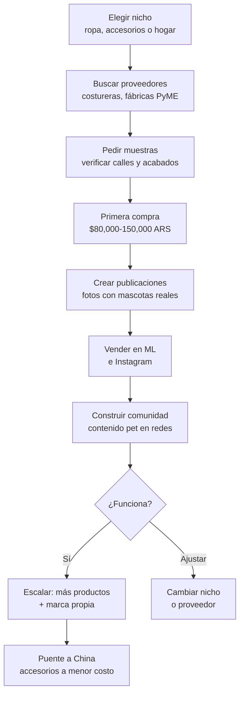

# Artículos para mascotas — Rubro #4

> **Score: 7.55/10** — Cuarto mejor rubro para compra-reventa con fábricas argentinas.

Argentina tiene una de las tasas de tenencia de mascotas más altas de la región. Se estima que más del 80% de los hogares argentinos tienen al menos una mascota (aproximado). Este mercado combina **demanda constante**, **compra emocional** (los dueños no escatiman en sus mascotas) y **márgenes altos** en accesorios y ropa.

---

## Score detallado

| # | Criterio | Peso | Puntaje | Ponderado |
|---|----------|------|---------|-----------|
| 1 | Margen potencial | 20% | 8 | 1.60 |
| 2 | Demanda de mercado | 18% | 7 | 1.26 |
| 3 | Capital requerido | 15% | 8 | 1.20 |
| 4 | Simplicidad legal | 12% | 8 | 0.96 |
| 5 | Competencia | 10% | 7 | 0.70 |
| 6 | Facilidad logística | 8% | 8 | 0.64 |
| 7 | Accesibilidad de fábricas | 7% | 6 | 0.42 |
| 8 | Escalabilidad | 5% | 8 | 0.40 |
| 9 | Puente a importación | 5% | 8 | 0.40 |
| | **TOTAL** | **100%** | | **7.58** |

<Note>
El score de 7.58 lo ubica como el **cuarto mejor rubro** del ranking general. Para entender cómo se calculan estos scores, consultá [Criterios de evaluación](/app/paso1-argentina/oportunidades/criterios-evaluacion).
</Note>

---

## Por qué mascotas es el rubro #4

<CardGroup cols={3}>
<Card title="Mercado en crecimiento" icon="chart-line">
Argentina tiene una altísima tenencia de mascotas. El gasto en productos pet crece año a año, impulsado por la tendencia de "humanización" de las mascotas.
</Card>
<Card title="Compra emocional" icon="heart">
Los dueños de mascotas compran con el corazón, no con la calculadora. Una campera para perro que cuesta poco de fabricar se vende a precios premium porque "mi perro lo merece".
</Card>
<Card title="Compra recurrente" icon="rotate">
Las mascotas necesitan productos constantemente: ropa por temporada, juguetes que se rompen, accesorios que se desgastan. Un cliente satisfecho vuelve a comprar.
</Card>
</CardGroup>

---

## Productos principales

<Tabs>
<Tab title="Ropa para mascotas">

El nicho de mayor margen dentro del rubro. La ropa para perros es particularmente popular en Argentina por las estaciones marcadas.

| Producto | Costo fábrica (aprox.) | Precio venta (aprox.) | Margen estimado |
|----------|----------------------|---------------------|-----------------|
| Buzo/hoodie para perro | $2,000 - $4,000 ARS | $5,500 - $10,000 ARS | 100-175% |
| Campera impermeable | $3,000 - $6,000 ARS | $8,000 - $15,000 ARS | 100-167% |
| Remera estampada | $1,500 - $3,000 ARS | $4,000 - $7,000 ARS | 100-167% |
| Pijama/enterito | $2,500 - $4,500 ARS | $6,000 - $12,000 ARS | 80-167% |
| Disfraz temático | $2,000 - $5,000 ARS | $6,000 - $13,000 ARS | 100-200% |

<Tip>
Todos los costos en ARS son aproximados para principios de 2026 (1 USD ≈ 1,200 ARS aproximadamente). Los precios de fábrica pueden variar según volumen, talles y proveedor.
</Tip>

</Tab>
<Tab title="Accesorios de paseo">

| Producto | Costo fábrica (aprox.) | Precio venta (aprox.) | Margen estimado |
|----------|----------------------|---------------------|-----------------|
| Collar ajustable | $1,500 - $3,000 ARS | $4,000 - $7,000 ARS | 80-167% |
| Correa retráctil | $3,000 - $5,000 ARS | $7,000 - $12,000 ARS | 80-140% |
| Arnés pectoral | $2,500 - $4,500 ARS | $6,000 - $11,000 ARS | 80-144% |
| Bolso transportador | $4,000 - $7,000 ARS | $10,000 - $18,000 ARS | 100-157% |
| Pechera con nombre | $2,000 - $3,500 ARS | $5,500 - $9,000 ARS | 100-175% |

</Tab>
<Tab title="Hogar y alimentación">

| Producto | Costo fábrica (aprox.) | Precio venta (aprox.) | Margen estimado |
|----------|----------------------|---------------------|-----------------|
| Cama/cucha | $3,500 - $6,000 ARS | $8,000 - $15,000 ARS | 80-150% |
| Comedero doble | $2,000 - $3,500 ARS | $5,000 - $8,000 ARS | 80-143% |
| Comedero elevado | $3,000 - $5,000 ARS | $7,000 - $12,000 ARS | 80-140% |
| Juguete mordible | $1,500 - $3,000 ARS | $4,000 - $7,000 ARS | 80-167% |
| Rascador para gatos | $4,000 - $7,000 ARS | $10,000 - $18,000 ARS | 100-157% |

</Tab>
</Tabs>

---

## Flujo del negocio

---

## Análisis detallado por criterio

<Accordion title="Margen potencial — 8/10">
Los márgenes en artículos para mascotas son altos, especialmente en ropa y accesorios personalizados:

- **Ropa para mascotas:** 100-175% de margen bruto
- **Accesorios de paseo:** 80-167%
- **Productos para el hogar:** 80-157%

El factor emocional juega a favor: los dueños de mascotas perciben el gasto como un "regalo para un miembro de la familia", no como una compra racional. Esto permite precios premium, especialmente en productos con diseño atractivo o personalización.

**Ejemplo concreto:** Un buzo para perro talle M tiene un costo de confección aproximado de $2,500-4,000 ARS (USD 2-3.30 aprox.) y se vende en MercadoLibre entre $5,500-10,000 ARS (USD 4.60-8.30 aprox.).
</Accordion>

<Accordion title="Demanda de mercado — 7/10">
El mercado pet en Argentina está en crecimiento sostenido:

- Alta tasa de tenencia de mascotas (una de las más altas de la región, aproximadamente 80% de hogares)
- Tendencia global de "humanización" de mascotas (ropa, accesorios premium)
- Gasto creciente por mascota año tras año
- La categoría "mascotas" en MercadoLibre tiene volumen consistente todo el año

**Perros vs. gatos:** Los productos para perros tienen mayor volumen de ventas (más variedad de talles, ropa, paseo). Los productos para gatos tienen menos competencia pero mercado más pequeño.
</Accordion>

<Accordion title="Capital requerido — 8/10">
Inversión inicial baja, similar a fitness:

**$80,000 a $150,000 ARS (aproximadamente USD 65-125)** para un stock inicial variado.

**Ejemplo de primera compra (nicho ropa):**

| Producto | Cantidad | Costo unitario (aprox.) | Subtotal (aprox.) |
|----------|----------|----------------------|-------------------|
| Buzos variados (3 talles) | 20 unidades | $3,000 ARS | $60,000 ARS |
| Collares ajustables | 15 unidades | $2,000 ARS | $30,000 ARS |
| Pecheras | 10 unidades | $3,000 ARS | $30,000 ARS |
| **Total** | | | **$120,000 ARS** |

Equivale a aproximadamente **USD 100** de inversión inicial.

<Warning>
En ropa para mascotas, tenés que stockearte con **múltiples talles** (S, M, L, XL como mínimo). Esto multiplica la cantidad de SKUs. Empezá con los talles más vendidos (M y L para perros medianos) y ampliá después.
</Warning>
</Accordion>

<Accordion title="Simplicidad legal — 8/10">
Para **accesorios** (ropa, collares, camas, juguetes), la regulación es simple:

- Solo necesitás inscripción fiscal básica (monotributo o responsable inscripto)
- No se requieren habilitaciones especiales
- No se necesitan certificaciones de SENASA para accesorios
- Facturación estándar

**La excepción importante es la comida para mascotas:**

<Warning>
**NUNCA empieces con alimentos para mascotas.** Los alimentos y suplementos para animales requieren habilitación de **SENASA** (Servicio Nacional de Sanidad y Calidad Agroalimentaria). El proceso de habilitación es largo, costoso y complejo. Es una barrera que no vale la pena enfrentar como principiante. Enfocate exclusivamente en accesorios.
</Warning>
</Accordion>

<Accordion title="Competencia — 7/10">
Competencia media con espacio para diferenciarse:

- Hay vendedores establecidos en ML, pero muchos con productos genéricos
- La ropa para mascotas es donde hay más espacio para diferenciación (diseños, calidad)
- Los accesorios personalizados (nombre bordado, colores a elección) tienen menor competencia
- El mercado sigue creciendo, absorbiendo nuevos jugadores

**Cómo diferenciarte:**
- Diseños originales y estampados creativos en ropa
- Personalización (nombre de la mascota bordado)
- Fotos con mascotas reales (no renders ni fotos genéricas)
- Kits temáticos (kit paseo: collar + correa + bolsita para bolsas)
</Accordion>

<Accordion title="Facilidad logística — 8/10">
Buena logística, con algunas consideraciones:

**Ventajas:**
- La mayoría de los productos son livianos
- No son frágiles (textil, plástico, tela)
- Fácil de embalar y etiquetar

**Consideraciones:**
- La ropa tiene múltiples talles (más SKUs para gestionar)
- Las camas/cuchas grandes ocupan más espacio de almacenamiento
- Los rascadores para gatos pueden ser voluminosos

**Recomendación:** Empezá con productos compactos (ropa, collares, juguetes) y dejá los productos voluminosos (camas, rascadores) para cuando tengas más espacio de almacenamiento.
</Accordion>

<Accordion title="Accesibilidad de fábricas — 6/10">
Moderada. Los proveedores están dispersos en distintas industrias:

- **Costureras especializadas** en ropa pet (muchas son emprendedoras individuales o PyMEs pequeñas)
- **Fábricas de plástico** para comederos y juguetes
- **Talleres textiles** para camas y cuchas
- **Fabricantes de cuero/sintético** para collares y correas

No hay un polo industrial concentrado como en calzado o textil general. Hay que buscar más activamente, pero se encuentran buenos proveedores.
</Accordion>

<Accordion title="Escalabilidad — 8/10">
Alta escalabilidad con múltiples caminos de crecimiento:

1. **Etapa 1:** Ropa básica para perros (buzos, remeras)
2. **Etapa 2:** Ampliar a accesorios de paseo (collares, correas, arneses)
3. **Etapa 3:** Agregar productos para el hogar (camas, comederos)
4. **Etapa 4:** Marca propia + productos para gatos
5. **Etapa 5:** Importar accesorios desde China a menor costo

La ventaja del rubro es que el catálogo puede crecer orgánicamente: cada tipo de producto atrae a un segmento ligeramente diferente del mismo mercado.
</Accordion>

<Accordion title="Puente a importación — 8/10">
Buena conexión con importación desde China:

- Collares y correas: costo China aproximado USD 0.50-2 por unidad
- Juguetes para mascotas: costo China aproximado USD 0.30-1.50 por unidad
- Ropa para mascotas: costo China aproximado USD 1-3 por unidad
- Comederos: costo China aproximado USD 0.50-2 por unidad

La ropa tiene menor ventaja de importación porque los talles y estilos del mercado chino no siempre coinciden con la preferencia argentina. Los accesorios (collares, juguetes, comederos) sí son altamente importables.
</Accordion>

---

## Inversión inicial y retorno esperado

| Concepto | Valor aproximado |
|----------|-----------------|
| Primera compra de stock | $80,000 - $150,000 ARS (USD 65-125 aprox.) |
| Packaging y etiquetas | $8,000 - $15,000 ARS (USD 7-13 aprox.) |
| Sesión de fotos (con mascotas) | $0 (celular + tu mascota) - $20,000 ARS |
| **Inversión total inicial** | **$88,000 - $185,000 ARS (USD 73-155 aprox.)** |
| Tiempo hasta primera venta | 1-2 semanas |
| Punto de equilibrio estimado | 1-2 meses |

<Warning>
Las estimaciones son aproximadas y dependen de múltiples factores. El rubro mascotas tiene la ventaja de la compra emocional, pero también requiere buenas fotos con mascotas reales para generar confianza. Invertí tiempo en la presentación visual.
</Warning>

---

## El nicho ganador: ropa para mascotas

<Tip>
Si tenés que elegir un solo nicho dentro de mascotas para empezar, **ropa para perros** es la mejor opción. Combina los márgenes más altos del rubro con compra emocional y estacionalidad marcada (invierno = pico de ventas). Los dueños de perros compran múltiples prendas por temporada.
</Tip>

**Por qué ropa pet es especial:**
- Margen bruto del 100-175% (el más alto del rubro)
- Compra emocional: "Mi perro necesita un buzo nuevo"
- Compra recurrente: cambio de temporada, eventos especiales, crecimiento del cachorro
- Diferenciación fácil: diseños, estampados, colores
- Bajo peso y volumen: logística ideal
- Se presta muy bien para contenido en redes sociales (fotos de mascotas vestidas)

---

## Advertencias importantes

<Warning>
**NUNCA arranques con alimentos para mascotas.** Los alimentos, snacks, suplementos y cualquier producto que el animal ingiera requieren habilitación de **SENASA**. El proceso incluye: habilitación del establecimiento, registro de productos, análisis de laboratorio, y etiquetado regulado. Es un proceso largo (meses) y costoso. Para un principiante, enfocarse en accesorios es la decisión correcta.
</Warning>

<Warning>
**Cuidado con los juguetes que se rompen fácil.** Un juguete para mascotas que se desarma puede ser **peligroso** si el animal ingiere piezas pequeñas. Verificá siempre la resistencia de los juguetes antes de comprar por mayor. Probá tirando, mordiendo y estirando. Si se rompe fácil, no lo vendas.
</Warning>

---

## Preguntas frecuentes

<Accordion title="¿Qué producto es el mejor para empezar?">
**Buzos y camperas para perro** son el producto ideal para empezar:

- Margen alto (100%+)
- Demanda constante (especialmente en otoño/invierno)
- Fácil de encontrar proveedores (costureras especializadas)
- Contenido fotogénico para redes sociales
- Los clientes vuelven a comprar por temporada

Si preferís no depender de la estacionalidad, **collares y pecheras** tienen demanda pareja todo el año.
</Accordion>

<Accordion title="¿Necesito tener mascotas para vender estos productos?">
**No es obligatorio**, pero ayuda mucho:

- Tener una mascota te permite probar los productos personalmente
- Fotos con tu propia mascota son más auténticas que fotos de stock
- Entendés mejor las necesidades de los compradores
- Generás contenido genuino para redes sociales

Si no tenés mascota, pedí prestada la de un amigo o familiar para las sesiones de fotos. Las fotos con mascotas reales venden mucho más que fotos del producto solo.
</Accordion>

<Accordion title="¿Ropa para perros o para gatos?">
**Perros primero**, por estas razones:

- El mercado de ropa para perros es significativamente más grande
- Los perros salen a pasear (la ropa tiene función práctica además de estética)
- Más variedad de talles y estilos
- Mayor volumen de búsquedas en MercadoLibre

Los gatos son un nicho secundario interesante para más adelante. Los productos para gatos que más se venden son: rascadores, juguetes con plumas, y cuchas.
</Accordion>

<Accordion title="¿Cómo manejar los talles?">
Los talles son el desafío principal de la ropa para mascotas. Recomendaciones:

- Empezá con los **3 talles más vendidos**: M, L y XL (perros medianos a grandes)
- Incluí **tabla de talles detallada** en cada publicación con medidas exactas (largo de lomo, contorno de pecho, contorno de cuello)
- Indicá cómo medir al perro (con cinta métrica, instrucciones claras)
- Aceptá cambios de talle los primeros meses (cuesta menos que una mala reputación)
- Con el tiempo, vas a aprender qué talles se venden más y optimizarás el stock
</Accordion>

---

## Siguiente paso

<CardGroup cols={2}>
<Card title="Encontrar proveedores" icon="store" href="/app/paso1-argentina/oportunidades/mascotas/proveedores">
Dónde y cómo encontrar fabricantes de artículos para mascotas en Argentina
</Card>
<Card title="Estrategia de venta" icon="bullseye" href="/app/paso1-argentina/oportunidades/mascotas/estrategia-venta">
Cómo vender artículos pet online y construir una marca en el nicho mascotas
</Card>
</CardGroup>
