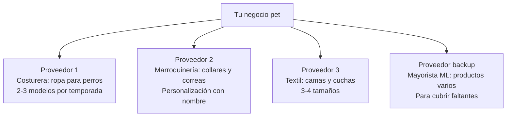

# Proveedores de artículos para mascotas

> Los proveedores del rubro mascotas son **diversos**: desde costureras individuales que hacen ropa artesanal hasta fábricas de inyección plástica que producen comederos en volumen. Cada tipo de producto tiene un perfil de proveedor diferente.

---

## Tipos de proveedores según producto

<Tabs>
<Tab title="Costureras especializadas (ropa pet)">

**Qué fabrican:** Buzos, camperas, remeras, pijamas, disfraces, abrigos para perros y gatos.

**Perfil del proveedor:**
- Generalmente emprendedoras o PyMEs pequeñas (1-5 personas)
- Trabajan desde talleres o domicilios particulares
- Producción semi-artesanal con buena calidad
- Capacidad de personalizar diseños, telas y estampados
- Muy accesibles vía Instagram y WhatsApp

**Pedido mínimo típico:** 10-30 prendas por modelo y talle (aproximado)

**Precio de referencia:** $2,000-6,000 ARS por prenda según complejidad (USD 1.70-5 aprox.)

<Tip>
Las costureras especializadas en ropa pet son tu mejor opción para empezar. Muchas ofrecen producir con **tu marca** (etiquetas personalizadas) desde pedidos relativamente pequeños. Esto te da diferenciación inmediata.
</Tip>

</Tab>
<Tab title="Fábricas de plástico (comederos/juguetes)">

**Qué fabrican:** Comederos, bebederos, comederos elevados, juguetes plásticos, dispensadores, palitas sanitarias.

**Perfil del proveedor:**
- Fábricas de inyección plástica, generalmente en parques industriales del GBA
- Mayor capacidad de producción
- Productos estandarizados (diseños fijos según moldes existentes)
- Requieren pedidos mínimos más altos

**Pedido mínimo típico:** 50-200 unidades (aproximado)

**Precio de referencia:** $2,000-4,000 ARS por comedero doble (USD 1.70-3.30 aprox.)

</Tab>
<Tab title="Talleres textiles (camas/cuchas)">

**Qué fabrican:** Camas, cuchas, almohadones, mantas, bolsos transportadores.

**Perfil del proveedor:**
- Talleres de confección que trabajan con telas gruesas, polar, corderito
- Algunos se especializan en productos pet, otros hacen productos para el hogar y adaptan a mascotas
- Capacidad de producir en distintos tamaños y telas

**Pedido mínimo típico:** 15-50 unidades por modelo y tamaño (aproximado)

**Precio de referencia:** $3,500-7,000 ARS por cama mediana (USD 2.90-5.80 aprox.)

<Note>
Las camas para mascotas ocupan **mucho espacio de almacenamiento** incluso comprimidas. Tené en cuenta esto antes de stockearte. Una alternativa es empezar con cuchas desarmables o modelos compactos.
</Note>

</Tab>
<Tab title="Fabricantes de cuero/sintético (collares/correas)">

**Qué fabrican:** Collares, correas, pecheras, arneses, chapitas identificatorias.

**Perfil del proveedor:**
- Talleres de marroquinería que se especializan o adaptan a productos pet
- Trabajan con cuero genuino, eco-cuero, nylon, materiales sintéticos
- Algunos ofrecen personalización (nombre grabado/bordado)

**Pedido mínimo típico:** 20-50 unidades por modelo (aproximado)

**Precio de referencia:** $1,500-4,500 ARS por collar según material (USD 1.25-3.75 aprox.)

</Tab>
</Tabs>

---

## Zonas industriales y comerciales clave

| Zona | Ubicación | Qué encontrar |
|------|-----------|---------------|
| Once / Balvanera (CABA) | Zona comercial céntrica | Mayoristas de accesorios pet importados, telas para confección |
| Flores / Parque Chacabuco (CABA) | Barrios con talleres textiles | Costureras especializadas en ropa pet |
| Avellaneda (GBA Sur) | Zona industrial | Fábricas de plástico (comederos, juguetes), textiles |
| Lanús / Quilmes (GBA Sur) | Parques industriales | Fabricantes de plásticos, emprendedores pet |
| Morón / Ituzaingó (GBA Oeste) | Zona mixta industrial/comercial | Talleres textiles, confección |
| San Martín (GBA Norte) | Polo industrial | Fabricantes de plástico, marroquinería |

---

## Ferias y eventos de la industria pet

<Note>
Las ferias pet son una oportunidad de oro para encontrar proveedores. En un solo lugar podés conocer decenas de fabricantes, ver productos en persona, comparar precios y establecer contactos.
</Note>

### Expo Pet (Buenos Aires)

La feria más importante del sector pet en Argentina:

- **Qué es:** Exposición anual de productos y servicios para mascotas
- **Cuándo:** Generalmente se realiza entre agosto y octubre (verificar fechas cada año)
- **Dónde:** Centros de convenciones en Buenos Aires (varía según edición)
- **Qué encontrar:** Fabricantes de accesorios, ropa, alimentos, juguetes, servicios
- **Por qué ir:** Contacto directo con proveedores, muestras en mano, precios de lanzamiento

**Cómo aprovecharla:**

<Steps>
<Step title="Preparar antes de ir">
- Hacé una lista de los productos que buscás
- Llevá tarjetas personales (o al menos tu contacto de WhatsApp/email)
- Definí un presupuesto para muestras
- Investigá qué expositores van a estar (generalmente publican la lista antes)
</Step>

<Step title="Durante la feria">
- Recorré todos los stands de fabricantes (no solo los más grandes)
- Pedí listas de precios mayoristas y catálogos
- Preguntá por pedidos mínimos y condiciones
- Tomá fotos de los productos que te interesen (con permiso)
- Priorizá los fabricantes que hagan marca propia (private label)
</Step>

<Step title="Después de la feria">
- Organizá los contactos recopilados
- Contactá a los 3-5 proveedores más interesantes dentro de la semana
- Pedí muestras de los productos que te gustaron
- Compará precios y condiciones antes de decidir
</Step>
</Steps>

### Otras ferias y eventos útiles

| Evento | Frecuencia | Utilidad |
|--------|-----------|----------|
| Rondas de negocios PyME (gobierno) | Varias veces al año | Contacto con fabricantes locales de todos los rubros |
| Ferias de emprendedores (CABA/GBA) | Mensuales | Encontrar costureras y artesanos pet |
| ExpoIndustria / Feria de la Industria | Anual | Contacto con fábricas de plástico y textiles |

---

## Cómo buscar proveedores online

<Steps>
<Step title="Google: búsquedas estratégicas">
**Búsquedas para ropa pet:**
- `"fábrica ropa para perros" argentina`
- `"costurera ropa mascotas" buenos aires mayorista`
- `"indumentaria canina" fábrica GBA`
- `"ropa para mascotas" mayorista taller`

**Búsquedas para accesorios:**
- `"fábrica accesorios mascotas" argentina`
- `"comederos para perros" fábrica plástico`
- `"collares para perros" fabricante mayorista`
- `"camas para perros" taller confección`

Anotá todos los resultados relevantes en una planilla: nombre, teléfono, Instagram, productos, zona.
</Step>

<Step title="MercadoLibre: detectar fabricantes">
MercadoLibre es una de las mejores fuentes para encontrar fabricantes de productos pet:

1. Buscá el producto (ej: "buzo para perro")
2. Filtrá por **"Venta por mayor"** o **"Por mayor y menor"**
3. Buscá vendedores con:
   - Stock alto (fabricante probable)
   - Múltiples publicaciones de productos similares
   - Ubicación en zona industrial (GBA sur/oeste)
   - Textos como "somos fabricantes", "producción propia"
4. Contactá preguntando por precios mayoristas con factura

<Tip>
Otro truco: buscá productos pet con precio **muy bajo** comparado con la competencia. Probablemente sea un fabricante vendiendo directo. Contactalo para comprar por mayor.
</Tip>
</Step>

<Step title="Instagram: el canal principal de los proveedores pet">
Instagram es donde la mayoría de los fabricantes y emprendedores pet tienen presencia:

**Hashtags para buscar:**
- `#ropaparaperros` `#ropacanina` `#ropapetmayorista`
- `#accesoriosmascotas` `#petfashion` `#industriapet`
- `#fabricantemascotas` `#mayoristapet`

**Qué buscar en los perfiles:**
- Fotos de producción (taller, máquina de coser, proceso)
- Historias destacadas con "Mayorista" o "Precios por mayor"
- Ubicación en zona industrial
- Reviews y etiquetados de otros negocios

Muchos de estos proveedores solo venden por Instagram/WhatsApp y no están en ML.
</Step>

<Step title="Primer contacto con el proveedor">
**Mensaje modelo para ropa pet:**
> "Hola, buenas tardes. Estoy armando un emprendimiento de venta de ropa para mascotas y estoy buscando proveedores de producción propia. Me gustaría saber: (1) qué productos fabrican y en qué talles, (2) cuál es el pedido mínimo por modelo/talle, (3) si trabajan con factura, (4) tiempos de entrega, y (5) si hacen marca propia con mi etiqueta. Gracias."

**Información clave a obtener:**
- Lista completa de productos y talles disponibles
- Precios por mayor (por rango de volumen)
- Pedido mínimo por modelo y talle
- Tiempo de producción y entrega
- Si hacen etiqueta personalizada y costo adicional
- Formas de pago (transferencia, efectivo, plazo)
- Política de cambios y devoluciones
</Step>

<Step title="Evaluar calidad y confiabilidad">
Antes de comprar por mayor, verificá:

| Aspecto | Cómo verificar | Señal de alerta |
|---------|---------------|-----------------|
| Calidad de costura | Pedir 2-3 muestras, revisar costuras y terminaciones | Hilos sueltos, costuras flojas, tela que se deshilacha |
| Consistencia de talles | Pedir la misma prenda en 2 talles, medir | Las medidas no coinciden con la tabla publicada |
| Materiales | Tocar la tela, verificar grosor y suavidad | Tela que pica, material que se encoge al lavar |
| Capacidad de reposición | Preguntar tiempo de producción para reorden | Más de 2-3 semanas para reponer |
| Legitimidad | Pedir CUIT, verificar en AFIP, pedir factura | No tiene CUIT, solo vende en negro |
</Step>
</Steps>

---

## Verificación de calidad específica para mascotas

<Warning>
Los productos para mascotas deben ser **seguros para el animal**. Un producto mal fabricado puede causar lesiones, asfixia o reacciones alérgicas en la mascota. Esto genera no solo devoluciones sino también posibles problemas legales.
</Warning>

| Producto | Qué verificar | Riesgo si falla |
|----------|--------------|-----------------|
| Ropa | Costuras firmes, sin botones pequeños sueltos, tela que no suelte pelusa | El animal puede ingerir botones o hilos |
| Collares | Cierre seguro, hebilla resistente, sin bordes filosos | El animal puede soltarse o cortarse |
| Juguetes | Sin piezas pequeñas desprendibles, material no tóxico | Asfixia o intoxicación |
| Comederos | Plástico apto para alimentos, sin bordes filosos, base antideslizante | Cortes en la boca, vuelco constante |
| Camas | Relleno seguro (no usar bolitas de telgopor en perros que muerden), tela lavable | Ingestión de relleno |

---

## Oportunidades de marca propia (private label)

<Note>
El rubro mascotas es excelente para marca propia porque la **conexión emocional** del dueño con la marca es fuerte. Una marca pet con identidad clara genera fidelización rápida.
</Note>

**Qué es viable como marca propia:**

| Producto | Facilidad de private label | Inversión adicional estimada |
|----------|--------------------------|------------------------------|
| Ropa para mascotas | Muy fácil (etiqueta + packaging) | $200-500 ARS por prenda (aprox.) |
| Collares y correas | Fácil (grabado/bordado de marca) | $300-600 ARS por unidad (aprox.) |
| Camas y cuchas | Fácil (etiqueta cosida) | $200-400 ARS por unidad (aprox.) |
| Comederos plásticos | Difícil (requiere molde con tu logo) | $50,000+ ARS por molde (aprox.) |
| Juguetes | Difícil (moldes propios) | Variable, generalmente alto |

**Recomendación:** Empezá marca propia con **ropa y collares** (bajo costo adicional, alto impacto en diferenciación). Los productos plásticos dejá para cuando tengas volumen que justifique la inversión en moldes.

### Elementos de una marca pet exitosa

- **Nombre memorable** relacionado con mascotas
- **Logo** que transmita cariño/diversión
- **Packaging** con diseño coherente (bolsita con tu logo, tarjeta de agradecimiento)
- **Presencia en redes** con identidad visual consistente
- **Historia de marca** (por qué hacés esto, tu amor por los animales)

---

## Red de proveedores recomendada

Para un negocio pet balanceado, buscá tener al menos:

<Tip>
Tener un **proveedor de respaldo** en MercadoLibre es útil para cubrir faltantes de stock mientras esperás la producción de tus proveedores principales. El margen será menor, pero mantiene tus publicaciones activas sin roturas de stock.
</Tip>

---

## Proveedores verificados

<Note>
Los siguientes proveedores fueron verificados en febrero 2026. Recomendamos contactar directamente para confirmar disponibilidad, precios y condiciones actuales.
</Note>

<Tabs>
  <Tab title="Happy Pet">
    | Dato | Detalle |
    |------|---------|
    | **Ubicación** | Argentina (consultar dirección) |
    | **Productos** | Juguetes, ropa, colchones, moisés, higiene y accesorios para perros y gatos |
    | **Pedido mínimo** | Consultar directamente |
    | **Web** | [happypet-accesorios.com.ar](https://happypet-accesorios.com.ar) |
    | **Ventaja clave** | Fabricación y venta mayorista con catálogo amplio de categorías pet |
  </Tab>
  <Tab title="Per-Ros">
    | Dato | Detalle |
    |------|---------|
    | **Ubicación** | Argentina (consultar dirección) |
    | **Productos** | Indumentaria, moisés, colchonetas y accesorios para mascotas |
    | **Pedido mínimo** | Consultar directamente |
    | **Web** | [per-ros.com](https://per-ros.com) |
    | **Ventaja clave** | Fábrica con 40+ años de trayectoria en el rubro mascotas |
  </Tab>
  <Tab title="eleCANt">
    | Dato | Detalle |
    |------|---------|
    | **Ubicación** | Argentina (consultar dirección) |
    | **Productos** | Ropa para perros y gatos |
    | **Pedido mínimo** | Consultar directamente |
    | **Web** | [elecant.com](https://elecant.com) |
    | **Ventaja clave** | Distribuidora de fábrica, venta al por mayor y menor |
  </Tab>
  <Tab title="Luna Accesorios">
    | Dato | Detalle |
    |------|---------|
    | **Ubicación** | Argentina (consultar dirección) |
    | **Productos** | Chapitas, correajes e insumos para sublimación |
    | **Pedido mínimo** | Consultar directamente |
    | **Web** | [lunaccesorios.com.ar](https://lunaccesorios.com.ar) |
    | **Ventaja clave** | Fábrica especializada en chapitas y correajes, ideal para personalización |
  </Tab>
  <Tab title="Mercaba">
    | Dato | Detalle |
    |------|---------|
    | **Ubicación** | Argentina (consultar dirección) |
    | **Productos** | Accesorios e indumentaria para mascotas |
    | **Pedido mínimo** | Consultar directamente |
    | **Web** | [mercaba.com.ar](https://mercaba.com.ar) |
    | **Ventaja clave** | 20+ años de experiencia en el rubro pet |
  </Tab>
  <Tab title="PeyGa">
    | Dato | Detalle |
    |------|---------|
    | **Ubicación** | Argentina (consultar dirección) |
    | **Productos** | Artículos e indumentaria para mascotas |
    | **Pedido mínimo** | Consultar directamente |
    | **Web** | [pega.com.ar](https://pega.com.ar) |
    | **Ventaja clave** | Empresa familiar con 24 años en el mercado pet |
  </Tab>
  <Tab title="Vale For Pets">
    | Dato | Detalle |
    |------|---------|
    | **Ubicación** | Argentina (consultar dirección) |
    | **Productos** | Productos funcionales y accesibles para mascotas |
    | **Pedido mínimo** | Consultar directamente |
    | **Web** | [valeforpets.com.ar](https://valeforpets.com.ar) |
    | **Ventaja clave** | Amplia variedad de productos orientados a comercios y revendedores |
  </Tab>
</Tabs>

---

## Preguntas frecuentes

<Accordion title="¿Cómo encuentro costureras especializadas en mascotas?">
Las costureras de ropa pet generalmente se promocionan en:

- **Instagram:** Buscá con hashtags como `#ropapetmayorista`, `#ropaparaperros`, `#confeccioncanina`
- **Facebook Marketplace y grupos:** Grupos de emprendedores pet, grupos de costura
- **MercadoLibre:** Filtrá por "fabricación propia" o "producción nacional"
- **Recomendaciones:** Preguntá en veterinarias y pet shops si conocen proveedores locales

Muchas costureras empezaron haciendo ropa para sus propias mascotas y escalaron a venta por mayor. Son accesibles, flexibles y generalmente aceptan pedidos pequeños.
</Accordion>

<Accordion title="¿Puedo importar accesorios pet desde China?">
Sí, y es un paso natural del crecimiento:

- **Buena idea importar:** Collares, correas, juguetes, comederos, accesorios de paseo (productos estandarizados)
- **Menos conveniente importar:** Ropa (los talles chinos suelen ser diferentes, la calidad textil varía mucho)

Empezá comprando localmente para validar qué se vende. Una vez que tengas productos ganadores identificados, buscá los mismos en Alibaba/1688 para comparar costos. La diferencia puede ser del 50-80% a favor de China en accesorios.
</Accordion>

<Accordion title="¿Cuántos proveedores necesito al inicio?">
Con **2 proveedores** es suficiente para empezar:

- 1 costurera para ropa (tu producto estrella)
- 1 proveedor de accesorios (collares, juguetes, o camas)

No te sobrecargues intentando tener todo desde el día uno. Es mejor tener pocos productos con buen stock que muchos productos con stock insuficiente.
</Accordion>

---

## Siguiente paso

<CardGroup cols={2}>
<Card title="Estrategia de venta" icon="bullseye" href="/app/paso1-argentina/oportunidades/mascotas/estrategia-venta">
Cómo vender artículos pet online y construir una marca en el nicho mascotas
</Card>
<Card title="Volver al overview" icon="paw" href="/app/paso1-argentina/oportunidades/mascotas/overview">
Volver a la página principal del rubro mascotas
</Card>
</CardGroup>
