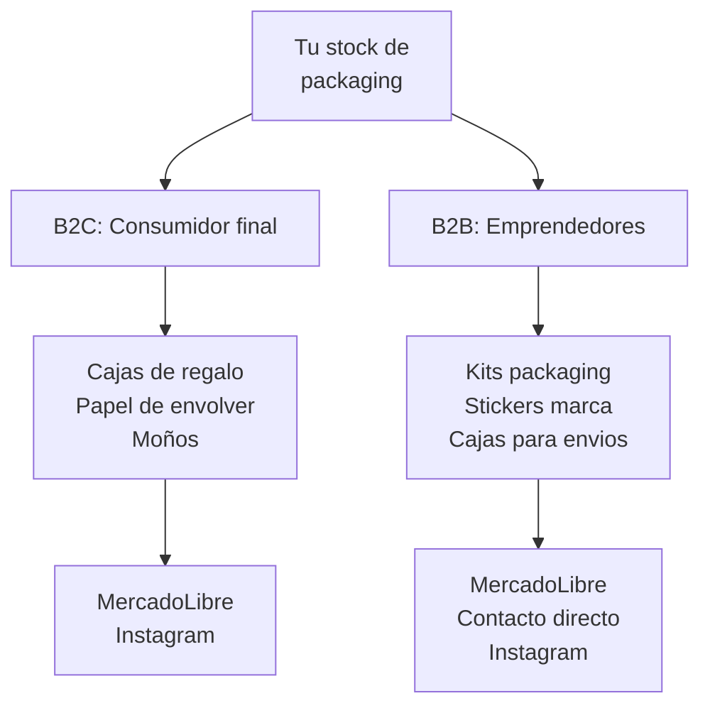
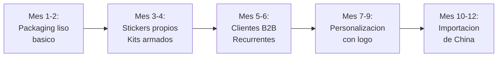

# Estrategia de venta — Packaging

Packaging tiene una ventaja unica: podes vender al **consumidor final** (personas que buscan cajas de regalo) y al **emprendedor** (otros vendedores que necesitan packaging para sus productos). Esta doble demanda te da dos fuentes de ingreso con los mismos productos.

<Note>
Todos los precios y estimaciones son aproximados a inicios de 2026 (1 USD ≈ 1200 ARS aproximado).
</Note>

---

## Doble mercado: B2C + B2B

### Mercado B2C (consumidor final)

El consumidor final busca packaging para **regalos personales**: cumpleaños, Navidad, San Valentin, Dia de la Madre. Lo que busca es:
- Cajas de regalo lindas y listas para usar
- Bolsas de papel con diseño
- Papel de envolver original
- Moños y cintas

### Mercado B2B (emprendedores)

El emprendedor busca packaging para **sus propios productos**: necesita empaquetar lo que vende de forma atractiva. Lo que busca es:
- Cajas personalizables para envios
- Stickers "Gracias por tu compra"
- Tissue paper de colores para rellenar
- Kits completos listos para usar

<Tip>
El mercado B2B es mas estable y predecible que el B2C. Un emprendedor que te compra packaging te va a **recomprar cada mes** porque siempre necesita mas. Priorizá construir una cartera de clientes B2B.
</Tip>

---

## MercadoLibre — Como publicar

### Titulos que funcionan

**Para B2C:**
- "Caja De Regalo Premium Con Tapa Rigida 20x20 Cm"
- "Bolsas De Papel Kraft Con Manija X10 Unidades"
- "Set Envolver Regalos Moños + Cinta + Papel X5"

**Para B2B:**
- "Kit Packaging Emprendedor X50 Caja + Sticker + Tissue"
- "Stickers Gracias Por Tu Compra X100 Diseño Premium"
- "Cajas Para Envios Con Logo Personalizado X100"

### Fotos que venden

La fotografia es especialmente importante en packaging. Mostra:
1. **Producto solo** con fondo limpio
2. **Producto en uso** — una caja armada con un regalo adentro, una bolsa con tissue saliendo
3. **Escala** — mostra el tamaño real con un objeto de referencia
4. **Variantes** — todos los colores y tamaños disponibles
5. **Detalle** — textura del carton, calidad de la impresion, terminado

<Warning>
En packaging, las fotos hacen el 80% de la venta. Una caja de carton fotografiada sobre una mesa se ve "barata". La misma caja fotografiada con un producto adentro, tissue paper saliendo y una cinta, se ve "premium". Inverte tiempo en fotos.
</Warning>

---

## Ejemplo practico: Kit packaging emprendedor x50

Armemos los numeros de un producto B2B real:

### Costo de armado (aproximado)

| Item | Cantidad | Costo unitario | Total |
|------|----------|---------------|-------|
| Cajas carton kraft 15x15x10 cm | 50 | $100 ARS | $5,000 ARS |
| Tissue paper color (2 pliegos c/u) | 100 | $20 ARS | $2,000 ARS |
| Stickers cierre "Gracias" | 50 | $15 ARS | $750 ARS |
| Cinta raso 1 metro c/u | 50 | $25 ARS | $1,250 ARS |
| **Total costo** | | | **$9,000 ARS (~USD 7.50)** |

### Precio de venta y margen

| Concepto | Valor |
|----------|-------|
| Precio de venta en ML | $19,000-22,000 ARS (~USD 16-18) |
| Comision ML (~15%) | -$3,000 ARS |
| Costo de envio (lo paga el comprador) | $0 |
| **Ganancia neta por kit** | **$7,000-10,000 ARS (~USD 6-8.50)** |
| **Margen neto** | **~45-55%** |

<Note>
Vendiendo 20 kits por mes ya generas $140,000-200,000 ARS (~USD 115-165 aproximado) de ganancia neta. Y cada kit es una recompra potencial porque el emprendedor siempre necesita mas packaging.
</Note>

---

## Instagram — Canal complementario

Instagram es un canal muy efectivo para packaging porque el producto es **visual por naturaleza**.

### Estrategia de contenido

| Tipo de contenido | Frecuencia | Ejemplo |
|-------------------|-----------|---------|
| **Foto de producto** | 3/semana | Caja armada con producto adentro |
| **Reel de armado** | 2/semana | Video mostrando como armar un packaging lindo |
| **Before/after** | 1/semana | Producto sin packaging vs. con packaging |
| **Testimonios** | 1/semana | Fotos de clientes usando tu packaging |

### Hashtags relevantes

Para B2C: #cajaderegalo #packaging #envoltorio #regalo #regalosoriginales
Para B2B: #packagingemprendedor #emprendedores #packaging #marcapropia

---

## Estacionalidad — Calendario de ventas

Packaging tiene picos de demanda muy fuertes en fechas comerciales:

| Fecha | Periodo pico | Demanda | Que se vende mas |
|-------|-------------|---------|-----------------|
| **San Valentin** | Enero-Febrero | Alta | Cajas corazon, papel rojo/rosa, moños |
| **Dia de la Madre** | Septiembre-Octubre | Muy alta | Cajas elegantes, bolsas premium |
| **Dia del Amigo** | Junio-Julio | Media-alta | Bolsas, papel de envolver divertido |
| **Dia del Niño** | Julio-Agosto | Media | Papel de envolver infantil, bolsas color |
| **Navidad** | Octubre-Diciembre | Maxima | Todo: cajas, bolsas, papel, moños, cintas |

<Warning>
**Navidad es el 40-50% de la facturacion anual** en packaging. Tene stock listo desde octubre. Si te quedas sin stock en diciembre, perdes la mejor epoca del año. Planifica tu compra de stock navideño en septiembre.
</Warning>

---

## Estrategia B2B: vender a otros vendedores de ML

Esta es la estrategia mas rentable a mediano plazo:

<Steps>
<Step title="Identificar vendedores que necesitan packaging">
Busca en MercadoLibre vendedores de bijouterie, cosmetica, accesorios y productos artesanales. Muchos envian sus productos en bolsas de plastico o cajas genericas. Ellos son tus clientes potenciales.
</Step>

<Step title="Armar kits atractivos">
Crea kits listos para usar: "Kit packaging bijouterie x50" con cajitas, tissue y stickers. Facilita la decision de compra con un producto que ya viene armado.
</Step>

<Step title="Ofrecer personalizacion">
El diferenciador clave es ofrecer packaging con el **logo del cliente**. Podes intermediar con una imprenta: el cliente te da su logo, vos mandas a imprimir y le entregas. El margen adicional es excelente.
</Step>

<Step title="Construir relaciones de recompra">
Cuando un emprendedor te compra y le gusta la calidad, va a volver cada mes. Ofrece descuento por volumen o por compra recurrente para fidelizar.
</Step>

<Step title="Escalar con contacto directo">
Una vez que tenes clientes B2B recurrentes, podes contactarlos directamente por WhatsApp y saltear la comision de MercadoLibre en pedidos repetidos. Ofrece 10% de descuento por compra directa.
</Step>
</Steps>

---

## Camino de crecimiento

| Etapa | Inversion | Ventas estimadas | Ganancia neta aprox. |
|-------|-----------|-----------------|---------------------|
| **Mes 1-2** | $50,000-75,000 ARS | $80,000-120,000 ARS | $30,000-50,000 ARS (~USD 25-40) |
| **Mes 3-4** | Reinversion ganancias | $150,000-250,000 ARS | $60,000-100,000 ARS (~USD 50-85) |
| **Mes 5-6** | Reinversion ganancias | $250,000-400,000 ARS | $100,000-180,000 ARS (~USD 85-150) |
| **Mes 7-12** | Reinversion + capital B2B | $400,000-700,000 ARS | $180,000-350,000 ARS (~USD 150-290) |

<Note>
Estas estimaciones asumen dedicacion de 3-4 horas diarias, reinversion de ganancias y crecimiento progresivo de la cartera de clientes. Los valores son aproximados y pueden variar segun tu ejecucion.
</Note>

---

## Errores comunes a evitar

1. **Comprar demasiado stock tematico** — Si compraste 500 cajas de Navidad y no las vendiste, las tenes que guardar 11 meses. Empeza conservador con stock estacional.
2. **Ignorar el mercado B2B** — El B2C es estacional; el B2B es constante. No te enfoques solo en regalos.
3. **Fotos malas** — Packaging se vende por la imagen. Inverte tiempo en fotos o perdes ventas.
4. **No calcular el volumen de almacenamiento** — Las cajas ocupan mucho espacio. Planifica donde vas a guardar stock antes de comprar.
5. **No ofrecer variedad de tamaños** — El comprador necesita el tamaño exacto para su producto. Ofrece al menos 3 tamaños de cada item.

---

## Siguiente paso

<CardGroup cols={2}>
<Card title="Proveedores de packaging" icon="store" href="/app/paso1-argentina/oportunidades/packaging/proveedores">
Donde encontrar imprentas y cartonerias con precios mayoristas.
</Card>
<Card title="Ranking general de rubros" icon="ranking-star" href="/app/paso1-argentina/oportunidades/ranking-general">
Compara packaging con los otros 7 rubros evaluados.
</Card>
</CardGroup>
