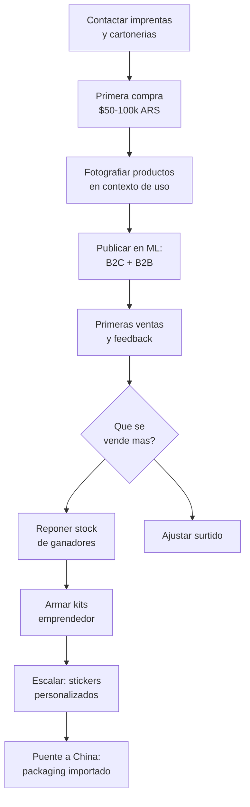

# Packaging y envoltorio — Score 7.22/10

Packaging y envoltorio ocupa el **puesto #7** en nuestro ranking de oportunidades. Su gran ventaja es la combinación de **capital muy bajo** para arrancar, **alta simplicidad legal** y una **competencia casi nula** en el segmento de packaging premium y con diseño.

<Note>
Este análisis está basado en los [9 criterios de evaluación](/app/paso1-argentina/oportunidades/criterios-evaluacion) que usamos para todos los rubros. Todos los precios son aproximados a inicios de 2026.
</Note>

## Score detallado

| # | Criterio | Peso | Puntaje | Ponderado |
|---|----------|------|---------|-----------|
| 1 | Margen potencial | 20% | 7 | 1.40 |
| 2 | Demanda de mercado | 18% | 6 | 1.08 |
| 3 | Capital requerido | 15% | 9 | 1.35 |
| 4 | Simplicidad legal | 12% | 9 | 1.08 |
| 5 | Competencia | 10% | 8 | 0.80 |
| 6 | Facilidad logistica | 8% | 5 | 0.40 |
| 7 | Accesibilidad de fabricas | 7% | 7 | 0.49 |
| 8 | Escalabilidad | 5% | 6 | 0.30 |
| 9 | Puente a importacion | 5% | 8 | 0.40 |
| | **TOTAL** | **100%** | | **7.30** |

<Tip>
La ventaja competitiva de packaging esta en la combinacion de **capital minimo (9)** + **sin competencia real en premium (8)** + **cero regulaciones (9)**. Pocos rubros te permiten arrancar con tan poca plata y tan poco riesgo legal.
</Tip>

---

## Por que packaging es una oportunidad

### Capital extremadamente bajo

Con apenas $50,000-100,000 ARS (~USD 40-85 aproximado) podes arrancar con un stock variado de cajas, bolsas y moños. Es una de las inversiones iniciales mas bajas de todos los rubros analizados.

### Poca competencia en premium

En MercadoLibre sobra el packaging generico y barato, pero hay un **vacio enorme** en packaging con diseño, personalizado y premium. Los emprendedores que venden productos en ML necesitan packaging atractivo y hay muy pocos vendedores que se lo ofrezcan.

### Doble mercado: B2C y B2B

Packaging tiene la ventaja unica de tener dos tipos de clientes:
- **B2C (consumidor final):** Personas que buscan cajas de regalo, papel de envolver, bolsas para obsequios
- **B2B (emprendedores):** Otros vendedores de MercadoLibre e Instagram que necesitan packaging para sus productos

### Simplicidad legal total

No hay regulaciones especiales, no necesitas habilitaciones, no hay restricciones. Con Monotributo y facturacion basica ya podes operar.

---

## Tipos de productos

<CardGroup cols={3}>
<Card title="Cajas regalo" icon="gift">
Cajas de carton con tapa, cajas rigidas, cajas magneticas. Variedad de tamaños y colores.
</Card>
<Card title="Bolsas de papel" icon="bag-shopping">
Bolsas kraft, bolsas con manija, bolsas con diseño impreso. Para regalos y emprendedores.
</Card>
<Card title="Papel de envolver" icon="scroll">
Papel de seda (tissue paper), papel kraft, papel estampado. Venta por rollo o por pliego.
</Card>
<Card title="Moños y ribbons" icon="ribbon">
Moños adhesivos, cintas de raso, cintas de organza, ribbons decorativos. Alta rotacion.
</Card>
<Card title="Stickers de cierre" icon="circle-dot">
Stickers "Gracias por tu compra", stickers de marca, etiquetas adhesivas decorativas.
</Card>
<Card title="Tissue paper" icon="note-sticky">
Papel de seda para rellenar cajas. Colores lisos y estampados. Muy bajo costo.
</Card>
<Card title="Packaging emprendedor" icon="store">
Kits completos: caja + tissue + sticker + tarjeta. Listo para que otros emprendedores usen.
</Card>
</CardGroup>

---

## Margenes reales — ejemplos practicos

| Producto | Costo fabrica (aprox.) | Precio venta ML (aprox.) | Margen bruto |
|----------|----------------------|------------------------|-------------|
| Caja regalo mediana | $200-500 ARS (~USD 0.15-0.40) | $600-1,500 ARS (~USD 0.50-1.25) | 100-200% |
| Bolsa kraft con manija x10 | $400-800 ARS (~USD 0.35-0.65) | $1,200-2,500 ARS (~USD 1.00-2.10) | 150-200% |
| Moños adhesivos x50 | $300-600 ARS (~USD 0.25-0.50) | $800-1,800 ARS (~USD 0.65-1.50) | 150-200% |
| Papel tissue x50 pliegos | $500-1,000 ARS (~USD 0.40-0.85) | $1,500-3,000 ARS (~USD 1.25-2.50) | 150-200% |
| Stickers cierre x100 | $200-500 ARS (~USD 0.15-0.40) | $600-1,500 ARS (~USD 0.50-1.25) | 150-200% |
| Kit emprendedor x50 | $2,000-4,000 ARS (~USD 1.65-3.35) | $5,000-10,000 ARS (~USD 4.15-8.35) | 100-150% |

<Warning>
Estos margenes son **brutos**. Resta la comision de MercadoLibre (~13-17%), costo de envio si lo bonificas y tu carga impositiva. El margen neto queda aproximadamente en 50-100%, que sigue siendo muy bueno para un producto de bajo capital.
</Warning>

---

## Donde encontrar proveedores

| Zona | Ubicacion | Que encontras |
|------|-----------|---------------|
| **Once** | Av. Pueyrredon, calles Larrea y Paso (CABA) | Mayor concentracion de packaging mayorista. Bolsas, cajas, moños, cintas. |
| **Barracas** | Zona sur de CABA | Imprentas y cartonerias con precios competitivos. Posibilidad de imprimir diseños propios. |
| **Zona sur GBA** | Avellaneda, Lanus, Lomas de Zamora | Fabricantes de bolsas de papel y cajas. Precios mas bajos que CABA. |
| **Parques industriales GBA** | Pilar, Pacheco, Ezeiza | Fabricas grandes con mejor precio por volumen, pero minimos mas altos. |

<Tip>
Para proveedores detallados, direcciones y tips para la primera compra, consulta [Proveedores de packaging](/app/paso1-argentina/oportunidades/packaging/proveedores).
</Tip>

---

## Capital necesario para arrancar

| Nivel | Inversion (aprox.) | Que compras | Stock aproximado |
|-------|-------------------|-------------|------------------|
| **Minimo** | $50,000 ARS (~USD 40) | Cajas basicas + bolsas + moños | Para testear 4-5 productos |
| **Recomendado** | $75,000 ARS (~USD 65) | Variedad de productos + stickers personalizados | Stock para 10-15 publicaciones |
| **Comodo** | $100,000 ARS (~USD 85) | Stock amplio + kits armados | Para vender 1-2 meses sin reponer |

<Note>
Estos valores son aproximados para inicios de 2026 (1 USD ≈ 1200 ARS aproximado). Packaging tiene una de las barreras de entrada mas bajas de todos los rubros analizados.
</Note>

---

## Requisitos legales

Packaging es uno de los rubros **mas simples** desde el punto de vista regulatorio:

- **No requiere permisos especiales** ni habilitaciones
- **No necesita certificaciones** de ningun tipo
- Con **Monotributo categoria A o B** alcanza para empezar
- No hay restricciones especiales para la venta
- Podes operar desde tu casa sin problemas

---

## Logistica — Lo bueno y lo malo

| Aspecto | Evaluacion | Detalle |
|---------|-----------|---------|
| **Peso** | Excelente | Packaging es ultraliviano |
| **Fragilidad** | Excelente | Papel y carton no se rompen en transporte |
| **Tamaño** | Regular | Cajas y bolsas son **voluminosas** aunque livianas |
| **Almacenamiento** | Regular | Necesitas espacio fisico considerable |
| **Costo de envio** | Bueno | Liviano pero volumetrico, entra en categorias medias |

<Warning>
El mayor desafio logistico de packaging es el **espacio de almacenamiento**. Las cajas y bolsas son voluminosas aunque pesen poco. Asegurate de tener un lugar seco y protegido donde guardar stock. La humedad arruina el carton y el papel.
</Warning>

---

## Puente a importacion desde China

Packaging tiene un **puente alto (score 8)** hacia la importacion:

| Paso | Que haces | Cuando |
|------|-----------|--------|
| **Paso 1** | Compras en imprentas y cartonerias argentinas, aprendes que se vende | Meses 1-6 |
| **Paso 2** | Contactas proveedores en China (packaging es muy barato alla) | Meses 6-12 |
| **Paso 3** | Importas packaging personalizado a una fraccion del costo local | Despues de mes 12 |

<Note>
Los materiales de packaging (cajas, bolsas, cintas, stickers) son **extremadamente baratos** en China. Una caja que cuesta $300 ARS en Argentina puede costar el equivalente a $30-50 ARS importada. La diferencia de costo es enorme, pero necesitas volumen para que el flete tenga sentido.
</Note>

---

## Competencia — Tu ventaja

La competencia en packaging es **muy baja** en el segmento premium y con diseño:

**Donde NO hay competencia:**
- Kits de packaging armados para emprendedores
- Packaging personalizado con impresion a pedido
- Packaging ecologico (kraft, reciclado, biodegradable)
- Sets tematicos para fechas especiales

**Donde SI hay competencia:**
- Packaging generico basico (bolsas lisas, moños simples)
- Productos commodity sin diferenciacion

---

## La oportunidad B2B: vender a otros vendedores

<Tip>
Una de las mejores oportunidades de packaging es vender a **otros vendedores de MercadoLibre** que necesitan packaging atractivo para sus productos. Imagina: vos vendes en ML a personas que tambien venden en ML. Es un mercado dentro del mercado.
</Tip>

**Como funciona:**
1. Armas kits de packaging emprendedor (ej: 50 cajas + 50 stickers + 100 tissue papers)
2. Lo publicas como "Kit packaging emprendedor x50" en MercadoLibre
3. Tus clientes son otros emprendedores que necesitan empaquetar sus propios productos
4. La recompra es altisima porque siempre necesitan mas packaging

---

## Flujo del negocio

---

## Preguntas frecuentes

<Accordion title="Necesito mucho espacio para guardar packaging?">
**Si, mas que otros rubros.** Packaging es voluminoso aunque liviano. Para un stock basico necesitas al menos un espacio de 2x2 metros con estanterias. Algunos tips:

- Usa estanterias altas para aprovechar altura
- Guarda en lugar **seco** — la humedad arruina carton y papel
- Pedi a los proveedores que te manden las cajas **desarmadas** (planas) para ahorrar espacio
- El papel tissue y los stickers ocupan poco y tienen buen margen

Si no tenes espacio, empeza solo con productos compactos: stickers, cintas, moños y tissue paper.
</Accordion>

<Accordion title="Cuanto puedo ganar por mes vendiendo packaging?">
Depende del volumen y del mix de productos. Estimaciones aproximadas:

| Periodo | Ventas/mes | Ganancia neta aprox. |
|---------|-----------|---------------------|
| **Mes 1-3** | 20-50 pedidos | $40,000-100,000 ARS (~USD 35-85) |
| **Mes 4-6** | 50-120 pedidos | $100,000-250,000 ARS (~USD 85-210) |
| **Mes 6-12** | 120-300 pedidos | $200,000-400,000 ARS (~USD 165-335) |

Estos numeros asumen dedicacion de 2-3 horas diarias y reinversion de ganancias. Son aproximados.
</Accordion>

<Accordion title="Puedo personalizar el packaging con mi marca?">
**Si, y es una gran ventaja.** Las imprentas argentinas pueden imprimir tu logo y diseños en cajas, bolsas y stickers. Los minimos para impresion personalizada suelen ser:

- **Stickers:** desde 100 unidades
- **Bolsas impresas:** desde 500 unidades
- **Cajas con logo:** desde 500 unidades

El costo de impresion es bajo y agrega mucho valor percibido.
</Accordion>

<Accordion title="Que fechas venden mas?">
Packaging tiene picos de demanda muy marcados:

- **Navidad y Año Nuevo** (noviembre-diciembre): Pico maximo del año
- **Dia de la Madre** (octubre): Muy fuerte
- **San Valentin** (febrero): Cajas de regalo y papel
- **Dia del Amigo** (julio): Bolsas y moños
- **Dia del Niño** (agosto): Papel de envolver tematico

Planifica tu stock con al menos 30 dias de anticipacion a cada fecha.
</Accordion>

<Accordion title="Packaging ecologico vende mas?">
**La tendencia es clara:** el packaging kraft, reciclado y ecologico esta en crecimiento. Muchos emprendedores prefieren packaging eco-friendly porque:

- Comunica valores de sustentabilidad
- El papel kraft es mas barato que el plastificado
- Los compradores valoran marcas conscientes
- Se ve "premium" sin necesidad de impresion costosa

Si podes, priorizá el packaging ecologico en tu catálogo.
</Accordion>

---

## Siguiente paso

<CardGroup cols={2}>
<Card title="Proveedores de packaging" icon="store" href="/app/paso1-argentina/oportunidades/packaging/proveedores">
Donde encontrar imprentas, cartonerias y fabricantes de bolsas con precios mayoristas.
</Card>
<Card title="Estrategia de venta" icon="bullseye" href="/app/paso1-argentina/oportunidades/packaging/estrategia-venta">
Como vender packaging a consumidores y emprendedores de forma rentable.
</Card>
</CardGroup>
