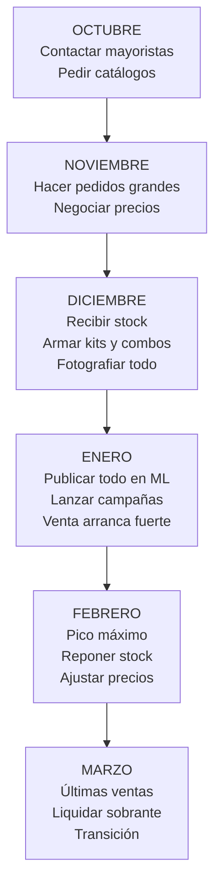
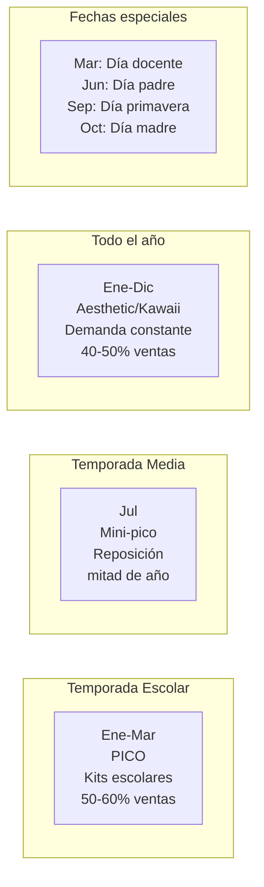

# Estrategia de venta — Papelería y útiles escolares

En papelería, la estrategia gira alrededor de dos ejes: **estacionalidad** (la vuelta a clases es tu temporada de oro) y **tendencias** (la papelería aesthetic/kawaii tiene demanda constante todo el año). Saber combinar ambos ejes es lo que diferencia a un revendedor exitoso de uno que solo vende en febrero.

<Note>
**La regla de papelería:** Vendé **kits y combos**, no productos sueltos. Un cuaderno solo compite por precio. Un "Kit Vuelta a Clases Completo — Primaria" compite por conveniencia y se vende con mejor margen.
</Note>

---

## La vuelta a clases — Tu temporada de oro

La temporada escolar (enero-marzo) puede representar el **50-60% de tus ventas anuales**. Prepararte bien para esta temporada es la diferencia entre un buen año y un año mediocre.

### Cronograma de la temporada escolar

### Estrategia de kits escolares

Los kits pre-armados son tu **producto estrella** para la vuelta a clases. Los padres no quieren recorrer 10 publicaciones comprando item por item — quieren resolver la lista escolar en una sola compra.

<Tabs>
<Tab title="Kit Primaria">
**"Kit Vuelta a Clases — Primaria Completo"**

Contenido sugerido:
- 3 cuadernos tapa dura 48 hojas
- 1 carpeta N3 con repuestos
- 1 cartuchera
- Lápices de colores x12
- Lápiz negro, goma, sacapuntas
- Bolígrafos azul y negro
- Regla 20cm
- Plasticola
- Tijera punta roma

| Concepto | Monto (ARS) |
|----------|-------------|
| Costo mayorista total | $4,000 – $5,500 |
| Precio de venta sugerido | $9,000 – $12,000 |
| Margen bruto | 60% – 80% |
</Tab>

<Tab title="Kit Secundaria">
**"Kit Vuelta a Clases — Secundaria Completo"**

Contenido sugerido:
- 3 cuadernos universitarios 84 hojas
- 1 carpeta N3 con separadores y repuestos
- Set de bolígrafos (azul, negro, rojo)
- Corrector líquido
- Resaltadores x4
- Regla, escuadra, transportador
- Compás
- Calculadora básica

| Concepto | Monto (ARS) |
|----------|-------------|
| Costo mayorista total | $5,000 – $7,000 |
| Precio de venta sugerido | $10,000 – $15,000 |
| Margen bruto | 55% – 75% |
</Tab>

<Tab title="Kit Artístico">
**"Kit Arte y Dibujo — Escolar"**

Contenido sugerido:
- Block de dibujo N5
- Lápices de colores x24
- Témperas x6
- Pinceles set x3
- Acuarelas x12
- Crayones x12
- Plasticola color x3

| Concepto | Monto (ARS) |
|----------|-------------|
| Costo mayorista total | $3,500 – $5,000 |
| Precio de venta sugerido | $8,000 – $12,000 |
| Margen bruto | 60% – 80% |
</Tab>
</Tabs>

<Tip>
**Truco de pricing para kits:** El precio del kit debe ser un **10-15% menor** que la suma de los productos individuales si se compraran por separado. Esto le da al comprador la sensación de ahorro ("me conviene el kit") mientras vos mantenés un buen margen porque el costo de envío es uno solo.
</Tip>

---

## Papelería aesthetic/kawaii — Demanda todo el año

La tendencia aesthetic/kawaii no depende de la temporada escolar. Es un nicho con demanda constante impulsado por redes sociales, especialmente entre el público de **15-30 años**.

### Qué es la papelería aesthetic/kawaii

Es papelería con diseño atractivo, colores pastel, elementos decorativos y una estética que la gente quiere mostrar en sus redes sociales. El producto funcional (un resaltador) se convierte en un objeto de deseo estético.

### Productos estrella de este nicho

| Producto | Por qué funciona | Margen |
|----------|-----------------|--------|
| Resaltadores pastel set | Los más pedidos, colores suaves que son tendencia | 50-70% |
| Washi tape decorativo | Para decorar cuadernos, planners, regalos | 60-80% |
| Stickers temáticos | Demanda altísima, bajo costo unitario | 70-100% |
| Bolígrafos gel de colores | Puntas finas, colores especiales | 50-70% |
| Planners decorados | Público adulto joven, uso personal | 50-80% |
| Post-its con formas | Gatos, nubes, flores — no los rectangulares genéricos | 60-80% |
| Clips y accesorios deco | Clips con formas, binder clips de colores | 60-90% |

<Warning>
**No confundas "kawaii" con "infantil".** El público de papelería aesthetic es adolescente y adulto joven (15-30 años). La estética es **sofisticada y pastel**, no caricaturas infantiles. Mirá cuentas de papelería aesthetic en Instagram y TikTok para entender el tono visual correcto.
</Warning>

---

## Estrategia en MercadoLibre

### Títulos optimizados para búsqueda

| Mal título | Buen título |
|-----------|-------------|
| "Resaltadores" | "Resaltadores Pastel X6 - Colores Suaves - Útiles Escolares" |
| "Kit escolar" | "Kit Vuelta A Clases Primaria Completo - 15 Piezas Marcas" |
| "Stickers" | "Pack 50 Stickers Decorativos Aesthetic - Planner Cuaderno" |
| "Washi tape" | "Set Washi Tape X10 Diseños - Cinta Decorativa Kawaii" |

### Estructura de publicación ganadora

<Steps>
<Step title="Foto principal: el combo completo">
Mostrá todo el contenido del kit o combo en una sola foto, bien organizado sobre fondo claro. Si es un set de resaltadores, sacalos de la caja y mostralos abiertos para que se vean los colores.
</Step>

<Step title="Galería: 6-8 fotos mínimo">
Incluí: 1) Foto general del combo, 2) Detalle de cada producto principal, 3) Foto de uso (alguien escribiendo, decorando), 4) Lista visual del contenido, 5) Comparación de tamaño, 6) Foto del packaging.
</Step>

<Step title="Descripción: listado claro + beneficios">
Empezá con la lista completa del contenido. Después agregá: para quién es el kit, por qué conviene comprarlo junto (vs. por separado), y si incluye marcas conocidas mencionarlas.
</Step>

<Step title="Variantes si aplica">
Si vendés kits, ofrecé variantes: "Kit Básico" vs. "Kit Completo" vs. "Kit Premium". Esto da opciones al comprador y te permite tener diferentes puntos de precio.
</Step>
</Steps>

---

## TikTok e Instagram — Tu motor de ventas aesthetic

Para el nicho kawaii/aesthetic, las redes sociales no son opcionales — son el **canal principal de descubrimiento**.

### Contenido que funciona

| Tipo de contenido | Plataforma | Ejemplo |
|-------------------|-----------|---------|
| **Stationery haul** | TikTok/Instagram Reels | "Miren todo lo que llegó al local" (mostrando productos) |
| **Organización de escritorio** | TikTok/Instagram | Transformación antes/después del escritorio |
| **Unboxing de kits** | TikTok | Abrir un kit escolar mostrando cada producto |
| **Swatches de colores** | Instagram | Mostrar los colores de resaltadores, marcadores en papel |
| **Decoración de cuaderno** | TikTok | Proceso de decorar un cuaderno con washi tape y stickers |
| **Tips de estudio** | TikTok/Instagram | "3 formas de organizar tus apuntes" usando tus productos |

<Tip>
Los videos de **"stationery haul"** y **"estudio conmigo"** son los formatos más populares en TikTok para papelería. No necesitás una producción profesional — un celular con buena luz y un escritorio ordenado es suficiente. El contenido auténtico funciona mejor que el sobreproducido.
</Tip>

### Frecuencia recomendada

| Plataforma | Posts/semana | Tipo |
|-----------|-------------|------|
| **TikTok** | 3-5 | Videos cortos de productos, hauls, swatches |
| **Instagram Feed** | 2-3 | Fotos de productos, flatlays de kits |
| **Instagram Stories** | Diarias | Encuestas, nuevos productos, detrás de escena |
| **Instagram Reels** | 2-3 | Mismos videos que TikTok, adaptados |

---

## Pricing — Ejemplo real con kit escolar

Veamos los números de un **Kit Vuelta a Clases Primaria Completo**:

| Concepto | Monto (ARS) |
|----------|-------------|
| Costo mayorista del kit (todos los items) | $4,500 |
| Packaging (bolsa + caja + etiqueta) | $400 |
| **Subtotal costo** | **$4,900** |
| Precio de venta en MercadoLibre | $10,500 |
| Comisión MercadoLibre (~13%) | -$1,365 |
| Costo de envío (si lo absorbés) | -$1,500 |
| Impuestos monotributo (~5%) | -$525 |
| **Ganancia neta por kit** | **$2,210** |
| **Margen neto** | **~21%** |

### Si vendés 50 kits en febrero (temporada alta)

| Métrica | Valor |
|---------|-------|
| Facturación | $525,000 ARS (~USD 440) |
| Ganancia neta | $110,500 ARS (~USD 92) |
| Solo de kits escolares | Sin contar productos individuales |

<Note>
El margen neto por kit escolar es más bajo (~21%) que el de productos aesthetic individuales (~30-40%). Pero el **volumen** de la temporada escolar compensa: en enero-febrero podés vender 50-100 kits, mientras que en un mes normal vendés 20-30 productos aesthetic.
</Note>

### Pricing de productos aesthetic (ejemplo)

| Concepto | Monto (ARS) |
|----------|-------------|
| Set 6 resaltadores pastel (costo mayorista) | $1,800 |
| Packaging | $200 |
| **Subtotal costo** | **$2,000** |
| Precio de venta en ML | $5,000 |
| Comisión ML (~13%) | -$650 |
| Envío (absorbido) | -$1,200 |
| Impuestos (~5%) | -$250 |
| **Ganancia neta** | **$900** |
| **Margen neto** | **~18%** |

<Tip>
Para mejorar el margen de productos aesthetic, armá **combos**: "Pack Study Aesthetic: 6 resaltadores pastel + 10 washi tapes + 50 stickers" a $12,000 ARS. El costo sumado es ~$5,000 ARS, pero el envío es uno solo y la comisión de ML es una sola. El margen neto sube al **25-30%**.
</Tip>

---

## Calendario estacional completo

### Acciones mensuales

| Mes | Estrategia escolar | Estrategia aesthetic |
|-----|--------------------|--------------------|
| **Enero** | Lanzamiento fuerte kits | Mantener publicaciones |
| **Febrero** | Pico ventas, reponer stock | Contenido "vuelta al estudio" |
| **Marzo** | Liquidar sobrante escolar | Nuevo contenido TikTok |
| **Abril-Junio** | Pausa escolar | Foco principal en aesthetic |
| **Julio** | Mini-campaña reposición | Kits "mitad de año" |
| **Agosto-Sept** | Preparar temporada | Planners y agendas 2027 |
| **Octubre** | Comprar stock escolar | Regalos con papelería |
| **Noviembre** | Stock listo, armar kits | Black Friday papelería |
| **Diciembre** | Pre-lanzar ofertas | Regalos de navidad con papelería |

<Warning>
**La peor decisión en papelería es no tener stock en enero.** Los padres empiezan a comprar kits escolares en la primera semana de enero. Si tus publicaciones están listas con stock desde el 2 de enero, le sacás ventaja a la mayoría de los vendedores que se activan recién a fines de enero.
</Warning>

---

## Estrategia de combos — Tu ventaja competitiva

Los combos son la forma más efectiva de **diferenciarte de librerías físicas** y **mejorar tu margen**.

| Tipo de combo | Contenido | Precio sugerido (ARS) | Para quién |
|--------------|-----------|----------------------|-----------|
| Kit Primaria Básico | 8-10 items esenciales | $7,000 – $9,000 | Padres con presupuesto ajustado |
| Kit Primaria Completo | 15-18 items con marcas | $10,000 – $13,000 | Padres que quieren resolver todo |
| Kit Secundaria Full | 12-15 items + calculadora | $12,000 – $16,000 | Adolescentes/padres |
| Pack Aesthetic Study | Resaltadores + washi + stickers | $10,000 – $14,000 | Jóvenes 15-25 años |
| Kit Artístico Premium | Todos los artísticos | $8,000 – $12,000 | Estudiantes de arte |
| Combo Oficina Home | Lapiceras + notas + organizador | $7,000 – $10,000 | Adultos teletrabajo |

<Tip>
Ofrecé al menos **3 niveles de precio** para el mismo tipo de kit (Básico / Completo / Premium). Esto le da al comprador la sensación de elegir y la mayoría termina eligiendo el del medio — que suele ser el de mejor margen para vos.
</Tip>

---

## Camino de crecimiento

<Steps>
<Step title="Fase 1: Kits escolares básicos (Mes 1-3)">
Empezá con kits de vuelta a clases comprando a 2-3 mayoristas. Publicá en MercadoLibre con fotos claras y títulos optimizados. Probá diferentes combinaciones de kits. Inversión: $80,000-$120,000 ARS (~USD 65-100).

**Meta:** 20-40 kits vendidos en temporada escolar, validar proveedores.
</Step>

<Step title="Fase 2: Sumar nicho aesthetic (Mes 3-6)">
Después de la temporada escolar, girá hacia papelería aesthetic/kawaii para mantener ventas todo el año. Empezá tu presencia en TikTok e Instagram. Armá combos aesthetic.

**Meta:** 25-40 ventas/mes constantes, presencia en redes con 300+ seguidores.
</Step>

<Step title="Fase 3: Marca y posicionamiento (Mes 6-12)">
Creá una identidad de marca para tu tienda de papelería. Packaging propio, etiquetas, estilo visual consistente. Diversificá: sumá productos de oficina y planners.

**Meta:** 50-80 ventas/mes, marca reconocible, mix equilibrado escolar + aesthetic.
</Step>

<Step title="Fase 4: Escalar — Corporativo o importar (Mes 12+)">
Dos caminos: 1) **Ventas institucionales** — escuelas, empresas, cooperadoras (volúmenes grandes, márgenes estables). 2) **Importar** washi tape, stickers y productos aesthetic desde China (Yiwu) para mejorar márgenes.

**Meta:** Definir tu siguiente nivel de crecimiento.
</Step>
</Steps>

---

## Estimación de ingresos mensuales

| Período | Ventas/mes | Ticket promedio | Facturación | Ganancia neta aprox. |
|---------|-----------|-----------------|-------------|---------------------|
| Temporada baja (abr-nov) | 20-35 | $7,000 ARS | $140,000-$245,000 | $35,000-$65,000 ARS (~USD 29-54) |
| Temporada media (julio) | 30-50 | $8,000 ARS | $240,000-$400,000 | $60,000-$100,000 ARS (~USD 50-83) |
| Temporada alta (ene-mar) | 50-100 | $10,000 ARS | $500,000-$1,000,000 | $120,000-$250,000 ARS (~USD 100-210) |
| **Promedio anual** | **30-50** | **$8,000** | **$240,000-$400,000** | **$60,000-$100,000 ARS (~USD 50-83)** |

<Note>
Estas cifras son **estimaciones aproximadas** para un emprendedor con 6+ meses de experiencia. Los primeros meses suelen ser de aprendizaje con ventas más bajas. La estacionalidad es muy marcada: los meses de enero-marzo pueden representar la mitad de tu ganancia anual.
</Note>

<Warning>
**No te desanimes en temporada baja.** Los meses de abril a noviembre son más lentos en ventas escolares, pero si tenés el pilar aesthetic/kawaii activo, mantenés un flujo constante. Usá los meses tranquilos para preparar stock, mejorar publicaciones y construir tu presencia en redes.
</Warning>

---

## Preguntas frecuentes

<Accordion title="¿Necesito saber de papelería para vender?">
No necesitás ser experto, pero sí necesitás entender qué **buscan los padres** (kits completos, marcas confiables, precio justo) y qué buscan los **jóvenes** (estética, colores, tendencia). Mirá qué se vende bien en MercadoLibre y qué contenido funciona en TikTok con el hashtag #papeleria.
</Accordion>

<Accordion title="¿Cuántos kits debo preparar para la temporada?">
Para tu primera temporada, prepará entre **30-50 kits** variados (primaria + secundaria + artístico). Si se venden rápido, reponé con los mayoristas. Es mejor quedarte corto y reponer que sobrecomprar y quedarte con stock sin vender en abril.
</Accordion>

<Accordion title="¿Puedo competir con las librerías del barrio?">
Sí, pero no por precio. Las librerías de barrio ganan por cercanía y compra inmediata. Vos ganás por: 1) **Comodidad** (el padre compra el kit completo desde su casa), 2) **Variedad** (ofrecés kits armados que la librería no tiene), 3) **Nicho aesthetic** (la mayoría de las librerías de barrio no apuntan a este público).
</Accordion>

<Accordion title="¿Qué hago con el stock sobrante de temporada escolar?">
Opciones: 1) **Guardar para julio** (reposición mitad de año). 2) **Liquidar con descuento** en abril (venta rápida para liberar capital). 3) **Combinar con aesthetic** (un cuaderno sobrante + stickers + washi tape = combo nuevo). Nunca pierdas capital — siempre hay forma de mover el stock.
</Accordion>

<Accordion title="¿Conviene vender en otras plataformas además de ML?">
Al principio, **MercadoLibre es suficiente** porque concentra la mayor demanda. A medida que crezcas, sumá TiendaNube (tu propia tienda online) y venta directa por Instagram/WhatsApp para la línea aesthetic, donde el cliente valora más la curaduría que la plataforma.
</Accordion>

---

## Próximos pasos

<CardGroup cols={2}>
<Card title="Overview — Papelería" icon="pen-ruler" href="/app/paso1-argentina/oportunidades/papeleria/overview">
Volver al análisis completo del rubro
</Card>
<Card title="Proveedores de papelería" icon="store" href="/app/paso1-argentina/oportunidades/papeleria/proveedores">
Detalle de cada mayorista y cómo comprarles
</Card>
</CardGroup>
